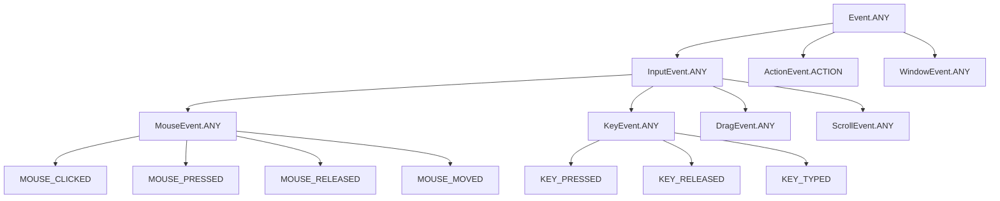
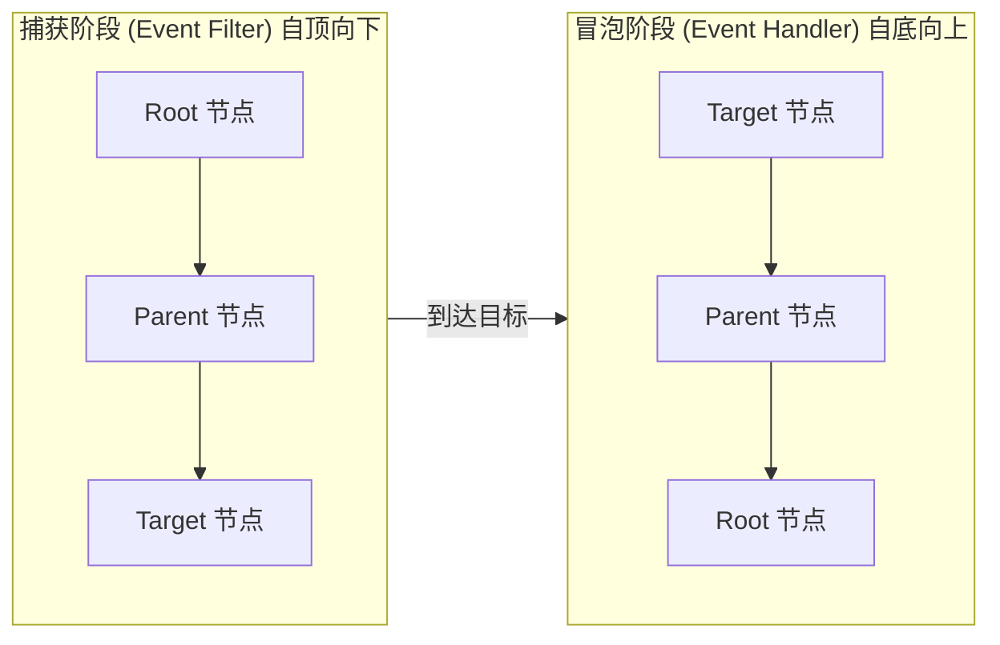

# 4.1 事件类型与事件链机制

用户在界面上的每一次点击、按键、移动鼠标，框架都需要把它转化为一个**事件对象**，并沿着 Scene Graph 中的节点树传播，直到被某个节点的处理器消费。本节解决的问题是：理解 JavaFX 事件的类型层次，掌握事件在节点树中的捕获—冒泡传播链，从而能精确控制“哪个节点、在哪个阶段、处理什么事件”。

## JavaFX 事件类型层次

JavaFX 所有事件都派生自 `Event`，按输入来源逐层细化。每个 `EventType` 通过父类型形成一棵树，`Event.ANY` 是所有事件的根。



| 事件类型 | 触发条件 | 关键方法/字段 |
| --- | --- | --- |
| `ActionEvent` | 按钮、菜单项激活 | `getActionCommand()` |
| `MouseEvent` | 鼠标点击/按下/释放/移动 | `getX()/getY()`、`getButton()`、`getClickCount()` |
| `KeyEvent` | 键盘按下/释放/输入字符 | `getCode()`、`getCharacter()`、`isControlDown()` |
| `DragEvent` | 拖放操作 | `getDragboard()`、`getTransferMode()` |
| `ScrollEvent` | 滚轮/触控滚动 | `getDeltaY()`、`getDeltaX()` |
| `WindowEvent` | 窗口显示/隐藏/关闭 | `WINDOW_CLOSE_REQUEST` |

## 事件链传播机制

事件传播分为**两个阶段**，沿 Scene Graph 的节点路径往返一次：



> [!note] 两条注册路径
> - `addEventFilter(EventType, EventHandler)` 注册的处理器在**捕获阶段**执行，自顶向下；
> - `addEventHandler(EventType, EventHandler)` 注册的处理器在**冒泡阶段**执行，自底向上；
> - 便捷方法（如 `setOnMouseClicked`）本质上注册的是冒泡阶段的 Handler。

### 事件消费：consume()

调用 `event.consume()` 会标记该事件为“已处理”：

- 阻止事件继续向**下一节点**传播（捕获阶段则不下传，冒泡阶段则不上传）；
- 部分事件会取消系统默认行为（如 `KeyEvent` 的快捷键默认动作）。

> [!warning] consume 不等于“停止当前节点其他处理器”
> `consume()` 只影响传播方向上的后续节点，不阻止同一节点上已注册的其他同类处理器执行。若需在节点内互斥，需用业务标志位控制。

## 鼠标事件处理示例

```java
import javafx.application.Application;
import javafx.scene.Scene;
import javafx.scene.input.MouseButton;
import javafx.scene.input.MouseEvent;
import javafx.scene.layout.Pane;
import javafx.scene.paint.Color;
import javafx.scene.shape.Circle;
import javafx.stage.Stage;

public class MouseEventDemo extends Application {
    @Override
    public void start(Stage stage) {
        Circle circle = new Circle(60, Color.CORAL);
        circle.setCenterX(120); circle.setCenterY(120);

        // 冒泡阶段：点击切换颜色，左键红、右键蓝
        circle.setOnMouseClicked(e -> {
            if (e.getButton() == MouseButton.PRIMARY) {
                circle.setFill(Color.CRIMSON);
            } else if (e.getButton() == MouseButton.SECONDARY) {
                circle.setFill(Color.STEELBLUE);
            }
            System.out.println("点击次数: " + e.getClickCount());
        });

        // 捕获阶段：在父节点拦截双击，阻止其到达子节点
        Pane root = new Pane(circle);
        root.addEventFilter(MouseEvent.MOUSE_CLICKED, e -> {
            if (e.getClickCount() == 2) {
                System.out.println("父节点拦截双击");
                e.consume(); // 圆形不会收到双击事件
            }
        });

        stage.setScene(new Scene(root, 240, 240));
        stage.show();
    }
}
```

## 键盘事件处理示例

```java
import javafx.scene.Scene;
import javafx.scene.input.KeyEvent;
import javafx.scene.layout.StackPane;
import javafx.scene.shape.Rectangle;

Rectangle rect = new Rectangle(80, 80);
StackPane root = new StackPane(rect);
Scene scene = new Scene(root, 300, 200);

// 在 Scene 上监听键盘，需保证 scene 获得焦点或节点可聚焦
scene.setOnKeyPressed((KeyEvent e) -> {
    switch (e.getCode()) {
        case LEFT  -> rect.setTranslateX(rect.getTranslateX() - 10);
        case RIGHT -> rect.setTranslateX(rect.getTranslateX() + 10);
        case UP    -> rect.setTranslateY(rect.getTranslateY() - 10);
        case DOWN  -> rect.setTranslateY(rect.getTranslateY() + 10);
        default -> { /* 其他键不处理 */ }
    }
});

// 拦截 Ctrl+S 触发自定义保存，阻止系统默认行为
scene.addEventFilter(KeyEvent.KEY_PRESSED, e -> {
    if (e.isControlDown() && e.getCode().toString().equals("S")) {
        System.out.println("执行保存...");
        e.consume();
    }
});
```

> [!tip] 焦点与键盘事件
> 键盘事件默认派发给拥有焦点的节点。`Scene` 级别的 `setOnKeyPressed` 可捕获未被节点消费的按键；要让某个 `Shape`/`Group` 响应键盘，需 `node.setFocusTraversable(true)` 并 `node.requestFocus()`。

## 易错点

> [!warning] 常见误区
> 1. 误以为 `setOnXxx` 是捕获阶段——实际是冒泡 Handler 的便捷写法。
> 2. 在捕获阶段调用 `consume()` 后，事件不会到达目标节点，目标节点上的 Handler 不会执行。
> 3. `KEY_TYPED` 只产生可打印字符（`getCharacter()`），没有 `getCode()`，方向键等不会触发 `KEY_TYPED`。

## 小结

JavaFX 事件按 `EventType` 树组织，沿 Scene Graph 走“捕获→目标→冒泡”的往返链路。`addEventFilter` 控制自顶向下的拦截，`addEventHandler`/`setOnXxx` 控制自底向上的响应，`consume()` 用于终止传播。理解这条链是设计快捷键、手势识别与事件代理的基础。

## 关联

- 先修：[[1.2 事件驱动编程基本原理]]、[[3.1 布局面板与容器体系]]
- 下一节：[[4.2 事件处理器与Lambda表达式]]
- 上一级：[[MOC - 第4章]]
