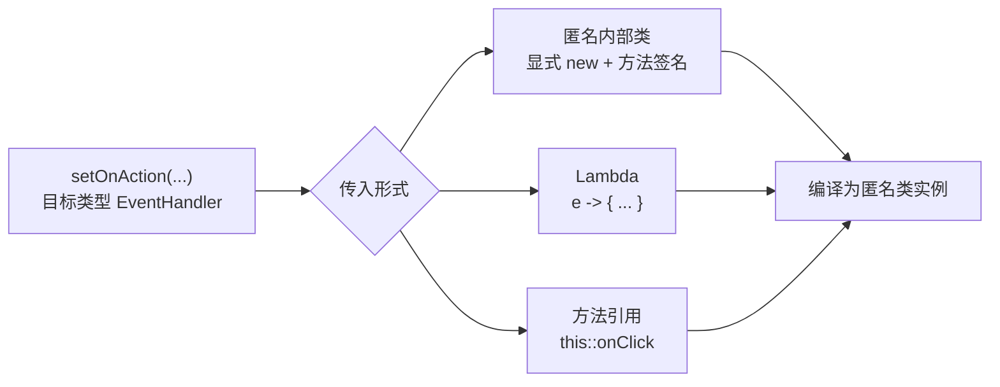

# 4.2 事件处理器与Lambda表达式

事件链只解决了“事件往哪传”，真正决定“做什么”的是注册在节点上的 `EventHandler`。本节解决的问题是：理解 `EventHandler` 作为函数式接口的本质，掌握用 Lambda 与方法引用简化事件注册，并明确匿名内部类与 Lambda 的取舍边界。

## EventHandler 接口与函数式编程

`EventHandler<T extends Event>` 是 JavaFX 事件处理的核心接口，定义在 `javafx.event` 包中：

```java
@FunctionalInterface
public interface EventHandler<T extends Event> extends EventListener {
    void handle(T event);
}
```

它是一个**函数式接口**（Functional Interface，仅有一个抽象方法），因此可以作为 Lambda 表达式与方法引用的目标类型。`setOnXxx`、`addEventHandler`、`addEventFilter` 等方法都接收 `EventHandler` 参数。

## Lambda 表达式简化事件处理

Lambda 的核心是 SAM 转换（Single Abstract Method）：编译器根据目标接口类型自动实例化实现类，省去匿名内部类的样板代码。



### 三种写法对比

```java
import javafx.application.Application;
import javafx.scene.control.Button;
import javafx.stage.Stage;
import javafx.event.ActionEvent;
import javafx.event.EventHandler;

public class LambdaDemo extends Application {
    private int count = 0;

    @Override
    public void start(Stage stage) {
        Button btn = new Button("点击 0 次");

        // 写法一：匿名内部类（Java 7 风格）
        btn.setOnAction(new EventHandler<ActionEvent>() {
            @Override
            public void handle(ActionEvent e) {
                count++;
                btn.setText("点击 " + count + " 次");
            }
        });

        // 写法二：Lambda 表达式（推荐）
        btn.setOnAction(e -> {
            count++;
            btn.setText("点击 " + count + " 次");
        });

        // 写法三：方法引用（无参委托给已有方法）
        btn.setOnAction(this::onClicked);
    }

    private void onClicked(ActionEvent e) {
        count++;
        // btn 需作为字段才能在此访问，示例从略
    }
}
```

### 匿名内部类 vs Lambda 对比

| 维度 | 匿名内部类 | Lambda |
| --- | --- | --- |
| 语法 | `new Type() { public void handle(T e) {...} }` | `e -> {...}` |
| 目标类型 | 任意接口/抽象类 | 仅函数式接口 |
| `this` 指向 | 匿名类实例本身 | 外围类实例（词法 this） |
| 访问外围变量 | 需 `final` 或等效 final | 需 `final` 或等效 final |
| 生成产物 | 单独的 `.class` 文件 | `invokedynamic`，无额外类文件 |
| 可读性 | 冗长 | 简洁，适合短逻辑 |

> [!tip] 词法 this
> Lambda 中的 `this` 指向**外围类**实例，匿名内部类中的 `this` 指向**匿名实例本身**。在 Controller 中用 Lambda 引用 `this` 时不会产生歧义，这是相对匿名内部类的重要优势。

## 方法引用

当 Lambda 体只是调用某个已存在的方法时，可进一步用方法引用（Method Reference）：

| 类型 | 语法 | 示例 |
| --- | --- | --- |
| 静态方法 | `类名::静态方法` | `Math::abs` |
| 特定对象实例方法 | `obj::方法` | `this::onClicked`、`System.out::println` |
| 任意对象实例方法 | `类名::方法` | `String::toLowerCase` |
| 构造方法 | `类名::new` | `Button::new` |

```java
// Lambda
button.setOnAction(e -> System.out.println("clicked"));
// 方法引用
button.setOnAction(this::handleClick);

private void handleClick(ActionEvent e) {
    System.out.println("clicked");
}
```

> [!warning] 方法引用的签名匹配
> 方法引用要求被引用方法的参数列表与函数式接口方法的参数列表兼容。`EventHandler.handle(ActionEvent)` 接收一个参数，因此 `this::handleClick` 必须接收一个 `ActionEvent`（或父类型）参数；无参方法无法直接作为 `EventHandler` 的方法引用。

## 多事件统一处理示例

```java
import javafx.scene.control.Button;
import javafx.scene.control.TextField;
import javafx.event.ActionEvent;

Button save   = new Button("保存");
Button load   = new Button("载入");
Button clear  = new Button("清空");
TextField status = new TextField("就绪");

// 用方法引用 + 事件源判断实现统一处理
save.setOnAction(this::onAction);
load.setOnAction(this::onAction);
clear.setOnAction(this::onAction);

private void onAction(ActionEvent e) {
    String id = ((Button) e.getSource()).getText();
    switch (id) {
        case "保存"  -> status.setText("已保存");
        case "载入"  -> status.setText("已载入");
        case "清空"  -> status.setText("已清空");
    }
}
```

> [!example]- 何时仍用匿名内部类
> 当需要实现多个方法、维护自身状态字段、或目标类型不是函数式接口（如 `Cell` 抽象类）时，匿名内部类仍不可替代。Lambda 适合“一次性、单一行为”的事件回调。

## 易错点

> [!warning] 常见误区
> 1. 误以为 Lambda 内可任意修改外围局部变量——只能读，不能写（等效 final 约束）。需要计数应使用字段或 `AtomicInteger`。
> 2. 方法引用 `obj::method` 与 `类名::method` 语义不同：前者绑定到固定实例，后者在调用时确定接收者。
> 3. Lambda 捕获的外围字段 `this` 与匿名类不同，迁移旧代码时注意 `this` 指向变化。

## 小结

`EventHandler` 是 JavaFX 事件回调的统一契约，作为函数式接口天然支持 Lambda 与方法引用。短小回调优先用 Lambda，复用既有方法用方法引用，复杂多方法逻辑仍用匿名内部类或独立类。掌握三者转换的关键是 SAM 转换与词法作用域。

## 关联

- 上一节：[[4.1 事件类型与事件链机制]]
- 下一节：[[4.3 属性变化监听与绑定机制]]
- 上一级：[[MOC - 第4章]]
