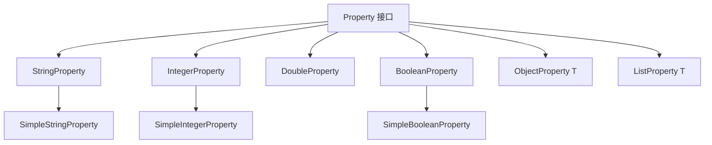
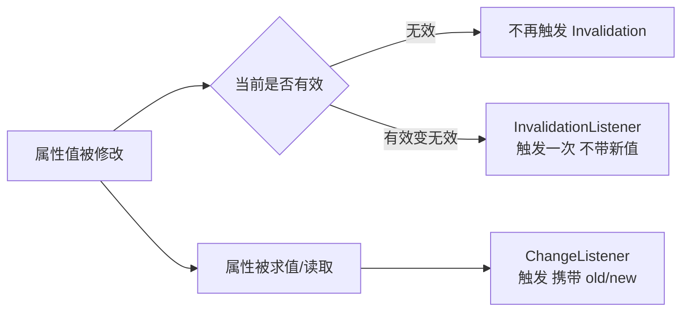

# 4.3 属性变化监听与绑定机制

事件处理解决了“用户操作→方法调用”，但 GUI 中还有大量“数据变了，界面跟着变”的需求（如滑块改变→标签数字更新、文本框联动→进度条同步）。本节解决的问题是：用 JavaFX Properties 体系与监听器机制，把状态变化自动传播到依赖它的界面节点，并用绑定机制声明式地建立属性间的依赖关系。

## JavaFX Properties 体系

JavaFX 为常用类型提供对应的属性包装类，位于 `javafx.beans.property` 包，每个属性既是可读写的值，也是可被监听的可观察对象。



| 属性类 | 包装类型 | 常用方法 |
| --- | --- | --- |
| `SimpleStringProperty` | `String` | `get()/set()`、`getValue()` |
| `SimpleIntegerProperty` | `int` | `get()/set()`、`add()`、`multiply()` |
| `SimpleDoubleProperty` | `double` | `get()/set()`、算术运算返回 `NumberBinding` |
| `SimpleBooleanProperty` | `boolean` | `get()/set()` |
| `SimpleObjectProperty<T>` | 任意对象 | `get()/set()` |

## 两种监听器



| 监听器 | 触发时机 | 回调签名 | 是否提供新值 |
| --- | --- | --- | --- |
| `InvalidationListener` | 属性由有效变**无效**时触发一次 | `invalidated(Observable)` | 否，惰性 |
| `ChangeListener` | 属性值真正变化（被求值）时触发 | `changed(ObservableValue, oldVal, newVal)` | 是 |

> [!note] 惰性求值（Lazy Evaluation）
> JavaFX 属性默认惰性：连续 `set` 修改时，若属性已处于无效状态，`InvalidationListener` 不会再触发；只有当属性被读取（求值）后才恢复有效。`ChangeListener` 在每次值变化时都会触发（前提是求值），适合需要精确新旧值的场景。

### 监听器代码示例

```java
import javafx.beans.property.SimpleIntegerProperty;
import javafx.beans.property.IntegerProperty;
import javafx.beans.value.ChangeListener;
import javafx.beans.value.ObservableValue;

IntegerProperty score = new SimpleIntegerProperty(0);

// ChangeListener：得到 old/new
score.addListener((ObservableValue<? extends Number> obs, Number oldVal, Number newVal) -> {
    System.out.println("分数变化: " + oldVal + " -> " + newVal);
});

// InvalidationListener：仅通知失效
score.addListener(observable -> {
    System.out.println("分数已失效，需重新读取: " + score.get());
});

score.set(10);  // 触发两个监听器
score.set(20);  // 再次触发（值确实变化）
score.set(20);  // ChangeListener 不触发（值未变）；InvalidationListener 也不触发
```

## 属性绑定

绑定（Binding）声明式地建立属性间依赖：被依赖方（依赖源）变化时，依赖方自动更新。

| 方式 | 方法 | 方向 | 说明 |
| --- | --- | --- | --- |
| 单向绑定 | `target.bind(source)` | source → target | target 跟随 source，target 不可手动 set |
| 双向绑定 | `a.bindBidirectional(b)` | a ↔ b | 任一方变化同步到另一方 |
| 解绑 | `unbind()` / `unbindBidirectional()` | — | 解除绑定 |

```java
import javafx.beans.property.SimpleStringProperty;
import javafx.beans.property.StringProperty;

StringProperty src = new SimpleStringProperty("Hello");
StringProperty dst = new SimpleStringProperty("");

dst.bind(src);          // dst 自动跟随 src
System.out.println(dst.get()); // Hello
src.set("World");
System.out.println(dst.get()); // World
// dst.set("X"); // 抛出 RuntimeException：绑定后不可直接 set

StringProperty a = new SimpleStringProperty("A");
StringProperty b = new SimpleStringProperty("B");
a.bindBidirectional(b);  // 双向同步
a.set("C"); System.out.println(b.get()); // C
b.set("D"); System.out.println(a.get()); // D
```

> [!warning] 单向绑定后不可写
> 调用 `bind()` 后，目标属性变为只读，直接 `set()` 会抛出 `RuntimeException`。需先 `unbind()` 才能恢复可写。双向绑定则允许任一端写入。

## 高级绑定与 Bindings 工具类

`Bindings` 工具类提供算术、逻辑、字符串运算，组合出派生属性（`NumberBinding`/`BooleanBinding`/`StringBinding`）：

```java
import javafx.beans.binding.Bindings;
import javafx.beans.property.SimpleIntegerProperty;
import javafx.beans.property.IntegerProperty;

IntegerProperty width  = new SimpleIntegerProperty(100);
IntegerProperty height = new SimpleIntegerProperty(50);

// 面积 = width * height，自动随两者变化
NumberBinding area = width.multiply(height);
System.out.println(area.intValue()); // 5000
width.set(200);
System.out.println(area.intValue()); // 10000

// 条件绑定：当面积大于阈值时为 true
IntegerProperty threshold = new SimpleIntegerProperty(8000);
BooleanBinding overThreshold = area.greaterThan(threshold);
System.out.println(overThreshold.get()); // true (10000 > 8000)
```

## ObservableList 与 ObservableMap

JavaFX 为集合提供可观察版本（`javafx.collections`），元素增删会触发 `ListChangeListener`，常与 `ListView`/`TableView` 联动实现数据驱动界面。

```java
import javafx.collections.FXCollections;
import javafx.collections.ObservableList;
import javafx.collections.ListChangeListener;

ObservableList<String> items = FXCollections.observableArrayList();
items.addListener((ListChangeListener<String>) change -> {
    while (change.next()) {
        if (change.wasAdded())   System.out.println("添加: " + change.getAddedSubList());
        if (change.wasRemoved()) System.out.println("移除: " + change.getRemoved());
    }
});

items.add("A");    // 触发 wasAdded
items.add("B");
items.remove("A"); // 触发 wasRemoved

// 直接作为 ListView 数据源，界面自动同步
// ListView<String> view = new ListView<>(items);
```

> [!tip] 与第7章的衔接
> `ObservableList` 与 `ListView`/`TableView` 的深度联动、`FXCollections` 工具方法以及表格属性绑定，将在 [[7.2 数据绑定与可观察集合]] 展开。

## 数据绑定综合示例

```java
import javafx.application.Application;
import javafx.scene.Scene;
import javafx.scene.control.Label;
import javafx.scene.control.Slider;
import javafx.scene.layout.VBox;
import javafx.stage.Stage;
import javafx.beans.binding.Bindings;

public class BindingDemo extends Application {
    @Override
    public void start(Stage stage) {
        Slider slider = new Slider(0, 100, 0);
        Label valueLabel = new Label();
        Label statusLabel = new Label();

        // 单向绑定：标签文本跟随滑块值
        valueLabel.textProperty().bind(slider.valueProperty().asString("值: %.0f"));
        // 条件绑定：值 >= 50 时显示“高”，否则“低”
        statusLabel.textProperty().bind(
                Bindings.when(slider.valueProperty().greaterThanOrEqualTo(50))
                        .then("高").otherwise("低"));

        VBox root = new VBox(10, slider, valueLabel, statusLabel);
        stage.setScene(new Scene(root, 250, 120));
        stage.show();
    }
}
```

## 易错点

> [!warning] 常见误区
> 1. `InvalidationListener` 不会在每次 `set` 都触发，依赖“有效→无效”状态转换；需要精确值变化应使用 `ChangeListener`。
> 2. 单向绑定后对目标 `set()` 会抛异常；忘记 `unbind()` 就重新绑定会抛“already bound”。
> 3. `Bindings` 派生属性是惰性求值的，若从未 `get()` 过，监听器可能不立即触发。

## 小结

JavaFX Properties 把状态封装为可观察、可绑定的属性。`ChangeListener` 用于精确响应值变化，`InvalidationListener` 用于高效失效通知；`bind()`/`bindBidirectional()` 声明式建立单向/双向依赖，`Bindings` 工具类组合出算术与条件派生属性；`ObservableList`/`ObservableMap` 把集合变化映射到界面。这套机制是数据驱动 GUI 的基础。

## 关联

- 先修：[[4.2 事件处理器与Lambda表达式]]（Lambda 写监听器）
- 下一章：[[5.1 Canvas绘图与Shape图形]]
- 延伸：[[7.2 数据绑定与可观察集合]]
- 上一级：[[MOC - 第4章]]
