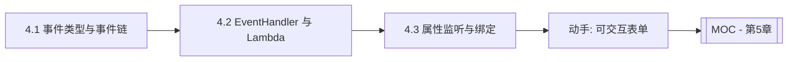

# MOC - 第4章 事件处理与消息响应机制

> [!info] 本章定位
> 第3章解决了“界面怎么摆”，第4章解决“界面怎么动”。事件处理是 GUI 从“静态画面”到“可交互程序”的核心跃迁。本章覆盖 JavaFX 事件类型层次、事件捕获与冒泡传播链、`EventHandler` 与 Lambda 简化写法，以及属性变化监听与绑定机制，把用户操作映射为可观察的数据流。

## 学习路线图

## 知识点导航

| 节 | 主题 | 核心要点 | 入口 |
| --- | --- | --- | --- |
| 4.1 | 事件类型与事件链机制 | Event 类型层次、捕获/冒泡两阶段、`consume()`、鼠标与键盘事件 | [[4.1 事件类型与事件链机制]] |
| 4.2 | 事件处理器与Lambda表达式 | `EventHandler` 接口、Lambda 简化、方法引用、匿名内部类对比 | [[4.2 事件处理器与Lambda表达式]] |
| 4.3 | 属性变化监听与绑定机制 | Properties、`ChangeListener`/`InvalidationListener`、`bind()`、`ObservableList` | [[4.3 属性变化监听与绑定机制]] |

## 核心考点

> [!warning] 重点掌握
> 1. JavaFX 事件类型层次 `Event → InputEvent → MouseEvent/KeyEvent`，能说出各层含义。
> 2. 事件链传播的两阶段：捕获阶段（Event Filter，自顶向下）与冒泡阶段（Event Handler，自底向上）。
> 3. `consume()` 的作用：阻止事件继续向下一节点传播，常用于拦截快捷键或自定义手势。
> 4. `EventHandler` 是函数式接口，可用 Lambda 与方法引用简化；能区分两种写法的语义边界。
> 5. JavaFX Properties 体系，`ChangeListener` 与 `InvalidationListener` 的区别（值变化 vs 失效）。
> 6. 单向绑定 `bind()` 与双向绑定 `bindBidirectional()` 的适用场景与限制。

## 自测题

> [!question] 题1
> 描述 JavaFX 事件从产生到处理完成的传播路径，并说明 Event Filter 与 Event Handler 的执行顺序。
> > [!check]- 参考答案
> > 事件产生后先进入**捕获阶段**：从 Scene Graph 根节点自顶向下经过各父节点注册的 Event Filter，到达目标节点；随后进入**冒泡阶段**：从目标节点自底向上经过各节点注册的 Event Handler，直至根节点。Filter 在前、Handler 在后，目标节点的 Handler 先于其父节点 Handler 执行。

> [!question] 题2
> `consume()` 方法对事件传播有什么影响？为什么在自定义对话框中常对 ESC 键调用它？
> > [!check]- 参考答案
> > `consume()` 标记事件已被处理，事件不会继续向父节点传播（冒泡终止），也不会触发系统的默认行为。对话框中拦截 ESC 是为了阻止系统默认的“关闭窗口”动作，转而执行自定义逻辑（如校验未保存数据后再关闭）。

> [!question] 题3
> 用匿名内部类与 Lambda 两种写法给按钮绑定点击事件，并说明 Lambda 为何能替代匿名内部类。
> > [!check]- 参考答案
> > 匿名内部类：`button.setOnAction(new EventHandler<ActionEvent>() { public void handle(ActionEvent e) { ... } });`；Lambda：`button.setOnAction(e -> { ... });`。`EventHandler` 是只有一个抽象方法的函数式接口，Lambda 实例化时编译器自动推断目标类型（SAM 转换），省去了样板代码，语义完全等价。

> [!question] 题4
> `ChangeListener` 与 `InvalidationListener` 的触发时机有何不同？惰性求值体现在哪里？
> > [!check]- 参考答案
> > `InvalidationListener` 在属性由有效变无效时触发一次（即值被改但尚未被读取），不提供新值；`ChangeListener` 在属性值真正变化且被求值时触发，提供 old/new 值。惰性求值体现在：连续修改属性时 `InvalidationListener` 只在首次失效时通知，后续修改若属性仍处于无效状态则不再触发，直到被重新读取后才恢复有效。

## 章节导航

- 上一章：[[MOC - 第3章]]
- 上一级：[[MOC - 可视化程序设计]]
- 下一章：[[MOC - 第5章]]
