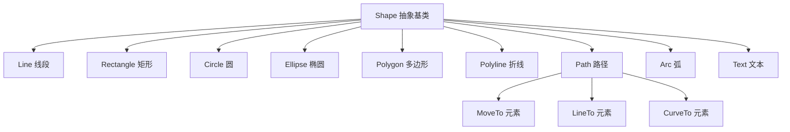
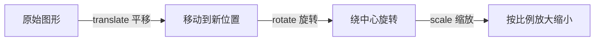

# 5.1 Canvas绘图与Shape图形

GUI 不只是文本控件，还需要画线、画圆、画任意图形。JavaFX 提供两条绘图路径：**Canvas** 用 `GraphicsContext` 命令式画到位图，适合频繁重绘的动态图形；**Shape 节点**是 Scene Graph 中的可交互对象，适合需要事件、绑定与变换的静态图形。本节解决“画什么、怎么画、用什么画”的问题。

## 两条绘图路径对比

| 维度 | Canvas（命令式） | Shape（声明式） |
| --- | --- | --- |
| 绘制方式 | `GraphicsContext` 方法画到缓冲区 | 节点放入 Scene Graph 由框架渲染 |
| 重绘 | 手动 `clearRect` + 重画 | 属性变化自动刷新 |
| 交互 | 需自行做命中检测 | 可直接注册事件、绑定属性 |
| 性能 | 高，适合大量频繁绘制 | 节点多时开销大 |
| 典型场景 | 实时曲线、画板、粒子 | 静态图形、可点击图形、数据图表 |

## Shape 类继承层次

所有二维图形派生自 `Shape`（`javafx.scene.shape`），共享 `fill`/`stroke` 等属性。



| Shape | 构造要点 | 关键属性 |
| --- | --- | --- |
| `Line` | `new Line(x1,y1,x2,y2)` | `startX/startY/endX/endY` |
| `Rectangle` | `new Rectangle(w,h)` 或 `(x,y,w,h)` | `arcWidth/arcHeight`（圆角） |
| `Circle` | `new Circle(r)` 或 `(cx,cy,r)` | `centerX/centerY/radius` |
| `Ellipse` | `new Ellipse(rx,ry)` | `radiusX/radiusY` |
| `Polygon` | `new Polygon(x1,y1,x2,y2,...)` | `points` 列表 |
| `Path` | 由 `PathElement` 组成 | `elements`、`FillRule` |

## 填充与描边

- `fill`：图形内部填充，可为颜色、渐变（`LinearGradient`/`RadialGradient`）、图案；
- `stroke`：图形轮廓描边，配合 `strokeWidth`/`strokeType`；
- `strokeType`：`INSIDE`（向内）、`OUTSIDE`（向外）、`CENTERED`（居中，默认）。

```java
import javafx.scene.shape.*;
import javafx.scene.paint.Color;
import javafx.scene.paint.LinearGradient;
import javafx.scene.paint.CycleMethod;
import javafx.scene.paint.Stop;

Rectangle rect = new Rectangle(80, 50);
rect.setFill(Color.LIGHTSKYBLUE);     // 填充
rect.setStroke(Color.DARKBLUE);       // 描边
rect.setStrokeWidth(3);
rect.setStrokeType(StrokeType.CENTERED);
rect.setArcWidth(12); rect.setArcHeight(12); // 圆角

// 线性渐变填充
Circle circle = new Circle(60);
circle.setFill(new LinearGradient(0, 0, 1, 1, true, CycleMethod.NO_CYCLE,
        new Stop(0, Color.WHITE), new Stop(1, Color.DODGERBLUE)));
```

## 坐标系与变换

JavaFX 坐标系原点在左上角，x 向右、y 向下。变换通过节点 `setTranslateX/Y`、`setRotate`、`setScaleX/Y` 设置，**变换作用于节点自身局部坐标系**。

> [!warning] 变换顺序
> 节点变换按 translate → rotate → scale 顺序叠加（局部坐标系变换），与绘制顺序不同。复杂变换链建议用 `Transform` 组合或 `getTransforms().addAll(...)` 显式控制顺序。



## Canvas API：GraphicsContext

`Canvas` 持有 `GraphicsContext`，提供与 2D Canvas API 类似的命令式绘图方法。

```java
import javafx.scene.canvas.Canvas;
import javafx.scene.canvas.GraphicsContext;
import javafx.scene.paint.Color;
import javafx.scene.shape.StrokeLineCap;

Canvas canvas = new Canvas(300, 200);
GraphicsContext gc = canvas.getGraphicsContext2D();

// 基本图形
gc.setFill(Color.LIGHTGRAY);
gc.fillRect(10, 10, 120, 80);          // 填充矩形
gc.setStroke(Color.BLACK);
gc.strokeRect(10, 10, 120, 80);        // 描边矩形

gc.setFill(Color.CORAL);
gc.fillOval(150, 10, 80, 80);          // 填充椭圆

// 线段与路径
gc.setLineWidth(3);
gc.setLineCap(StrokeLineCap.ROUND);
gc.strokeLine(10, 110, 280, 110);      // 直线

gc.beginPath();
gc.moveTo(20, 150);
gc.lineTo(100, 130);
gc.lineTo(180, 170);
gc.stroke();                            // 折线

// 文本
gc.setFill(Color.DARKRED);
gc.fillText("Hello Canvas", 90, 190);
```

### Canvas 重绘与变换示例

```java
// 清空并重绘
gc.clearRect(0, 0, canvas.getWidth(), canvas.getHeight());

// 变换：平移坐标系后绘制，绘制完恢复
gc.save();                       // 保存当前变换状态
gc.translate(150, 100);          // 原点移到中心
gc.rotate(45);                   // 旋转 45 度
gc.setFill(Color.STEELBLUE);
gc.fillRect(-40, -40, 80, 80);   // 在变换后的坐标系画方块
gc.restore();                    // 恢复变换状态
```

> [!tip] save/restore 配对
> `GraphicsContext` 的 `save()`/`restore()` 必须配对使用，用于临时变换、裁剪、样式变更后恢复，避免污染后续绘制。每多一层 `save` 必须对应一个 `restore`。

## Shape 节点示例：可点击图形

```java
import javafx.application.Application;
import javafx.scene.Scene;
import javafx.scene.layout.Pane;
import javafx.scene.paint.Color;
import javafx.scene.shape.Circle;
import javafx.stage.Stage;

public class ShapeDemo extends Application {
    @Override
    public void start(Stage stage) {
        Circle c1 = new Circle(80, 80, 40, Color.CORAL);
        Circle c2 = new Circle(200, 80, 40, Color.STEELBLUE);

        // Shape 节点可直接绑定事件，Canvas 做不到
        c1.setOnMouseClicked(e -> c1.setFill(Color.random()));
        c2.setOnMouseEntered(e -> c2.setScaleX(1.2));
        c2.setOnMouseExited(e -> c2.setScaleX(1.0));

        stage.setScene(new Scene(new Pane(c1, c2), 300, 160));
        stage.show();
    }
}
```

## 易错点

> [!warning] 常见误区
> 1. Canvas 绘制内容不会自动重绘——窗口最小化恢复、`resize` 后缓冲区可能清空，需在重绘回调里重画。
> 2. `Canvas` 默认不随父容器缩放，需手动监听尺寸变化重设 `width`/`height` 并重绘。
> 3. `Shape` 的 `rotate` 默认绕节点左上角（局部原点）旋转，需配合 `translate` 或设置布局才能绕中心旋转。

## 小结

Canvas 适合高频命令式绘图，Shape 适合可交互声明式图形。`GraphicsContext` 提供 fill/stroke/path/transform 命令，Shape 共享 fill/stroke 属性并支持事件与绑定。坐标变换作用于局部坐标系，`save`/`restore` 管理变换栈。选型依据是“是否需要节点能力”与“重绘频率”。

## 关联

- 先修：[[4.1 事件类型与事件链机制]]（Shape 事件）、[[4.3 属性变化监听与绑定机制]]（属性绑定）
- 下一节：[[5.2 图像加载与显示处理]]
- 上一级：[[MOC - 第5章]]
