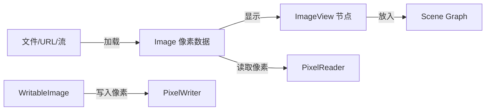

# 5.2 图像加载与显示处理

GUI 应用常需要展示照片、图标、生成图等位图资源。JavaFX 用 `Image` 表示图像数据，用 `ImageView` 作为 Scene Graph 节点显示它，并用 `PixelReader`/`PixelWriter` 提供像素级读写能力。本节解决“图像从哪来、怎么显示、怎么变换、怎么逐像素处理”的问题。

## Image 与 ImageView 的分工



| 类 | 职责 | 是否节点 |
| --- | --- | --- |
| `Image` | 加载并存储图像像素数据 | 否，纯数据 |
| `ImageView` | 在 Scene Graph 中显示 `Image`，提供变换与视口 | 是，`Node` 子类 |
| `WritableImage` | 可修改的 `Image`，配合 `PixelWriter` | 否，数据 |

## Image 加载来源

`Image` 构造方法支持多种来源：

```java
import javafx.scene.image.Image;

// 1. 从 URL 加载（可在线资源）
Image img1 = new Image("https://example.com/photo.jpg");

// 2. 从本地文件加载（file: 协议或相对 classpath）
Image img2 = new Image("file:images/icon.png");

// 3. 从输入流加载（适合打包进 jar 的资源）
Image img3 = new Image(getClass().getResourceAsStream("/images/logo.png"));

// 4. 指定加载尺寸与比例，节省内存
Image img4 = new Image("file:big.jpg", 200, 150, true, true);
// 参数：url, requestedWidth, requestedHeight, preserveRatio, smooth
```

> [!tip] 后台加载与进度
> `Image` 默认后台异步加载，可通过 `progressProperty()` 监听加载进度，结合 `ImageView` 实现加载占位符。对本地资源可用 `new Image(stream, false)` 改为同步加载。

## ImageView 显示与变换

`ImageView` 通过属性实现缩放、旋转、裁剪：

```java
import javafx.scene.image.Image;
import javafx.scene.image.ImageView;
import javafx.scene.layout.VBox;
import javafx.scene.paint.Color;

Image img = new Image("file:photo.jpg");
ImageView view = new ImageView(img);

// 缩放：设置 fit 尺寸并保持比例
view.setFitWidth(300);
view.setFitHeight(200);
view.setPreserveRatio(true);
view.setSmooth(true);

// 旋转与透明度
view.setRotate(15);
view.setOpacity(0.9);

// 视口裁剪：只显示原图左上 100x100 区域
ImageView cropped = new ImageView(img);
cropped.setViewport(new Rectangle2D(50, 50, 100, 100));
```

| 属性 | 作用 |
| --- | --- |
| `fitWidth`/`fitHeight` | 显示目标尺寸 |
| `preserveRatio` | 是否保持原图比例 |
| `smooth` | 缩放是否使用抗锯齿 |
| `viewport` | 视口矩形，裁剪显示区域 |
| `rotate`/`opacity` | 旋转角度与透明度 |

## 像素操作：PixelReader 与 PixelWriter

像素级操作用于滤镜、截图、图像分析等。

```java
import javafx.scene.image.Image;
import javafx.scene.image.ImageView;
import javafx.scene.image.PixelReader;
import javafx.scene.image.PixelWriter;
import javafx.scene.image.WritableImage;
import javafx.scene.paint.Color;

Image src = new Image("file:photo.jpg");
int w = (int) src.getWidth();
int h = (int) src.getHeight();

PixelReader reader = src.getPixelReader();
WritableImage gray = new WritableImage(w, h);
PixelWriter writer = gray.getPixelWriter();

// 灰度化：逐像素读取、转换、写回
for (int y = 0; y < h; y++) {
    for (int x = 0; x < w; x++) {
        Color c = reader.getColor(x, y);
        double g = 0.299 * c.getRed() + 0.587 * c.getGreen() + 0.114 * c.getBlue();
        writer.setColor(x, y, new Color(g, g, g, c.getOpacity()));
    }
}

ImageView view = new ImageView(gray);
```

> [!note] 性能边界
> `getColor`/`setColor` 逐像素调用开销大，大图处理应优先用 `getArgb`/`setArgb`（int 运算）或批量 `getPixels`/`setPixels`。像素遍历应避免在 JavaFX Application Thread 上阻塞过久，大图处理建议放到后台线程，完成后再用 `Platform.runLater` 更新界面。

## 图像操作综合示例

```java
import javafx.application.Application;
import javafx.scene.Scene;
import javafx.scene.image.*;
import javafx.scene.layout.HBox;
import javafx.stage.Stage;
import javafx.scene.paint.Color;

public class ImageDemo extends Application {
    @Override
    public void start(Stage stage) {
        Image src = new Image("file:photo.jpg", 200, 0, true, true);

        // 原图
        ImageView original = new ImageView(src);

        // 旋转 90 度并裁剪
        ImageView rotated = new ImageView(src);
        rotated.setRotate(90);
        rotated.setViewport(new javafx.geometry.Rectangle2D(0, 0, 100, 100));

        // 灰度处理
        int w = (int) src.getWidth(), h = (int) src.getHeight();
        WritableImage gray = new WritableImage(w, h);
        PixelReader reader = src.getPixelReader();
        PixelWriter writer = gray.getPixelWriter();
        for (int y = 0; y < h; y++) {
            for (int x = 0; x < w; x++) {
                Color c = reader.getColor(x, y);
                double g = 0.299 * c.getRed() + 0.587 * c.getGreen() + 0.114 * c.getBlue();
                writer.setColor(x, y, Color.gray(g));
            }
        }
        ImageView grayView = new ImageView(gray);

        stage.setScene(new Scene(new HBox(10, original, rotated, grayView), 700, 250));
        stage.show();
    }
}
```

## 易错点

> [!warning] 常见误区
> 1. 把 jar 内资源当文件加载：`new Image("file:...")` 找不到打包资源，应改用 `getResourceAsStream`。
> 2. 误以为 `Image` 是节点——它不能直接加入 Scene Graph，必须用 `ImageView` 包装。
> 3. 在 UI 线程做大量像素遍历导致界面卡顿，应移到后台线程处理。

## 小结

`Image` 负责加载像素数据（支持文件/URL/流与指定尺寸），`ImageView` 负责显示与变换（缩放/旋转/视口裁剪），`PixelReader`/`PixelWriter` 配合 `WritableImage` 提供像素级读写。选型上：显示用 `ImageView`，滤镜与分析用像素 API，大图处理注意线程与性能。

## 关联

- 先修：[[5.1 Canvas绘图与Shape图形]]（绘图基础）
- 下一节：[[5.3 动画与过渡效果]]
- 上一级：[[MOC - 第5章]]
