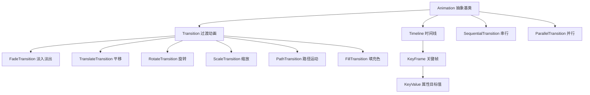
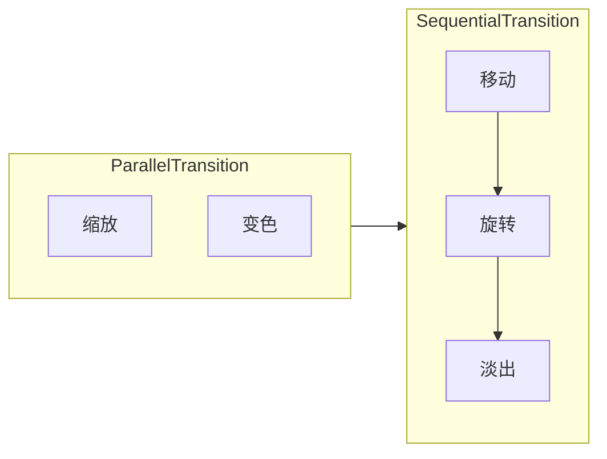

# 5.3 动画与过渡效果

静态界面缺乏反馈，用户难以感知状态变化。JavaFX 用动画把属性变化在时间维度上插值，让淡入、移动、旋转、缩放等效果自然过渡。本节解决的问题是：理解 `Animation` 抽象体系，掌握 `Transition` 家族的封装动画与 `Timeline` 的关键帧动画，能组合出串行/并行动画序列。

## 动画类层次



| 类 | 作用 | 配置方式 |
| --- | --- | --- |
| `Transition` | 封装对单一属性的常用动画 | `setDuration`、`setNode`、`setToXxx` |
| `Timeline` | 基于关键帧自由驱动任意属性 | `KeyFrame` + `KeyValue` |
| `SequentialTransition` | 串行执行子动画 | `getChildren().addAll(...)` |
| `ParallelTransition` | 并行执行子动画 | `getChildren().addAll(...)` |

## Animation 公共属性

所有动画继承自 `Animation`，共享以下控制：

| 属性/方法 | 含义 |
| --- | --- |
| `setCycleCount(int)` | 循环次数，`INDEFINITE` 为无限 |
| `setAutoReverse(boolean)` | 是否往返播放 |
| `setRate(double)` | 播放速率（1.0 正常，2.0 两倍速） |
| `play()`/`pause()`/`stop()` | 播放控制 |
| `setOnFinished(handler)` | 结束回调 |

## Transition 家族示例

```java
import javafx.animation.*;
import javafx.application.Application;
import javafx.scene.Scene;
import javafx.scene.layout.StackPane;
import javafx.scene.paint.Color;
import javafx.scene.shape.Rectangle;
import javafx.stage.Stage;
import javafx.util.Duration;

public class TransitionDemo extends Application {
    @Override
    public void start(Stage stage) {
        Rectangle rect = new Rectangle(80, 80, Color.CORAL);
        StackPane root = new StackPane(rect);

        // 淡入淡出
        FadeTransition fade = new FadeTransition(Duration.millis(1000), rect);
        fade.setFromValue(1.0);
        fade.setToValue(0.2);
        fade.setCycleCount(Animation.INDEFINITE);
        fade.setAutoReverse(true);

        // 平移
        TranslateTransition move = new TranslateTransition(Duration.millis(1000), rect);
        move.setFromX(-100);
        move.setToX(100);
        move.setCycleCount(Animation.INDEFINITE);
        move.setAutoReverse(true);

        // 旋转
        RotateTransition rotate = new RotateTransition(Duration.millis(1000), rect);
        rotate.setByAngle(360);
        rotate.setCycleCount(Animation.INDEFINITE);

        // 缩放
        ScaleTransition scale = new ScaleTransition(Duration.millis(800), rect);
        scale.setToX(1.5);
        scale.setToY(1.5);
        scale.setCycleCount(Animation.INDEFINITE);
        scale.setAutoReverse(true);

        // 并行执行（同时淡入、旋转）
        ParallelTransition parallel = new ParallelTransition(fade, rotate);
        parallel.play();

        stage.setScene(new Scene(root, 400, 200));
        stage.show();
    }
}
```

## Timeline 关键帧动画

`Timeline` 通过 `KeyFrame` 定义关键时间点，每个 `KeyFrame` 含若干 `KeyValue`（属性目标值），框架在关键帧间自动插值。

```java
import javafx.animation.*;
import javafx.application.Application;
import javafx.scene.Scene;
import javafx.scene.layout.Pane;
import javafx.scene.paint.Color;
import javafx.scene.shape.Circle;
import javafx.stage.Stage;
import javafx.util.Duration;

public class TimelineDemo extends Application {
    @Override
    public void start(Stage stage) {
        Circle circle = new Circle(20, Color.DODGERBLUE);
        circle.setCenterX(40); circle.setCenterY(100);

        // 关键帧：0s 起点状态，2s 终点状态
        KeyFrame start = new KeyFrame(Duration.ZERO,
                new KeyValue(circle.centerXProperty(), 40),
                new KeyValue(circle.fillProperty(), Color.DODGERBLUE));
        KeyFrame end = new KeyFrame(Duration.seconds(2),
                new KeyValue(circle.centerXProperty(), 360),
                new KeyValue(circle.fillProperty(), Color.CORAL));

        Timeline timeline = new Timeline(start, end);
        timeline.setCycleCount(Animation.INDEFINITE);
        timeline.setAutoReverse(true);
        timeline.play();

        stage.setScene(new Scene(new Pane(circle), 400, 200));
        stage.show();
    }
}
```

> [!note] KeyValue 的属性来源
> `KeyValue` 必须绑定一个**可写属性**（`WritableValue`），如 `circle.centerXProperty()`。只能对 JavaFX 属性插值，普通字段不行。这正是 [[4.3 属性变化监听与绑定机制]] 中 Properties 体系的价值。

## 串行与并行组合

```java
import javafx.animation.*;

// 串行：先移动，再旋转，再淡出
SequentialTransition seq = new SequentialTransition(
        move, rotate, fade);
seq.play();

// 并行：同时缩放与改变颜色
ParallelTransition par = new ParallelTransition(scale, fade);
par.setCycleCount(2);
par.play();

// 嵌套组合：并行组作为串行的一环
SequentialTransition combo = new SequentialTransition(
        new ParallelTransition(move, scale),
        rotate);
combo.play();
```



## 易错点

> [!warning] 常见误区
> 1. `Transition` 的 `setFromXxx` 与 `setToXxx`：省略 `setFrom` 时从当前值开始，省略 `setTo` 时使用 `setByXxx` 的增量。
> 2. 同一节点同时被多个动画驱动同一属性会冲突，应串行或用不同属性。
> 3. 动画结束默认停在最后一帧；`stop()` 会将属性重置回动画开始前的值，注意与 `setOnFinished` 中状态保持的配合。

## 小结

`Animation` 是动画基类，`Transition` 封装常用单属性动画，`Timeline` 用 `KeyFrame`+`KeyValue` 自由驱动任意 JavaFX 属性。`SequentialTransition` 串行、`ParallelTransition` 并行，二者可嵌套组合复杂动画序列。动画只能驱动可写 JavaFX 属性，理解属性体系是关键。

## 关联

- 先修：[[4.3 属性变化监听与绑定机制]]（动画驱动属性）、[[5.1 Canvas绘图与Shape图形]]（图形节点）
- 下一章：[[6.1 对话框设计与弹窗交互]]
- 上一级：[[MOC - 第5章]]
