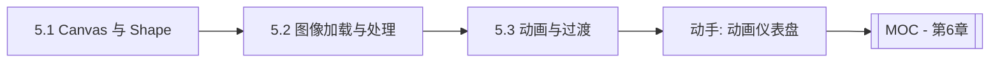

# MOC - 第5章 图形绘制、图像显示与动画

> [!info] 本章定位
> 第4章解决了“交互怎么响应”，第5章解决“界面怎么画、怎么动”。本章覆盖 JavaFX 的两条绘图路径——命令式 Canvas 与声明式 Shape 节点，图像加载与像素级处理，以及基于时间线的动画与过渡效果，让界面从“可用”走向“生动”。

## 学习路线图

## 知识点导航

| 节 | 主题 | 核心要点 | 入口 |
| --- | --- | --- | --- |
| 5.1 | Canvas绘图与Shape图形 | `GraphicsContext`、Shape 类层次、填充/描边、坐标变换 | [[5.1 Canvas绘图与Shape图形]] |
| 5.2 | 图像加载与显示处理 | `Image`/`ImageView`、缩放裁剪旋转、`PixelReader`/`PixelWriter` | [[5.2 图像加载与显示处理]] |
| 5.3 | 动画与过渡效果 | `Animation`/`Timeline`、Transition 家族、`KeyFrame`/`KeyValue` | [[5.3 动画与过渡效果]] |

## 核心考点

> [!warning] 重点掌握
> 1. Canvas 的 `GraphicsContext` 命令式绘图与 Shape 节点声明式绘图的差异与选型。
> 2. Shape 类层次：`Line`/`Rectangle`/`Circle`/`Ellipse`/`Polygon`/`Path` 的构造与属性。
> 3. 填充（`fill`）与描边（`stroke`）的区别，`translate`/`rotate`/`scale` 坐标变换的作用顺序。
> 4. `Image` 加载来源（文件/URL/流）与 `ImageView` 的视口（viewport）裁剪。
> 5. `PixelReader`/`PixelWriter` 像素级读写的能力与性能边界。
> 6. `Transition` 家族与 `Timeline` 的区别：前者封装常用属性动画，后者基于关键帧自由控制任意属性。

## 自测题

> [!question] 题1
> Canvas 绘图与 Shape 节点绘图各自适合什么场景？重绘时二者行为有何不同？
> > [!check]- 参考答案
> > Canvas 是位图式命令绘图，调用 `GraphicsContext` 方法直接画到画布缓冲区，适合频繁重绘的图形（如实时曲线、粒子），重绘需手动 `clearRect` 后重画。Shape 是 Scene Graph 节点，由框架自动管理重绘，属性变化自动刷新，适合静态可交互图形（可单独加事件、绑定属性）。Canvas 性能高但失去节点能力，Shape 灵活但节点过多时开销大。

> [!question] 题2
> 简述 JavaFX 动画的两种实现路径 `Transition` 与 `Timeline`，并说明 `KeyFrame` 与 `KeyValue` 的关系。
> > [!check]- 参考答案
> > `Transition`（如 `FadeTransition`/`TranslateTransition`）封装了对单个属性的常用动画，配置简单但灵活度低；`Timeline` 基于关键帧，可同时驱动多个属性的任意插值。`KeyValue` 描述“某属性在某时刻的目标值”，`KeyFrame` 是“某时间点的一组 `KeyValue`”，`Timeline` 按时间轴在关键帧间插值。

> [!question] 题3
> 如何用 `PixelReader` 把一张彩色图像转为灰度图？关键步骤是什么？
> > [!check]- 参考答案
> > 通过 `image.getPixelReader()` 获取读取器，遍历每个像素 `reader.getArgb(x,y)` 取出 ARGB 分量，按灰度公式 `gray = 0.299R + 0.587G + 0.114B` 计算灰度值，再通过 `PixelWriter` 写入新 `WritableImage`。关键步骤是创建同尺寸 `WritableImage`，用 `writer.setArgb(x,y, grayPixel)` 写回。注意大图遍历性能，可用 `BufferedImage` 或批量读取优化。

> [!question] 题4
> `SequentialTransition` 与 `ParallelTransition` 的区别是什么？如何让动画循环播放？
> > [!check]- 参考答案
> > `SequentialTransition` 串行执行子动画（一个完成再开始下一个），`ParallelTransition` 并行执行（同时开始）。循环播放通过设置 `setCycleCount(Animation.INDEFINITE)` 实现无限循环，或设置具体次数；配合 `setAutoReverse(true)` 可让动画往返播放。

## 章节导航

- 上一章：[[MOC - 第4章]]
- 上一级：[[MOC - 可视化程序设计]]
- 下一章：[[MOC - 第6章]]
