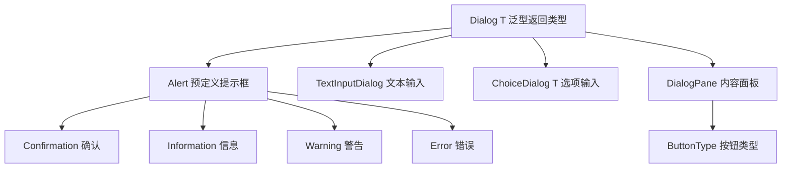

# 6.1 对话框设计与弹窗交互

主窗口承载常规操作，但“确认删除”“输入文件名”“选择选项”这类临时性、需要用户决策的场景，适合用对话框（Dialog）独立呈现。本节解决的问题是：掌握 JavaFX `Dialog`/`Alert` 体系，能使用预定义对话框、自定义对话框与模态控制，把临时交互从主流程中干净剥离。

## Dialog 与 Alert 类体系



| 类 | 用途 | 返回值 |
| --- | --- | --- |
| `Alert` | 预定义类型提示框 | `Optional<ButtonType>` |
| `TextInputDialog` | 单行文本输入 | `Optional<String>` |
| `ChoiceDialog<T>` | 从列表选一项 | `Optional<T>` |
| `Dialog<T>` | 自定义对话框 | `Optional<T>` |

## 预定义对话框：Alert

`Alert` 通过 `AlertType` 枚举快速创建常见提示框：

```java
import javafx.scene.control.Alert;
import javafx.scene.control.ButtonType;
import javafx.scene.control.Alert.AlertType;

// 信息提示
Alert info = new Alert(AlertType.INFORMATION);
info.setTitle("提示");
info.setHeaderText("操作完成");
info.setContentText("文件已成功保存。");
info.show();            // 非阻塞显示

// 确认对话框（阻塞获取结果）
Alert confirm = new Alert(AlertType.CONFIRMATION);
confirm.setHeaderText("确认删除?");
confirm.setContentText("删除后无法恢复，是否继续？");
confirm.showAndWait().ifPresent(type -> {
    if (type == ButtonType.OK) {
        System.out.println("执行删除");
    } else {
        System.out.println("取消删除");
    }
});

// 警告与错误：改用 AlertType.WARNING / AlertType.ERROR
Alert error = new Alert(AlertType.ERROR, "磁盘空间不足，无法保存。",
        ButtonType.OK);
error.showAndWait();
```

> [!note] show vs showAndWait
> `show()` 立即返回非阻塞；`showAndWait()` 阻塞调用线程至对话框关闭并返回 `Optional`。`showAndWait` 必须在 JavaFX Application Thread 调用，常用于需要根据用户决策决定后续流程的场景。

## 自定义对话框：DialogPane + ButtonType

自定义对话框需设置内容、按钮并用 `setResultConverter` 把按钮映射为返回值。

```java
import javafx.scene.control.*;
import javafx.scene.layout.GridPane;
import javafx.util.Callback;
import java.util.Optional;

Dialog<String> dialog = new Dialog<>();
dialog.setTitle("用户登录");
dialog.setHeaderText("请输入账号信息");

// 自定义内容：表单
TextField userField = new TextField();
PasswordField passField = new PasswordField();
GridPane grid = new GridPane();
grid.setHgap(10); grid.setVgap(10);
grid.add(new Label("用户名:"), 0, 0); grid.add(userField, 1, 0);
grid.add(new Label("密码:"),   0, 1); grid.add(passField, 1, 1);
dialog.getDialogPane().setContent(grid);

// 按钮类型
ButtonType loginBtn = new ButtonType("登录", ButtonBar.ButtonData.OK_DONE);
dialog.getDialogPane().getButtonTypes().addAll(loginBtn, ButtonType.CANCEL);

// 结果转换：登录按钮返回用户名，否则 null
dialog.setResultConverter(new Callback<ButtonType, String>() {
    @Override
    public String call(ButtonType button) {
        if (button == loginBtn) {
            return userField.getText();
        }
        return null;
    }
});

Optional<String> result = dialog.showAndWait();
result.ifPresent(name -> System.out.println("登录用户: " + name));
```

> [!tip] setResultConverter 是核心
> `setResultConverter` 把用户点击的 `ButtonType` 映射为 `Dialog<T>` 的泛型返回值。省略它则返回的是按钮本身。Lambda 写法：`dialog.setResultConverter(btn -> btn == loginBtn ? userField.getText() : null);`

## TextInputDialog 与 ChoiceDialog

```java
import javafx.scene.control.TextInputDialog;
import javafx.scene.control.ChoiceDialog;
import java.util.Optional;
import java.util.List;

// 文本输入对话框
TextInputDialog input = new TextInputDialog("默认值");
input.setTitle("新建项目");
input.setHeaderText("输入项目名称");
Optional<String> name = input.showAndWait();
name.ifPresent(n -> System.out.println("项目名: " + n));

// 选项对话框
ChoiceDialog<String> choice = new ChoiceDialog<>(
        "Java", List.of("Java", "Python", "Go"));
choice.setTitle("语言选择");
choice.setHeaderText("选择项目语言");
Optional<String> lang = choice.showAndWait();
lang.ifPresent(l -> System.out.println("选定: " + l));
```

## 模态与非模态

模态（Modality）决定对话框是否阻塞其他窗口交互：

| 模态级别 | 含义 | 效果 |
| --- | --- | --- |
| `APPLICATION_MODAL` | 应用级模态 | 阻塞整个应用所有窗口（默认） |
| `WINDOW_MODAL` | 窗口级模态 | 仅阻塞其父窗口 |
| `NONE` | 非模态 | 不阻塞任何窗口 |

```java
import javafx.stage.Modality;

Dialog<Void> modeless = new Dialog<>();
modeless.initModality(Modality.NONE);      // 非模态，可与主窗口同时操作
modeless.initOwner(primaryStage);           // 设置父窗口
modeless.show();

Dialog<Void> appModal = new Dialog<>();
appModal.initModality(Modality.APPLICATION_MODAL); // 应用级模态
appModal.showAndWait();
```

> [!warning] 模态与 showAndWait
> `WINDOW_MODAL`/`APPLICATION_MODAL` 通常配合 `showAndWait` 使用才有意义；用 `show()` 显示模态框时主线程不阻塞，但窗口层仍会拦截输入。`initOwner` 建议显式设置，使对话框跟随父窗口最小化/恢复。

## 易错点

> [!warning] 常见误区
> 1. 忘记 `setResultConverter`，自定义对话框 `showAndWait` 返回的是 `ButtonType` 而非业务数据。
> 2. 在非 UI 线程调用 `showAndWait` 会抛 `IllegalStateException`。
> 3. 误以为 `AlertType.NONE` 是错误类型——它表示“无预定义图标与按钮”，需自定义 `ButtonType`。

## 小结

`Alert` 提供四类预定义提示框，`TextInputDialog`/`ChoiceDialog` 处理简单输入，`Dialog<T>` 配合 `DialogPane`+`ButtonType`+`setResultConverter` 实现任意自定义对话框。模态级别控制阻塞范围，`showAndWait` 顺序化处理结果。对话框是临时交互的标准容器，把确认与输入从主窗口逻辑中解耦。

## 关联

- 先修：[[4.2 事件处理器与Lambda表达式]]（按钮回调）、[[3.1 布局面板与容器体系]]（表单布局）
- 下一节：[[6.2 菜单栏与上下文菜单]]
- 上一级：[[MOC - 第6章]]
