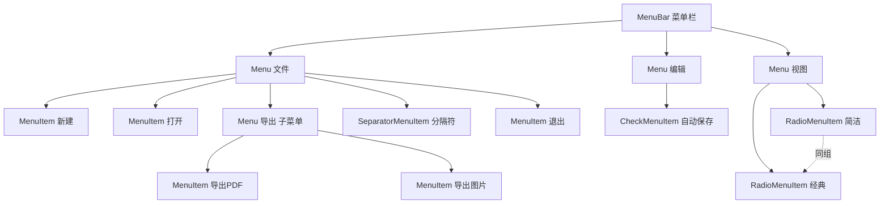
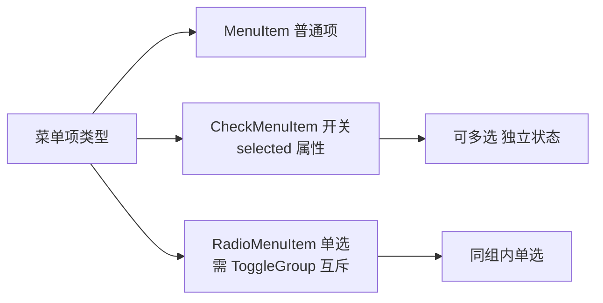

# 6.2 菜单栏与上下文菜单

桌面应用功能繁多，需要分级组织入口。菜单栏（MenuBar）把功能按“文件/编辑/视图”等类别分层，上下文菜单（ContextMenu）在右键时按当前对象提供相关操作。本节解决的问题是：掌握 `MenuBar`→`Menu`→`MenuItem` 三级结构与各类 `MenuItem` 变体，能为菜单设置快捷键与图标，并能绑定右键上下文菜单。

## 菜单层次结构



| 组件 | 作用 |
| --- | --- |
| `MenuBar` | 顶部菜单栏容器，通常放入 `BorderPane` 的 `top` |
| `Menu` | 可点击展开的菜单，可嵌套形成子菜单 |
| `MenuItem` | 菜单项，点击触发 `setOnAction` |
| `SeparatorMenuItem` | 分隔线 |
| `CheckMenuItem` | 带勾选状态的开关项 |
| `RadioMenuItem` | 单选项，需配合 `ToggleGroup` 互斥 |
| `CustomMenuItem` | 可放任意 Node 的菜单项 |

## MenuBar 与 MenuItem 示例

```java
import javafx.application.Application;
import javafx.scene.Scene;
import javafx.scene.control.*;
import javafx.scene.input.KeyCodeCombination;
import javafx.scene.input.KeyCombination;
import javafx.scene.input.KeyCode;
import javafx.scene.layout.BorderPane;
import javafx.stage.Stage;

public class MenuDemo extends Application {
    @Override
    public void start(Stage stage) {
        // 文件菜单
        Menu fileMenu = new Menu("文件(_F)"); // _F 表示 Alt+F 快捷键
        MenuItem newItem = new MenuItem("新建");
        MenuItem openItem = new MenuItem("打开");
        MenuItem exitItem = new MenuItem("退出");

        // 设置快捷键 accelerator
        newItem.setAccelerator(new KeyCodeCombination(KeyCode.N,
                KeyCombination.CONTROL_DOWN));
        openItem.setAccelerator(new KeyCodeCombination(KeyCode.O,
                KeyCombination.CONTROL_DOWN));

        newItem.setOnAction(e -> System.out.println("新建"));
        openItem.setOnAction(e -> System.out.println("打开"));
        exitItem.setOnAction(e -> stage.close());

        fileMenu.getItems().addAll(newItem, openItem,
                new SeparatorMenuItem(), exitItem);

        // 编辑菜单：含 CheckMenuItem
        Menu editMenu = new Menu("编辑(_E)");
        CheckMenuItem autoSave = new CheckMenuItem("自动保存");
        autoSave.setSelected(true);
        autoSave.selectedProperty().addListener((obs, o, n) ->
                System.out.println("自动保存: " + (n ? "开" : "关")));
        editMenu.getItems().add(autoSave);

        // 视图菜单：含 RadioMenuItem（互斥）
        Menu viewMenu = new Menu("视图(_V)");
        ToggleGroup themeGroup = new ToggleGroup();
        RadioMenuItem simple = new RadioMenuItem("简洁主题");
        RadioMenuItem classic = new RadioMenuItem("经典主题");
        simple.setToggleGroup(themeGroup);
        classic.setToggleGroup(themeGroup);
        simple.setSelected(true);
        viewMenu.getItems().addAll(simple, classic);

        MenuBar menuBar = new MenuBar(fileMenu, editMenu, viewMenu);

        BorderPane root = new BorderPane();
        root.setTop(menuBar);
        root.setCenter(new Label("主内容区"));

        stage.setScene(new Scene(root, 500, 350));
        stage.show();
    }
}
```

> [!tip] 助记符与快捷键
> > 菜单文本中的 `(_F)` 是**助记符**（Mnemonic），按 Alt+F 可展开该菜单（系统依赖）。`setAccelerator` 是**全局快捷键**（如 Ctrl+N），菜单显示时无需展开即可触发。两者不同：助记符定位菜单，accelerator 直接执行命令。

## CheckMenuItem 与 RadioMenuItem



- `CheckMenuItem`：用 `isSelected()`/`selectedProperty()` 读取勾选状态，适合“自动换行”“显示网格”等开关。
- `RadioMenuItem`：必须加入同一 `ToggleGroup` 才能互斥，适合“主题”“视图模式”等单选项。

## 上下文菜单：ContextMenu

右键菜单通过 `ContextMenu` 实现，绑定到控件的 `setContextMenu`：

```java
import javafx.scene.control.*;
import javafx.scene.input.ContextMenuEvent;

TextArea area = new TextArea();

ContextMenu ctx = new ContextMenu();
MenuItem copy  = new MenuItem("复制");
MenuItem paste = new MenuItem("粘贴");
MenuItem clear = new MenuItem("清空");

copy.setOnAction(e -> area.copy());
paste.setOnAction(e -> area.paste());
clear.setOnAction(e -> area.clear());

ctx.getItems().addAll(copy, paste, new SeparatorMenuItem(), clear);
area.setContextMenu(ctx); // 右键自动弹出

// 也可手动控制弹出位置
area.addEventHandler(ContextMenuEvent.CONTEXT_MENU_REQUESTED, e -> {
    ctx.show(area, e.getScreenX(), e.getScreenY());
    e.consume();
});
```

> [!note] ContextMenu 的两种用法
> > 1. `control.setContextMenu(ctx)`：框架自动在右键时弹出，最常用；
> > 2. `ctx.show(anchor, x, y)`：手动在任意坐标弹出，适合自定义触发条件（如长按、按钮点击）。

## 子菜单与图标

`Menu` 本身可包含 `Menu`，形成子菜单；`MenuItem` 可设图标：

```java
import javafx.scene.image.ImageView;
import javafx.scene.image.Image;

MenuItem exportPdf = new MenuItem("导出 PDF");
exportPdf.setGraphic(new ImageView(new Image("file:icons/pdf.png", 16, 16, true, true)));

Menu exportMenu = new Menu("导出", null, exportPdf,
        new MenuItem("导出图片"), new MenuItem("导出文本"));
fileMenu.getItems().add(exportMenu); // 嵌套子菜单
```

## 易错点

> [!warning] 常见误区
> 1. `RadioMenuItem` 忘记加 `ToggleGroup`，导致可多选无法互斥。
> 2. `accelerator` 大小写：`KeyCodeCombination` 中 `KeyCode.N` 区分按键，修饰键用 `KeyCombination.CONTROL_DOWN` 等。
> 3. 在 macOS 上 `MenuBar` 默认显示在系统顶部全局菜单栏，需用 `platform.setScene(null)` 或 `useSystemMenuBarProperty` 控制。

## 小结

`MenuBar`→`Menu`→`MenuItem` 构成三级菜单层次，`SeparatorMenuItem`/`CheckMenuItem`/`RadioMenuItem` 提供分隔、开关与单选变体，`Menu` 嵌套形成子菜单。`accelerator` 设置全局快捷键，助记符定位菜单。`ContextMenu` 通过 `setContextMenu` 绑定或 `show` 手动弹出右键菜单。菜单是桌面应用功能组织的标准骨架。

## 关联

- 先修：[[4.1 事件类型与事件链机制]]（`setOnAction`）、[[6.1 对话框设计与弹窗交互]]（菜单项打开对话框）
- 下一节：[[6.3 工具栏与状态栏设计]]
- 上一级：[[MOC - 第6章]]
