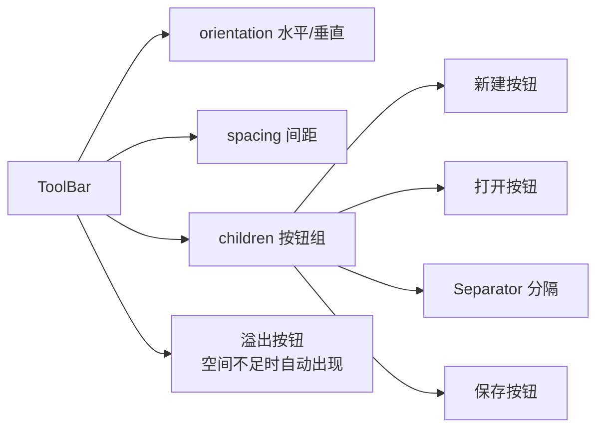
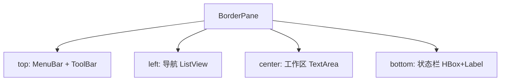

# 6.3 工具栏与状态栏设计

菜单容纳全部功能但层级深，高频操作需要更直接的入口；运行时的状态（如“就绪”“加载中 50%”）需要常驻反馈区。本节解决的问题是：用 `ToolBar` 组织常用操作按钮，用面板拼装状态栏，用 `Tooltip` 提供悬浮提示，并了解 `SystemTray` 的后台驻留能力，补齐桌面应用的最后一层交互。

## ToolBar 组件

`ToolBar` 是水平或垂直排列的按钮容器，超出宽度时自动溢出显示溢出按钮。



| 属性 | 作用 |
| --- | --- |
| `orientation` | `HORIZONTAL`（默认）/`VERTICAL` |
| `items`/`getItems()` | 子节点列表，可放 `Button`、`Separator`、`ComboBox` 等 |
| 溢出 | 空间不足自动出现 `»` 溢出按钮，点击展开隐藏项 |

## ToolBar 代码示例

```java
import javafx.application.Application;
import javafx.scene.Scene;
import javafx.scene.control.*;
import javafx.scene.layout.BorderPane;
import javafx.scene.layout.HBox;
import javafx.stage.Stage;

public class ToolBarDemo extends Application {
    @Override
    public void start(Stage stage) {
        Button newBtn = new Button("新建");
        Button openBtn = new Button("打开");
        Button saveBtn = new Button("保存");
        ComboBox<String> zoom = new ComboBox<>();
        zoom.getItems().addAll("100%", "150%", "200%");
        zoom.setValue("100%");

        newBtn.setOnAction(e -> System.out.println("新建"));
        openBtn.setOnAction(e -> System.out.println("打开"));
        saveBtn.setOnAction(e -> System.out.println("保存"));

        ToolBar toolBar = new ToolBar(
                newBtn, openBtn, new Separator(), saveBtn,
                new Separator(), new Label("缩放:"), zoom);
        // 工具栏默认水平；垂直工具栏：toolBar.setOrientation(Orientation.VERTICAL)

        BorderPane root = new BorderPane();
        root.setTop(toolBar);
        root.setCenter(new TextArea("主内容区"));
        root.setBottom(makeStatusBar()); // 见下文状态栏

        stage.setScene(new Scene(root, 600, 400));
        stage.show();
    }
    // makeStatusBar 见状态栏章节
}
```

> [!tip] 图标按钮
> > 工具栏按钮常用图标而非文字，更紧凑：`new Button("", new ImageView(icon))`。鼠标悬停时用 `Tooltip` 显示文字说明，兼顾紧凑与可读性。

## 状态栏实现

JavaFX 没有内置 `StatusBar`，标准做法是用 `HBox` 横向排列 `Label`，左侧放状态文本，右侧放进度或时间。

```java
import javafx.scene.control.*;
import javafx.scene.layout.*;
import javafx.scene.control.ProgressIndicator;

private HBox makeStatusBar() {
    Label status = new Label("就绪");
    Label count = new Label("行数: 0");
    ProgressIndicator progress = new ProgressIndicator();
    progress.setVisible(false); // 默认隐藏，加载时显示

    HBox bar = new HBox(10, status, count);
    // 让左侧状态文本占满剩余空间，右侧进度固定
    HBox.setHgrow(status, Priority.ALWAYS);
    status.setMaxWidth(Double.MAX_VALUE);

    HBox right = new HBox(5, new Label("CPU:"), progress);
    HBox.setHgrow(right, Priority.NEVER);

    HBox statusBar = new HBox(10, status, right);
    statusBar.setStyle("-fx-background-color: #f0f0f0; -fx-padding: 4 8;");
    return statusBar;
}

// 业务逻辑更新状态
// status.setText("加载中...");
// progress.setVisible(true);
// progress.setProgress(0.5);
```

> [!note] 为什么没有内置 StatusBar
> > 状态栏需求差异大（左状态/右进度/中时钟/多分区），用基础 `HBox`+`Priority`+`Label` 组合实现更灵活。这与 JavaFX“用面板拼装而非内置大控件”的设计哲学一致，[[3.1 布局面板与容器体系]] 的 grow 权重是状态栏自适应的关键。

## 工具提示：Tooltip

`Tooltip` 在鼠标悬停时显示说明文字，是工具栏图标按钮的标配。

```java
import javafx.scene.control.Tooltip;
import javafx.scene.control.Button;
import javafx.scene.image.ImageView;
import javafx.scene.image.Image;
import javafx.util.Duration;

Button saveBtn = new Button("", new ImageView(new Image("file:icons/save.png", 16, 16, true, true)));
Tooltip tip = new Tooltip("保存当前文件 (Ctrl+S)");
tip.setShowDelay(Duration.millis(200));  // 悬停多久后显示
tip.setHideDelay(Duration.millis(100));  // 移开后多久隐藏
saveBtn.setTooltip(tip);

// Tooltip 也可用于任意控件
TextField input = new TextField();
input.setTooltip(new Tooltip("请输入邮箱地址"));
```

| 属性 | 作用 |
| --- | --- |
| `text` | 提示文字 |
| `showDelay` | 悬停到显示的延迟 |
| `hideDelay` | 离开到隐藏的延迟 |
| `showDuration` | 显示持续时间 |
| `graphic` | 提示中的图标 |

## 系统托盘：SystemTray

JavaFX 本身不直接管理托盘，需借助 AWT 的 `java.awt.SystemTray`/`TrayIcon`，并通过 `Platform.setImplicitExit(false)` 让窗口关闭后程序驻留。

```java
import javafx.application.Platform;
import java.awt.*;
import java.awt.event.*;

// 启用托盘前的设置
Platform.setImplicitExit(false); // 关闭窗口不退出程序，驻留后台

if (SystemTray.isSupported()) {
    SystemTray tray = SystemTray.getSystemTray();
    Image awtImage = Toolkit.getDefaultToolkit().getImage("file:icons/tray.png");
    PopupMenu popup = new PopupMenu();
    MenuItem showItem = new MenuItem("显示窗口");
    MenuItem exitItem = new MenuItem("退出");
    showItem.addActionListener(e -> Platform.runLater(() -> stage.show()));
    exitItem.addActionListener(e -> Platform.exit());
    popup.add(showItem);
    popup.addSeparator();
    popup.add(exitItem);

    TrayIcon trayIcon = new TrayIcon(awtImage, "我的应用", popup);
    trayIcon.setImageAutoSize(true);
    // 双击托盘图标显示窗口
    trayIcon.addActionListener(e -> Platform.runLater(() -> stage.show()));
    try {
        tray.add(trayIcon);
    } catch (AWTException ex) {
        ex.printStackTrace();
    }
}

// 窗口关闭按钮改为隐藏而非退出
stage.setOnCloseRequest(e -> {
    e.consume();
    stage.hide();
});
```

> [!warning] AWT 与 JavaFX 线程隔离
> > `SystemTray`/`TrayIcon` 属于 AWT 事件线程，操作 JavaFX 的 `Stage` 必须用 `Platform.runLater(...)` 切回 JavaFX 线程，否则会抛线程访问异常。`Platform.setImplicitExit(false)` 是窗口隐藏后程序仍驻留的关键，配合托盘实现“最小化到托盘”。

## 主框架整合

完整的桌面主框架通常是 `BorderPane` + 顶菜单 + 顶工具栏 + 中内容 + 底状态栏：



## 易错点

> [!warning] 常见误区
> 1. `ToolBar` 溢出按钮只对水平工具栏生效，且需父容器给固定高度/宽度才触发溢出。
> 2. 状态栏忘记用 `Priority.ALWAYS`+`setMaxWidth(MAX_VALUE)`，导致状态文本无法撑满剩余空间。
> 3. `SystemTray` 操作 `Stage` 未用 `Platform.runLater`，抛出跨线程异常。

## 小结

`ToolBar` 横向/纵向排列高频操作按钮并支持溢出，状态栏用 `HBox`+`Label`+`Priority` 拼装，`Tooltip` 提供悬停说明，`SystemTray`（借助 AWT）实现最小化驻留。四者配合 `MenuBar` 构成桌面应用的标准交互骨架，与 [[3.1 布局面板与容器体系]] 的 `BorderPane` 框架共同形成完整主界面。

## 关联

- 先修：[[6.2 菜单栏与上下文菜单]]（菜单）、[[3.1 布局面板与容器体系]]（BorderPane 框架）
- 下一章：[[7.1 文件选择器与文件IO]]
- 上一级：[[MOC - 第6章]]
