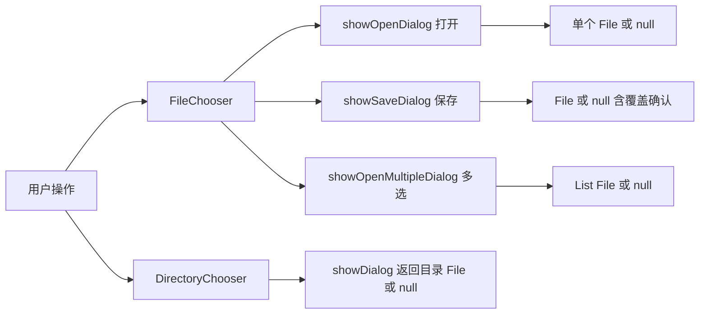

# 7.1 文件选择器与文件IO

GUI 应用需要打开和保存文件，但不能让用户在文本框里手敲路径。JavaFX 用 `FileChooser` 弹出系统原生文件对话框，用 `DirectoryChooser` 选择目录，再结合 Java NIO 完成实际读写。本节解决的问题是：掌握文件/目录选择器的配置与调用，并用 NIO 把选择结果落地为读写操作。

## FileChooser 与 DirectoryChooser



| 类 | 方法 | 返回 | 说明 |
| --- | --- | --- | --- |
| `FileChooser` | `showOpenDialog(Window)` | `File` 或 `null` | 打开单个文件，取消返回 null |
| `FileChooser` | `showSaveDialog(Window)` | `File` 或 `null` | 保存，文件存在时弹覆盖确认 |
| `FileChooser` | `showOpenMultipleDialog(Window)` | `List<File>` 或 `null` | 多选 |
| `DirectoryChooser` | `showDialog(Window)` | `File` 或 `null` | 选择目录 |

> [!note] Window 参数
> > 上述方法的 `Window` 参数是对话框的父窗口（通常是主 `Stage`），用于模态阻塞与定位。传 `null` 也能工作但失去父子关联，建议显式传入。

## ExtensionFilter 文件过滤

`ExtensionFilter` 限制对话框显示的文件类型：

```java
import javafx.stage.FileChooser;
import javafx.stage.FileChooser.ExtensionFilter;

FileChooser chooser = new FileChooser();
chooser.setTitle("打开文本文件");
chooser.setInitialDirectory(new File(System.getProperty("user.home")));

// 可添加多个过滤器，第一个为默认
chooser.getExtensionFilters().addAll(
        new ExtensionFilter("文本文件", "*.txt", "*.md"),
        new ExtensionFilter("所有文件", "*.*"));

File file = chooser.showOpenDialog(primaryStage);
if (file != null) {
    System.out.println("选中: " + file.getAbsolutePath());
}
```

> [!tip] 扩展名格式
> > `ExtensionFilter` 的扩展名参数必须以 `*.` 开头，如 `*.txt`，可传多个。多个过滤器时，`getExtensionFilters()` 第一个会被默认选中，可后续通过 `setSelectedExtensionFilter` 切换。

## DirectoryChooser 目录选择

```java
import javafx.stage.DirectoryChooser;
import java.io.File;

DirectoryChooser dirChooser = new DirectoryChooser();
dirChooser.setTitle("选择输出目录");
dirChooser.setInitialDirectory(new File(System.getProperty("user.home")));

File dir = dirChooser.showDialog(primaryStage);
if (dir != null) {
    System.out.println("输出到: " + dir.getAbsolutePath());
}
```

## Java NIO 文件读写集成

`FileChooser` 只负责选路径，实际读写用 `java.nio.file.Files`：

```java
import java.io.File;
import java.nio.file.Files;
import java.nio.file.Path;
import java.nio.charset.StandardCharsets;
import java.io.IOException;
import java.util.List;

// 读取整个文本文件
File openFile(FileChooser chooser, Stage stage) throws IOException {
    File file = chooser.showOpenDialog(stage);
    if (file != null) {
        Path path = file.toPath();
        String content = Files.readString(path, StandardCharsets.UTF_8);
        System.out.println("读取 " + content.length() + " 字符");
    }
    return file;
}

// 写入文本文件
void saveFile(String content, Stage stage) throws IOException {
    FileChooser saver = new FileChooser();
    saver.setTitle("保存文件");
    saver.setInitialFileName("untitled.txt");
    saver.getExtensionFilters().add(
            new FileChooser.ExtensionFilter("文本文件", "*.txt"));

    File file = saver.showSaveDialog(stage);
    if (file != null) {
        // showSaveDialog 不保证扩展名，手动补齐
        Path path = file.toPath();
        if (!path.toString().endsWith(".txt")) {
            path = Path.of(path + ".txt");
        }
        Files.writeString(path, content, StandardCharsets.UTF_8);
    }
}

// 读取所有行
List<String> lines = Files.readAllLines(path, StandardCharsets.UTF_8);
```

> [!warning] 异常与编码
> > 文件读写会抛 `IOException`，必须捕获或声明。中文文件务必显式指定 `StandardCharsets.UTF_8`，依赖系统默认编码在 Windows 上可能是 GBK 导致乱码。大文件用 `Files.lines(path)` 返回流式 `Stream<String>` 避免一次性加载。

## 完整记事本示例

```java
import javafx.application.Application;
import javafx.scene.Scene;
import javafx.scene.control.*;
import javafx.scene.layout.BorderPane;
import javafx.stage.FileChooser;
import javafx.stage.Stage;
import java.io.*;
import java.nio.file.*;

public class NotepadDemo extends Application {
    private final TextArea area = new TextArea();
    private final FileChooser chooser = new FileChooser();
    private File currentFile;

    @Override
    public void start(Stage stage) {
        chooser.getExtensionFilters().add(
                new FileChooser.ExtensionFilter("文本文件", "*.txt"));
        chooser.setInitialFileName("untitled.txt");

        MenuBar menuBar = new MenuBar(
                buildFileMenu(stage),
                new Menu("编辑", new MenuItem("复制"), new MenuItem("粘贴")));
        BorderPane root = new BorderPane(area);
        root.setTop(menuBar);
        stage.setScene(new Scene(root, 600, 400));
        stage.show();
    }

    private Menu buildFileMenu(Stage stage) {
        MenuItem open = new MenuItem("打开");
        MenuItem save = new MenuItem("保存");
        open.setOnAction(e -> open(stage));
        save.setOnAction(e -> save(stage));
        return new Menu("文件", null, open, save);
    }

    private void open(Stage stage) {
        File file = chooser.showOpenDialog(stage);
        if (file == null) return;
        try {
            area.setText(Files.readString(file.toPath()));
            currentFile = file;
            stage.setTitle(file.getName() + " - 记事本");
        } catch (IOException ex) {
            new Alert(Alert.AlertType.ERROR, "打开失败: " + ex.getMessage()).show();
        }
    }

    private void save(Stage stage) {
        File file = currentFile != null ? currentFile : chooser.showSaveDialog(stage);
        if (file == null) return;
        try {
            Files.writeString(file.toPath(), area.getText());
            currentFile = file;
            stage.setTitle(file.getName() + " - 记事本");
        } catch (IOException ex) {
            new Alert(Alert.AlertType.ERROR, "保存失败: " + ex.getMessage()).show();
        }
    }
}
```

## 易错点

> [!warning] 常见误区
> 1. `showSaveDialog` 返回的 `File` 对象对应的文件可能还不存在，需用 NIO 写入时创建；扩展名不会自动补齐，需手动处理。
> 2. 把 `FileChooser` 在非 UI 线程调用会抛异常；它必须在 JavaFX Application Thread 上调用。
> 3. 忽略 `IOException` 或不指定编码，导致中文乱码或静默失败。

## 小结

`FileChooser` 处理打开/保存/多选文件，`DirectoryChooser` 选择目录，`ExtensionFilter` 控制文件类型过滤，实际读写交给 Java NIO `Files`。`showSaveDialog` 不保证扩展名与文件存在，需手动补齐。选择器只产路径，IO 由 NIO 完成，二者分工明确。这是文件型应用的基础能力。

## 关联

- 先修：[[6.1 对话框设计与弹窗交互]]（错误提示用 Alert）、[[6.2 菜单栏与上下文菜单]]（文件菜单）
- 下一节：[[7.2 数据绑定与可观察集合]]
- 上一级：[[MOC - 第7章]]
