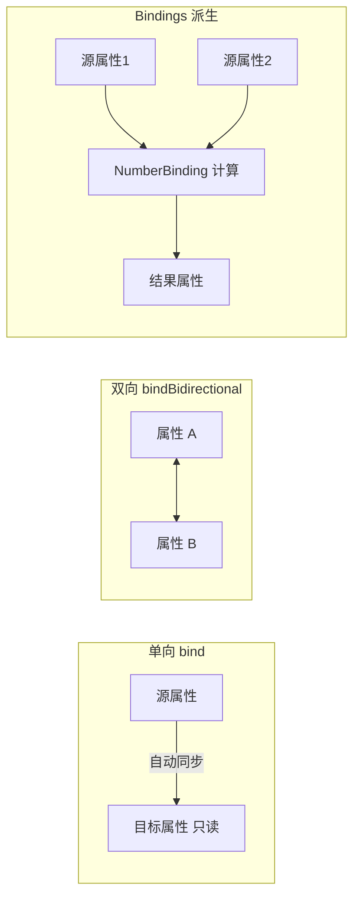

# 7.2 数据绑定与可观察集合

[[4.3 属性变化监听与绑定机制]] 引入了 Properties 与基础绑定，本节在它之上深入：用 `Bindings` 工具类与 `NumberBinding` 构建算术/逻辑派生属性，用 `ObservableList` 让 `ListView`/`TableView` 数据驱动刷新，用 `FXCollections` 管理可观察集合。本节解决的问题是：把“数据变→界面变”从单个属性扩展到集合与计算链，实现真正的数据驱动 GUI。

## 属性绑定回顾



- 单向 `target.bind(source)`：source 变 target 自动变，target 不可写；
- 双向 `a.bindBidirectional(b)`：任一方变化同步另一方；
- 高级绑定：用 `Bindings` 工具类组合多源属性生成派生属性。

## 高级绑定：Bindings 工具类

`Bindings` 提供算术、逻辑、字符串、条件等运算，返回 `NumberBinding`/`BooleanBinding`/`StringBinding`：

```java
import javafx.beans.binding.Bindings;
import javafx.beans.binding.NumberBinding;
import javafx.beans.binding.BooleanBinding;
import javafx.beans.binding.StringBinding;
import javafx.beans.property.SimpleIntegerProperty;
import javafx.beans.property.IntegerProperty;

IntegerProperty price = new SimpleIntegerProperty(100);
IntegerProperty qty   = new SimpleIntegerProperty(3);
IntegerProperty discount = new SimpleIntegerProperty(50);

// 算术：总价 = price * qty
NumberBinding total = price.multiply(qty);
// 实付 = 总价 - 折扣
NumberBinding paid = total.subtract(discount);

System.out.println(paid.intValue()); // 250
price.set(120);
System.out.println(paid.intValue()); // 310

// 条件：实付 > 300 时为 true
BooleanBinding bigOrder = paid.greaterThan(300);
System.out.println(bigOrder.get()); // true

// 字符串组合
StringBinding summary = Bindings.concat("实付: ", paid.asString(), " 元");
System.out.println(summary.get()); // 实付: 310 元
```

| Bindings 方法 | 作用 |
| --- | --- |
| `add/subtract/multiply/divide` | 算术运算 |
| `greaterThan/lessThan/equalTo` | 比较返回 `BooleanBinding` |
| `and/or/not` | 逻辑运算 |
| `concat` | 字符串拼接 |
| `when(cond).then(x).otherwise(y)` | 三元条件 |
| `isNull/isNotNull` | 空判断 |
| `select(root, "child", "field")` | 路径选择 |

> [!note] NumberBinding 与 NumberBinding
> > `NumberBinding` 是 `ObservableValue<Number>`，可被监听也可绑定到其他属性。它惰性求值，只有在被读取或被监听时才重新计算。注意 `intValue()`/`doubleValue()` 的类型转换，浮点结果用 `doubleValue()` 避免截断。

## ObservableList 与 ListView/TableView 联动

`ObservableList` 是可观察的 `List`，元素增删会通知监听者，`ListView`/`TableView` 内部正是依赖它实现自动刷新。

```java
import javafx.collections.FXCollections;
import javafx.collections.ObservableList;
import javafx.scene.control.ListView;
import javafx.scene.control.cell.TextFieldListCell;

// ObservableList 作为 ListView 数据源
ObservableList<String> names = FXCollections.observableArrayList(
        "张三", "李四", "王五");
ListView<String> listView = new ListView<>(names);

// 修改 list 时 ListView 自动刷新
names.add("赵六");     // 界面立即出现新项
names.remove("李四");  // 界面立即移除
names.set(0, "张三丰"); // 替换第0项
```

### TableView 数据驱动

```java
import javafx.beans.property.SimpleStringProperty;
import javafx.beans.property.StringProperty;
import javafx.scene.control.TableColumn;
import javafx.scene.control.TableView;
import javafx.scene.control.cell.PropertyValueFactory;

public static class Person {
    private final StringProperty name = new SimpleStringProperty();
    private final StringProperty email = new SimpleStringProperty();
    public Person(String n, String e) { name.set(n); email.set(e); }
    public StringProperty nameProperty() { return name; }
    public StringProperty emailProperty() { return email; }
    public String getName() { return name.get(); }
    public String getEmail() { return email.get(); }
}

ObservableList<Person> people = FXCollections.observableArrayList(
        new Person("张三", "zs@example.com"),
        new Person("李四", "ls@example.com"));

TableView<Person> table = new TableView<>(people);

TableColumn<Person, String> nameCol = new TableColumn<>("姓名");
nameCol.setCellValueFactory(new PropertyValueFactory<>("name"));
TableColumn<Person, String> emailCol = new TableColumn<>("邮箱");
emailCol.setCellValueFactory(new PropertyValueFactory<>("email"));

table.getColumns().addAll(nameCol, emailCol);

// 增删行时表格自动刷新
people.add(new Person("王五", "ww@example.com"));
```

> [!tip] PropertyValueFactory 与属性命名
> > `PropertyValueFactory("name")` 通过反射查找 `nameProperty()` 方法（返回 `Property`）或 `getName()` 方法。Person 的字段用 `SimpleStringProperty` 并暴露 `xxxProperty()` 方法，单元格才能监听属性变化实现即时更新。若只用普通字段，单元格编辑不会回写。

## FXCollections 工具方法

`FXCollections` 提供可观察集合的工厂与工具：

| 方法 | 作用 |
| --- | --- |
| `observableArrayList()` | 创建可观察 `ArrayList` |
| `observableArrayList(elements)` | 用已有元素创建 |
| `unmodifiableObservableList(list)` | 包裹为不可修改视图 |
| `checkedObservableList(list, type)` | 类型检查视图 |
| `synchronizedObservableList(list)` | 同步视图 |
| `sort(list, comparator)` | 排序并触发变更通知 |
| `copy(dest, src)` | 复制元素并通知 |

```java
import javafx.collections.FXCollections;
import java.util.Comparator;

ObservableList<Integer> nums = FXCollections.observableArrayList(3, 1, 4, 1, 5);
// 排序（触发变更通知，ListView 自动重排）
FXCollections.sort(nums, Comparator.naturalOrder());
System.out.println(nums); // [1, 1, 3, 4, 5]

// 不可修改视图
ObservableList<Integer> readOnly = FXCollections.unmodifiableObservableList(nums);
// readOnly.add(9); // 抛 UnsupportedOperationException
```

> [!warning] 直接修改底层集合不通知
> > 若用 `Collections.sort` 而非 `FXCollections.sort`，`ObservableList` 内部数据变了但不会触发变更通知，`ListView` 不会重排。所有对 `ObservableList` 的结构性修改都必须通过它自身或 `FXCollections` 工具方法，绕过会破坏数据驱动刷新。

## 绑定与集合综合示例

```java
import javafx.application.Application;
import javafx.beans.binding.Bindings;
import javafx.collections.FXCollections;
import javafx.collections.ObservableList;
import javafx.scene.Scene;
import javafx.scene.control.*;
import javafx.scene.layout.VBox;
import javafx.stage.Stage;

public class BindingListDemo extends Application {
    @Override
    public void start(Stage stage) {
        ObservableList<String> items = FXCollections.observableArrayList("A", "B", "C");
        ListView<String> view = new ListView<>(items);
        Label countLabel = new Label();
        Label sizeLabel = new Label();

        // 标签文本绑定到集合大小
        sizeLabel.textProperty().bind(Bindings.size(items).asString("共 %d 项"));

        Button add = new Button("添加");
        add.setOnAction(e -> items.add("项" + items.size()));
        Button remove = new Button("移除最后");
        remove.disableProperty().bind(Bindings.isEmpty(items)); // 空时禁用

        stage.setScene(new Scene(new VBox(8, view, sizeLabel, add, remove), 250, 250));
        stage.show();
    }
}
```

## 易错点

> [!warning] 常见误区
> 1. 用 `ArrayList` 作 `ListView` 数据源后直接 `add`，界面不刷新——必须用 `ObservableList`。
> 2. `PropertyValueFactory` 找不到 `xxxProperty()` 方法时降级用 `getXxx()`，但单元格无法监听后续属性变化。
> 3. `NumberBinding` 惰性求值，未被读取或监听时不计算，导致看似“没更新”。

## 小结

`Bindings` 工具类把多个属性组合成算术/逻辑/条件派生属性，`NumberBinding` 实现计算链；`ObservableList` 让 `ListView`/`TableView` 数据驱动刷新，增删改自动反映到界面；`FXCollections` 提供可观察集合的工厂与排序/视图工具。这套机制把 [[4.3 属性变化监听与绑定机制]] 的单属性绑定扩展到集合与计算，是数据驱动 GUI 的核心。

## 关联

- 先修：[[4.3 属性变化监听与绑定机制]]（基础绑定）、[[2.2 选择类与列表类组件]]（ListView/TableView 控件）
- 下一节：[[7.3 持久化存储与序列化]]
- 上一级：[[MOC - 第7章]]
