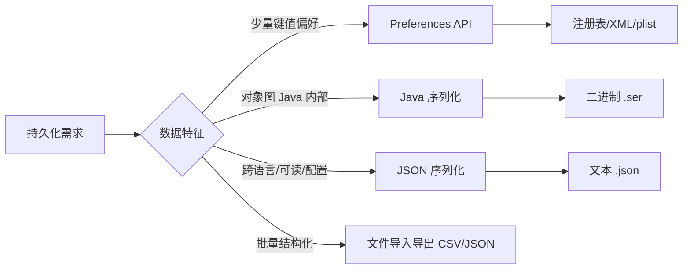
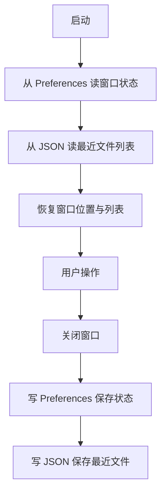

# 7.3 持久化存储与序列化

应用关闭后数据要能保留，下次启动恢复。JavaFX 桌面应用的持久化分三个层次：少量用户偏好用 `Preferences` API，结构化对象图用 Java 序列化或 JSON 序列化，批量数据导入导出用文件交换。本节解决的问题是：根据数据量与用途选择合适的持久化方式，把内存状态可靠地存到磁盘并恢复。

## 三种持久化方式对比



| 方式 | 数据量 | 可读性 | 跨语言 | 典型用途 |
| --- | --- | --- | --- | --- |
| `Preferences` | 少量键值 | 不可见 | 否 | 窗口位置、最近文件、勾选项 |
| Java 序列化 | 中等 | 二进制不可读 | 否 | Java 内部对象图缓存 |
| JSON（Gson/Jackson） | 中大 | 文本可读 | 是 | 配置、用户数据、数据交换 |

## Preferences API：用户偏好

`Preferences` 是 Java 标准的轻量键值存储，按节点树组织，存储位置由 OS 决定（Windows 注册表、Linux XML、macOS plist）。

```java
import java.util.prefs.Preferences;

public class AppPrefs {
    private final Preferences prefs = Preferences.userNodeForPackage(AppPrefs.class);

    // 存
    public void saveWindowState(double x, double y, double w, double h) {
        prefs.putDouble("win.x", x);
        prefs.putDouble("win.y", y);
        prefs.putDouble("win.w", w);
        prefs.putDouble("win.h", h);
        prefs.putBoolean("darkMode", true);
        prefs.put("lastFile", "/home/user/doc.txt");
    }

    // 取（带默认值）
    public double[] loadWindowState() {
        return new double[] {
                prefs.getDouble("win.x", 100),
                prefs.getDouble("win.y", 100),
                prefs.getDouble("win.w", 800),
                prefs.getDouble("win.h", 600)
        };
    }

    public boolean isDarkMode() {
        return prefs.getBoolean("darkMode", false);
    }
}
```

| 方法 | 类型 |
| --- | --- |
| `put/getString` | `String` |
| `putBoolean/getBoolean` | `boolean` |
| `putInt/getInt`、`putLong/getLong` | 整数 |
| `putDouble/getDouble` | 浮点 |
| `putByteArray/getByteArray` | `byte[]`（适合小二进制） |
| `node("子节点名")` | 子节点 |

> [!note] userNode vs systemNode
> > `userNodeForPackage` 按当前用户隔离，`systemNodeForPackage` 全系统共享（需权限）。GUI 应用存用户偏好优先用 `userNode`。`Preferences` 不适合存大数据，单个值上限约 8KB（`MAX_VALUE_LENGTH`），整体长度也有限。

## Java 序列化与反序列化

实现 `Serializable` 接口的对象可通过 `ObjectOutputStream`/`ObjectInputStream` 转为字节流：

```java
import java.io.*;

public static class Settings implements Serializable {
    private static final long serialVersionUID = 1L; // 版本号
    private String theme;
    private int fontSize;
    private boolean autoSave;
    // 构造、getter/setter 省略
    public Settings(String t, int f, boolean a) { theme = t; fontSize = f; autoSave = a; }
    @Override public String toString() { return theme + "," + fontSize + "," + autoSave; }
}

// 序列化到文件
void serialize(Settings s, File file) throws IOException {
    try (ObjectOutputStream oos = new ObjectOutputStream(
            new FileOutputStream(file))) {
        oos.writeObject(s);
    }
}

// 反序列化
Settings deserialize(File file) throws IOException, ClassNotFoundException {
    try (ObjectInputStream ois = new ObjectInputStream(
            new FileInputStream(file))) {
        return (Settings) ois.readObject();
    }
}
```

> [!warning] 序列化的局限
> > 1. 类必须实现 `Serializable`，否则抛 `NotSerializableException`。
> > 2. 类改字段会导致 `serialVersionUID` 不匹配抛 `InvalidClassException`，需显式声明并维护版本号。
> > 3. `transient` 字段不参与序列化，反序列化后为默认值。
> > 4. 安全性：反序列化不可信数据可触发任意对象构造（反序列化漏洞），生产环境慎用。

## JSON 序列化（Gson / Jackson）

JSON 跨语言、可读、易版本演进，是 GUI 应用持久化用户数据的首选。

### Gson 示例

```java
// 需引入依赖：com.google.code.gson:gson:2.10+
import com.google.gson.Gson;
import com.google.gson.GsonBuilder;
import java.io.*;
import java.nio.file.*;

public static class AppConfig {
    String theme = "light";
    int fontSize = 14;
    boolean autoSave = true;
    String lastFile = "";
}

Gson gson = new GsonBuilder().setPrettyPrinting().create();

// 对象 → JSON 文件
void saveConfig(AppConfig cfg, Path path) throws IOException {
    String json = gson.toJson(cfg);
    Files.writeString(path, json);
}

// JSON 文件 → 对象
AppConfig loadConfig(Path path) throws IOException {
    if (!Files.exists(path)) return new AppConfig();
    String json = Files.readString(path);
    return gson.fromJson(json, AppConfig.class);
}
```

### Jackson 示例

```java
// 需引入依赖：com.fasterxml.jackson.core:jackson-databind:2.15+
import com.fasterxml.jackson.databind.ObjectMapper;

ObjectMapper mapper = new ObjectMapper();
// 美化输出
mapper.writerWithDefaultPrettyPrinter().writeValue(new File("config.json"), cfg);

// 读取
AppConfig cfg2 = mapper.readValue(new File("config.json"), AppConfig.class);
```

> [!tip] Gson vs Jackson
> > Gson（Google）API 简单，零注解即可用，适合中小项目；Jackson（FasterXML）性能更好、功能更全（流式、树模型、注解丰富），适合大型项目。GUI 配置文件二者皆可，按团队依赖习惯选择。注意 Jackson 默认要求无参构造，Gson 通过反射创建对象。

## 数据导出与导入

把内部数据导出为通用格式（CSV/JSON）便于交换：

```java
import java.util.List;
import java.nio.file.*;
import java.io.IOException;

// 导出为 CSV
void exportCsv(List<Person> people, Path path) throws IOException {
    StringBuilder sb = new StringBuilder("name,email\n");
    for (Person p : people) {
        sb.append(p.getName()).append(',')
          .append(p.getEmail()).append('\n');
    }
    Files.writeString(path, sb.toString());
}

// 导入 CSV
List<String> importCsv(Path path) throws IOException {
    return Files.readAllLines(path).stream()
            .skip(1) // 跳过表头
            .toList();
}
```

## 持久化综合示例：带配置的记事本



```java
import java.util.prefs.Preferences;
import com.google.gson.Gson;
import com.google.gson.reflect.TypeToken;
import java.nio.file.*;
import java.util.*;

public class NotepadState {
    private final Preferences prefs = Preferences.userNodeForPackage(NotepadState.class);
    private final Path recentPath = Path.of("recent.json");
    private final Gson gson = new Gson();

    void saveWindowState(Stage stage) {
        prefs.putDouble("x", stage.getX());
        prefs.putDouble("y", stage.getY());
        prefs.putDouble("w", stage.getWidth());
        prefs.putDouble("h", stage.getHeight());
    }

    void applyWindowState(Stage stage) {
        stage.setX(prefs.getDouble("x", 100));
        stage.setY(prefs.getDouble("y", 100));
        stage.setWidth(prefs.getDouble("w", 800));
        stage.setHeight(prefs.getDouble("h", 600));
    }

    void saveRecent(List<String> files) throws IOException {
        String json = gson.toJson(files);
        Files.writeString(recentPath, json);
    }

    List<String> loadRecent() throws IOException {
        if (!Files.exists(recentPath)) return new ArrayList<>();
        return gson.fromJson(Files.readString(recentPath),
                new TypeToken<List<String>>(){}.getType());
    }
}
```

## 易错点

> [!warning] 常见误区
> 1. 用 `Preferences` 存大数据（图片、长文本）——超过长度限制会抛异常，应改用文件。
> 2. Java 序列化改字段未维护 `serialVersionUID`，导致旧数据反序列化失败。
> 3. Gson/Jackson 反序列化时 JSON 字段名与类字段不匹配（或类无无参构造），导致默认值或异常。
> 4. 持久化路径用相对路径，依赖工作目录导致找不到文件——配置文件应存固定位置（如 `user.home/.app/`）。

## 小结

`Preferences` 适合少量键值偏好，存储位置由 OS 决定；Java 序列化适合 Java 内部对象图但对版本敏感、不可跨语言；JSON（Gson/Jackson）跨语言可读、易演进，是用户数据持久化首选；导入导出用 CSV/JSON 实现数据交换。选型依据是数据量、可读性需求与跨语言需求，三者常配合使用。

## 关联

- 先修：[[7.1 文件选择器与文件IO]]（文件读写）、[[7.2 数据绑定与可观察集合]]（可观察数据）
- 上一级：[[MOC - 第7章]]
