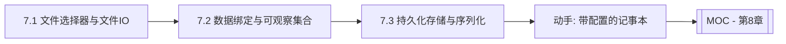

# MOC - 第7章 文件交互与数据绑定

> [!info] 本章定位
> 第6章搭好了交互骨架，第7章让应用“能存能取、能联动数据”。本章覆盖三条主线：用 `FileChooser`/`DirectoryChooser` 完成文件与目录的打开保存，用绑定与可观察集合实现界面与数据的双向同步，用 Preferences/序列化/JSON 完成持久化存储。这是从“演示程序”到“实用工具”的关键一跃。

## 学习路线图

## 知识点导航

| 节 | 主题 | 核心要点 | 入口 |
| --- | --- | --- | --- |
| 7.1 | 文件选择器与文件IO | `FileChooser`、`ExtensionFilter`、`DirectoryChooser`、Java NIO 集成 | [[7.1 文件选择器与文件IO]] |
| 7.2 | 数据绑定与可观察集合 | 单/双向绑定、`Bindings`/`NumberBinding`、`ObservableList` 联动、`FXCollections` | [[7.2 数据绑定与可观察集合]] |
| 7.3 | 持久化存储与序列化 | `Preferences` API、Java 序列化、JSON（Gson/Jackson）、导入导出 | [[7.3 持久化存储与序列化]] |

## 核心考点

> [!warning] 重点掌握
> 1. `FileChooser` 的 `showOpenDialog`/`showSaveDialog` 与 `ExtensionFilter` 文件过滤的写法。
> 2. `DirectoryChooser` 选择目录与 `FileChooser` 选择文件的差异。
> 3. `ObservableList` 与 `ListView`/`TableView` 的数据驱动联动，`FXCollections` 工具方法。
> 4. `Preferences` API 的节点层级与键值存取，适合存用户偏好而非大数据。
> 5. Java 序列化与 JSON 序列化的取舍：跨语言、可读性、版本兼容性。
> 6. `Bindings` 高级绑定与 `NumberBinding` 的算术组合。

## 自测题

> [!question] 题1
> 用 `FileChooser` 实现一个“保存文本文件”功能，要求过滤 `.txt` 文件，并写出关键步骤。
> > [!check]- 参考答案
> > 1. `FileChooser chooser = new FileChooser();`
> > 2. `chooser.getExtensionFilters().add(new ExtensionFilter("文本文件", "*.txt"));`
> > 3. `chooser.setInitialFileName("untitled.txt");`
> > 4. `File file = chooser.showSaveDialog(stage);`（返回 `null` 表示取消）
> > 5. 若 `file != null`，用 NIO `Files.writeString(file.toPath(), content)` 写入。
> > 注意 `showSaveDialog` 在文件已存在时会弹覆盖确认，返回的 `File` 不保证扩展名正确，可手动补 `.txt`。

> [!question] 题2
> `ObservableList` 与普通 `ArrayList` 有何不同？为什么 `ListView` 要用它作数据源？
> > [!check]- 参考答案
> > `ObservableList` 在元素增删、替换时会触发 `ListChangeListener` 通知；普通 `ArrayList` 修改后外部无感知。`ListView` 内部监听数据源的变更事件来自动刷新视图，若用 `ArrayList` 则增删后界面不会更新（除非调用 `listView.refresh()` 或重新 `setItems`）。因此数据驱动界面必须用 `ObservableList`，让“数据变→界面变”自动完成。

> [!question] 题3
> `Preferences` API 适合存什么、不适合存什么？它的存储位置由什么决定？
> > [!check]- 参考答案
> > 适合存少量用户偏好（窗口位置、最近文件、主题选择、勾选项），以键值对形式。不适合存大数据、二进制、需要查询索引的数据（应存数据库或文件）。存储位置由**节点路径**（`userNodeForPackage`/`systemNodeForPackage`）和操作系统决定：Windows 存注册表、Linux 存用户目录下 XML、macOS 存 plist。它是按用户/系统隔离的层级树。

> [!question] 题4
> 对比 Java 原生序列化与 JSON 序列化的优缺点，分别适合什么场景？
> > [!check]- 参考答案
> > Java 原生序列化（`Serializable`+`ObjectOutputStream`）保留对象图完整、简单，但只能 Java 读取、二进制不可读、对类版本敏感（`serialVersionUID` 不匹配会失败），适合 Java 内部短期缓存或 RMI。JSON 序列化（Gson/Jackson）跨语言、文本可读、易于版本演进与调试，但需处理嵌套对象、循环引用与类型信息，适合配置文件、数据交换、持久化存储。GUI 应用持久化用户数据优先选 JSON。

## 章节导航

- 上一章：[[MOC - 第6章]]
- 上一级：[[MOC - 可视化程序设计]]
- 下一章：[[MOC - 第8章]]
