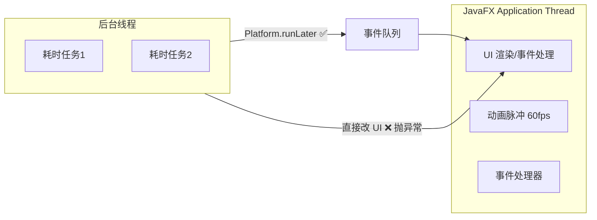
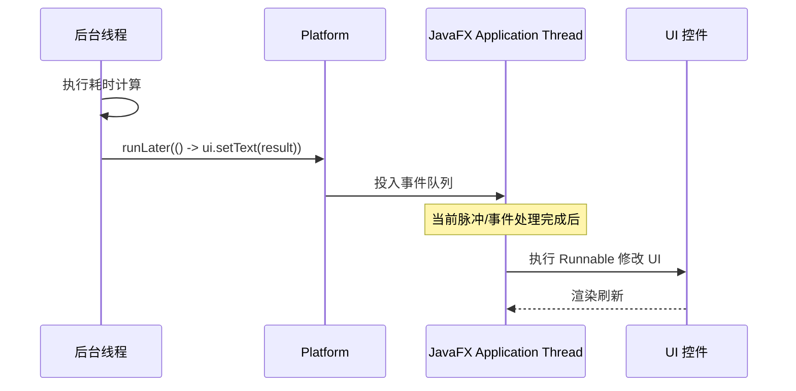

# 8.1 JavaFX线程模型与Platform.runLater

JavaFX 采用单线程 UI 模型：所有对 Scene Graph 的读写都必须在 JavaFX Application Thread 上完成，这避免了多线程并发修改 UI 的锁竞争与渲染不一致。但实际应用常需执行耗时操作（文件加载、网络请求、大量计算），若挤在 UI 线程会冻结界面。本节解决的问题是：理解 JavaFX 的线程模型，掌握 `Platform.runLater()` 把后台线程的结果切回 UI 线程更新界面的标准做法。

## JavaFX 单线程模型

JavaFX 只有一个线程可以安全地访问 UI 组件——JavaFX Application Thread（也称 FX 线程）。`Application.start()`、事件处理器、动画脉冲（pulse）都在该线程执行。



> [!note] 为什么是单线程
> > 多线程并发修改 UI 会引入复杂的锁机制，容易死锁且难以测试。单线程模型让 UI 控件实现无需同步原语、性能更可预测，是 Swing/AWT/JavaFX/WPF/Android UI 工具包的共同选择。

## 非 UI 线程更新 UI 的禁止规则

JavaFX 在运行时会检测对 `Node`/`Scene`/`Window` 的访问线程，若不是 FX 线程则抛 `IllegalStateException`：

```
Exception in thread "Thread-0" java.lang.IllegalStateException:
    Not on FX application thread; currentThread = Thread-0
```

```java
import javafx.application.Application;
import javafx.scene.control.Label;
import javafx.stage.Stage;

// ❌ 错误：后台线程直接改 UI
new Thread(() -> {
    try { Thread.sleep(1000); } catch (InterruptedException ignored) {}
    label.setText("done");  // 抛 IllegalStateException
}).start();
```

> [!warning] 常见误区
> > “我只读不改应该安全”——读 `label.getText()` 同样要求在 FX 线程上，否则也可能抛异常或读到不一致状态。任何对 UI 对象的访问都需走 FX 线程。

## Platform.runLater() 机制

`Platform.runLater(Runnable)` 把 `Runnable` 投递到 JavaFX Application Thread 的事件队列，由该线程在空闲时异步执行。它是后台线程切回 UI 线程的标准入口。



| 方法 | 作用 | 备注 |
| --- | --- | --- |
| `Platform.runLater(Runnable)` | 在 FX 线程异步执行 | 非阻塞，立即返回 |
| `Platform.isFxApplicationThread()` | 判断当前是否 FX 线程 | 调试/条件调度 |
| `Platform.startup(Runnable)` | 未继承 `Application` 时启动 FX | JavaFX 9+ |
| `Platform.exit()` | 请求关闭 FX 运行时 | 不强制 `System.exit` |

### Platform.runLater 代码示例

```java
import javafx.application.Application;
import javafx.application.Platform;
import javafx.scene.Scene;
import javafx.scene.control.Button;
import javafx.scene.control.Label;
import javafx.scene.layout.VBox;
import javafx.stage.Stage;

public class RunLaterDemo extends Application {
    private final Label status = new Label("就绪");

    @Override
    public void start(Stage stage) {
        Button btn = new Button("开始后台任务");
        btn.setOnAction(e -> {
            status.setText("运行中...");
            // 后台线程模拟耗时操作
            new Thread(() -> {
                try {
                    Thread.sleep(2000); // 模拟耗时
                } catch (InterruptedException ignored) {}
                String result = "计算完成: " + System.currentTimeMillis();

                // ✅ 正确：切回 FX 线程更新 UI
                Platform.runLater(() -> status.setText(result));
            }, "worker").start();
        });

        stage.setScene(new Scene(new VBox(10, btn, status), 280, 120));
        stage.show();
    }
}
```

> [!tip] runLater 的非阻塞语义
> > `runLater` 立即返回，`Runnable` 排在事件队列尾端执行。若需等待 UI 更新完成再继续，应使用 `CountDownLatch` 或改用 `Task` 的回调（见 [[8.2 Task与Service后台任务]]）。

## 线程安全问题分析

### runLater 风暴

后台线程高频调用 `Platform.runLater` 会塞满事件队列，UI 响应变慢甚至卡顿：

```java
// ❌ 错误：每毫秒投递一次 runLater，事件队列被淹没
while (running) {
    data.add(produce());
    Platform.runLater(() -> label.setText("数量: " + data.size()));
    Thread.sleep(1);
}
```

正确做法：后台批量缓冲，按时间窗口合并提交（如每 50ms 一次），或用 `Task` 的 `updateProgress`/`updateMessage`（内部已限速）。

### 共享状态竞态

后台线程与 FX 线程共享普通集合/变量会出现竞态：

```java
// ❌ 共享普通 ArrayList，并发修改异常
List<String> buffer = new ArrayList<>();
new Thread(() -> { buffer.add("x"); /* ... */ }).start();
Platform.runLater(() -> label.setText(buffer.get(0))); // ConcurrentModificationException 风险
```

应使用并发集合（见 [[8.3 并发集合与界面实时刷新]]）或只允许单线程持有可变状态。

### 判断当前线程

```java
if (Platform.isFxApplicationThread()) {
    updateUI(); // 已在 FX 线程，直接执行
} else {
    Platform.runLater(this::updateUI); // 否则调度
}
```

## 易错点

> [!warning] 常见误区
> 1. 在事件处理器里直接 `Thread.sleep` 或调用阻塞 IO——会冻结整个 UI；必须放后台线程。
> 2. 误以为 `runLater` 是同步等待——它是异步的，调用后立即返回，后续代码先于 `Runnable` 执行。
> 3. 后台线程高频 `runLater` 导致事件队列堆积，界面卡顿；应批量或限速。
> 4. 在后台线程读 `Scene`/`Node` 属性（如 `stage.getWidth()`）同样违规。

## 小结

JavaFX 的单线程 UI 模型要求所有 UI 访问在 JavaFX Application Thread 上完成；后台线程不能直接改 UI，必须用 `Platform.runLater(Runnable)` 把更新切回 FX 线程。`runLater` 是异步、非阻塞的，滥用会淹没事件队列。对于有进度汇报和取消需求的长任务，应使用 `Task`/`Service`（见 [[8.2 Task与Service后台任务]]），它们内置了线程切换与状态管理。

## 关联

- 先修：[[4.1 事件类型与事件链机制]]（事件在 FX 线程派发）、[[7.1 文件选择器与文件IO]]（`FileChooser` 必须在 FX 线程调用）
- 下一节：[[8.2 Task与Service后台任务]]
- 上一级：[[MOC - 第8章]]
