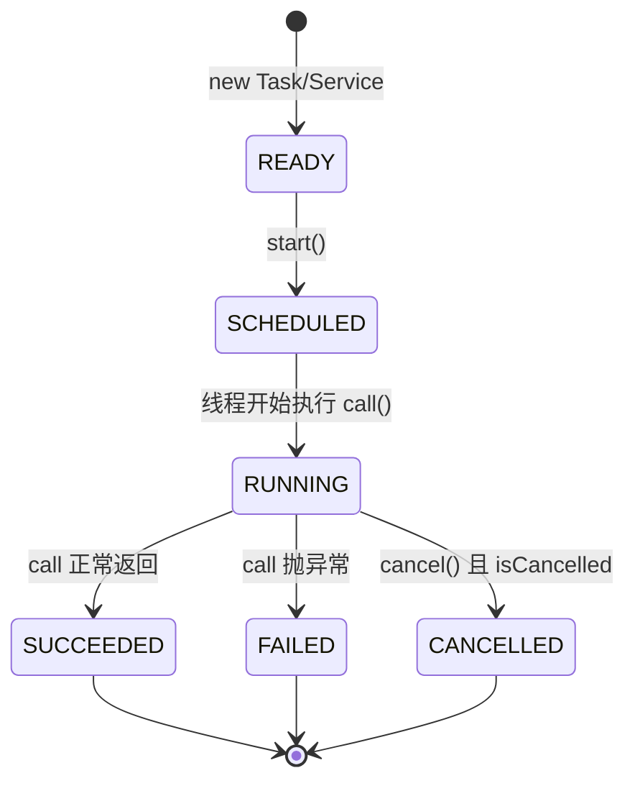

# 8.2 Task与Service后台任务

`Platform.runLater` 解决了“切回 UI 线程”的问题，但手工管理后台 `Thread` 仍繁琐：进度怎么汇报、取消怎么响应、失败怎么处理、状态怎么暴露给 UI 绑定？JavaFX 用 `Task<V>` 和 `Service<V>` 把这一切封装成可观察、可绑定、可取消的抽象。本节解决的问题是：掌握 `Task`/`Service` 的状态机、进度回调与事件回调，用它们替代裸 `Thread` 写后台任务。

## Task<V> 抽象类

`Task<V>` 是 `FutureTask<V>` 的子类，同时实现了 `Worker<V>` 接口，把后台计算包装成可观察对象。子类重写 `call()` 方法执行实际工作，通过 `updateProgress`/`updateMessage`/`updateValue` 汇报进度，结果通过 `valueProperty()` 暴露。

| 关键方法 | 调用线程 | 作用 |
| --- | --- | --- |
| `call()` 重写 | 后台线程 | 实际计算逻辑，返回 `V` |
| `updateProgress(long done, long total)` | 后台线程（内部切回 FX 线程更新属性） | 汇报进度 |
| `updateMessage(String)` | 后台线程 | 汇报消息文本 |
| `updateValue(V)` | 后台线程 | 提前推送中间结果 |
| `setOnSucceeded`/`setOnFailed`/`setOnCancelled` | FX 线程回调 | 状态事件 |
| `cancel()` | 任意线程 | 请求取消，需在 `call()` 内检查 `isCancelled()` |

> [!note] update* 方法的线程安全
> > `updateProgress`/`updateMessage`/`updateValue` 内部已用 `Platform.runLater` 切回 FX 线程更新对应属性，因此在 `call()` 中可直接调用，无需手工 `runLater`。这也意味着高频调用会走事件队列，应合理限速。

## Service<V>：可重用的 Task

`Task` 一次性使用，执行完不能再次 `start`。`Service<V>` 通过 `createTask()` 工厂方法每次生成新的 `Task`，可重复启动、可 `reset()`、可绑定到 UI。

```java
import javafx.concurrent.Service;
import javafx.concurrent.Task;

// Service：每次 start() 调用 createTask() 生成新 Task
Service<Integer> sumService = new Service<>() {
    @Override protected Task<Integer> createTask() {
        return new Task<>() {
            @Override protected Integer call() throws Exception {
                int sum = 0;
                for (int i = 1; i <= 100; i++) {
                    if (isCancelled()) break;
                    sum += i;
                    updateProgress(i, 100);
                    Thread.sleep(10);
                }
                return sum;
            }
        };
    }
};
// sumService.start(); 可多次调用
```

| 对比项 | `Task<V>` | `Service<V>` |
| --- | --- | --- |
| 复用 | 一次性，执行完不可再 `start` | 可多次 `start()`/`reset()` |
| 创建方式 | 直接 new + 重写 `call` | 重写 `createTask()` 工厂 |
| 线程池 | 自行 `new Thread(task).start()` | 内部 `Executor`，可 `setExecutor` |
| 状态重置 | 无 | `reset()` 回到 `READY` |
| 适用场景 | 一次性长任务 | 多次触发/周期性任务 |

## 任务状态机

`Worker` 接口定义了任务状态，转换不可逆：



| 状态 | 含义 | 可观察属性 |
| --- | --- | --- |
| `READY` | 刚创建，未启动 | `stateProperty` |
| `SCHEDULED` | 已提交到线程池，尚未运行 | `stateProperty` |
| `RUNNING` | `call()` 执行中 | `runningProperty`=true |
| `SUCCEEDED` | 正常结束，`value` 已设置 | `valueProperty` 有值 |
| `FAILED` | 抛异常，`exception` 已设置 | `exceptionProperty` |
| `CANCELLED` | 被取消 | `cancel()` 触发 |

> [!warning] 状态不可逆
> > `SUCCEEDED`/`FAILED`/`CANCELLED` 是终态，`Task` 不可重新 `start`；`Service` 通过 `reset()` 回到 `READY` 后才能再次 `start()`。在终态直接 `start` 会抛 `IllegalStateException`。

## 进度回调与事件回调

进度属性可绑定到 UI 控件，实现数据驱动刷新：

```java
import javafx.concurrent.Task;
import javafx.scene.control.Label;
import javafx.scene.control.ProgressBar;

Task<Integer> task = new Task<>() {
    @Override protected Integer call() throws Exception {
        int sum = 0;
        for (int i = 1; i <= 100; i++) {
            if (isCancelled()) return sum;
            sum += i;
            updateProgress(i, 100);            // 0.0 ~ 1.0
            updateMessage("已计算 " + i + "/100");
            Thread.sleep(15);
        }
        return sum;
    }
};

ProgressBar bar = new ProgressBar();
bar.progressProperty().bind(task.progressProperty());

Label msg = new Label();
msg.textProperty().bind(task.messageProperty());

// 事件回调都在 FX 线程执行，可直接改 UI
task.setOnSucceeded(e -> msg.setText("完成: " + task.getValue()));
task.setOnFailed(e -> msg.setText("失败: " + task.getException().getMessage()));
task.setOnCancelled(e -> msg.setText("已取消"));

// 启动（Task 也可交给 Executor）
Thread th = new Thread(task, "sum-worker");
th.setDaemon(true);
th.start();
```

| 回调 | 触发时机 | 线程 |
| --- | --- | --- |
| `setOnScheduled` | 进入 `SCHEDULED` | FX 线程 |
| `setOnRunning` | 进入 `RUNNING` | FX 线程 |
| `setOnSucceeded` | 正常结束 | FX 线程 |
| `setOnFailed` | 抛异常 | FX 线程 |
| `setOnCancelled` | 被取消 | FX 线程 |
| `setOnProgress` | `updateProgress` | FX 线程 |

> [!tip] 取消的正确姿势
> > `cancel()` 只是设置取消标志，不会强杀线程。`call()` 内部应周期性检查 `isCancelled()`，及时退出。阻塞调用（如 `Thread.sleep`/IO）需处理 `InterruptedException`，捕获后通常应重新设置中断标志并退出。

## 后台文件加载 Task 示例

下面是一个完整的“后台加载大文本文件并显示进度”的示例：

```java
import javafx.application.Application;
import javafx.concurrent.Task;
import javafx.scene.Scene;
import javafx.scene.control.*;
import javafx.scene.layout.VBox;
import javafx.stage.Stage;
import java.io.BufferedReader;
import java.nio.charset.StandardCharsets;
import java.nio.file.*;

public class FileLoadDemo extends Application {
    private final TextArea area = new TextArea();
    private final ProgressBar bar = new ProgressBar(0);
    private final Label status = new Label("就绪");
    private Task<String> currentTask;

    @Override
    public void start(Stage stage) {
        bar.setPrefWidth(260);
        Button load = new Button("加载文件");
        Button cancel = new Button("取消");
        load.setOnAction(e -> startLoad(Paths.get("large.txt")));
        cancel.setOnAction(e -> {
            if (currentTask != null) currentTask.cancel(true);
        });

        stage.setScene(new Scene(new VBox(8, load, cancel, bar, status, area), 320, 280));
        stage.show();
    }

    private void startLoad(Path path) {
        currentTask = new Task<>() {
            @Override protected String call() throws Exception {
                long size = Files.size(path);
                StringBuilder sb = new StringBuilder();
                try (BufferedReader r = Files.newBufferedReader(path, StandardCharsets.UTF_8)) {
                    String line;
                    long read = 0;
                    while ((line = r.readLine()) != null) {
                        if (isCancelled()) return null;     // 响应取消
                        sb.append(line).append('\n');
                        read += line.length() + 1;
                        updateProgress(read, size);
                        updateMessage("已读 " + read + " / " + size);
                    }
                }
                return sb.toString();
            }
        };

        bar.progressProperty().bind(currentTask.progressProperty());
        status.textProperty().bind(currentTask.messageProperty());

        currentTask.setOnSucceeded(e -> {
            area.setText(currentTask.getValue());
            status.textProperty().unbind();
            status.setText("加载完成");
        });
        currentTask.setOnFailed(e -> {
            status.textProperty().unbind();
            status.setText("失败: " + currentTask.getException().getMessage());
        });
        currentTask.setOnCancelled(e -> status.setText("已取消"));

        Thread th = new Thread(currentTask, "file-loader");
        th.setDaemon(true);
        th.start();
    }
}
```

> [!note] 守护线程
> > `setDaemon(true)` 让工作线程随 JVM 退出而终止，避免后台线程阻塞应用关闭。对 UI 应用的辅助线程通常都设为守护线程。

## 易错点

> [!warning] 常见误区
> 1. 在 `call()` 内直接修改 UI 控件——应通过 `update*` 或事件回调，回调内才是 FX 线程。
> 2. `Task` 执行完再次 `start()` 抛 `IllegalStateException`；要复用改用 `Service` 或新建 `Task`。
> 3. 忘记检查 `isCancelled()`，导致 `cancel()` 后任务仍跑到底。
> 4. 把 `setOnSucceeded` 写在 `start()` 之后，回调已注册但语义混乱；建议先注册回调再启动线程。

## 小结

`Task<V>` 把后台计算封装为可观察、可绑定、可取消的 `Worker`，`call()` 内用 `updateProgress`/`updateMessage`/`updateValue` 汇报进度，事件回调在 FX 线程执行可直接更新 UI。`Service<V>` 通过 `createTask()` 工厂实现可重用，适合多次触发的任务。状态机 `READY`→`SCHEDULED`→`RUNNING`→`SUCCEEDED`/`FAILED`/`CANCELLED` 不可逆。这是 JavaFX 后台任务的标准写法，优于裸 `Thread`+`Platform.runLater`。下一步在 [[8.3 并发集合与界面实时刷新]] 中处理后台持续产生数据并刷新界面的场景。

## 关联

- 先修：[[8.1 JavaFX线程模型与Platform.runLater]]（线程模型基础）、[[7.1 文件选择器与文件IO]]（文件加载）
- 下一节：[[8.3 并发集合与界面实时刷新]]
- 上一级：[[MOC - 第8章]]
