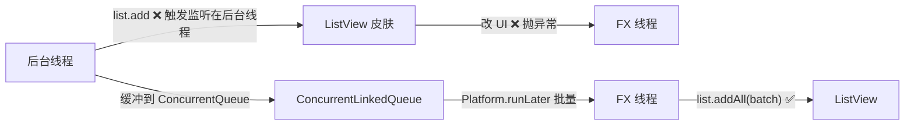

# 8.3 并发集合与界面实时刷新

后台线程持续产生数据并要刷新到界面时，会遇到两类问题：共享集合的并发修改异常、`Platform.runLater` 风暴导致 UI 卡顿。本节解决的问题是：用 `CopyOnWriteArrayList`/`ConcurrentHashMap` 等并发集合保证线程安全，用 `ScheduledService` 实现周期性轮询，掌握“后台产生→批量缓冲→UI 线程提交”的实时刷新模式。

## 线程安全集合

`java.util.concurrent` 提供的并发集合可在多线程下安全读写：

| 集合 | 特点 | 适用场景 |
| --- | --- | --- |
| `CopyOnWriteArrayList` | 写时复制，读无锁，写开销大 | 读多写少、遍历频繁 |
| `ConcurrentHashMap` | 分段锁/CAS，高并发读写 | 并发键值缓存 |
| `ConcurrentLinkedQueue` | 无锁队列 | 生产者-消费者缓冲 |
| `BlockingQueue` | 阻塞式入队/出队 | 后台生产→UI 消费 |

```java
import java.util.concurrent.CopyOnWriteArrayList;
import java.util.concurrent.ConcurrentHashMap;

// 线程安全列表：后台线程添加，UI 线程遍历读
CopyOnWriteArrayList<String> buffer = new CopyOnWriteArrayList<>();

// 线程安全映射：多线程缓存计算结果
ConcurrentHashMap<String, Integer> cache = new ConcurrentHashMap<>();
cache.computeIfAbsent("key", k -> expensiveCompute(k));
```

> [!note] CopyOnWrite 的代价
> > `CopyOnWriteArrayList` 每次写都复制整个数组，写多场景性能差，且最终一致性（遍历看到的是快照）。适合监听器列表、配置项等读多写少的场景，不适合高频写入的数据缓冲——那应改用 `ConcurrentLinkedQueue`。

## ObservableList 线程安全操作

[[7.2 数据绑定与可观察集合]] 介绍了 `ObservableList`，但它本身**不是线程安全**的：在后台线程 `add` 会触发 `ListChangeListener`，而监听者（`ListView` 皮肤）会在调用线程尝试更新 UI，抛 `IllegalStateException`。



正确模式：后台线程写入并发缓冲，FX 线程批量取出后写入 `ObservableList`。

```java
import javafx.collections.FXCollections;
import javafx.collections.ObservableList;
import javafx.application.Platform;
import java.util.concurrent.ConcurrentLinkedQueue;
import java.util.ArrayList;
import java.util.List;

ObservableList<String> uiList = FXCollections.observableArrayList();
ConcurrentLinkedQueue<String> buffer = new ConcurrentLinkedQueue<>();

// 后台线程：只写缓冲，不碰 uiList
new Thread(() -> {
    while (running) {
        buffer.add(produceData());   // 线程安全
        Thread.sleep(10);
    }
}).start();

// 定时把缓冲批量搬到 uiList（FX 线程）
Platform.runLater(() -> {
    if (!buffer.isEmpty()) {
        List<String> batch = new ArrayList<>();
        while (!buffer.isEmpty()) batch.add(buffer.poll());
        uiList.addAll(batch);        // 在 FX 线程修改，安全
    }
});
```

## ScheduledService 定时刷新

`ScheduledService<V>` 是 `Service` 的子类，支持周期性执行。`start()` 后按 `period` 重复调用 `createTask()`，适合轮询传感器、刷新股票、定时拉取日志等场景。

| 属性 | 作用 |
| --- | --- |
| `setPeriod(Duration)` | 两次执行间隔，默认 0（立即重跑） |
| `setDelay(Duration)` | 首次执行前延迟 |
| `setBackoffStrategy` | 失败后重试退避策略 |
| `setMaximumFailureCount` | 最大连续失败次数后停止 |
| `setRestartOnFailure` | 失败后是否自动重试 |

```java
import javafx.concurrent.ScheduledService;
import javafx.concurrent.Task;
import javafx.util.Duration;

ScheduledService<Integer> poller = new ScheduledService<>() {
    @Override protected Task<Integer> createTask() {
        return new Task<>() {
            @Override protected Integer call() throws Exception {
                // 模拟拉取最新数值
                return fetchFromServer();
            }
        };
    }
};
poller.setPeriod(Duration.seconds(2));
poller.setDelay(Duration.seconds(0));

// value 属性每次成功后被更新，绑定到 UI
poller.setOnSucceeded(e -> valueLabel.setText("最新: " + poller.getLastValue()));
poller.start();
```

> [!tip] ScheduledService 与 Timeline 的取舍
> > 需要后台 IO/计算用 `ScheduledService`（任务在后台线程）；只需在 FX 线程定时改 UI（如时钟显示）用 `Timeline`/`PauseTransition`（见 [[5.3 动画与过渡效果]]），避免无谓的线程切换。

## 界面实时更新模式

### 模式一：生产者-消费者 + 批量提交

适合高频数据流（传感器、日志）：

```java
ConcurrentLinkedQueue<Reading> queue = new ConcurrentLinkedQueue<>();
ObservableList<Reading> viewData = FXCollections.observableArrayList();

// 定时（FX 线程）批量搬运，避免 runLater 风暴
Timeline flusher = new Timeline(new KeyFrame(Duration.millis(50), e -> {
    if (queue.isEmpty()) return;
    List<Reading> batch = new ArrayList<>();
    while (!queue.isEmpty()) batch.add(queue.poll());
    if (viewData.size() + batch.size() > 1000) {
        viewData.remove(0, viewData.size() + batch.size() - 1000); // 限长
    }
    viewData.addAll(batch);
}));
flusher.setCycleCount(Timeline.INDEFINITE);
flusher.play();
```

### 模式二：直接 updateValue 推送

适合单值实时显示（温度、进度）：

```java
Task<Void> monitor = new Task<>() {
    @Override protected Void call() throws Exception {
        while (!isCancelled()) {
            Reading r = sensor.read();
            updateValue(r);                 // 推送最新值到 FX 线程
            updateMessage(r.toString());
            Thread.sleep(100);
        }
        return null;
    }
};
// valueProperty 内部已切到 FX 线程
tempLabel.textProperty().bind(monitor.valueProperty().asString("%.1f ℃"));
```

## 实时数据刷新综合示例

下面是一个“模拟股票行情实时刷新”的完整示例，综合并发集合、`ScheduledService` 与批量提交：

```java
import javafx.application.Application;
import javafx.collections.FXCollections;
import javafx.collections.ObservableList;
import javafx.concurrent.ScheduledService;
import javafx.concurrent.Task;
import javafx.scene.Scene;
import javafx.scene.control.*;
import javafx.scene.layout.VBox;
import javafx.stage.Stage;
import javafx.util.Duration;
import java.util.Random;

public class StockTickerDemo extends Application {
    private final ObservableList<Tick> ticks = FXCollections.observableArrayList();
    private final Random rnd = new Random();

    public static class Tick {
        public final String code; public final double price;
        Tick(String c, double p) { code = c; price = p; }
        @Override public String toString() { return code + " = " + price; }
    }

    @Override public void start(Stage stage) {
        ListView<Tick> view = new ListView<>(ticks);
        Label last = new Label("等待数据...");

        ScheduledService<Tick> svc = new ScheduledService<>() {
            @Override protected Task<Tick> createTask() {
                return new Task<>() {
                    @Override protected Tick call() {
                        // 后台线程：模拟网络抓取
                        try { Thread.sleep(rnd.nextInt(200)); } catch (InterruptedException ignored) {}
                        return new Tick("FX" + rnd.nextInt(10), 100 + rnd.nextDouble() * 50);
                    }
                };
            }
        };
        svc.setPeriod(Duration.seconds(1));
        svc.setOnSucceeded(e -> {
            Tick t = svc.getLastValue();
            ticks.add(t);                              // FX 线程，安全
            if (ticks.size() > 50) ticks.remove(0);    // 限长
            last.setText("最新: " + t);
        });
        svc.start();

        stage.setScene(new Scene(new VBox(8, last, view), 300, 320));
        stage.show();
    }
}
```

> [!note] 为什么用 ScheduledService 而非 Thread+runLater
> > `ScheduledService` 自动管理线程池、状态机、失败重试与取消，`setOnSucceeded` 回调在 FX 线程执行，可直接改 `ObservableList`。手写 `Thread`+`runLater` 需自行处理这些细节，易遗漏。

## 易错点

> [!warning] 常见误区
> 1. 后台线程直接 `observableList.add(x)`——触发监听在后台线程，抛 `IllegalStateException`；必须切到 FX 线程。
> 2. 高频数据每条都 `Platform.runLater`——事件队列堆积，UI 卡顿；应批量缓冲后定时提交。
> 3. `CopyOnWriteArrayList` 用于高频写入缓冲——写时复制开销大，应改用 `ConcurrentLinkedQueue`。
> 4. `ScheduledService` 的 `setPeriod` 默认 0，导致任务首尾相接占满线程；需显式设置合理间隔。

## 小结

并发集合（`CopyOnWriteArrayList`/`ConcurrentHashMap`/`ConcurrentLinkedQueue`）保证后台线程与 UI 线程共享数据的安全；`ObservableList` 本身非线程安全，修改必须在 FX 线程；`ScheduledService` 适合周期性轮询任务。实时刷新的标准模式是“后台缓冲→FX 线程批量提交”，避免 `runLater` 风暴。至此，[[8.1 JavaFX线程模型与Platform.runLater]]→[[8.2 Task与Service后台任务]]→本节构成 JavaFX 多线程与界面刷新的完整体系。

## 关联

- 先修：[[8.1 JavaFX线程模型与Platform.runLater]]、[[8.2 Task与Service后台任务]]、[[7.2 数据绑定与可观察集合]]（ObservableList）
- 相关：[[5.3 动画与过渡效果]]（Timeline 定时）
- 上一级：[[MOC - 第8章]]
