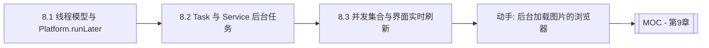

# MOC - 第8章 多线程与界面刷新机制

> [!info] 本章定位
> 第7章让应用“能存能取”，第8章让应用“能后台干活不卡界面”。JavaFX 采用单线程 UI 模型，所有界面操作必须在 JavaFX Application Thread 上完成，长时间任务若挤在该线程会导致界面冻结。本章覆盖三条主线：用 `Platform.runLater()` 把后台结果切回 UI 线程，用 `Task`/`Service` 封装可取消、可汇报进度的后台任务，用并发集合与 `ScheduledService` 实现界面实时刷新。这是从“演示程序”到“流畅实用工具”的关键一跃。

## 学习路线图



## 知识点导航

| 节 | 主题 | 核心要点 | 入口 |
| --- | --- | --- | --- |
| 8.1 | JavaFX线程模型与Platform.runLater | JavaFX Application Thread、非UI线程禁改UI、`Platform.runLater()` | [[8.1 JavaFX线程模型与Platform.runLater]] |
| 8.2 | Task与Service后台任务 | `Task<V>` 抽象类、`Service<V>` 复用、状态机、`updateProgress`/`updateMessage` | [[8.2 Task与Service后台任务]] |
| 8.3 | 并发集合与界面实时刷新 | `CopyOnWriteArrayList`、`ConcurrentHashMap`、`ObservableList` 跨线程、`ScheduledService` | [[8.3 并发集合与界面实时刷新]] |

## 核心考点

> [!warning] 重点掌握
> 1. JavaFX 单线程 UI 模型：所有 UI 操作必须在 JavaFX Application Thread 上执行，非 UI 线程直接更新 UI 会抛 `IllegalStateException`。
> 2. `Platform.runLater(Runnable)` 的作用：把 `Runnable` 调度到 JavaFX Application Thread 异步执行，用于后台线程切回 UI 线程。
> 3. `Task<V>` 与 `Service<V>` 的区别：`Task` 一次性、`Service` 可重用；二者均通过 `updateProgress`/`updateMessage` 汇报进度。
> 4. 任务状态机：`READY`→`SCHEDULED`→`RUNNING`→`SUCCEEDED`/`FAILED`/`CANCELLED`，状态间不可逆。
> 5. 跨线程修改 `ObservableList` 必须切回 UI 线程，否则触发 `Exception in thread` 异常。
> 6. `ScheduledService` 适合周期性轮询刷新，`Task` 适合一次性长任务。

## 自测题

> [!question] 题1
> 为什么 JavaFX 规定“只有 JavaFX Application Thread 才能修改 UI”？如果在后台线程直接调用 `label.setText("done")` 会发生什么？
> > [!check]- 参考答案
> > 单线程 UI 模型避免了多线程并发修改 Scene Graph 带来的锁竞争、死锁和渲染不一致问题，让 UI 控件实现无需加锁、性能更好。后台线程直接调用 `label.setText("done")` 会抛 `IllegalStateException: Not on FX application thread; currentThread = ...`。正确做法是把 UI 修改包装进 `Platform.runLater(() -> label.setText("done"))`，由 JavaFX Application Thread 异步执行。

> [!question] 题2
> `Task` 和 `Service` 都能执行后台任务，它们的核心区别是什么？什么时候应该选 `Service`？
> > [!check]- 参考答案
> > `Task` 是一次性任务，`cancel()` 后或执行完成后不可再次执行，需每次新建实例；`Service` 内部每次 `start()` 会调用 `createTask()` 工厂方法生成新的 `Task`，可重复启动、可重置状态（`reset()`）。需要多次触发同一类后台操作（如多次点击“刷新”按钮、周期性查询）时选 `Service`，避免重复手工创建 `Task` 并管理状态。

> [!question] 题3
> 写出一个 `Task<Integer>`：在后台计算 1+2+...+100，每步汇报进度，完成后把结果显示在 `Label` 上。
> > [!check]- 参考答案
> > ```java
> > Task<Integer> task = new Task<>() {
> >     @Override protected Integer call() throws Exception {
> >         int sum = 0;
> >         for (int i = 1; i <= 100; i++) {
> >             sum += i;
> >             updateProgress(i, 100);
> >             updateMessage("已计算到 " + i);
> >             Thread.sleep(10);
> >         }
> >         return sum;
> >     }
> > };
> > task.setOnSucceeded(e -> label.setText("结果: " + task.getValue()));
> > new Thread(task).start();
> > ```
> > `updateProgress`/`updateMessage` 内部已做线程切换，可在后台线程安全调用；`setOnSucceeded` 回调在 JavaFX Application Thread 执行，可直接更新 `Label`。

> [!question] 题4
> 后台线程不断产生数据并要追加到 `ListView` 的 `ObservableList` 中，直接 `list.add(x)` 会出什么问题？正确做法是什么？
> > [!check]- 参考答案
> > 直接 `list.add(x)` 会触发 `ObservableList` 的变更通知，而监听者（`ListView` 的皮肤）会在调用线程上尝试更新 UI，导致“Not on FX application thread”异常。正确做法是把对 `ObservableList` 的修改切回 UI 线程：`Platform.runLater(() -> list.add(x))`；若数据量大，应先在后台用 `CopyOnWriteArrayList`/`ConcurrentHashMap` 缓冲，再批量用 `Platform.runLater` 提交，避免事件队列被 `runLater` 淹没造成界面卡顿。

## 章节导航

- 上一章：[[MOC - 第7章]]
- 上一级：[[MOC - 可视化程序设计]]
- 下一章：[[MOC - 第9章]]
