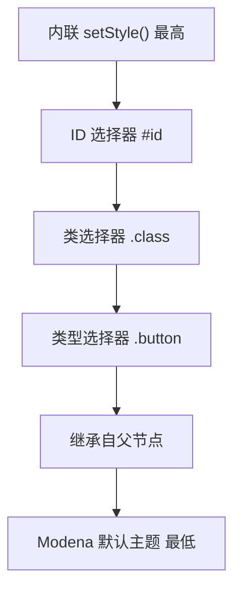
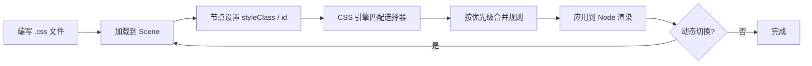

# 9.1 CSS样式与JavaFX皮肤

JavaFX 控件默认外观（Modena 主题）朴素统一，要让产品有差异化视觉风格，最有效的手段是 CSS。JavaFX 借鉴 Web CSS 语法，用样式表描述 `Node` 的颜色、字体、边框、圆角、特效，实现样式与逻辑分离。本节解决的问题是：掌握 JavaFX CSS 的语法、选择器、属性与优先级规则，能写出可维护的样式表替代大量 `setStyle` 代码。

## JavaFX CSS 语法

JavaFX CSS 以 `.css` 文件形式存在，规则结构为 `选择器 { 属性: 值; }`。属性必须以 `-fx-` 前缀开头以区别于 Web CSS。

```css
/* 类型选择器：匹配 Button 控件 */
.button {
    -fx-background-color: #4a90d9;
    -fx-text-fill: white;
    -fx-font-size: 14px;
    -fx-background-radius: 6;
}

/* 类选择器：匹配 styleClass 含 primary 的节点 */
.primary {
    -fx-background-color: #2ecc71;
}

/* ID 选择器：匹配 id = loginBtn 的节点 */
#loginBtn {
    -fx-font-weight: bold;
}

/* 伪类：鼠标悬停状态 */
.button:hover {
    -fx-background-color: #357abd;
}
```

| 选择器 | 语法 | 匹配对象 |
| --- | --- | --- |
| 类型选择器 | `.button` / `.label` | 对应控件类型（类名小写） |
| 类选择器 | `.style-class` | `getStyleClass()` 含该类的节点 |
| ID 选择器 | `#node-id` | `setId("node-id")` 的节点 |
| 伪类 | `:hover`/`:pressed`/`:focused` | 节点的某种交互状态 |
| 后代选择器 | `.vbox .button` | VBox 内的 Button |

> [!note] 类型选择器的大小写
> > JavaFX 类型选择器是控件类名的**小写**形式：`Button`→`.button`，`TextField`→`.text-field`，`CheckBox`→`.check-box`。内部用驼峰转中划线，与 CSS 习惯一致。

## CSS 属性

常用 `-fx-` 属性按用途分组：

| 类别 | 属性 | 说明 |
| --- | --- | --- |
| 背景 | `-fx-background-color` | 背景色，可多色分层 |
| 背景 | `-fx-background-radius` | 背景圆角 |
| 背景 | `-fx-background-image` | 背景图 |
| 文本 | `-fx-text-fill` | 文字颜色 |
| 文本 | `-fx-font-size`/`-fx-font-weight`/`-fx-font-family` | 字体属性 |
| 边框 | `-fx-border-color`/`-fx-border-width`/`-fx-border-radius` | 边框 |
| 内边距 | `-fx-padding` | 内容与边框间距 |
| 特效 | `-fx-effect` | `dropshadow`/`gaussianblur` 等 |
| 透明度 | `-fx-opacity` | 整体透明度 |

```css
.card {
    -fx-background-color: white;
    -fx-background-radius: 10;
    -fx-border-color: #e0e0e0;
    -fx-border-width: 1;
    -fx-border-radius: 10;
    -fx-padding: 12 16 12 16;          /* 上 右 下 左 */
    -fx-effect: dropshadow(gaussian, rgba(0,0,0,0.15), 10, 0, 0, 2);
}
```

> [!tip] 多色背景分层
> > `-fx-background-color` 可写多个值（逗号分隔）实现分层叠加，配合 `-fx-background-insets` 控制每层偏移，常用于按钮的立体高光效果。

## 选择器详解

### 类型选择器

匹配某一类控件，作用于所有该类型实例：

```css
.label { -fx-text-fill: #333333; }   /* 所有 Label 文字变深灰 */
```

### 类选择器

通过 `getStyleClass().add("name")` 给节点打标签，样式表用 `.name` 匹配：

```java
Button btn = new Button("保存");
btn.getStyleClass().add("primary");
```
```css
.primary { -fx-background-color: #2ecc71; -fx-text-fill: white; }
```

### ID 选择器

作用于单个唯一节点（`setId` 后用 `#id` 匹配），优先级最高：

```java
btn.setId("saveBtn");
```
```css
#saveBtn { -fx-font-size: 16px; }
```

### 伪类

描述交互状态，JavaFX 内置 `:hover`/`:pressed`/`:focused`/`:disabled`/`:selected` 等：

```css
.button:hover { -fx-background-color: #357abd; }
.button:pressed { -fx-background-color: #2a5a9d; }
.button:disabled { -fx-opacity: 0.5; }
```

## 样式优先级与继承

JavaFX CSS 优先级从高到低：



```java
// 内联样式优先级最高，覆盖样式表
btn.setStyle("-fx-background-color: red;");

// 同优先级时，后加载的样式表覆盖先加载的
scene.getStylesheets().add("base.css");
scene.getStylesheets().add("override.css");  // override 中规则胜出
```

> [!warning] 继承的范围
> > 并非所有属性都继承。`-fx-font-*`、`-fx-text-fill`、`-fx-cursor` 会从父节点继承；`-fx-background-color`、`-fx-border-*` 不继承，每个节点独立设置。`Scene` 的根容器设置 `-fx-font-size` 可影响所有子节点字体。

## CSS 应用流程



加载样式表的标准写法（资源路径用 `toExternalForm`，打包后仍可用）：

```java
scene.getStylesheets().add(
    getClass().getResource("/css/app.css").toExternalForm()
);
```

## CSS 样式表示例

下面是一个完整的登录界面样式表，演示类型、类、ID 与伪类组合：

```css
/* app.css */
.root {
    -fx-background-color: #f5f7fa;
    -fx-font-family: "Microsoft YaHei";
    -fx-font-size: 14px;
}

.label { -fx-text-fill: #333333; }

.text-field {
    -fx-background-radius: 6;
    -fx-border-color: #cccccc;
    -fx-border-radius: 6;
    -fx-padding: 8;
}
.text-field:focused {
    -fx-border-color: #4a90d9;
}

.button {
    -fx-background-color: #4a90d9;
    -fx-text-fill: white;
    -fx-background-radius: 6;
    -fx-padding: 8 20 8 20;
    -fx-cursor: hand;
}
.button:hover { -fx-background-color: #357abd; }
.button:pressed { -fx-background-color: #2a5a9d; }

.primary { -fx-background-color: #2ecc71; }
.primary:hover { -fx-background-color: #27ae60; }

#title {
    -fx-font-size: 22px;
    -fx-font-weight: bold;
    -fx-text-fill: #2c3e50;
}
```

```java
import javafx.application.Application;
import javafx.scene.Scene;
import javafx.scene.control.*;
import javafx.scene.layout.VBox;
import javafx.stage.Stage;

public class CssDemo extends Application {
    @Override public void start(Stage stage) {
        Label title = new Label("用户登录");
        title.setId("title");

        TextField user = new TextField();
        user.setPromptText("用户名");
        PasswordField pwd = new PasswordField();
        pwd.setPromptText("密码");

        Button login = new Button("登录");
        Button reg = new Button("注册");
        reg.getStyleClass().add("primary");

        Scene scene = new Scene(new VBox(12, title, user, pwd, login, reg), 280, 240);
        scene.getStylesheets().add(getClass().getResource("/css/app.css").toExternalForm());
        stage.setScene(scene);
        stage.show();
    }
}
```

> [!tip] setStyle 与样式表的取舍
> > `setStyle` 适合一次性、动态计算的样式（如根据数据变色）；样式表适合统一定义、便于主题切换与维护。生产项目优先用样式表，避免大量散落的 `setStyle`。

## 易错点

> [!warning] 常见误区
> 1. 忘记 `-fx-` 前缀（写成 `background-color`）——JavaFX CSS 会忽略该属性。
> 2. 类型选择器大小写错误（写成 `.Button`）——应小写 `.button`。
> 3. 用 `File` 路径加载 CSS，打包后失效——应走 `getResource().toExternalForm()`。
> 4. 误以为 `-fx-background-color` 会继承——它不继承，子节点需单独设置。

## 小结

JavaFX CSS 用 `-fx-` 前缀属性和类型/类/ID/伪类选择器描述 `Node` 外观，优先级为内联 > ID > 类 > 类型 > 继承 > 默认主题。样式表通过 `scene.getStylesheets().add(toExternalForm())` 加载，与逻辑分离便于维护和主题切换。这是界面美化的基础，下一节 [[9.2 主题切换与皮肤管理]] 在此基础上实现亮/暗主题动态切换。

## 关联

- 先修：[[2.1 标签、按钮与文本输入组件]]（控件基础）、[[3.1 布局面板与容器体系]]（容器）
- 下一节：[[9.2 主题切换与皮肤管理]]
- 上一级：[[MOC - 第9章]]
