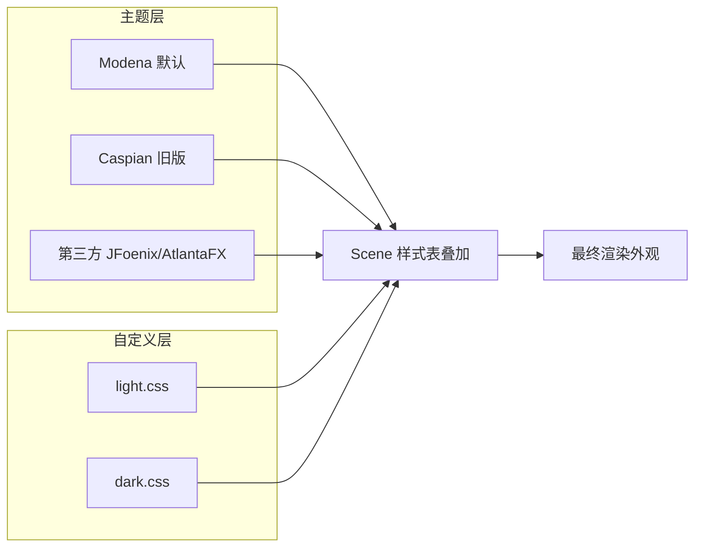

# 9.2 主题切换与皮肤管理

[[9.1 CSS样式与JavaFX皮肤]] 学会了用单张样式表美化界面，但现代应用常需支持亮色/暗色主题切换以适应不同环境与用户偏好。本节解决的问题是：理解主题与皮肤的概念，用 `Scene` 样式表动态加载实现运行时主题切换，了解 Modena/Caspian 内置主题与 JFoenix/AtlantaFX 等第三方主题库的选型。

## 主题概念

- **主题（Theme）**：一组统一定义颜色、字体、间距的样式集合，决定应用整体观感。JavaFX 通过 `Application.setUserAgentStylesheet` 设置全局主题，通过 `Scene` 样式表叠加自定义规则。
- **皮肤（Skin）**：控件的可视化实现，JavaFX 中每个控件由 `Skin` 渲染。换肤可以是换 CSS（轻量），也可以是换 `Skin` 类（重量，需自定义控件）。
- **亮色主题（Light）**：浅色背景 + 深色文字，白天/明亮环境适用。
- **暗色主题（Dark）**：深色背景 + 浅色文字，夜间/低光环境护眼。



## 主题切换实现

核心思路：准备多套 `.css`，切换时 `scene.getStylesheets().clear()` 清空再 `add` 新表。主题表通常定义在 `.root` 选择器上，用 CSS 变量（JavaFX 称 “looked-up color”）统一管理颜色。

```mermaid
flowchart LR
    A[用户点击切换] --> B[scene.getStylesheets().clear]
    B --> C[add 新主题 css toExternalForm]
    C --> D[CSS 引擎重新匹配]
    D --> E[所有节点自动重绘]
    E --> F[保存偏好到 Preferences]
```

### 主题切换代码示例

```java
import javafx.application.Application;
import javafx.scene.Scene;
import javafx.scene.control.*;
import javafx.scene.layout.VBox;
import javafx.stage.Stage;
import java.util.prefs.Preferences;

public class ThemeSwitchDemo extends Application {
    private Scene scene;
    private final Preferences prefs = Preferences.userNodeForPackage(ThemeSwitchDemo.class);

    @Override public void start(Stage stage) {
        Label title = new Label("主题切换演示");
        Button light = new Button("亮色主题");
        Button dark = new Button("暗色主题");
        light.setOnAction(e -> applyTheme("light"));
        dark.setOnAction(e -> applyTheme("dark"));

        scene = new Scene(new VBox(12, title, light, dark), 280, 180);
        // 启动时读取上次选择
        applyTheme(prefs.get("theme", "light"));
        stage.setScene(scene);
        stage.show();
    }

    private void applyTheme(String name) {
        scene.getStylesheets().clear();
        String url = getClass().getResource("/css/" + name + ".css").toExternalForm();
        scene.getStylesheets().add(url);
        prefs.put("theme", name);   // 持久化用户选择
    }
}
```

### 用 looked-up color 统一配色

JavaFX CSS 支持 “looked-up color”（变量），在 `.root` 定义后被所有节点引用，切换主题只需改这些变量：

```css
/* light.css */
.root {
    -bg: #f5f7fa;
    -fg: #2c3e50;
    -accent: #4a90d9;
    -card-bg: #ffffff;
}
.label { -fx-text-fill: -fg; }
.button { -fx-background-color: -accent; -fx-text-fill: white; }
.card { -fx-background-color: -card-bg; }
.pane { -fx-background-color: -bg; }
```

```css
/* dark.css */
.root {
    -bg: #1e1e1e;
    -fg: #e0e0e0;
    -accent: #5dade2;
    -card-bg: #2d2d2d;
}
.label { -fx-text-fill: -fg; }
.button { -fx-background-color: -accent; -fx-text-fill: white; }
.card { -fx-background-color: -card-bg; }
.pane { -fx-background-color: -bg; }
```

> [!tip] looked-up color 的优势
> > 控件样式表只引用变量（如 `-fx-background-color: -accent`），亮/暗主题只需各定义一组变量值，控件规则完全复用，避免重复维护两套表。变量名以 `-` 开头，定义在 `.root` 上对所有后代可见。

## Modena 与 Caspian 主题

JavaFX 内置两套主题：

| 主题 | 引入版本 | 特点 | 设置方式 |
| --- | --- | --- | --- |
| **Modena** | JavaFX 8 | 默认主题，扁平化、更现代，高 DPI 友好 | `Application.setUserAgentStylesheet(Application.STYLESHEET_MODENA)` |
| **Caspian** | JavaFX 2 | 旧版主题，渐变质感，已过时 | `Application.setUserAgentStylesheet(Application.STYLESHEET_CASPIAN)` |

```java
import javafx.application.Application;

// 切回 Caspian 旧主题（仅复古需求）
Application.setUserAgentStylesheet(Application.STYLESHEET_CASPIAN);
// Modena（默认）
Application.setUserAgentStylesheet(Application.STYLESHEET_MODENA);
```

> [!note] Modena 的两个变体
> > Modena 还提供 `modena.css` 内部的 `.root` 伪类 `MODENA`，以及通过 `Platform.setImplicitExit` 等控制。JavaFX 9+ 增加了对高对比度模式的支持。日常项目一般保留 Modena 作为底色，在其上叠加自定义 CSS。

## 第三方主题库

| 库 | 特点 | 引入方式 |
| --- | --- | --- |
| **JFoenix** | Material Design 风格，提供 `JFXButton`/`JFXTextField` 等美化控件 | Maven 依赖 `com.jfoenix:jfoenix` |
| **AtlantaFX** | 现代扁平风格，主题多样（Primer/Nord/Cupertino） | Maven 依赖 `io.github.mkpaz:atlantafx-base` |
| **FormsFX** | 表单美化 | Maven 依赖 `com.dlsc.formsfx` |
| **MaterialFX** | Material 风格控件集 | Maven 依赖 `io.github.palexdev:materialfx` |

```xml
<!-- AtlantaFX 示例：pom.xml -->
<dependency>
    <groupId>io.github.mkpaz</groupId>
    <artifactId>atlantafx-base</artifactId>
    <version>2.0.1</version>
</dependency>
```

```java
import atlantafx.base.theme.PrimerLight;
import atlantafx.base.theme.PrimerDark;

// 应用 AtlantaFX 主题
Application.setUserAgentStylesheet(new PrimerLight().getUserAgentStylesheet());
// 切换暗色
Application.setUserAgentStylesheet(new PrimerDark().getUserAgentStylesheet());
```

> [!tip] 选型建议
> > 学习阶段用 Modena + 自定义 CSS 理解原理；商业项目可用 AtlantaFX（轻量、主题完备）或 JFoenix（Material 风格）快速获得专业外观。注意第三方库对 Java 版本与 JavaFX 版本的兼容性。

## 易错点

> [!warning] 常见误区
> 1. 切换主题时只 `add` 不 `clear`，导致两张表叠加、规则冲突。
> 2. CSS 用 `File` 路径加载，打包进 jar 后找不到——必须用 `getResource().toExternalForm()`。
> 3. 主题颜色硬编码在每个控件规则里，切换主题需改两套表——应用 looked-up color 变量统一管理。
> 4. 忘记持久化用户选择，每次启动都回到默认主题——配合 [[7.3 持久化存储与序列化]] 的 `Preferences` 存储偏好。

## 小结

主题切换的本质是 `Scene` 样式表的动态增删：清空旧表、装入新表，CSS 引擎自动重绘所有节点。用 looked-up color 变量在 `.root` 定义配色，控件表只引用变量，亮/暗主题只需各定义一组变量值。Modena 是 JavaFX 8+ 默认主题，AtlantaFX/JFoenix 提供更丰富的现代风格。配合 `Preferences` 持久化用户选择即可实现完整主题管理。下一节 [[9.3 图标、特效与界面增强]] 进一步增强视觉表现。

## 关联

- 先修：[[9.1 CSS样式与JavaFX皮肤]]（CSS 基础）、[[7.3 持久化存储与序列化]]（Preferences 存主题偏好）
- 下一节：[[9.3 图标、特效与界面增强]]
- 上一级：[[MOC - 第9章]]
