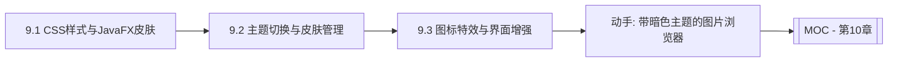

# MOC - 第9章 界面美化样式与主题

> [!info] 本章定位
> 第8章让应用“流畅不卡”，第9章让应用“好看易用”。控件默认外观朴素，要让产品有专业质感必须借助 CSS 样式、主题切换与图标特效。本章覆盖三条主线：用 JavaFX CSS 定制控件皮肤，用样式表动态加载实现亮/暗主题切换，用图标、内置特效与动画增强视觉表现。这是从“能用的工具”到“有品的产品”的关键一跃。

## 学习路线图



## 知识点导航

| 节 | 主题 | 核心要点 | 入口 |
| --- | --- | --- | --- |
| 9.1 | CSS样式与JavaFX皮肤 | JavaFX CSS 语法、`-fx-` 属性、选择器、优先级与继承 | [[9.1 CSS样式与JavaFX皮肤]] |
| 9.2 | 主题切换与皮肤管理 | 亮/暗主题、`Scene` 样式表动态加载、Modena/Caspian、第三方库 | [[9.2 主题切换与皮肤管理]] |
| 9.3 | 图标、特效与界面增强 | `ImageView`、字体图标 Ikonli、`DropShadow`/`GaussianBlur`/`Reflection`、动画过渡 | [[9.3 图标、特效与界面增强]] |

## 核心考点

> [!warning] 重点掌握
> 1. JavaFX CSS 语法：选择器（类型 `.button`、类 `.style-class`、ID `#node-id`、伪类 `:hover`）与 `-fx-` 前缀属性。
> 2. 样式作用域与优先级：内联 `setStyle` > ID > 类 > 类型；同优先级时后者覆盖前者。
> 3. 主题切换原理：`scene.getStylesheets().add/remove()` 动态加载 `.css` 文件，切换时清空再装入新表。
> 4. Modena（JavaFX 8+ 默认）与 Caspian（JavaFX 2）主题的差异与切换方式。
> 5. `DropShadow`/`GaussianBlur`/`Reflection` 三种内置特效的典型用法。
> 6. 字体图标（Ikonli/FontAwesomeFX）相对 `ImageView` 的优势：矢量、可着色、随字体缩放。

## 自测题

> [!question] 题1
> JavaFX CSS 与 Web CSS 有哪些主要差异？为什么属性前都要加 `-fx-`？
> > [!check]- 参考答案
> > JavaFX CSS 借鉴 Web CSS 语法但作用对象是 JavaFX 的 `Node` 而非 HTML 元素；选择器用 JavaFX 类型名（如 `.button` 对应 `Button`）。属性必须加 `-fx-` 前缀（如 `-fx-background-color`）以避免与未来标准 CSS 冲突，并区分 JavaFX 特有属性（如 `-fx-text-fill`）。JavaFX CSS 不支持 Web CSS 的全部特性（如 `@media` 有限、动画需用 `Transition` 而非 `@keyframes`）。

> [!question] 题2
> 写出实现“亮/暗主题切换”的核心步骤。切换时如何避免旧样式残留？
> > [!check]- 参考答案
> > 1. 准备 `light.css` 和 `dark.css` 两套样式表，定义相同的类选择器（如 `.root` 背景）。
> > 2. 切换时先 `scene.getStylesheets().clear()` 清空当前表，再 `add(getClass().getResource("dark.css").toExternalForm())` 装入新表。
> > 3. 在 `Scene` 的根容器上设置 `getStyleClass().add("root")`，让样式表的 `.root` 选择器生效。
> > 清空再装入可避免两张表同时存在导致规则冲突；用 `toExternalForm()` 保证资源路径在打包后仍可用。

> [!question] 题3
> 给一个 `Button` 添加圆角和投影效果，分别用 CSS 和 Java 代码两种方式实现。
> > [!check]- 参考答案
> > CSS 方式（推荐，样式与逻辑分离）：
> > ```css
> > .btn-primary {
> >     -fx-background-radius: 12;
> >     -fx-background-color: #4a90d9;
> >     -fx-effect: dropshadow(gaussian, rgba(0,0,0,0.4), 8, 0, 2, 2);
> > }
> > ```
> > Java 方式：
> > ```java
> > button.setStyle("-fx-background-radius: 12; -fx-background-color: #4a90d9;");
> > DropShadow shadow = new DropShadow(8, Color.rgb(0,0,0,0.4));
> > shadow.setOffsetX(2); shadow.setOffsetY(2);
> > button.setEffect(shadow);
> > ```
> > CSS 适合统一样式管理，Java 适合动态/条件性特效。

> [!question] 题4
> 相比用 `ImageView` 加载 PNG 图标，字体图标（如 Ikonli）有哪些优势？使用时需要注意什么？
> > [!check]- 参考答案
> > 优势：①矢量缩放不失真，任意 DPI 清晰；②单文件包含大量图标，减少资源管理；③可用 `-fx-text-fill` 着色，无需多色版本；④随字号 `font-size` 缩放，与文本对齐自然。注意：需引入对应字体包（如 `ikonli-javafx` + `ikonli-fontawesome-pack`），用 `FontIcon` 设置 `iconLiteral`（如 `fa-trash-o`），并确保字体被加载（模块化项目需在 `module-info` 中 `requires` 相应包）。

## 章节导航

- 上一章：[[MOC - 第8章]]
- 上一级：[[MOC - 可视化程序设计]]
- 下一章：[[MOC - 第10章]]
