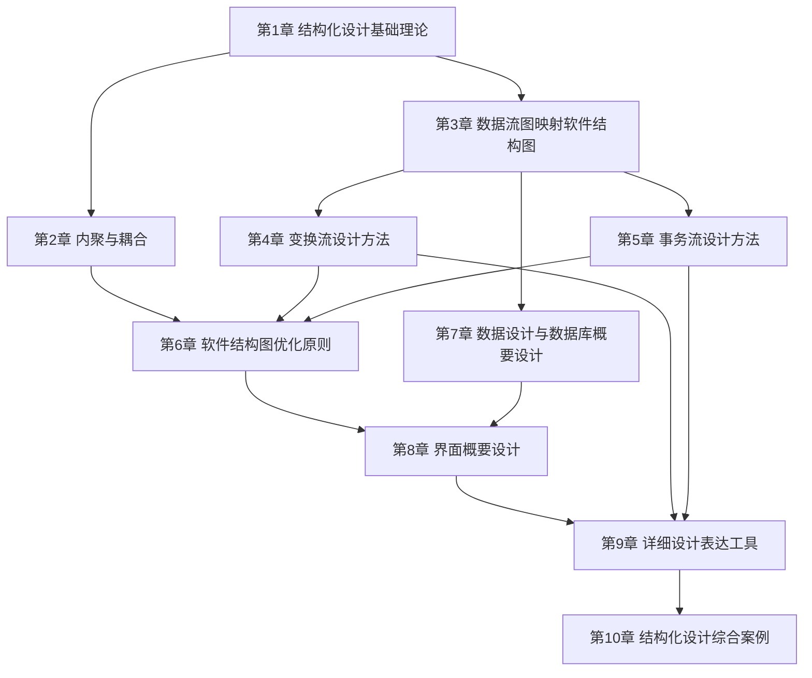

# MOC - 结构化软件设计

> [!info] 课程定位
> 结构化软件设计（Structured Software Design）是软件工程的核心课程，研究从数据流图（DFD）到软件结构图（SC）的设计方法。它解决的核心问题是：**如何把结构化分析阶段得到的逻辑模型（DFD）系统地转化为程序的物理模块结构（SC），并保证模块具备高内聚低耦合的独立性**。课程以面向数据流的设计为主线，贯穿结构化开发思想、概要设计与详细设计分层、内聚耦合判定、DFD 到 SC 的映射（变换分析与事务分析）、结构优化与综合实践，是从“理解需求”走向“工程设计出可维护模块结构”的关键方法学桥梁。

## 课程摘要

本课程围绕“**基础理论 → 映射方法 → 优化设计 → 综合实践**”四条主线展开。学生需要掌握：

1. 结构化开发思想（自顶向下、逐步求精、模块化），SA 与 SD 的衔接关系，概要设计与详细设计的分层；
2. 软件设计目标与模块独立性，高内聚低耦合核心准则及模块划分原则；
3. 内聚七类型（偶然→功能）与耦合七类型（内容→非直接）的判定与改进；
4. DFD 到 SC 的映射原理，变换流与事务流的识别，变换分析与事务分析两种映射方法；
5. 分层 DFD 的逐层映射与父图子图平衡检验，结构优化与启发式规则；
6. 详细设计工具（程序流程图、N-S 图、PAD 图、PDL），设计文档与评审，综合案例实践。

## 章节结构与依赖关系

> [!note] 依赖说明
> 第1章奠定结构化设计思想与分层框架；第2章建立内聚耦合的判定准则，是后续优化的依据；第3章给出 DFD→SC 映射总框架并区分两种信息流类型；第4、5章分别深入变换流与事务流两种映射方法，得到初始 SC；第6章汇集软件结构图优化原则与设计评审，依赖前述映射与内聚耦合知识对初始 SC 优化；第7章聚焦数据设计与数据库概要设计，以 DFD 数据字典为输入完成数据层面设计；第8章界面概要设计，为模块结构配上可用界面；第9章详细设计表达工具，把模块细化为可编码算法；第10章综合案例整合映射、优化、数据、界面与详细设计，并总结向面向对象方法的过渡。

## 章节导航

| 章节 | 主题 | 学习阶段 | 入口 |
| --- | --- | --- | --- |
| 第1章 | 结构化设计基础理论 | 基础理论 | [[MOC - 第1章]] |
| 第2章 | 内聚与耦合 | 基础理论 | [[MOC - 第2章]] |
| 第3章 | 数据流图映射软件结构图 | 映射方法 | [[MOC - 第3章]] |
| 第4章 | 变换流设计方法 | 映射方法 | [[MOC - 第4章]] |
| 第5章 | 事务流设计方法 | 映射方法 | [[MOC - 第5章]] |
| 第6章 | 软件结构图优化原则 | 优化设计 | [[MOC - 第6章]] |
| 第7章 | 数据设计与数据库概要设计 | 优化设计 | [[MOC - 第7章]] |
| 第8章 | 界面概要设计 | 优化设计 | [[MOC - 第8章]] |
| 第9章 | 详细设计表达工具 | 详细设计 | [[MOC - 第9章]] |
| 第10章 | 结构化设计综合案例 | 综合实践 | [[MOC - 第10章]] |

> [!warning] 建设状态
> 全部 10 章已建立完整知识节点，含 MOC、知识点笔记、Mermaid 图与自测题。各章节导航链接可正常解析。

## 分阶段学习目标

> [!example] 基础理论阶段（第1–2章）
> 建立结构化设计的心智模型。理解结构化开发思想（自顶向下、逐步求精、模块化）与 SA-SD 衔接关系，区分概要设计与详细设计的产出；掌握软件设计目标与模块独立性概念，能运用高内聚低耦合准则判定七种内聚与七种耦合类型并给出改进方向。

> [!example] 映射方法阶段（第3–5章）
> 掌握 DFD 到 SC 映射的核心方法。能识别变换流与事务流，运用变换分析（确定逻辑输入/输出边界、划分输入-变换-输出模块）与事务分析（确定事务中心、设计调度与动作模块）将 DFD 映射为结构图；掌握分层 DFD 的逐层映射与父图子图平衡检验。

> [!example] 优化设计与数据设计阶段（第6–8章）
> 运用模块分解合并原则与结构图优化策略对初始 SC 优化（合并高耦合、拆分低内聚、提取公共子模块、接口与结构优化），并掌握设计评审与质量度量方法；完成数据设计原则、数据库概要设计（ER 图转关系模型、规范化）与文件存储设计；按规范编写结构化设计文档并参与设计评审。

> [!example] 综合实践阶段（第9–10章）
> 通过综合案例完整演练从 DFD 到优化结构图再到详细设计的全过程；对比结构化方法与面向对象方法在建模思想、设计产物与适用场景上的差异，建立方法选型能力。

## 先修与关联课程

- [[MOC - 软件工程|软件工程]]：本课程的前置与上位课程。软件工程第4章结构化分析方法（DFD/DD/ER）是本课程的直接输入，第5章结构化软件设计是本课程的凝练概述——本课程在此基础上的独立深入展开。二者关系见下方“与软件工程课程的关系”。
- [[MOC - 面向对象系统分析与建模|面向对象系统分析与建模]]：提供对照方法。面向对象方法以对象与职责为核心建模，结构化方法以数据流与模块为核心建模；第10章对比二者在设计思想、产物与适用场景上的差异。
- 关联延伸：[[MOC - 数据结构|数据结构]]与[[MOC - 算法设计与分析|算法设计与分析]]（详细设计阶段模块算法的基础）、[[MOC - 软件测试技术|软件测试技术]]（模块独立性直接影响可测试性）。

> [!note] 与软件工程课程的关系
> `软件工程`课程的`第5章 结构化软件设计`（[[软件工程/软件工程/知识点/第5章 结构化软件设计/MOC - 第5章|软件工程·第5章]]）是对结构化设计的浓缩概述（5.1 原理与结构图、5.2 内聚耦合、5.3 变换事务分析）。本课程将其独立展开为 10 章的深度体系，是结构化设计主题的**权威主叙述**；软件工程第5章保留为该课程内的概览入口，通过链接指向本课程的对应章节，避免内容重复维护。

## 设计工具推荐

| 工具 | 类型 | 用途 | 适用章节 | 说明 |
| --- | --- | --- | --- | --- |
| Visio | 绘图工具 | 绘制 DFD、SC 结构图、程序流程图 | 第1、3–6章 | 工程文档标准工具，图形符号规范，适合正式设计文档 |
| draw.io | 绘图工具（开源免费） | 绘制 DFD、SC 结构图、N-S 图 | 全课程 | 开源免费，支持导出多种格式，适合课程练习与协作 |
| StarUML | 建模工具 | 绘制结构图、模块层次图 | 第3–5章 | 支持自定义图例表达 SC 结构图，可管理模块层次 |
| ProcessOn | 在线绘图 | DFD、SC、流程图快速绘制 | 全课程 | 在线协作，模板丰富，适合快速草图与分享 |
| PDL 编辑器 / IDE | 伪代码工具 | 编写 PDL 伪代码 | 第6章 | 用语言无关的伪代码描述模块算法，可借助 VS Code 等编辑器 |

> [!tip] 工具选型建议
> 课程练习推荐 **draw.io 或 Visio** 完成 DFD 与 SC 结构图绘制——SC 图需准确表达模块（矩形）、调用（箭头）、数据（空心圆箭头）、控制（实心圆箭头）四种元素；**StarUML** 辅助管理模块层次；**ProcessOn** 适合快速草图与小组协作。先用轻量工具掌握映射方法，再在综合案例中规范化输出。

## 复习与查询入口

- 基础理论速查：[[1.1 结构化开发思想、SA与SD衔接关系]]、[[1.2 软件设计分层：概要设计与详细设计]]、[[1.3 设计目标、高内聚低耦合核心准则]]
- 内聚耦合速查：[[2.1 内聚类型详解（弱到强）]]、[[2.2 耦合类型详解（强到弱）]]、[[2.3 内聚耦合综合判定与设计实践]]
- DFD 映射速查：[[3.1 DFD到SC的映射原理]]、[[3.2 变换流识别与事务流识别]]、[[3.3 DFD分层映射与平衡检验]]
- 变换流设计速查：[[4.1 变换流识别与变换中心确定]]、[[4.2 变换流映射步骤与SC生成]]、[[4.3 变换流设计案例与实践]]
- 事务流设计速查：[[5.1 事务流识别与事务中心确定]]、[[5.2 事务流映射步骤与SC生成]]、[[5.3 事务流设计案例与实践]]
- 结构图优化速查：[[6.1 模块分解与合并原则]]、[[6.2 结构图优化策略]]、[[6.3 设计评审与质量度量]]
- 数据设计速查：[[7.1 数据设计原则与方法]]、[[7.2 数据库概要设计]]、[[7.3 数据存储与文件设计]]
- 界面设计速查：[[8.1 人机界面设计原则与模型]]、[[8.2 界面类型与交互方式]]、[[8.3 界面设计评估与可用性]]
- 详细设计工具速查：[[9.1 程序流程图与N-S图]]、[[9.2 PAD图与伪代码（PDL）]]、[[9.3 判定表与判定树]]
- 综合案例速查：[[10.1 综合案例：图书借阅管理系统设计]]、[[10.2 综合案例：学生成绩管理系统设计]]、[[10.3 设计评审与课程设计总结]]
