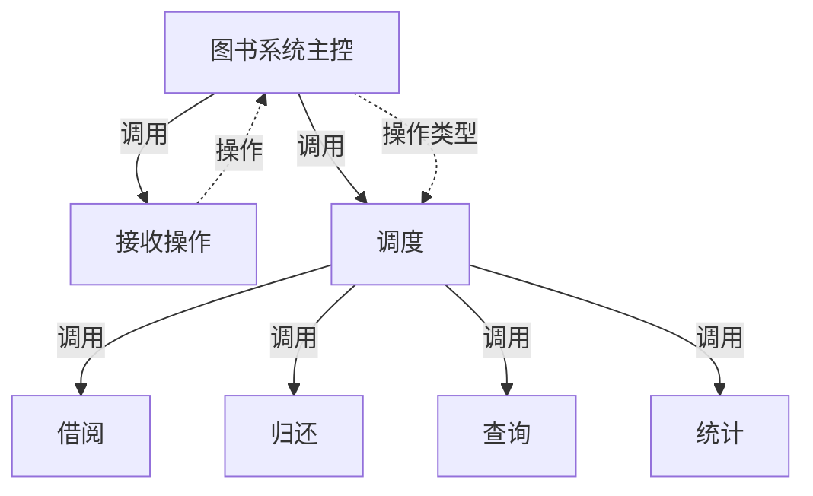
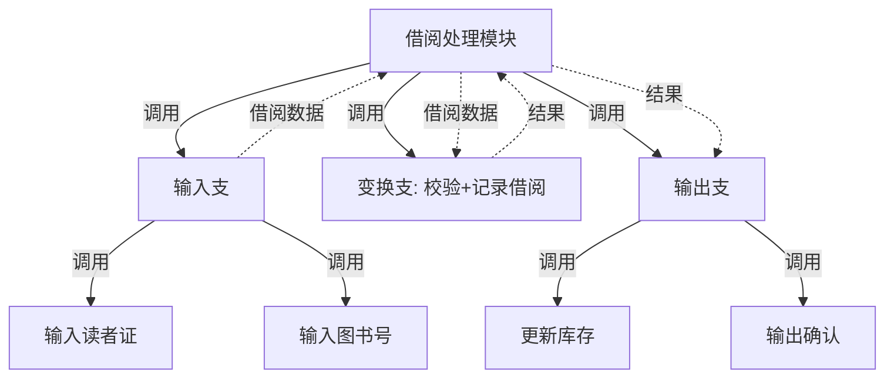
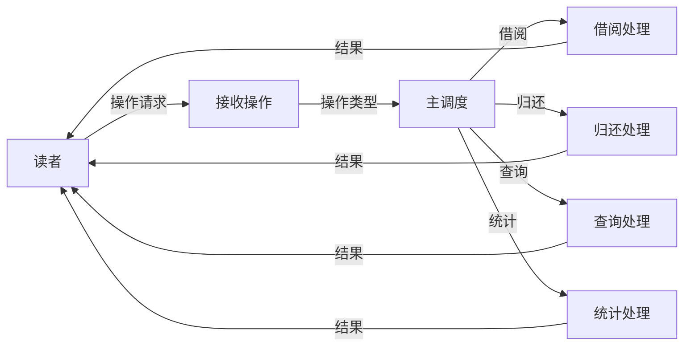
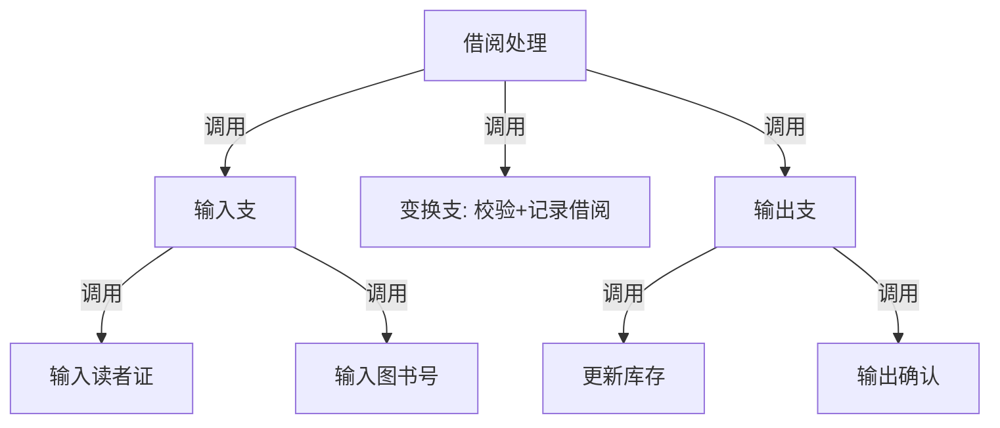
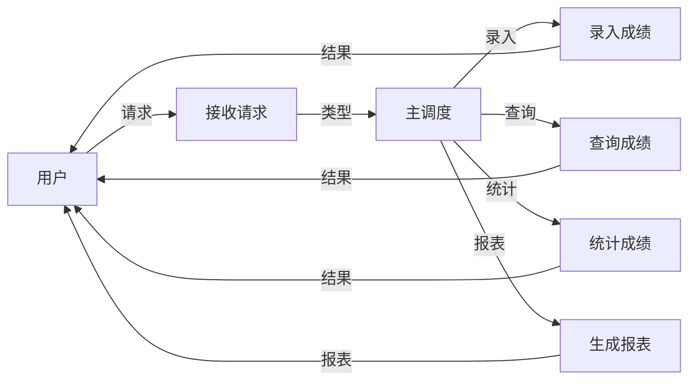
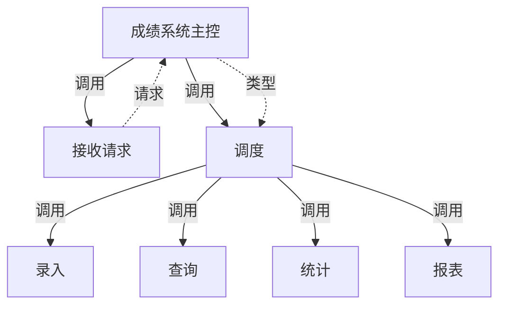
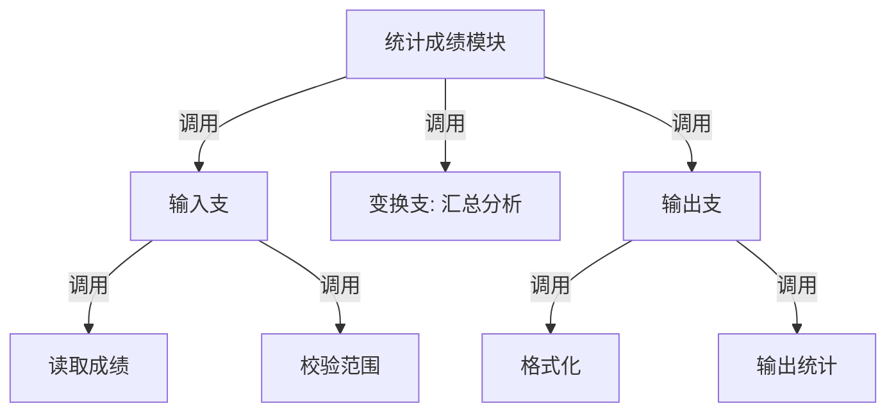
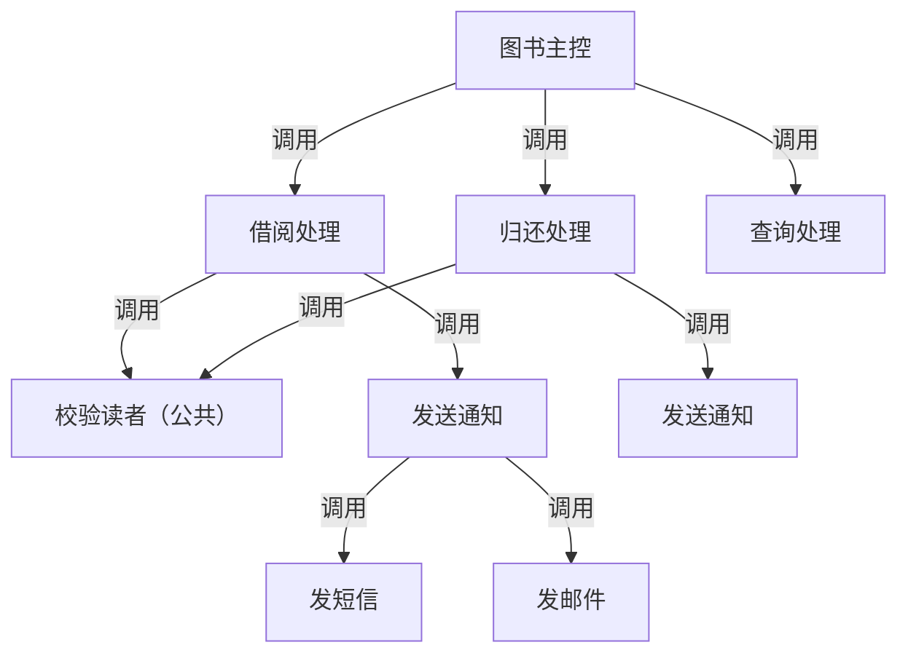

# 习题 - 第10章 结构化设计综合案例

本章习题整合前九章全部知识，覆盖完整 DFD→SC 转换流程、变换流+事务流组合设计、数据库概要设计、界面设计与设计评审。综合题要求完成图书借阅系统或学生成绩管理系统的完整结构化设计，是课程设计与期末综合题的核心。

## 知识点覆盖表

| 知识点 | 题号 |
| --- | --- |
| 综合案例完整流程 | 1、7、11、16、21 |
| 变换流+事务流组合识别与设计 | 2、8、12、17、22、28 |
| 数据库概要设计（ER 转关系） | 3、9、13、18、23、29 |
| 界面设计整合 | 4、10、14、19、24 |
| 设计评审检查清单 | 5、15、20、25、30 |
| 结构化方法优缺点与 OO 过渡 | 6、26、27、31、32 |

## 一、单选题（每题 2 分，共 10 题）

**1.** 结构化设计综合案例的完整流程顺序是（  ）。
A. 需求分析→顶层 DFD→0层DFD→1层DFD→识别信息流→SC设计→优化→详细设计
B. SC设计→DFD→需求分析→识别信息流
C. 详细设计→优化→SC设计→DFD
D. 识别信息流→需求分析→DFD→SC设计

**2.** 图书借阅系统中"借阅/归还/查询/统计"由主调度分发到对应业务模块，整体属于（  ）。
A. 变换流
B. 事务流
C. 纯线性流
D. 无信息流

**3.** 学生成绩系统中 ER 图含学生、课程、选课（M:N 含成绩），选课应转换为（  ）。
A. 学生表的列
B. 课程表的列
C. 独立关联表，主键为(学号,课程号)
D. 删除

**4.** 图书借阅系统面向读者查询界面，最适合的界面类型是（  ）。
A. 命令语言
B. 直接操纵（菜单+表单）
C. 命令行脚本
D. 批处理

**5.** 设计评审检查清单中"数据流父子图平衡"属于（  ）。
A. 内聚耦合检查
B. 接口检查
C. 数据与需求检查
D. 结构检查

**6.** 结构化设计方法的缺点是（  ）。
A. 面向数据流、系统化
B. 数据与操作分离、复用性差
C. 步骤明确
D. 易于评审文档化

**7.** 在综合案例中，DFD 分层映射的顺序一般是（  ）。
A. 先映射底层再映射顶层
B. 先顶层 DFD，再逐层向下映射
C. 随机选取加工映射
D. 只映射 0 层

**8.** 图书借阅系统中"借阅处理"内部呈"输入读者证→校验→记录借阅→更新库存→输出确认"线性流水线，属于（  ）。
A. 事务流局部
B. 变换流局部
C. 无流类型
D. 控制流

**9.** 学生成绩系统中班级(1)与学生(N)的隶属关系转关系模型时（  ）。
A. 将班号作为学生表外键
B. 将学号作为班级表外键
C. 建关联表
D. 删除

**10.** 顶层用事务分析调度多业务、各业务内部用变换分析映射输入-变换-输出，体现的原则是（  ）。
A. 只用一种映射方法
B. 整体定框架、局部定细节
C. 忽略局部流类型
D. 不需优化

## 二、多选题（每题 3 分，共 5 题）

**11.** 结构化设计综合案例的完整流程包括（  ）。
A. 需求分析
B. DFD 分层
C. 识别信息流类型
D. SC 设计与优化

**12.** 变换流与事务流组合设计时，常见做法包括（  ）。
A. 顶层用事务分析调度多业务
B. 各业务内部用变换分析映射输入-变换-输出
C. 提取公共子模块（如校验）提高扇入
D. 忽略所有变换流局部

**13.** 学生成绩系统 ER 图转换为关系模型时，涉及的转换规则包括（  ）。
A. 实体转表
B. 1:N 联系将"1"端主键作"N"端外键
C. M:N 联系建独立关联表
D. 属性转列、标识符转主键

**14.** 界面设计整合时需考虑的方面包括（  ）。
A. 用户类型分析
B. 界面类型选择
C. 一致性、反馈、容错等原则落实
D. 可用性评估

**15.** 设计评审检查清单的主要维度包括（  ）。
A. 内聚耦合
B. 接口
C. 结构（扇出、作用范围）
D. 数据与需求（平衡、覆盖度）

## 三、判断题（每题 2 分，共 5 题）

**16.** 图书借阅系统整体呈事务流特征，事务中心为"操作调度"，动作模块为各业务处理。

**17.** 学生成绩系统中选课（M:N）应转换为独立关联表，主键为(学号,课程号)。

**18.** 综合案例中得到的初始 SC 可直接交付编码，无需优化。

**19.** 结构化设计方法面向数据流、步骤明确，适合数据处理系统，但数据与操作分离、复用性差。

**20.** 设计评审中作用范围≤控制范围指判定所在模块应能控制其判定影响的模块。

## 四、简答题（每题 6 分，共 4 题）

**21.** 简述图书借阅管理系统中变换流与事务流的组合识别与 SC 设计思路。

**22.** 学生成绩管理系统设计中，如何完成 ER 图到关系模式的转换？举例说明。

**23.** 列举设计评审检查清单的主要检查维度与典型缺陷。

**24.** 对比结构化设计方法与面向对象方法的优缺点，说明为何要向面向对象过渡。

## 五、设计题/分析题（每题 8 分，共 4 题）

**25.**（分析题）图书借阅系统顶层 DFD：读者提交操作（借阅/归还/查询/统计），系统主调度分发到四个业务模块。请判断整体信息流类型，指出事务中心，并说明"查询"业务内部若为变换流应如何局部细化。

**26.**（绘图题）对第 25 题图书借阅系统，请用 Mermaid 绘制整体事务型扇形 SC（主控 `图书系统主控` 下含接收与调度，调度分发到借阅、归还、查询、统计四个动作模块）。

**27.**（设计题）学生成绩管理系统 ER 图：学生（学号、姓名、班号）、课程（课程号、课程名、学分）、班级（班号、专业）、选课（M:N，含成绩）。请转换为关系模型，标注各表主键（PK）与外键（FK），并判断是否满足 3NF。

**28.**（绘图题）请用 Mermaid 绘制图书借阅系统"借阅处理"动作模块内部的变换型三叉树 SC（输入支：输入读者证+图书号；变换支：校验+记录借阅；输出支：更新库存+输出确认）。

## 六、综合题/案例题（每题 10-15 分，共 3 题）

**29.**（综合案例题，15 分）"图书借阅管理系统"需求：读者可借阅、归还、查询借阅记录、统计借阅情况；每本图书有书号、书名、馆藏数；读者有借书证号、姓名；借阅需记录借阅日期。请完成完整结构化设计：
（1）绘制顶层 DFD（外部实体"读者"，主加工"图书系统"，输入操作，输出结果）。
（2）绘制 0 层 DFD（主调度分发到借阅、归还、查询、统计四个加工）。
（3）判断整体信息流类型并指出事务中心。
（4）用 Mermaid 绘制整体事务型扇形 SC。
（5）将"借阅处理"内部用变换分析细化为三叉树 SC（Mermaid）。
（6）完成数据设计：列出读者、图书、借阅三个关系模式并标注 PK/FK。
（7）说明该系统界面设计的界面类型选择与至少两条 Shneiderman 法则落实。

**30.**（综合案例题，15 分）"学生成绩管理系统"需求：教师录入成绩、学生查询成绩、管理员统计成绩、生成报表；学生隶属班级、选修课程并获成绩。请完成：
（1）绘制顶层 DFD 与 0 层 DFD（录入、查询、统计、报表四加工）。
（2）判断信息流类型并说明 SC 设计思路（整体事务+局部变换）。
（3）用 Mermaid 绘制整体事务型扇形 SC。
（4）完成 ER 图转关系模型：学生、班级、课程、选课，标注 PK/FK，判断 3NF。
（5）对"统计成绩"动作模块内部用变换分析细化（Mermaid 三叉树）。
（6）列出该系统设计评审检查清单至少 4 项检查内容。

**31.**（综合题，10 分）阅读以下关于结构化设计方法的论述，回答问题：
> 结构化设计以数据流为驱动，方法系统化、步骤明确，适合数据处理系统，易于评审与文档化；但数据与操作分离、模块按功能划分难以跨系统复用，需求变化时模块结构需大改，复杂系统建模困难。

（1）归纳结构化设计方法的优点与缺点（各至少三条）。
（2）说明向面向对象方法过渡的主要原因。
（3）简述从结构化设计的"功能分解"到面向对象的"对象职责"的转变要点。

**32.**（综合题，10 分）"课程设计总结与评审"：某学生完成图书借阅系统设计后提交了以下 SC：顶层 `主控` 扇出 9；`业务处理` 模块同时做借阅、归还、查询；`通知(type)` 由标志选短信/邮件；`校验读者` 代码在借阅与归还中重复出现。请：
（1）逐一指出设计缺陷及所属问题（内聚/耦合/结构/复用）。
（2）给出优化方案并用 Mermaid 绘制优化后 SC（顶层归并为协调模块、业务处理拆分、提取公共 `校验读者`）。
（3）说明优化后如何通过设计评审检查清单的关键项。

## 答案与解析

### 单选题答案

1-10 题答案与解析

**1. 答案：A**
解析：完整流程为需求→顶层 DFD→0层→1层→识别→SC→优化→详细设计。

**2. 答案：B**
解析：多业务分发属事务流。

**3. 答案：C**
解析：M:N 选课建独立关联表，主键(学号,课程号)。

**4. 答案：B**
解析：面向读者查询适合直接操纵（菜单+表单），直观易学。

**5. 答案：C**
解析：数据流平衡属数据与需求检查。

**6. 答案：B**
解析：数据与操作分离、复用性差是结构化方法缺点。

**7. 答案：B**
解析：先顶层 DFD 再逐层向下映射。

**8. 答案：B**
解析："借阅处理"内部线性流水线属变换流局部。

**9. 答案：A**
解析：1:N 隶属将班号作学生表外键。

**10. 答案：B**
解析：整体定框架、局部定细节。

### 多选题答案

11-15 题答案与解析

**11. 答案：ABCD**
解析：四步均属完整流程。

**12. 答案：ABC**
解析：顶层事务+局部变换+提取公共子模块；D 错误。

**13. 答案：ABCD**
解析：四条转换规则均涉及。

**14. 答案：ABCD**
解析：四方面均需考虑。

**15. 答案：ABCD**
解析：四维度均属检查清单。

### 判断题答案

16-20 题答案与解析

**16. 答案：√**
解析：整体事务流，事务中心为操作调度。

**17. 答案：√**
解析：M:N 选课建关联表主键(学号,课程号)。

**18. 答案：×**
解析：初始 SC 需优化后才能交付。

**19. 答案：√**
解析：结构化方法优缺点描述正确。

**20. 答案：√**
解析：作用范围≤控制范围。

### 简答题答案

21-24 题参考答案

**21.** 图书借阅系统整体呈事务流：主调度接收操作（借阅/归还/查询/统计）按类型分发到各业务处理，事务中心为"操作调度"，动作模块为各业务。各业务内部呈变换流：如借阅处理"输入读者证→校验→记录借阅→更新库存→输出确认"为输入-变换-输出线性流水线。SC 设计：顶层用事务分析设计调度与各业务动作模块；每个业务内部用变换分析设计输入-变换-输出三层；按优化原则合并高耦合、提取公共子模块（如"校验读者"被多业务复用提高扇入）。

**22.** 学生成绩系统 ER 含学生(学号,姓名,班号)、课程(课程号,课程名,学分)、班级(班号,专业)、选课(M:N,含成绩)。转换：①实体转表——学生表(学号 PK,姓名,班号 FK)、课程表(课程号 PK,课程名,学分)、班级表(班号 PK,专业)；②1:N——班级(1)与学生(N)隶属，班号作学生表外键；③M:N——选课转关联表(学号 FK,课程号 FK,成绩)，主键(学号,课程号)。各表满足 3NF。

**23.** 检查四维度：①内聚耦合——是否高内聚低耦合，有无内容/控制/公共耦合；②接口——参数≤5、无控制标志、与 DFD 数据流一致；③结构——扇出≤7、层次不过深、作用范围≤控制范围；④数据与需求——父子图平衡、数据字典完备、需求覆盖度。典型缺陷：控制耦合（传操作类型标志）、顶层扇出过大、作用范围越界、接口参数过多、低内聚。

**24.** 结构化设计优点：面向数据流、方法系统化步骤明确、适合数据处理系统、易于评审文档化；缺点：数据与操作分离封装性差、复用性差、需求变化时模块结构需大改、复杂系统建模困难。面向对象以对象封装数据与操作、继承多态提高复用、变化局限在对象内部、贴合现实模型。过渡原因：结构化方法在数据封装、复用性与复杂系统建模上的固有局限，面向对象通过对象职责与交互更好应对变化与复杂性。

### 设计题/分析题答案

25-28 题参考答案

**25.** 整体信息流类型为**事务流**。事务中心为"主调度"加工（根据操作类型分发到借阅/归还/查询/统计）。"查询"业务内部若为变换流（如"输入查询条件→校验→检索→格式化→输出结果"线性流水线），应在该动作模块内部用变换分析细化为三叉树：输入支（输入查询条件）、变换支（校验+检索）、输出支（格式化+输出结果）。体现"整体事务定框架、局部变换定细节"。

**26.** 整体事务型扇形 SC：

**27.** 关系模型：
- 班级表：`班级(班号 PK, 专业)`
- 学生表：`学生(学号 PK, 姓名, 班号 FK)` ——班号作外键（1:N 隶属）
- 课程表：`课程(课程号 PK, 课程名, 学分)`
- 选课表：`选课(学号 FK, 课程号 FK, 成绩)`，主键(学号,课程号) ——M:N 关联表
3NF 判定：各表非主属性均完全且直接依赖主键，无部分依赖与传递依赖，满足 3NF。

**28.** "借阅处理"内部变换型三叉树 SC：

### 综合题答案

29-32 题参考答案

**29.**（图书借阅系统完整设计）
（1）顶层 DFD：

（2）0 层 DFD：

（3）整体为**事务流**，事务中心为"主调度"。
（4）整体事务型扇形 SC：

（5）"借阅处理"内部变换型三叉树 SC：

（6）数据设计：
- 读者表：`读者(借书证号 PK, 姓名)`
- 图书表：`图书(书号 PK, 书名, 馆藏数)`
- 借阅表：`借阅(借书证号 FK, 书号 FK, 借阅日期)`，主键(借书证号,书号,借阅日期)，借书证号、书号为外键
（7）界面设计：选择**直接操纵（菜单+表单）**，面向读者直观易学。Shneiderman 法则落实：①一致性——各业务入口布局统一；②信息反馈——操作后即时显示借阅成功/失败状态；③错误处理与撤销——超借或证号错误时友好提示并允许重新输入。

**30.**（学生成绩系统完整设计）
（1）顶层与 0 层 DFD：

（2）整体为**事务流**（主调度分发四业务）。SC 思路：顶层事务分析建扇形主框架，各业务内部如呈线性流水线则用变换分析细化。
（3）整体事务型扇形 SC：

（4）ER 转关系模型：
- 班级表：`班级(班号 PK, 专业)`
- 学生表：`学生(学号 PK, 姓名, 班号 FK)`
- 课程表：`课程(课程号 PK, 课程名, 学分)`
- 选课表：`选课(学号 FK, 课程号 FK, 成绩)`，主键(学号,课程号)
均满足 3NF。
（5）"统计成绩"动作模块内部变换型三叉树 SC：

（6）评审检查清单：①内聚耦合——各模块高内聚低耦合，无控制耦合；②接口——参数≤5、与 DFD 数据流一致；③结构——扇出≤7、作用范围≤控制范围；④数据与需求——父子图平衡、需求覆盖度完整、数据字典完备。

**31.**
（1）优点：①面向数据流、方法系统化步骤明确；②适合数据处理系统；③易于评审与文档化。缺点：①数据与操作分离封装性差；②模块按功能划分复用性差；③需求变化时模块结构需大改、复杂系统建模困难。
（2）过渡主因：结构化方法在数据封装、复用性与复杂系统建模上固有局限；面向对象通过对象封装数据与操作、继承多态提高复用、变化局限在对象内部、贴合现实模型，更好应对变化与复杂性。
（3）转变要点：从"按功能分解模块"转为"按对象职责划分对象"；从"数据作为参数在模块间传递"转为"数据与操作封装在对象内"；从"数据流驱动模块调用"转为"对象间消息交互协作"。

**32.**
（1）缺陷：①顶层扇出 9 过大——结构问题（扇出过大）；②`业务处理` 同时做借阅/归还/查询——内聚问题（低内聚，偶然/逻辑内聚）；③`通知(type)` 由标志选分支——耦合问题（控制耦合）；④`校验读者` 代码重复——复用问题（未提取公共子模块，扇入低）。
（2）优化后 SC：

（3）通过评审：内聚耦合——各模块功能内聚、无控制耦合；接口——参数简化为数据耦合；结构——顶层扇出降为 3、`校验读者` 扇入=2 提升复用；数据与需求——保持数据流平衡与需求覆盖。各项符合检查清单关键项。

## 考点统计表

| 题型 | 题数 | 分值 | 覆盖知识点 |
| --- | --- | --- | --- |
| 单选题 | 10 | 20 | 完整流程、信息流类型、ER 转换、界面选择、检查清单、方法优缺点、映射顺序、局部流类型、1:N 转换、整体局部原则 |
| 多选题 | 5 | 15 | 完整流程、组合设计、ER 转换规则、界面整合、检查清单维度 |
| 判断题 | 5 | 10 | 事务流特征、M:N 转换、初始 SC 需优化、方法优缺点、作用范围 |
| 简答题 | 4 | 24 | 图书系统组合设计、ER 转关系、检查清单、SD vs OO |
| 设计题/分析题 | 4 | 32 | 信息流识别、扇形 SC、ER 转关系、变换型三叉树 |
| 综合题/案例题 | 4 | 50 | 图书系统完整设计、成绩系统完整设计、方法对比、课程设计优化 |
| 合计 | 32 | 151 | 第10章及全课程综合知识点 |

## 关联

- 上一级：[[MOC - 结构化软件设计]]
- 本章知识点：[[10.1 综合案例：图书借阅管理系统设计]]、[[10.2 综合案例：学生成绩管理系统设计]]、[[10.3 设计评审与课程设计总结]]
- 上一章习题：[[习题-第9章-详细设计工具]]
- 课程总览：[[MOC - 结构化软件设计]]
