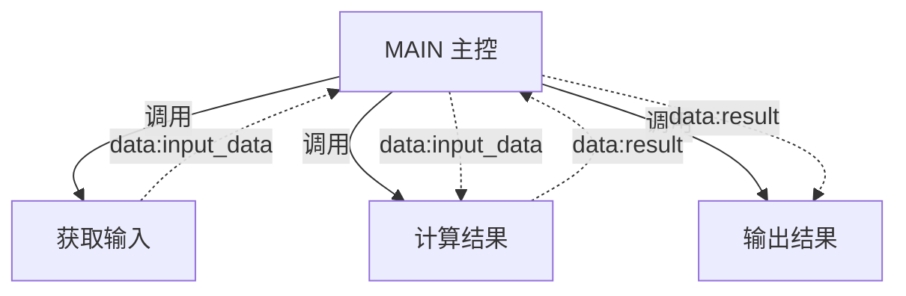
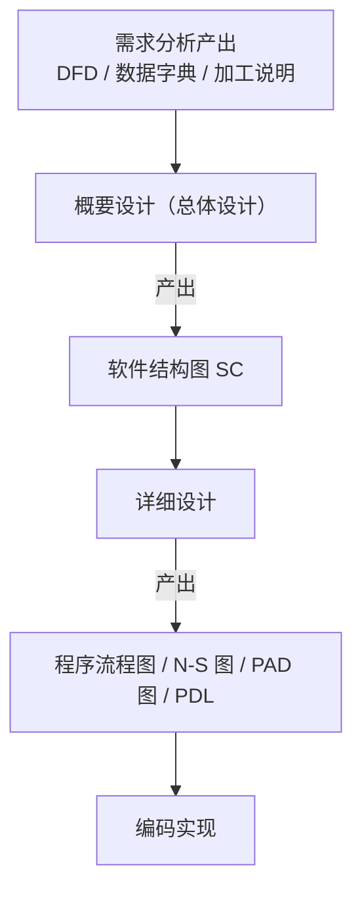

# 习题 - 第1章 结构化设计基础

本章习题覆盖结构化开发思想、SA 与 SD 衔接、概要设计与详细设计分层、软件结构图（SC）四种元素、软件设计目标与高内聚低耦合核心准则。要求在理解概念的基础上辨析分层产出与 SC 元素语义，并能在简单场景中运用模块划分原则。

## 知识点覆盖表

| 知识点 | 题号 |
| --- | --- |
| 结构化开发思想（自顶向下/逐步求精/模块化） | 1、11、16、21、26 |
| SA 与 SD 衔接，DFD 作为桥梁 | 2、12、17、22、27 |
| 概要设计与详细设计的区分及产出 | 3、7、13、18、28 |
| 软件结构图 SC 四种元素 | 4、8、14、19、23、29 |
| 软件设计五大目标 | 5、9、15、20、24 |
| 高内聚低耦合核心准则与模块划分原则 | 6、10、25、30、31、32 |

## 一、单选题（每题 2 分，共 10 题）

**1.** 结构化开发思想的三个核心要点是（  ）。
A. 自顶向下、逐步求精、模块化
B. 自底向上、抽象、封装
C. 面向对象、继承、多态
D. 数据流、数据字典、加工说明

**2.** 在 SA-SD 衔接中，连接结构化分析与结构化设计的桥梁是（  ）。
A. 数据字典
B. 数据流图（DFD）
C. 实体联系图（ER 图）
D. 软件结构图（SC）

**3.** 下列属于概要设计产出的是（  ）。
A. 程序流程图
B. N-S 图
C. 软件结构图（SC）
D. PDL 伪代码

**4.** 软件结构图（SC）中，用带空心圆的箭头表示的元素是（  ）。
A. 模块
B. 调用
C. 数据信息
D. 控制信息

**5.** 软件设计目标中，"修改系统时影响范围小、成本低"对应的是（  ）。
A. 可理解性
B. 可维护性
C. 可测试性
D. 可重用性

**6.** 结构化设计的核心准则是（  ）。
A. 高内聚高耦合
B. 低内聚低耦合
C. 高内聚低耦合
D. 低内聚高耦合

**7.** 下列活动中属于详细设计任务是（  ）。
A. 将系统划分为模块
B. 确定模块间调用关系
C. 为每个模块设计算法与数据结构
D. 评价模块结构质量

**8.** 软件结构图中，模块用（  ）图形符号表示。
A. 椭圆
B. 菱形
C. 矩形
D. 平行四边形

**9.** "模块可被独立测试、易构造测试用例"对应的设计目标是（  ）。
A. 可靠性
B. 可测试性
C. 可重用性
D. 可维护性

**10.** 模块划分原则中，"一个模块被多个上层模块调用"指的是（  ）。
A. 扇出大
B. 扇入大
C. 深度大
D. 宽度大

## 二、多选题（每题 3 分，共 5 题）

**11.** 下列属于结构化开发思想要点的有（  ）。
A. 自顶向下
B. 逐步求精
C. 模块化
D. 封装继承

**12.** 结构化分析（SA）阶段产出的模型成分包括（  ）。
A. 数据流图（DFD）
B. 数据字典（DD）
C. 加工说明
D. 软件结构图（SC）

**13.** 下列属于详细设计产出工具的有（  ）。
A. 程序流程图
B. N-S 图
C. PAD 图
D. PDL 伪代码

**14.** 软件结构图（SC）包含的四种元素是（  ）。
A. 模块（矩形）
B. 调用（箭头）
C. 数据（空心圆箭头）
D. 控制（实心圆箭头）

**15.** 软件设计的五大目标包括（  ）。
A. 可维护性
B. 可理解性
C. 可测试性
D. 可靠性与可重用性

## 三、判断题（每题 2 分，共 5 题；正确打 √，错误打 ×）

**16.** "逐步求精"是把抽象的上一层描述逐步细化为具体的、可实现的下层描述，逐步求精是方法，模块化是其自然结果。

**17.** SD（结构化设计）需要重新分析需求，而不直接使用 SA 产出的 DFD。

**18.** 概要设计解决"系统由哪些模块组成、如何组织"，详细设计解决"每个模块内部如何工作"。

**19.** 在软件结构图中传递控制信息（实心圆箭头）意味着存在控制依赖，应尽量减少。

**20.** 高内聚的模块必然伴随最低的耦合，二者完全等价，无需分别考量。

## 四、简答题（每题 6 分，共 4 题）

**21.** 简述结构化开发思想的三个核心要点，并说明"逐步求精"与"模块化"的关系。

**22.** SA 与 SD 如何衔接？为什么说 DFD 是连接分析与设计的桥梁？

**23.** 说明软件结构图（SC）的四种元素，并区分"数据"与"控制"在语义上的差异。

**24.** 为什么"高内聚低耦合"是结构化设计的核心准则？它如何支撑五大设计目标？

## 五、设计题/分析题（每题 8 分，共 4 题）

**25.**（分析题）某系统初始结构图中存在如下情况：顶层模块 A 的扇出为 12，模块 B 既处理订单计算又生成报表，模块 C 与 D 之间通过传递操作类型标志选择分支。请依据模块划分原则分析该结构图存在的问题，并给出改进方向。

**26.**（绘图题）一个最简变换型系统，主控模块 `MAIN` 下需调用三个模块：`获取输入`、`计算结果`、`输出结果`。其中 `获取输入` 向 `MAIN` 传回数据 `input_data`，`MAIN` 将 `input_data` 传给 `计算结果` 得到数据 `result`，`MAIN` 再将 `result` 传给 `输出结果`。请用 Mermaid 绘制该软件结构图，并标注四种元素（模块、调用、数据、控制，若无需控制可不画控制）。

**27.**（分析题）给定以下 SA 到 SD 的流程描述，请指出其中的错误并改正："SA 阶段产出 DFD 与数据字典后，SD 阶段直接依据 ER 图绘制软件结构图；得到的初始结构图即为最终设计，可直接交付编码。"

**28.**（绘图题）请用 Mermaid 绘制一张概要设计阶段的"设计分层框架图"，体现：需求分析产出（DFD/数据字典/加工说明）→ 概要设计（产出 SC）→ 详细设计（产出程序流程图/N-S 图/PAD 图/PDL）→ 编码实现。

## 六、综合题/案例题（每题 10 分，共 2 题）

**29.**（综合题）某公司欲开发一个"员工考勤统计系统"，需求为：采集打卡数据，校验有效性，按部门统计出勤率，生成月度报表并支持导出。
（1）请判断该系统主数据流更接近变换流还是事务流，并简述理由。
（2）若按概要设计/详细设计分层，分别列出该系统两类设计应产出的核心制品。
（3）指出该系统至少两处体现"高内聚低耦合"的设计要点。

**30.**（综合题）阅读以下关于某"订单处理系统"的描述，回答问题：
> 系统接收客户提交的订单，校验订单合法性后，计算订单金额，保存订单并返回受理结果。在设计评审中发现：模块 `process` 同时负责校验、计算、保存和发邮件通知；模块 `notify` 接收一个 `type` 参数，由其决定发短信还是发邮件；多个模块直接读写全局配置变量 `g_config`。

（1）指出三处违反"高内聚低耦合"准则的设计缺陷，并分别归类（内聚类型/耦合类型）。
（2）针对每个缺陷给出改进方案。
（3）说明改进后如何体现可维护性与可测试性两项设计目标。

## 答案与解析

> 题目答案统一折叠，便于自测后再核对。

### 单选题答案

1-10 题答案与解析

**1. 答案：A**
解析：结构化开发思想三要点为自顶向下、逐步求精、模块化。B 为面向对象特征，D 为 SA 产出物。

**2. 答案：B**
解析：DFD 描述系统的数据流向与加工，是 SD 映射为模块结构的直接依据，是连接分析与设计的桥梁。

**3. 答案：C**
解析：概要设计产出软件结构图（SC）；A、B、D 均为详细设计产出工具。

**4. 答案：C**
解析：空心圆箭头表示数据信息；实心圆箭头表示控制信息；矩形表示模块；普通箭头表示调用。

**5. 答案：B**
解析：可维护性指修改、扩展系统时影响范围小、成本低，由模块独立、低耦合支撑。

**6. 答案：C**
解析：高内聚低耦合是结构化设计的核心准则，内聚越高越好、耦合越低越好。

**7. 答案：C**
解析：详细设计为每个模块设计算法与数据结构；A、B、D 属概要设计任务。

**8. 答案：C**
解析：SC 中模块用矩形表示；椭圆为流程图起止框，菱形为判断框，平行四边形为输入输出框。

**9. 答案：B**
解析：可测试性指模块可被独立测试、易构造测试用例，由接口简单、内聚高支撑。

**10. 答案：B**
解析：扇入大指一个模块被多个上层模块调用，复用性好；扇出指调用多少个下级模块。

### 多选题答案

11-15 题答案与解析

**11. 答案：ABC**
解析：结构化开发思想三要点为自顶向下、逐步求精、模块化；封装继承属面向对象。

**12. 答案：ABC**
解析：SA 产出 DFD、数据字典、加工说明；SC 是 SD 的产出，不是 SA 的产出。

**13. 答案：ABCD**
解析：程序流程图、N-S 图、PAD 图、PDL 均为详细设计产出工具。

**14. 答案：ABCD**
解析：SC 四种元素：模块（矩形）、调用（箭头）、数据（空心圆箭头）、控制（实心圆箭头）。

**15. 答案：ABCD**
解析：五大目标为可维护性、可理解性、可测试性、可靠性、可重用性。

### 判断题答案

16-20 题答案与解析

**16. 答案：√**
解析：逐步求精是方法，模块化是结果，逐步求精的过程自然产生模块层次。

**17. 答案：×**
解析：SD 不重新分析需求，而是以 SA 产出的 DFD 为输入导出 SC。

**18. 答案：√**
解析：概要设计解决模块组成与组织，详细设计解决模块内部如何工作。

**19. 答案：√**
解析：传递控制信息即控制耦合，应尽量减少，改用数据参数或拆分模块。

**20. 答案：×**
解析：高内聚模块仍可能因接口设计不当产生较强耦合，二者相关但不完全等价，需分别考量。

### 简答题答案

21-24 题参考答案

**21.** 三个核心要点：①自顶向下——从最顶层问题出发逐层分解为子问题；②逐步求精——把抽象的上层描述逐步细化为可实现的下层描述；③模块化——把系统分解为若干相对独立的模块分别实现。逐步求精是方法，模块化是结果：逐步求精的过程自然产生模块层次，每求精一层即得到一组下层模块；模块化为逐步求精提供可管理的分解边界。

**22.** SA 产出 DFD、数据字典与加工说明刻画系统"做什么"；SD 以 SA 的分析模型（主要是 DFD）为输入导出 SC，刻画系统"怎么做"。DFD 描述数据流向与加工，是 SD 映射为模块结构的直接依据——变换流映射为变换型 SC，事务流映射为事务型 SC。SD 不重新分析需求，而是把需求模型转化为设计模型，故 DFD 是连接分析与设计的桥梁。

**23.** SC 四种元素：模块（矩形，程序的可命名单元）、调用（箭头，调用者→被调用者）、数据（空心圆箭头，被处理的对象如订单、查询结果）、控制（实心圆箭头，影响另一模块执行逻辑的信号如结束标志、错误码）。数据是被加工对象，控制是影响执行逻辑的信号；传递控制信息意味着控制耦合，应尽量减少。

**24.** 高内聚保证模块功能单一、内部各成分紧密关联，使模块易理解、测试、复用；低耦合保证模块间依赖少，修改一个模块不易波及其他模块，提升可维护性。二者共同实现模块独立性，是可维护性、可理解性、可测试性、可靠性、可重用性五大目标的根本保障，故为核心准则。

### 设计题/分析题答案

25-28 题参考答案

**25.** 存在问题与改进：①顶层扇出 12 过大（一般≤7），模块职责过重——应将相关下层模块归并为若干中间协调模块，降低扇出；②模块 B 同时处理订单计算与生成报表，属低内聚（逻辑/偶然内聚）——应拆分为 `计算金额` 与 `生成报表` 两个功能内聚模块；③C 与 D 传递操作类型标志选分支，属控制耦合——应拆分 D 为多个功能内聚模块由 C 直接调用，或将控制标志转为数据参数。改进后结构顶层扇出适中、模块高内聚、模块间以数据耦合为主。

**26.** 结构图如下（`--data-->` 表示数据流，调用用普通箭头）：

说明：实线为调用关系，虚线（带空心圆语义）为数据传递。本例无控制信息传递，故不画控制箭头。

**27.** 错误与改正：①"SD 依据 ER 图绘制 SC"错误——SD 应依据 SA 产出的 DFD 映射 SC，ER 图属数据设计输入而非 SC 映射依据；②"初始结构图即为最终设计可直接交付编码"错误——初始 SC 是 DFD 的机械映射，可能存在模块过大、扇出过大、低内聚高耦合等问题，必须依据高内聚低耦合准则与启发式规则优化后才能交付。改正后流程：SA 产出 DFD/数据字典/加工说明 → SD 以 DFD 为输入映射得到初始 SC → 依据准则优化 SC → 详细设计 → 编码。

**28.** 设计分层框架图：

### 综合题答案

29-30 题参考答案

**29.**
（1）更接近**变换流**。系统主数据沿"采集打卡数据→校验→统计→生成报表→导出"线性流动，呈"输入→变换→输出"流水线特征，无明显事务中心分派多路径。
（2）概要设计产出：软件结构图（SC）、模块接口说明、数据设计（含数据结构与存储方案）；详细设计产出：每个模块的程序流程图/N-S 图/PAD 图/PDL、数据结构定义。
（3）设计要点示例：①"校验有效性"独立为功能内聚模块，与统计模块以数据耦合（仅传校验后的有效数据）；②"生成报表"与"导出"分离，导出模块被多种报表复用（扇入大）；③"统计"模块只接收必要数据值而非整个考勤记录（避免标记耦合）。

**30.**
（1）三处缺陷：①`process` 同时做校验、计算、保存、发邮件——属偶然/逻辑内聚（低内聚）；②`notify(type,...)` 由 `type` 选分支——属控制耦合；③多模块直接读写全局 `g_config`——属公共耦合。
（2）改进：①拆分 `process` 为 `校验订单`、`计算金额`、`保存订单`、`发送通知` 四个功能内聚模块；②拆分 `notify` 为 `发短信`、`发邮件` 两模块，调用方直接调用所需模块，消除控制标志；③将 `g_config` 封装为配置模块，通过 getter/setter 访问，消除公共耦合。
（3）改进后：可维护性——模块功能单一、低耦合，修改某模块不易波及他模块；可测试性——每个模块功能单一、接口简单，可独立构造测试用例。

## 考点统计表

| 题型 | 题数 | 分值 | 覆盖知识点 |
| --- | --- | --- | --- |
| 单选题 | 10 | 20 | 开发思想、SA-SD 衔接、分层产出、SC 元素、设计目标、核心准则 |
| 多选题 | 5 | 15 | 开发思想要点、SA 产出、详细设计工具、SC 四元素、五大目标 |
| 判断题 | 5 | 10 | 逐步求精与模块化、SD 不重新分析、分层区分、控制耦合、内聚耦合关系 |
| 简答题 | 4 | 24 | 开发思想三要点、SA-SD 衔接、SC 四元素、高内聚低耦合 |
| 设计题/分析题 | 4 | 32 | 模块划分分析、SC 绘图、流程纠错、分层框架图 |
| 综合题/案例题 | 2 | 20 | 考勤系统信息流判断与设计、订单系统缺陷分析与改进 |
| 合计 | 30 | 121 | 第1章全部核心知识点 |

## 关联

- 上一级：[[MOC - 结构化软件设计]]
- 本章知识点：[[1.1 结构化开发思想、SA与SD衔接关系]]、[[1.2 软件设计分层：概要设计与详细设计]]、[[1.3 设计目标、高内聚低耦合核心准则]]
- 下一章习题：[[习题-第2章-内聚与耦合]]
