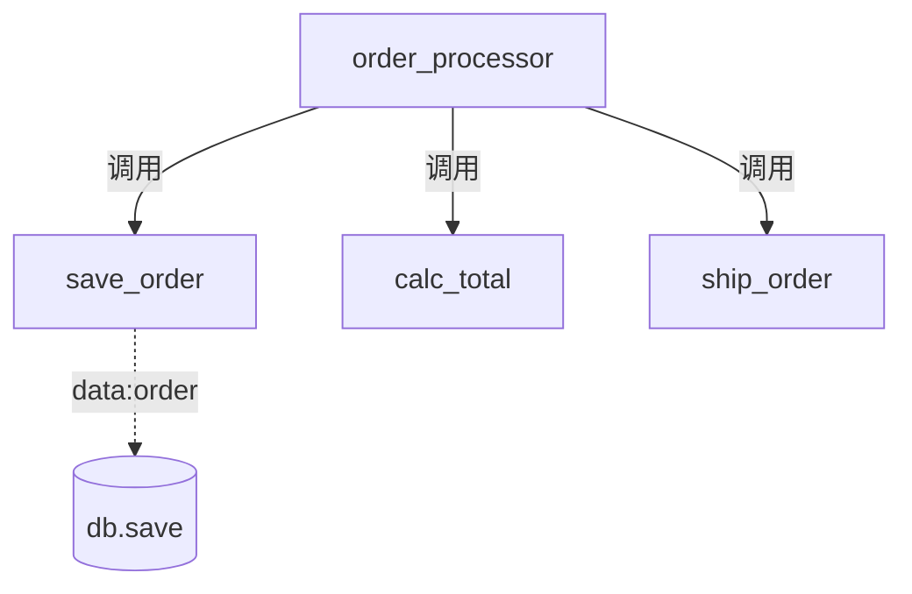

# 习题 - 第2章 内聚与耦合

本章习题覆盖七种内聚类型（由弱到强）与七种耦合类型（由强到弱）的排序与判定、内聚与耦合的相互关系、模块质量评估与解耦策略。设计题要求对给定模块判定内聚/耦合类型并给出改进方案，是结构化设计中最常考的辨析与改进题型。

## 知识点覆盖表

| 知识点 | 题号 |
| --- | --- |
| 七种内聚类型排序与判定 | 1、7、11、16、21、26、28 |
| 七种耦合类型排序与判定 | 2、8、12、17、22、27 |
| 内聚与耦合的相互关系 | 3、9、18、23 |
| 模块质量评估 | 4、13、19、24、29 |
| 解耦策略与模块改进 | 5、10、14、20、25、30、31 |
| 内聚耦合综合判定 | 6、15、30、32 |

## 一、单选题（每题 2 分，共 10 题）

**1.** 下列内聚类型中，内聚程度最高的是（  ）。
A. 时间内聚
B. 通信内聚
C. 顺序内聚
D. 功能内聚

**2.** 下列耦合类型中，耦合程度最强的是（  ）。
A. 公共耦合
B. 内容耦合
C. 控制耦合
D. 标记耦合

**3.** 关于内聚与耦合的关系，下列说法正确的是（  ）。
A. 高内聚必然导致高耦合
B. 高内聚模块往往自然形成低耦合
C. 内聚与耦合完全等价
D. 低内聚一定伴随低耦合

**4.** 一个模块同时完成"读订单、计算金额、保存订单、发送邮件"，其内聚类型最可能是（  ）。
A. 功能内聚
B. 顺序内聚
C. 偶然内聚
D. 时间内聚

**5.** 模块 A 调用模块 B 时传入 `flag` 参数，由 `flag` 决定 B 执行计算还是排序分支，这种耦合属于（  ）。
A. 数据耦合
B. 标记耦合
C. 控制耦合
D. 公共耦合

**6.** 模块间仅通过参数传递必要的数据值，接口清晰、依赖最小，这种耦合是（  ）。
A. 数据耦合
B. 标记耦合
C. 非直接耦合
D. 外部耦合

**7.** "模块内各成分顺序执行，且前一成分的输出是后一成分的输入，形成数据流水线"，这是（  ）。
A. 过程内聚
B. 通信内聚
C. 顺序内聚
D. 功能内聚

**8.** 多个模块共享同一全局变量 `g_config`，任一模块修改都影响其他模块，这种耦合是（  ）。
A. 内容耦合
B. 公共耦合
C. 外部耦合
D. 控制耦合

**9.** 下列关于高内聚低耦合的描述，错误的是（  ）。
A. 高内聚使模块易理解、易测试
B. 低耦合使修改不易扩散
C. 二者共同保证模块独立性
D. 高内聚模块必然产生最强耦合

**10.** 将控制标志转化为数据参数，或将一个按标志选分支的模块拆分为多个功能内聚模块，这种改进针对的是（  ）。
A. 消除公共耦合
B. 消除控制耦合
C. 消除内容耦合
D. 消除标记耦合

## 二、多选题（每题 3 分，共 5 题）

**11.** 下列属于低内聚、应避免的有（  ）。
A. 偶然内聚
B. 逻辑内聚
C. 时间内聚
D. 功能内聚

**12.** 下列属于强耦合、应避免的有（  ）。
A. 内容耦合
B. 公共耦合
C. 外部耦合
D. 数据耦合

**13.** 判定模块内聚类型时，依次需要检查的成分关系包括（  ）。
A. 是否共同服务单一功能
B. 是否形成数据流水线
C. 是否操作同一数据集
D. 是否由参数选择执行分支

**14.** 下列解耦策略正确的有（  ）。
A. 把公共数据封装为模块，通过接口访问
B. 只传递模块实际需要的字段而非整个数据结构
C. 拆分按标志选分支的模块为多个功能内聚模块
D. 让一个模块直接修改另一模块的内部变量以加快通信

**15.** 关于通信内聚与过程内聚，下列说法正确的有（  ）。
A. 通信内聚各成分操作同一数据集
B. 过程内聚各成分按固定顺序执行
C. 通信内聚通常强于过程内聚
D. 过程内聚的成分之间一定有数据流动

## 三、判断题（每题 2 分，共 5 题）

**16.** 偶然内聚的模块难以用一句话描述其功能，难以命名、测试与复用，应拆分为多个功能内聚模块。

**17.** 内容耦合是最强的耦合，现代语言通过访问控制（private/protected）从语法上抑制它。

**18.** 标记耦合比数据耦合弱，是模块间协作的理想状态。

**19.** 时间内聚的成分之间无数据或逻辑依赖，仅在同一时间段执行。

**20.** 高内聚的模块不可能再产生较强耦合，因此无需检查接口设计。

## 四、简答题（每题 6 分，共 4 题）

**21.** 列出七种内聚类型并按由弱到强排序，指出哪些是低内聚、中内聚、高内聚。

**22.** 列出七种耦合类型并按由强到弱排序，指出哪些是强耦合、中耦合、弱耦合。

**23.** 简述内聚与耦合的关系，并说明为何二者需分别考量。

**24.** 简述判定一个模块内聚类型的一般步骤。

## 五、设计题/分析题（每题 8 分，共 4 题）

**25.**（分析题）给定以下模块描述，请判定其内聚类型并说明改进方案：
> 模块 `print_report(type, data)`：当 `type="PDF"` 生成 PDF 报表；当 `type="Excel"` 生成 Excel 报表；当 `type="HTML"` 生成 HTML 报表。

**26.**（分析题）给定以下模块，请判定内聚类型并说明理由，给出改进方案：
> 模块 `transform(data)`：读取原始数据→清洗→转换→输出，前一成分的输出是后一成分的输入。

**27.**（分析题）模块 A 调用模块 B，传入一个完整的 `Student` 对象，但 B 只使用其中的 `score` 字段判断是否及格。请判定耦合类型、指出问题并给出改进方案。

**28.**（绘图题）请用 Mermaid 绘制"七种内聚由弱到强"的谱系图，并用颜色区分低/中/高内聚区间。

## 六、综合题/案例题（每题 10 分，共 2 题）

**29.**（综合题）某"库存管理"系统在设计评审中发现以下问题：
① 模块 `misc` 同时打开日志文件、计算两数之和、格式化日期、校验邮箱；
② 模块 `report(action,data)` 由 `action` 标志决定生成日报、周报或月报；
③ 多个模块直接读写全局 `g_inventory`；
④ 模块 `proc(student)` 接收完整 `student` 对象但只用 `student.qty`。
请逐一判定各问题的内聚/耦合类型，给出改进方案，并说明改进后模块独立性的提升体现在哪里。

**30.**（综合题）阅读以下模块代码，回答问题：
```python
def handle(action, order):
    if action == "save":
        db.save(order)
    elif action == "calc":
        return calc_total(order)
    elif action == "ship":
        ship(order)
```
（1）判定 `handle` 的内聚类型与 `action` 参数造成的耦合类型。
（2）给出重构方案，使每个模块达到功能内聚并消除该耦合。
（3）用 Mermaid 绘制重构后的调用结构（`order_processor` 分别调用三个功能模块）。

## 答案与解析

### 单选题答案

<details>
<summary>1-10 题答案与解析</summary>

**1. 答案：D**
解析：七种内聚由弱到强为偶然、逻辑、时间、过程、通信、顺序、功能，功能内聚最强。

**2. 答案：B**
解析：七种耦合由强到弱为内容、公共、外部、控制、标记、数据、非直接，内容耦合最强。

**3. 答案：B**
解析：高内聚模块功能单一、不需过多外部交互，往往自然形成低耦合；但二者不完全等价，接口不当仍可能产生较强耦合。

**4. 答案：C**
解析：四个成分无明显关联，属偶然内聚（无关联堆叠）。

**5. 答案：C**
解析：传入标志选择执行分支，属控制耦合。

**6. 答案：A**
解析：仅传必要数据值，接口清晰依赖最小，属数据耦合，是最常见的可接受协作方式。

**7. 答案：C**
解析：前一成分输出为后一成分输入，形成数据流水线，属顺序内聚。

**8. 答案：B**
解析：多模块共享全局变量，属公共耦合。

**9. 答案：D**
解析：高内聚模块仍可能因接口设计不当产生较强耦合，D 错误。

**10. 答案：B**
解析：将控制标志转化为数据参数或拆分按标志选分支的模块，针对的是消除控制耦合。
</details>

### 多选题答案

<details>
<summary>11-15 题答案与解析</summary>

**11. 答案：ABC**
解析：偶然、逻辑、时间为低内聚应避免；功能内聚为高内聚。

**12. 答案：ABC**
解析：内容、公共、外部为强耦合应避免；数据耦合为弱耦合是务实目标。

**13. 答案：ABCD**
解析：依次检查是否单一功能、数据流水线、同一数据、固定顺序、同时间执行、参数选择。

**14. 答案：ABC**
解析：封装公共数据、只传必要字段、拆分标志分支均为正确解耦策略；D 直接修改内部变量会引入内容耦合，错误。

**15. 答案：ABC**
解析：通信内聚各成分操作同一数据集无固定顺序，过程内聚按固定顺序执行但未必有数据流动，故 D 错误。
</details>

### 判断题答案

<details>
<summary>16-20 题答案与解析</summary>

**16. 答案：√**
解析：偶然内聚无关联，难命名、难测试、难复用，应拆分为功能内聚模块。

**17. 答案：√**
解析：内容耦合最强，现代语言通过访问控制抑制直接访问内部。

**18. 答案：×**
解析：标记耦合比数据耦合强（传整个结构但只用部分），应改进为数据耦合，而非理想状态。

**19. 答案：√**
解析：时间内聚成分仅同时间执行，无数据或逻辑依赖。

**20. 答案：×**
解析：高内聚模块仍可能因接口设计不当产生较强耦合，仍需检查接口。
</details>

### 简答题答案

<details>
<summary>21-24 题参考答案</summary>

**21.** 七种内聚由弱到强：偶然内聚、逻辑内聚、时间内聚、过程内聚、通信内聚、顺序内聚、功能内聚。低内聚（应避免）：偶然、逻辑、时间；中内聚（可接受）：过程、通信；高内聚（设计目标）：顺序、功能（功能内聚最优）。

**22.** 七种耦合由强到弱：内容耦合、公共耦合、外部耦合、控制耦合、标记耦合、数据耦合、非直接耦合。强耦合（应避免）：内容、公共、外部；中耦合（应消除）：控制；弱耦合（设计目标）：标记、数据、非直接（数据耦合为务实目标，非直接为理想极限）。

**23.** 内聚衡量模块内部各成分关联程度，耦合衡量模块间依赖程度。高内聚模块功能单一往往自然形成低耦合，二者相关；但二者不完全等价，一个高内聚模块仍可能因接口设计不当（如传递整个数据结构、传递控制标志）产生较强耦合，因此需分别考量内聚与耦合两个维度。

**24.** 判定步骤：①先检查成分是否共同服务一个单一明确功能——是则为功能内聚；②否则检查是否形成数据流水线（前输出为后输入）——是则为顺序内聚；③否则检查是否操作同一数据集——是则为通信内聚；④否则检查是否按固定顺序执行——是则为过程内聚；⑤否则检查是否同时间段执行——是则为时间内聚；⑥否则检查是否由参数选择执行分支——是则为逻辑内聚；⑦以上皆否，则无关联即偶然内聚。
</details>

### 设计题/分析题答案

<details>
<summary>25-28 题参考答案</summary>

**25.** 内聚类型：逻辑内聚。理由：模块完成逻辑上相关的多种功能（生成不同格式报表），由调用方传入的 `type` 标志选择执行其中之一。改进：拆分为 `generate_pdf(data)`、`generate_excel(data)`、`generate_html(data)` 三个功能内聚模块，调用方直接调用所需模块，消除标志参数。

**26.** 内聚类型：顺序内聚。理由：成分顺序执行且前一成分输出为后一成分输入，形成数据流水线（读→清→转→写），是高内聚。改进：顺序内聚已较好；若整个流水线只为单一目标服务，可进一步抽象为功能内聚；否则保持顺序内聚即可，无需强行拆分。

**27.** 耦合类型：标记耦合。问题：B 接收整个 `Student` 对象却只用 `score` 字段，依赖了它不需要的字段，`Student` 结构变化会波及 B。改进：只传必要字段，改为 `B(student.score)`，仅传 `score` 值，转为数据耦合。

**28.** 内聚谱系图：


颜色说明：红/橙色（偶然、逻辑、时间）为低内聚应避免；黄色（过程、通信）为中内聚可接受；绿色（顺序、功能）为高内聚设计目标。
</details>

### 综合题答案

<details>
<summary>29-30 题参考答案</summary>

**29.**
① `misc` 模块四个成分（开日志、算和、格式化日期、校验邮箱）无逻辑关联——偶然内聚。改进：拆分为 `open_log`、`add`、`format_date`、`is_valid_email` 四个功能内聚模块。
② `report(action,data)` 由 `action` 标志选日报/周报/月报分支——逻辑内聚（内聚低）+ 控制耦合（`action` 为控制标志）。改进：拆为 `daily_report`、`weekly_report`、`monthly_report` 三个功能内聚模块，调用方直接调用。
③ 多模块直接读写全局 `g_inventory`——公共耦合。改进：将 `g_inventory` 封装为库存模块，通过 `get_inventory()`/`set_inventory()` 接口访问，使数据变化可追踪。
④ `proc(student)` 接收完整对象只用 `student.qty`——标记耦合。改进：改为 `proc(student.qty)`，只传必要字段，转为数据耦合。
改进后模块独立性提升：模块均达功能内聚、模块间以数据耦合为主、消除了控制耦合与公共耦合，模块可独立理解、测试与复用。

**30.**
（1）`handle` 内聚类型为逻辑内聚（由 `action` 选择不同功能分支）；`action` 参数造成的耦合为控制耦合（传入标志控制 B 的执行逻辑）。
（2）重构：拆分为 `save_order(order)`、`calc_total(order)`、`ship_order(order)` 三个功能内聚模块，由 `order_processor` 直接调用所需模块，消除 `action` 控制标志。
（3）重构后调用结构：


</details>

## 考点统计表

| 题型 | 题数 | 分值 | 覆盖知识点 |
| --- | --- | --- | --- |
| 单选题 | 10 | 20 | 内聚排序、耦合排序、内聚耦合关系、内聚/耦合判定 |
| 多选题 | 5 | 15 | 低内聚类型、强耦合类型、内聚判定步骤、解耦策略、通信/过程对比 |
| 判断题 | 5 | 10 | 偶然内聚危害、内容耦合抑制、标记耦合强弱、时间内聚特征、内聚耦合关系 |
| 简答题 | 4 | 24 | 七种内聚排序、七种耦合排序、内聚耦合关系、内聚判定步骤 |
| 设计题/分析题 | 4 | 32 | 逻辑内聚改进、顺序内聚判定、标记耦合改进、内聚谱系图 |
| 综合题/案例题 | 2 | 20 | 库存系统多缺陷综合、订单模块重构与绘图 |
| 合计 | 30 | 121 | 第2章全部核心知识点 |

## 关联

- 上一级：[[MOC - 结构化软件设计]]
- 本章知识点：[[2.1 内聚类型详解（弱到强）]]、[[2.2 耦合类型详解（强到弱）]]、[[2.3 内聚耦合综合判定与设计实践]]
- 上一章习题：[[习题-第1章-结构化设计基础]]
- 下一章习题：[[习题-第3章-DFD转换结构图]]
