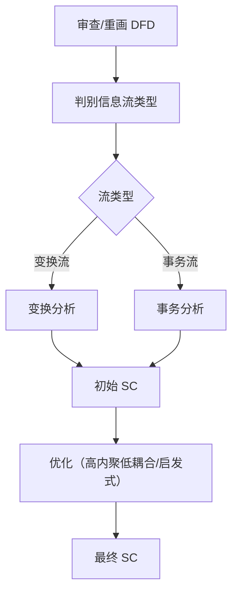

# 习题 - 第3章 DFD 转换结构图

本章习题覆盖 DFD→SC 映射原理、变换流与事务流的识别、分层 DFD 的逐层映射与父图子图平衡检验。设计题要求根据给定 DFD 识别信息流类型并说明映射方法，是连接分析与设计的方法学核心。

## 知识点覆盖表

| 知识点 | 题号 |
| --- | --- |
| DFD→SC 映射原理与步骤 | 1、7、11、16、21、26 |
| 变换流识别与变换中心判定 | 2、8、12、17、22、28 |
| 事务流识别与事务中心判定 | 3、9、13、18、23、29 |
| 分层映射与父图子图平衡 | 4、14、19、24、30 |
| 映射步骤与初始 SC | 5、10、15、20、25 |
| 混合型 DFD 处理 | 6、27、31、32 |

## 一、单选题（每题 2 分，共 10 题）

**1.** DFD→SC 映射的核心思想是（  ）。
A. 重新分析需求
B. 以 DFD 为输入按信息流类型选择映射方法导出初始 SC
C. 直接将 DFD 加工对应文件
D. 依据 ER 图绘制 SC

**2.** 变换流的数据流形态是（  ）。
A. 一进多出
B. 输入→变换→输出 线性流水线
C. 事务→分派→多动作
D. 无固定流向

**3.** 事务流的典型特征是（  ）。
A. 线性流水线
B. 一进多出，由事务中心根据类型分派多路径
C. 单一输入单一输出
D. 数据仅在模块内部流动

**4.** 分层 DFD 父图子图平衡是指（  ）。
A. 子图加工数等于父图加工数
B. 子图输入输出数据流与父图对应加工一致
C. 子图层数与父图层数相同
D. 子图与父图使用相同符号

**5.** DFD→SC 映射的总体步骤，正确顺序是（  ）。
A. 重画 DFD→判别信息流类型→变换/事务分析→得到初始 SC→优化
B. 判别信息流类型→重画 DFD→优化→变换分析→得到 SC
C. 优化→得到 SC→判别类型→重画 DFD→分析
D. 得到 SC→重画 DFD→优化→判别类型→分析

**6.** 混合型 DFD 的处理原则是（  ）。
A. 只用变换分析
B. 只用事务分析
C. 整体定框架、局部定细节
D. 忽略次要流类型

**7.** 下列关于 DFD→SC 映射的描述，错误的是（  ）。
A. SD 以 DFD 为输入
B. 映射得到的是初始 SC
C. 初始 SC 可直接交付编码
D. 需依据准则优化

**8.** 变换中心（加工中心）的边界由（  ）确定。
A. 逻辑输入边界与逻辑输出边界
B. 物理输入与物理输出
C. 事务分派加工
D. 数据字典

**9.** 事务中心识别方法是寻找（  ）。
A. 一进一出线性加工
B. 根据输入类型分派到多路径的加工
C. 无输入的加工
D. 仅做格式化的加工

**10.** 得到初始 SC 后，下一步应（  ）。
A. 直接编码
B. 依据高内聚低耦合与启发式规则优化
C. 重新画 DFD
D. 删除多余模块

## 二、多选题（每题 3 分，共 5 题）

**11.** DFD→SC 映射总体步骤包含（  ）。
A. 审查并重画 DFD
B. 判别信息流类型
C. 变换分析或事务分析
D. 优化初始 SC

**12.** 变换流的三段结构包括（  ）。
A. 传入路径（物理输入→逻辑输入）
B. 中心变换（逻辑输入→逻辑输出）
C. 传出路径（逻辑输出→物理输出）
D. 事务分派路径

**13.** 事务流的组成包括（  ）。
A. 事务输入
B. 事务中心
C. 多条动作路径
D. 三叉树输出

**14.** 父图子图平衡检验的内容包括子图与父图对应加工的（  ）。
A. 输入数据流一致
B. 输出数据流一致
C. 数据流方向一致
D. 加工内部实现相同

**15.** 关于变换流与事务流，下列说法正确的有（  ）。
A. 变换流用变换分析映射
B. 事务流用事务分析映射
C. 一个系统可能同时包含两种流
D. 变换流呈三叉树，事务流呈扇形

## 三、判断题（每题 2 分，共 5 题）

**16.** DFD→SC 映射是设计的起点而非终点，工程师的优化判断不可省略。

**17.** 变换流的识别特征是"输入→变换→输出"的线性流水线，呈一进一出。

**18.** 事务流的特征是"一进多出"，事务中心根据输入类型分派到多条动作路径。

**19.** 父图子图不平衡时，说明细化过程存在遗漏或错误，将导致映射得到的 SC 结构错误。

**20.** 混合型 DFD 只能整体采用一种映射方法，不能局部细化。

## 四、简答题（每题 6 分，共 4 题）

**21.** 简述 DFD 到 SC 映射的核心思想与总体步骤。

**22.** 如何识别变换流？说明变换中心（加工中心）的双向追踪判定方法。

**23.** 如何识别事务流？事务中心有什么特征？

**24.** 什么是分层 DFD 的父图子图平衡？为什么必须进行平衡检验？

## 五、设计题/分析题（每题 8 分，共 4 题）

**25.**（分析题）给定如下 DFD 描述，请判断其信息流类型并说明理由：
> 外部实体"学生"提交查询请求，系统根据请求类型（查成绩/查课表/查学籍）分别调用三个处理模块，各模块返回结果给"学生"。

**26.**（绘图题）给定一个变换型 DFD：外部实体 `用户` →加工`接收输入`→加工`校验`→加工`计算`→加工`格式化`→外部实体`报表`。请用 Mermaid 绘制该 DFD，并标出传入路径、中心变换、传出路径的大致边界（在图中用注释说明逻辑输入、逻辑输出位置）。

**27.**（分析题）某系统 DFD 中：主路径为"采集数据→校验→汇总→生成报表→输出"（线性），同时在"校验"之后有一个加工"按类型分发"将异常数据分发到三条告警路径。请说明该 DFD 属于何种类型，应如何映射。

**28.**（绘图题）请用 Mermaid 绘制 DFD→SC 映射的总体流程图，体现：审查/重画 DFD → 判别信息流类型 → 变换分析/事务分析 → 初始 SC → 优化 → 最终 SC。

## 六、综合题/案例题（每题 10 分，共 2 题）

**29.**（综合题）某"ATM 取款系统"顶层 DFD：客户插入银行卡输入密码，系统校验后根据客户选择（取款/查询/转账/改密）分发到对应处理模块。请：
（1）判断该系统主信息流类型并指出事务中心。
（2）说明应采用何种映射方法建立主框架。
（3）若"取款"内部呈"输入金额→校验余额→扣款→吐钞→打印凭条"线性流水线，应如何局部细化。

**30.**（综合题）给定分层 DFD 描述：父图加工 P"处理订单"有一个输入数据流"订单"和一个输出数据流"处理结果"；其子图含 P1、P2、P3 三个加工，子图输入"订单"、输出"处理结果"。请回答：
（1）该父图与子图是否平衡？为什么？
（2）若子图实际输入为"订单+客户档案"、输出为"处理结果+日志"，是否平衡？存在什么问题？
（3）说明平衡检验对 DFD→SC 映射可靠性的意义。

## 答案与解析

### 单选题答案

1-10 题答案与解析

**1. 答案：B**
解析：映射核心思想是以 DFD 为输入，按信息流类型选择映射方法导出初始 SC。

**2. 答案：B**
解析：变换流呈输入→变换→输出线性流水线（一进一出）。

**3. 答案：B**
解析：事务流呈一进多出，事务中心根据类型分派多路径。

**4. 答案：B**
解析：平衡指子图输入输出数据流与父图对应加工一致（数量、名称、方向）。

**5. 答案：A**
解析：正确顺序为重画 DFD→判别类型→分析→初始 SC→优化。

**6. 答案：C**
解析：混合型遵循"整体定框架、局部定细节"原则。

**7. 答案：C**
解析：初始 SC 不能直接交付编码，需优化。

**8. 答案：A**
解析：变换中心边界由逻辑输入边界与逻辑输出边界确定。

**9. 答案：B**
解析：事务中心是根据输入类型分派到多路径的加工。

**10. 答案：B**
解析：得到初始 SC 后应依据高内聚低耦合与启发式规则优化。

### 多选题答案

11-15 题答案与解析

**11. 答案：ABCD**
解析：四步均属于映射总体步骤。

**12. 答案：ABC**
解析：变换流三段为传入、中心变换、传出；D 为事务流成分。

**13. 答案：ABC**
解析：事务流由事务输入、事务中心、多条动作路径组成；D 是变换流 SC 形态。

**14. 答案：ABC**
解析：平衡检验数据流的输入、输出、方向一致；加工内部实现不需相同（子图正是细化内部）。

**15. 答案：ABCD**
解析：四项均正确：变换流用变换分析、事务流用事务分析、可同时存在、变换型三叉树/事务型扇形。

### 判断题答案

16-20 题答案与解析

**16. 答案：√**
解析：映射是起点，优化判断不可省略。

**17. 答案：√**
解析：变换流呈输入→变换→输出线性流水线，一进一出。

**18. 答案：√**
解析：事务流一进多出，事务中心按类型分派。

**19. 答案：√**
解析：不平衡意味着遗漏或错误，导致 SC 结构错误。

**20. 答案：×**
解析：混合型可整体定框架、局部定细节，对不同部分分别采用对应方法。

### 简答题答案

21-24 题参考答案

**21.** 核心思想：SD 以 DFD 为输入，按信息流类型选择映射方法，将数据流加工转化为模块层次，导出初始 SC。总体步骤：①审查并重画 DFD；②判别信息流类型（变换流或事务流）；③对变换流用变换分析、对事务流用事务分析；④得到初始 SC；⑤依据高内聚低耦合与启发式规则优化。

**22.** 变换流呈"输入→变换→输出"线性流水线。变换中心判定用双向追踪法：①从最外层物理输入沿数据流方向向内追踪，逐个判断加工是否仅做纯输入（接收、校验、格式转换），直到执行实质变换的加工，其前数据流即逻辑输入边界；②从最外层物理输出沿反方向向内追踪，判断是否仅做纯输出，直到实质变换加工，其后即逻辑输出边界；两边界间即变换中心。

**23.** 事务流呈"一进多出"扇形，事务中心接收单一输入，根据输入类型分派到多条动作路径。识别方法：扫描所有加工，寻找满足"一进多出+类型分派"特征的加工——接收单一输入却根据类型产生多个不同输出路径，该加工即事务中心。

**24.** 父图子图平衡指子图输入输出数据流与父图对应加工在数量、名称、方向上一致。必须检验因为：它保证分层细化中没有丢失或增加数据流——子图如实实现父图加工职责。若不平衡说明有遗漏或错误（如某数据流未被处理或引入了未定义数据流），将导致映射得到的 SC 错误。平衡是 DFD 正确性与映射可靠性的前提。

### 设计题/分析题答案

25-28 题参考答案

**25.** 信息流类型：**事务流**。理由：系统根据查询请求"类型"（查成绩/查课表/查学籍）分派到三个不同处理模块，呈"一进多出+类型分派"特征。事务中心为"根据请求类型分发"的加工。应采用事务分析映射为扇形 SC。

**26.** DFD 图示（`用户→接收输入→校验→计算→格式化→报表`）：

边界说明：传入路径为 `用户→接收输入→校验`（逻辑输入为"校验"输出的有效数据）；中心变换为 `计算`；传出路径为 `格式化→报表`（逻辑输出为"计算"输出的结果）。具体边界视校验是否视为纯输入而定，本题以"计算"为变换中心。

**27.** 类型：**混合型 DFD**（整体为变换流，局部含事务流）。映射：整体用变换分析建立"输入-变换-输出"三叉树主框架；对"按类型分发"的局部事务流用事务分析细化——将该加工映射为调度模块+三个告警动作模块。遵循"整体定框架、局部定细节"。

**28.** 映射总体流程图：

### 综合题答案

29-30 题参考答案

**29.**
（1）主信息流类型为**事务流**。系统根据客户选择（取款/查询/转账/改密）分发到对应模块，呈"一进多出+类型分派"。事务中心为"根据客户选择分发"的加工。
（2）应采用**事务分析**建立主框架：设计主控模块+接收模块+调度模块，调度模块下分四个并列动作模块（取款、查询、转账、改密），呈扇形 SC。
（3）"取款"内部呈线性流水线，属变换流局部，应在该动作模块内部用**变换分析**细化：输入边界为"输入金额"、变换中心为"校验余额→扣款"、输出边界为"吐钞→打印凭条"，展开为输入-变换-输出三层。体现"整体（事务）定框架、局部（变换）定细节"。

**30.**
（1）**平衡**。子图输入"订单"、输出"处理结果"与父图加工 P 的输入输出完全一致（数量、名称、方向），满足平衡条件。
（2）**不平衡**。子图引入了父图未定义的数据流"客户档案"（额外输入）和"日志"（额外输出），与父图不一致。问题：说明细化过程引入了未在父图中声明的外部数据依赖或输出，可能导致映射错误——需回头修正父图（补充"客户档案"输入与"日志"输出）或调整子图（去掉多余数据流），使二者一致。
（3）平衡检验保证分层 DFD 在逐层细化中数据流无丢失无增加，子图如实实现父图加工职责，是 DFD 正确性与 SC 映射可靠性的前提；不平衡会直接导致映射出的 SC 结构错误。

## 考点统计表

| 题型 | 题数 | 分值 | 覆盖知识点 |
| --- | --- | --- | --- |
| 单选题 | 10 | 20 | 映射原理、变换/事务流特征、平衡概念、映射步骤、混合处理 |
| 多选题 | 5 | 15 | 映射步骤、变换流三段、事务流组成、平衡内容、流类型对比 |
| 判断题 | 5 | 10 | 映射是起点、变换流特征、事务流特征、平衡必要性、混合处理 |
| 简答题 | 4 | 24 | 映射步骤、变换中心判定、事务中心识别、平衡检验 |
| 设计题/分析题 | 4 | 32 | 事务流识别、DFD 绘制与边界、混合型处理、映射流程图 |
| 综合题/案例题 | 2 | 20 | ATM 系统混合流设计、分层 DFD 平衡判定 |
| 合计 | 30 | 121 | 第3章全部核心知识点 |

## 关联

- 上一级：[[MOC - 结构化软件设计]]
- 本章知识点：[[3.1 DFD到SC的映射原理]]、[[3.2 变换流识别与事务流识别]]、[[3.3 DFD分层映射与平衡检验]]
- 上一章习题：[[习题-第2章-内聚与耦合]]
- 下一章习题：[[习题-第4章-变换流设计]]
