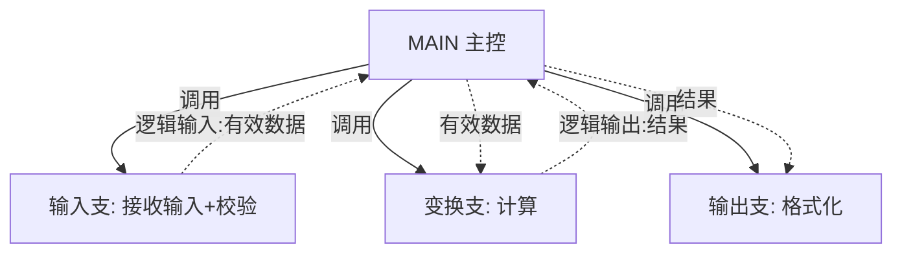
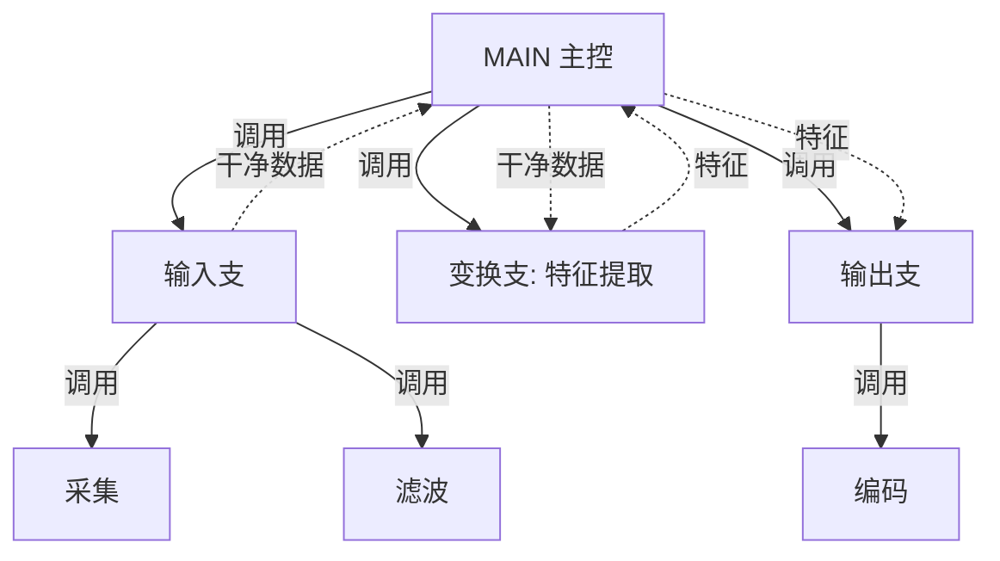
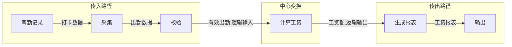
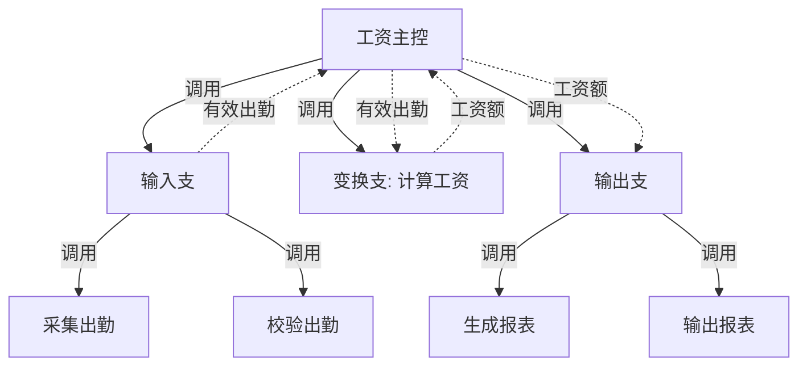
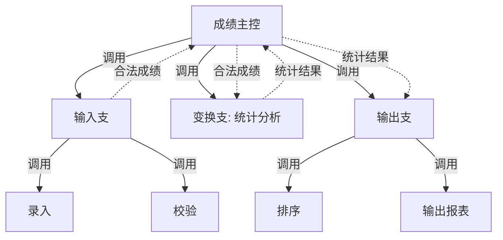

# 习题 - 第4章 变换流设计

本章习题覆盖变换流的三段结构、变换中心边界确定（双向追踪法）、变换分析四步法与三叉树 SC 生成。设计题要求根据给定 DFD 完成完整的变换流映射并绘制 SC 图，是结构化设计绘图题的高频考点。

## 知识点覆盖表

| 知识点 | 题号 |
| --- | --- |
| 变换流三段结构 | 1、7、11、16、21 |
| 逻辑输入/输出与物理输入/输出 | 2、8、12、17、22 |
| 变换中心边界确定（双向追踪） | 3、9、13、18、23、28 |
| 变换分析四步法 | 4、10、14、19、24、26 |
| 三叉树 SC 形态与生成 | 5、15、20、25、29 |
| 初始 SC 优化与综合 | 6、27、30、31、32 |

## 一、单选题（每题 2 分，共 10 题）

**1.** 变换流的三段结构按数据流方向依次是（  ）。
A. 传入路径、中心变换、传出路径
B. 中心变换、传入路径、传出路径
C. 传出路径、中心变换、传入路径
D. 传入路径、传出路径、中心变换

**2.** 下列关于逻辑输入与物理输入的说法，正确的是（  ）。
A. 二者完全相同
B. 物理输入是经传入路径处理后的内部数据
C. 逻辑输入是经传入路径处理后、进入中心变换前的内部标准数据
D. 逻辑输入即外部实体提供的数据

**3.** 确定变换中心边界的方法是（  ）。
A. 单向追踪
B. 双向追踪法（输入逆向、输出正向）
C. 随机选取
D. 按加工编号

**4.** 变换分析四步法的正确顺序是（  ）。
A. 设计中下层→重画 DFD→设计顶层→确定边界
B. 重画 DFD→确定逻辑输入/输出→设计顶层→设计中下层
C. 确定边界→重画 DFD→设计中下层→设计顶层
D. 设计顶层→设计中下层→重画 DFD→确定边界

**5.** 变换型 SC 的形态特征是（  ）。
A. 扇形
B. 三叉树（主控下分输入、变换、输出三支）
C. 线性链
D. 环形

**6.** 变换分析得到的初始 SC（  ）。
A. 可直接交付编码
B. 必须依据高内聚低耦合与启发式规则优化后才能使用
C. 无需任何修改
D. 只能用于事务流系统

**7.** 传入路径的作用是（  ）。
A. 完成核心业务变换
B. 接收、校验、格式化外部输入，转化为系统内部可用数据
C. 输出结果
D. 分派事务

**8.** 沿输入流从外部向内逆向追踪，目的是确定（  ）。
A. 逻辑输出边界
B. 逻辑输入边界
C. 事务中心
D. 物理输出

**9.** 下列加工中，最可能属于变换中心（而非纯输入/纯输出）的是（  ）。
A. 接收键盘输入
B. 格式化报表输出
C. 计算工资总额
D. 屏幕显示结果

**10.** 变换分析四步法中"设计顶层模块"建立的四类模块是（  ）。
A. 主控、输入、变换、输出
B. 调度、接收、动作、输出
C. 主控、调度、动作、事务
D. 输入、校验、计算、输出

## 二、多选题（每题 3 分，共 5 题）

**11.** 变换流三段结构包括（  ）。
A. 传入路径
B. 中心变换
C. 传出路径
D. 事务分派路径

**12.** 下列关于物理输入与逻辑输入的描述，正确的有（  ）。
A. 物理输入是外部实体直接提供的数据
B. 逻辑输入是经传入路径处理后的内部数据
C. 区分二者是确定变换中心边界的关键
D. 逻辑输入仍带有外部格式

**13.** 确定变换中心边界的双向追踪法包括（  ）。
A. 从物理输入沿数据流方向向内追踪确定逻辑输入边界
B. 从物理输出沿反方向向内追踪确定逻辑输出边界
C. 随机指定一个加工为变换中心
D. 两边界之间的加工集合即变换中心

**14.** 变换分析四步法包括（  ）。
A. 重画 DFD 区分三段
B. 确定逻辑输入/输出边界
C. 设计顶层模块
D. 设计中下层模块

**15.** 变换型 SC 三叉树的三个分支对应（  ）。
A. 传入路径
B. 中心变换
C. 传出路径
D. 事务调度

## 三、判断题（每题 2 分，共 5 题）

**16.** 传入路径负责接收、校验、格式化外部输入，将其转化为系统内部可用数据。

**17.** 逻辑输入是经过传入路径处理后、进入中心变换前已转化为系统内部标准形式的数据。

**18.** 变换中心边界的两边界重合时，中心变换一定只包含一个加工。

**19.** 变换型 SC 的三叉树形态源于变换流的三段结构。

**20.** 变换分析得到的初始 SC 就是最终设计，无需优化即可交付编码。

## 四、简答题（每题 6 分，共 4 题）

**21.** 简述变换流的三段结构，并说明逻辑输入与物理输入的区别。

**22.** 如何确定变换中心的边界？请描述双向追踪法的具体步骤。

**23.** 详述变换分析四步法，并说明顶层模块包含哪几类。

**24.** 变换型 SC 为什么呈三叉树形态？得到的初始 SC 是否可直接使用？

## 五、设计题/分析题（每题 8 分，共 4 题）

**25.**（绘图题）给定变换型 DFD：`用户 →(原始输入) 接收输入 →(数据) 校验 →(有效数据) 计算 →(结果) 格式化 →(报表) 报表`。约定：传入路径为"接收输入、校验"（逻辑输入=有效数据），中心变换为"计算"，传出路径为"格式化"。请用 Mermaid 绘制变换型三叉树 SC 图（主控 `MAIN` 下分输入、变换、输出三支，标注数据流）。

**26.**（分析题）给定变换型 DFD：`传感器 →(原始数据) 采集 →(采样值) 滤波 →(干净数据) 特征提取 →(特征) 编码 →(码流) 发送器`。请用双向追踪法标定逻辑输入边界、逻辑输出边界与变换中心，并说明理由。

**27.**（绘图题）对第 26 题的 DFD，假设变换中心为"特征提取"，请用 Mermaid 绘制变换型 SC 图（主控下分输入支、变换支、输出支，输入支含"采集、滤波"，变换支含"特征提取"，输出支含"编码"）。

**28.**（分析题）某 DFD：`键盘 →(录入) 接收 →(文本) 校验格式 →(合法文本) 解析 →(结构数据) 计算 →(结果) 格式化 →(输出串) 显示器`。某同学将"校验格式"划入中心变换。请判断是否合理，并给出你认为更合理的边界划分及理由。

## 六、综合题/案例题（每题 10 分，共 2 题）

**29.**（综合题）"工资计算系统"DFD：`考勤记录 →(打卡数据) 采集 →(出勤数据) 校验 →(有效出勤) 计算工资 →(工资额) 生成报表 →(工资报表) 输出`。约定逻辑输入=有效出勤、逻辑输出=工资额、变换中心=计算工资。请完成：
（1）用 Mermaid 绘制该 DFD 并标注三段边界。
（2）用 Mermaid 绘制变换型三叉树 SC（主控 `工资主控` 下分输入、变换、输出三支，输入支含"采集出勤、校验出勤"，变换支含"计算工资"，输出支含"生成报表、输出报表"）。
（3）指出该初始 SC 至少两处可优化点。

**30.**（综合题）"成绩统计系统"DFD：`教师 →(成绩单) 录入 →(原始成绩) 校验 →(合法成绩) 统计分析 →(统计结果) 排序 →(排序结果) 输出报表 →(报表) 教师`。请完成：
（1）标定逻辑输入、逻辑输出、变换中心。
（2）绘制变换型 SC 图（Mermaid）。
（3）若"统计分析"内部含多个子加工（求均值、求方差、排名），说明变换支如何继续分解。
（4）说明该 SC 如何体现变换流三段与三叉树形态。

## 答案与解析

### 单选题答案

1-10 题答案与解析

**1. 答案：A**
解析：变换流三段为传入路径、中心变换、传出路径。

**2. 答案：C**
解析：逻辑输入是经传入路径处理后进入中心变换前的内部标准数据；物理输入是外部实体原始数据。

**3. 答案：B**
解析：用双向追踪法（输入逆向、输出正向）确定边界。

**4. 答案：B**
解析：四步法为重画 DFD→确定边界→设计顶层→设计中下层。

**5. 答案：B**
解析：变换型 SC 呈三叉树，主控下分输入、变换、输出三支。

**6. 答案：B**
解析：初始 SC 需优化后才能使用，不能直接交付编码。

**7. 答案：B**
解析：传入路径负责接收、校验、格式化外部输入转化为内部可用数据。

**8. 答案：B**
解析：沿输入流从外部向内逆向追踪确定逻辑输入边界。

**9. 答案：C**
解析：计算工资总额是实质业务变换；接收输入、格式化、显示属纯输入/纯输出。

**10. 答案：A**
解析：顶层四类模块为主控、输入、变换、输出。

### 多选题答案

11-15 题答案与解析

**11. 答案：ABC**
解析：三段为传入、中心变换、传出；D 属事务流。

**12. 答案：ABC**
解析：物理输入是外部原始数据（带外部格式），逻辑输入是处理后内部标准数据，D 错误。

**13. 答案：ABD**
解析：双向追踪法含输入逆向、输出正向追踪，两边界间即变换中心；C 随机指定错误。

**14. 答案：ABCD**
解析：四步法四步均正确。

**15. 答案：ABC**
解析：三叉树三支对应传入、中心变换、传出；D 属事务型。

### 判断题答案

16-20 题答案与解析

**16. 答案：√**
解析：传入路径负责接收、校验、格式化转化为内部可用数据。

**17. 答案：√**
解析：逻辑输入是经传入路径处理后的内部标准数据。

**18. 答案：×**
解析：两边界不重合时中心变换可能含多个加工；重合时才可能只含一个，"一定"过绝对。

**19. 答案：√**
解析：三叉树形态源于变换流三段结构。

**20. 答案：×**
解析：初始 SC 是机械映射，需优化后才能使用。

### 简答题答案

21-24 题参考答案

**21.** 三段：传入路径（物理输入→逻辑输入，接收校验格式化）、中心变换（逻辑输入→逻辑输出，核心业务变换）、传出路径（逻辑输出→物理输出，格式化输出）。区别：物理输入是外部实体直接提供的数据（带外部格式）；逻辑输入是经传入路径处理后进入中心变换前已转化为系统内部标准形式的数据。

**22.** 双向追踪法：①从最外层物理输入沿数据流方向向内追踪，逐个判断加工是否仅做纯输入（接收、校验、格式转换），直到执行实质变换的加工，其前数据流即逻辑输入边界；②从最外层物理输出沿反方向向内追踪，判断是否仅做纯输出，直到实质变换加工，其后即逻辑输出边界；③两边界间加工集合即变换中心。

**23.** 四步法：①重画 DFD 区分传入、中心变换、传出三段；②确定逻辑输入与逻辑输出边界（双向追踪）；③设计顶层模块——主控模块下分输入模块（获取并向上传递逻辑输入）、变换模块（完成中心变换）、输出模块（接收逻辑输出并向下传出）；④设计中下层模块——为输入模块分解获取与校验子模块，为变换模块分解各变换子加工，为输出模块分解格式化与输出子模块。顶层四类模块：主控、输入、变换、输出。

**24.** 三叉树源于变换流三段结构：主控模块对应整个变换流，其下三分支分别对应传入、中心变换、传出，每分支再按 DFD 加工层次逐层分解，形成"一主控、三分支、逐层细化"的树形结构，主控下恰好分三叉故称三叉树。初始 SC 不能直接使用——它是 DFD 的机械映射，可能存在模块过大、接口参数过多、扇出过大、低内聚高耦合等问题，必须依据高内聚低耦合与启发式规则优化后才可用于工程。

### 设计题/分析题答案

25-28 题参考答案

**25.** 变换型三叉树 SC：

**26.** 边界标定：从物理输入"原始数据"沿流向内：采集（采样）→滤波（清洗），二者偏纯输入处理，到"特征提取"执行实质变换，故逻辑输入边界在"滤波→特征提取"之间（逻辑输入=干净数据）。从物理输出"码流"沿反向向内：编码（编码为码流）偏纯输出处理，到"特征提取"为实质变换，故逻辑输出边界在"特征提取→编码"之间（逻辑输出=特征）。变换中心=特征提取（亦可包含其前后纯变换加工，本题定为特征提取）。

**27.** 变换型 SC（变换中心为特征提取）：

**28.** 不合理。"校验格式"只做格式合法性检查与格式转换，属纯输入处理，应划入传入路径，而非中心变换。更合理边界：逻辑输入=合法文本（校验格式之后）、逻辑输出=结果（计算之后）、变换中心=解析+计算（执行实质变换）。理由：解析将合法文本转为结构数据、计算得出结果，二者为实质业务变换；接收、校验格式属纯输入，格式化、显示属纯输出。

### 综合题答案

29-30 题参考答案

**29.**
（1）DFD 与三段边界：

（2）变换型三叉树 SC：

（3）可优化点：①"采集出勤+校验出勤"若耦合过强可合并为一个高内聚模块；②若"输出报表"被多业务复用可提取为公共子模块提高扇入；③接口参数若过多可简化、消除控制标志。

**30.**
（1）逻辑输入=合法成绩（校验之后）、逻辑输出=统计结果（统计分析之后）、变换中心=统计分析（排序属传出路径的格式化处理）。
（2）变换型 SC：

（3）"统计分析"内部含求均值、求方差、排名等子加工，变换支可继续分解：在"统计分析"模块下分解为 `求均值`、`求方差`、`排名` 三个下层子模块，各为功能内聚模块，由"统计分析"主控调用。
（4）三段对应三叉树三支：输入支对应传入路径（录入→校验→逻辑输入）、变换支对应中心变换（统计分析）、输出支对应传出路径（排序→输出报表→物理输出），整体呈"一主控、三分支"三叉树形态。

## 考点统计表

| 题型 | 题数 | 分值 | 覆盖知识点 |
| --- | --- | --- | --- |
| 单选题 | 10 | 20 | 三段结构、逻辑/物理输入、边界确定、四步法、三叉树、初始 SC 优化 |
| 多选题 | 5 | 15 | 三段结构、逻辑/物理输入、双向追踪、四步法、三叉树三支 |
| 判断题 | 5 | 10 | 传入路径作用、逻辑输入、边界重合、三叉树来源、初始 SC |
| 简答题 | 4 | 24 | 三段结构、双向追踪、四步法、三叉树成因 |
| 设计题/分析题 | 4 | 32 | 三叉树 SC 绘图、边界标定、SC 绘图、边界合理性分析 |
| 综合题/案例题 | 2 | 20 | 工资系统完整映射、成绩系统完整映射与分解 |
| 合计 | 30 | 121 | 第4章全部核心知识点 |

## 关联

- 上一级：[[MOC - 结构化软件设计]]
- 本章知识点：[[4.1 变换流识别与变换中心确定]]、[[4.2 变换流映射步骤与SC生成]]、[[4.3 变换流设计案例与实践]]
- 上一章习题：[[习题-第3章-DFD转换结构图]]
- 下一章习题：[[习题-第5章-事务流设计]]
