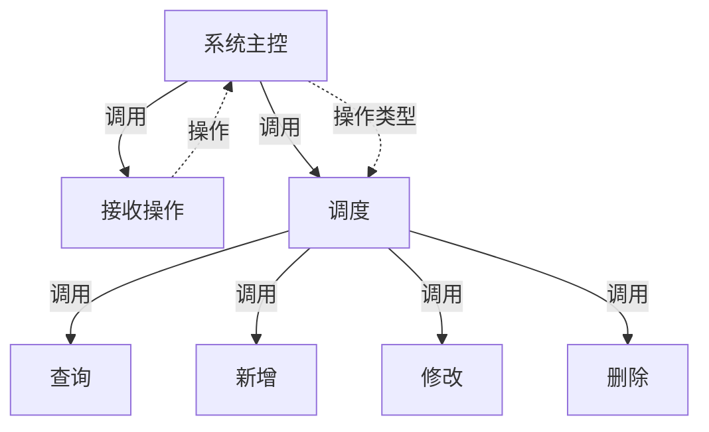
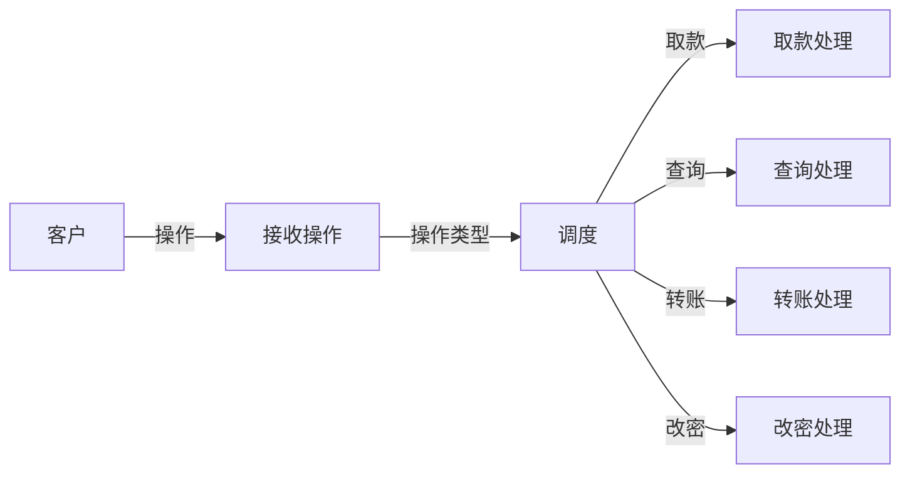
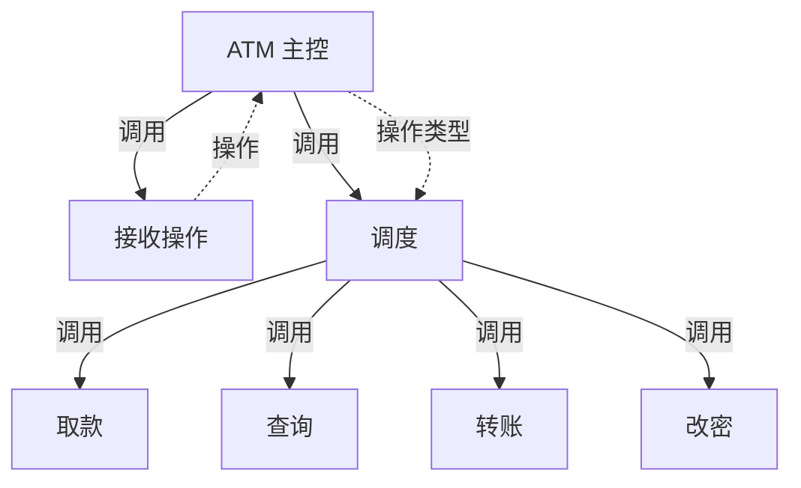
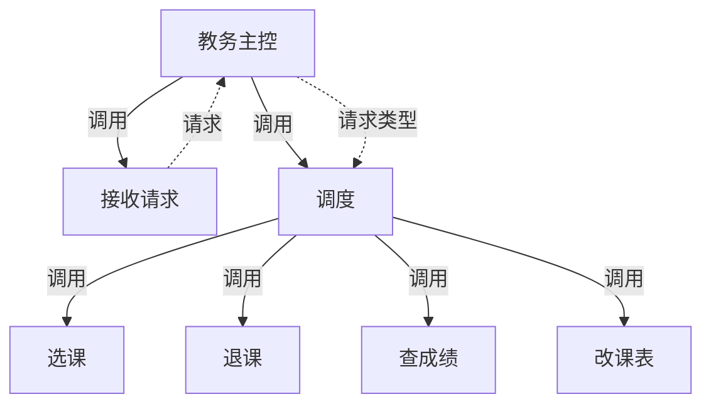
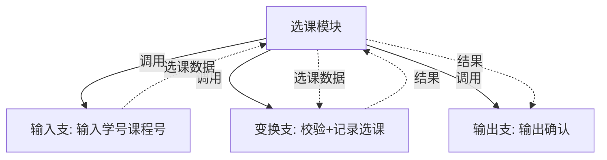

# 习题 - 第5章 事务流设计

本章习题覆盖事务流定义与事务中心识别、事务分析三步法、扇形 SC 结构图生成与混合型 DFD 处理。设计题要求根据给定 DFD 完成事务流映射并绘制扇形 SC 图，是事务型系统设计的核心绘图题型。

## 知识点覆盖表

| 知识点 | 题号 |
| --- | --- |
| 事务流定义与形态 | 1、7、11、16、21 |
| 事务中心特征与识别 | 2、8、12、17、22、28 |
| 事务分析三步法 | 3、9、13、18、23、26 |
| 扇形 SC 形态与生成 | 4、10、14、19、24、29 |
| 变换流与事务流对比 | 5、15、20、25 |
| 混合型 DFD 处理 | 6、27、30、31、32 |

## 一、单选题（每题 2 分，共 10 题）

**1.** 事务流的数据流形态是（  ）。
A. 输入→变换→输出 线性
B. 一进多出，由事务中心根据类型分派多路径
C. 多进一出
D. 无明确流向

**2.** 事务中心的特征是（  ）。
A. 接收单一输入，根据类型产生多个不同输出路径
B. 一进一出的线性加工
C. 无任何输入
D. 仅做格式化输出

**3.** 事务分析三步法的正确顺序是（  ）。
A. 设计动作模块→确定事务中心→设计顶层
B. 确定事务中心和动作路径→设计顶层模块→设计各动作模块
C. 设计顶层→设计动作模块→确定事务中心
D. 确定事务中心→设计动作模块→设计顶层

**4.** 事务型 SC 的形态特征是（  ）。
A. 三叉树
B. 扇形（调度模块下并列多个动作模块）
C. 线性链
D. 环形

**5.** 下列适合用事务流映射的系统是（  ）。
A. 工资计算流水线
B. 菜单选择/命令调度系统
C. 数据采集统计
D. 简单输入输出转换

**6.** 混合型 DFD 中整体为事务流、某动作路径内部为变换流时，应（  ）。
A. 只用事务分析
B. 整体用事务分析建框架，局部用变换分析细化
C. 只用变换分析
D. 忽略变换流局部

**7.** 下列关于事务流的描述，错误的是（  ）。
A. 事务中心根据输入类型分派
B. 事务流呈一进多出
C. 事务流用变换分析映射
D. 事务型 SC 呈扇形

**8.** 识别事务中心的方法是寻找（  ）。
A. 仅做格式化的加工
B. 根据输入类型分派到多路径的加工
C. 一进一出的线性加工
D. 无输出的加工

**9.** 事务分析三步法中"设计顶层模块"建立的模块是（  ）。
A. 主控+接收+调度
B. 主控+输入+变换+输出
C. 仅调度模块
D. 仅动作模块

**10.** 事务型 SC 中调度模块的作用是（  ）。
A. 完成核心变换
B. 根据事务类型分派到对应动作模块
C. 接收外部输入
D. 格式化输出

## 二、多选题（每题 3 分，共 5 题）

**11.** 事务流的组成包括（  ）。
A. 事务输入
B. 事务中心
C. 多条动作路径
D. 逻辑输入边界追踪

**12.** 事务中心的特征包括（  ）。
A. 接收单一输入
B. 根据输入类型选择执行路径
C. 产生多个不同输出路径
D. 一进多出+类型分派

**13.** 事务分析三步法包括（  ）。
A. 确定事务中心和各动作路径
B. 设计顶层模块（主控+接收+调度）
C. 设计各动作模块
D. 确定逻辑输入输出边界

**14.** 事务型 SC 扇形结构包含的模块有（  ）。
A. 主控模块
B. 接收模块
C. 调度模块
D. 多个并列动作模块

**15.** 变换流与事务流的区别包括（  ）。
A. 数据流形态不同（线性 vs 扇形分派）
B. 映射方法不同（变换分析 vs 事务分析）
C. SC 结构不同（三叉树 vs 扇形）
D. 典型系统不同（数据处理 vs 命令调度）

## 三、判断题（每题 2 分，共 5 题）

**16.** 事务流是一个事务进入系统后，由事务中心根据事务类型分派到多条不同处理路径的"一进多出"扇形数据流。

**17.** 事务中心接收一个输入数据流，根据输入数据中的"类型"字段选择执行路径，产生多个输出数据流。

**18.** 事务型 SC 中调度模块位于中心，向下分发到多个并列的动作模块，呈扇形。

**19.** 事务分析需要像变换分析那样确定逻辑输入与逻辑输出边界。

**20.** 对同时含事务流与变换流的 DFD，应"整体定框架、局部定细节"分别映射。

## 四、简答题（每题 6 分，共 4 题）

**21.** 什么是事务流？事务中心有什么特征？如何识别事务中心？

**22.** 简述事务分析三步法，并说明事务型 SC 的形态特征。

**23.** 对比变换流与事务流在数据流形态、映射方法和 SC 结构上的差异。

**24.** 一个系统的 DFD 同时包含事务流和变换流，应如何映射？

## 五、设计题/分析题（每题 8 分，共 4 题）

**25.**（分析题）给定 DFD 描述：`用户 →(操作请求) 操作调度 →(按类型分发)`，操作调度根据请求类型（查询/新增/修改/删除）分别调用四个处理模块。请判断信息流类型，指出事务中心，并说明应采用何种映射方法、SC 呈何种形态。

**26.**（绘图题）对第 25 题的 DFD，请用 Mermaid 绘制事务型扇形 SC（主控 `系统主控` 下含接收模块与调度模块，调度模块下分查询、新增、修改、删除四个动作模块）。

**27.**（分析题）某"文件管理"系统：主调度根据命令（打开/保存/打印/删除）分发到四个动作模块；其中"打印"内部呈"读取文件→格式化→发送打印机→输出"线性流水线。请说明该 DFD 类型及映射策略。

**28.**（绘图题）给定 ATM 取款事务型 DFD：`客户 →(操作) 接收操作 →(操作类型) 调度`，调度分派到取款、查询、转账、改密四个动作。请用 Mermaid 绘制该 DFD 与对应扇形 SC。

## 六、综合题/案例题（每题 10 分，共 2 题）

**29.**（综合题）"教务操作平台"DFD：`用户 →(请求) 接收请求 →(请求类型) 请求分发`，分发到"选课"、"退课"、"查成绩"、"改课表"四个动作模块；其中"选课"内部呈"输入学号课程号→校验→记录选课→输出确认"线性变换流。请完成：
（1）判断该系统主信息流类型并指出事务中心。
（2）用 Mermaid 绘制事务型扇形 SC（主框架）。
（3）说明"选课"动作模块内部如何用变换分析细化，并画出该动作模块内部的三叉树结构。

**30.**（综合题）对比并完成下列设计：
（1）用表格对比变换流与事务流在数据流形态、识别方法、映射步骤、SC 形态、典型系统上的差异。
（2）某系统 DFD 既含一个事务调度中心（分发到三个动作），又含一条主数据流水线（采集→统计→报表）。请说明如何确定整体框架、如何处理两条流的关系。
（3）说明事务分析得到初始扇形 SC 后，至少两处常见优化点。

## 答案与解析

### 单选题答案

1-10 题答案与解析

**1. 答案：B**
解析：事务流呈一进多出，事务中心根据类型分派多路径。

**2. 答案：A**
解析：事务中心接收单一输入，根据类型产生多个不同输出路径。

**3. 答案：B**
解析：三步法为确定事务中心和动作路径→设计顶层→设计各动作模块。

**4. 答案：B**
解析：事务型 SC 呈扇形，调度模块下并列多个动作模块。

**5. 答案：B**
解析：菜单选择/命令调度系统是典型事务流。

**6. 答案：B**
解析：整体用事务分析建框架，局部变换流用变换分析细化。

**7. 答案：C**
解析：事务流用事务分析映射，不是变换分析。

**8. 答案：B**
解析：事务中心是根据输入类型分派到多路径的加工。

**9. 答案：A**
解析：顶层模块建立主控+接收+调度。

**10. 答案：B**
解析：调度模块根据事务类型分派到对应动作模块。

### 多选题答案

11-15 题答案与解析

**11. 答案：ABC**
解析：事务流由事务输入、事务中心、多条动作路径组成；D 属变换分析步骤。

**12. 答案：ABCD**
解析：四项均为事务中心特征。

**13. 答案：ABC**
解析：三步法前三项；D 属变换分析而非事务分析。

**14. 答案：ABCD**
解析：扇形结构含主控、接收、调度、多个并列动作模块。

**15. 答案：ABCD**
解析：四项对比均正确。

### 判断题答案

16-20 题答案与解析

**16. 答案：√**
解析：事务流是一进多出扇形分派。

**17. 答案：√**
解析：事务中心根据类型字段选路径产生多输出。

**18. 答案：√**
解析：调度模块居中向下分发到并列动作模块呈扇形。

**19. 答案：×**
解析：事务分析确定事务中心与动作路径，无需确定逻辑输入输出边界（那是变换分析）。

**20. 答案：√**
解析：混合型遵循"整体定框架、局部定细节"。

### 简答题答案

21-24 题参考答案

**21.** 事务流是一个事务进入系统后，由事务中心根据事务类型分派到多条不同处理路径的"一进多出"扇形数据流。事务中心特征：接收单一输入，根据输入类型字段选择执行路径，产生多个不同输出路径，即"一进多出+类型分派"。识别方法：扫描所有加工，寻找满足该特征的加工即为事务中心。

**22.** 三步法：①确定事务中心和各动作路径——识别事务中心及其分派的所有动作路径与对应类型；②设计顶层模块——建立主控模块，其下含接收模块（获取并传递事务输入）与调度模块（按类型分派到对应动作模块）；③设计中下层动作模块——为每条动作路径设计一个动作模块，必要时分解为子模块。事务型 SC 呈扇形：调度模块居中向下分发到多个并列动作模块，每个动作模块对应一种事务类型路径。

**23.** ①数据流形态：变换流线性（一进一出），事务流扇形（一进多出）；②映射方法：变换流用变换分析（四步法、确定逻辑输入输出边界），事务流用事务分析（三步法、确定事务中心与动作路径）；③SC 结构：变换型三叉树，事务型扇形；④典型系统：变换流适数据处理统计，事务流适菜单命令交易调度。

**24.** 遵循"整体定框架、局部定细节"：先识别整体形态——若整体为事务流用事务分析建主框架，对其中的变换流局部用变换分析细化（将该动作模块内部展开为输入-变换-输出三叉树）；若整体为变换流用变换分析建框架，对局部事务流用事务分析细化。对不同部分分别采用对应映射方法，最后统一优化初始 SC。

### 设计题/分析题答案

25-28 题参考答案

**25.** 信息流类型：**事务流**。理由：操作调度根据请求类型（查询/新增/修改/删除）分派到四个处理模块，呈"一进多出+类型分派"。事务中心为"操作调度"加工。应采用事务分析映射，SC 呈扇形（调度模块下并列四个动作模块）。

**26.** 事务型扇形 SC：

**27.** 类型：**混合型 DFD**（整体事务流，局部变换流）。映射策略：整体用事务分析建扇形主框架（调度模块分发到打开/保存/打印/删除四个动作模块）；其中"打印"动作模块内部呈线性变换流，用变换分析细化为输入-变换-输出三叉树（输入=读取文件、变换=格式化、输出=发送打印机+输出）。遵循"整体定框架、局部定细节"。

**28.** DFD 与扇形 SC：

### 综合题答案

29-30 题参考答案

**29.**
（1）主信息流类型为**事务流**。事务中心为"请求分发"加工，根据请求类型分派到选课/退课/查成绩/改课表四个动作模块。
（2）事务型扇形 SC（主框架）：

（3）"选课"动作模块内部呈线性变换流，用变换分析细化为三叉树：输入支（输入学号课程号）、变换支（校验+记录选课）、输出支（输出确认）。

**30.**
（1）对比表：

| 维度 | 变换流 | 事务流 |
| --- | --- | --- |
| 数据流形态 | 输入→变换→输出 线性 | 一进多出 扇形分派 |
| 识别方法 | 双向追踪确定逻辑输入/输出边界 | 寻找按类型分派多路径的加工 |
| 映射步骤 | 变换分析四步法 | 事务分析三步法 |
| SC 形态 | 三叉树 | 扇形 |
| 典型系统 | 数据处理、统计 | 菜单、命令、交易调度 |

（2）需判断整体形态：若系统以事务调度为主导（事务中心明显），整体用事务分析建扇形框架，主数据流水线作为某动作模块内部用变换分析细化；若系统以数据流水线为主导，整体用变换分析建三叉树框架，事务调度作为局部用事务分析细化。两条流的关系是"主框架+局部细化"，不应割裂处理。
（3）常见优化点：①若某动作模块被多处复用可提取为公共子模块提高扇入；②若调度模块扇出过大（动作过多）可分组归并为中间协调模块降低扇出；③消除动作模块间隐含的控制耦合、简化接口参数为数据耦合。

## 考点统计表

| 题型 | 题数 | 分值 | 覆盖知识点 |
| --- | --- | --- | --- |
| 单选题 | 10 | 20 | 事务流形态、事务中心、三步法、扇形、典型系统、混合处理 |
| 多选题 | 5 | 15 | 事务流组成、事务中心特征、三步法、扇形结构、流类型对比 |
| 判断题 | 5 | 10 | 事务流定义、事务中心、扇形形态、无需边界追踪、混合处理 |
| 简答题 | 4 | 24 | 事务流与事务中心、三步法与形态、流类型对比、混合型映射 |
| 设计题/分析题 | 4 | 32 | 事务流识别、扇形 SC 绘图、混合型策略、DFD+SC 绘图 |
| 综合题/案例题 | 2 | 20 | 教务平台主框架+局部细化、流类型对比与混合处理 |
| 合计 | 30 | 121 | 第5章全部核心知识点 |

## 关联

- 上一级：[[MOC - 结构化软件设计]]
- 本章知识点：[[5.1 事务流识别与事务中心确定]]、[[5.2 事务流映射步骤与SC生成]]、[[5.3 事务流设计案例与实践]]
- 上一章习题：[[习题-第4章-变换流设计]]
- 下一章习题：[[习题-第6章-结构图优化]]
