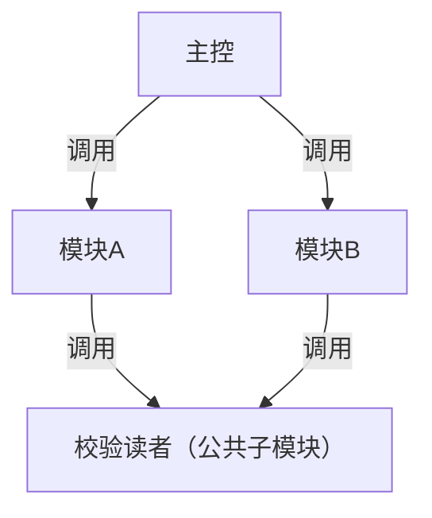
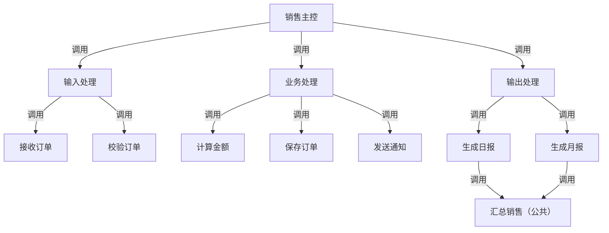

# 习题 - 第6章 结构图优化

本章习题覆盖模块分解与合并原则、扇入扇出与深度宽度控制、结构图优化策略（合并/拆分/提取公共子模块/接口优化）、设计评审检查清单与质量度量。分析题要求对给定 SC 图执行优化并说明依据。

## 知识点覆盖表

| 知识点 | 题号 |
| --- | --- |
| 模块分解与合并原则 | 1、7、11、16、21、26 |
| 扇入扇出与深度宽度 | 2、8、12、17、22、28 |
| 优化策略与手法 | 3、9、13、18、23、29 |
| 接口优化与控制耦合消除 | 4、10、14、19、24 |
| 设计评审检查清单 | 5、15、20、25、30 |
| 质量度量与综合优化 | 6、27、31、32 |

## 一、单选题（每题 2 分，共 10 题）

**1.** 模块分解的基本原则是（  ）。
A. 按功能分解、简化接口
B. 按代码行数平均切分
C. 按开发人员分工
D. 按文件大小拆分

**2.** 模块的扇入是指（  ）。
A. 一个模块调用多少个下级模块
B. 一个模块被多少个上级模块调用
C. 模块的层次深度
D. 模块的代码行数

**3.** 结构图优化的目标是（  ）。
A. 提高内聚、降低耦合、简化结构
B. 增加模块数量
C. 增加层次深度
D. 提高耦合以加快通信

**4.** 若两模块间数据耦合参数过多，较合理的优化是（  ）。
A. 增加更多参数
B. 合并为一个高内聚模块
C. 拆分为更多模块
D. 引入全局变量

**5.** 设计评审检查清单中，"判定所在模块应能控制其判定影响的模块"属于（  ）。
A. 接口检查
B. 结构检查（作用范围≤控制范围）
C. 内聚检查
D. 数据检查

**6.** 下列质量度量指标中，衡量模块内功能相关性的是（  ）。
A. 模块化程度
B. 耦合度
C. 内聚度
D. 扇出

**7.** 模块大小通常建议控制在（  ）。
A. 1-10 行
B. 50-100 行（参考一页纸）
C. 500-1000 行
D. 越大越好

**8.** 理想的扇入扇出形态是（  ）。
A. 顶层扇出大、底层扇入小
B. 顶层扇出适中、底层扇入较大（清真寺形）
C. 高扇出低扇入
D. 层次越深越好

**9.** "拆分低内聚模块"是指（  ）。
A. 将承担多个不相关功能的模块拆为多个功能内聚模块
B. 合并两个模块
C. 增加参数
D. 删除模块

**10.** "消除控制耦合"的常用方法是（  ）。
A. 将控制标志改为数据参数，或拆分被控模块为多个功能内聚模块
B. 增加更多控制标志
C. 使用全局变量
D. 增加模块层次

## 二、多选题（每题 3 分，共 5 题）

**11.** 模块分解应遵循的原则包括（  ）。
A. 按功能分解
B. 简化接口
C. 模块大小适中
D. 随意按行数切分

**12.** 关于扇入扇出，下列说法正确的有（  ）。
A. 扇入大表示复用性好
B. 扇出小表示控制范围合理
C. 高扇出低扇入是不良结构
D. 扇出越大越好

**13.** 结构图优化的主要手法包括（  ）。
A. 合并高耦合模块
B. 拆分低内聚模块
C. 提取公共子模块
D. 接口优化（减少参数、消除控制耦合）

**14.** 接口优化的具体做法包括（  ）。
A. 减少参数数量
B. 消除控制标志
C. 只传递必要数据值
D. 传递整个数据结构以备将来使用

**15.** 设计评审检查清单应包含的维度有（  ）。
A. 内聚耦合检查
B. 接口检查
C. 结构检查（扇出、层次、作用范围）
D. 数据与需求检查（数据流平衡、需求覆盖度）

## 三、判断题（每题 2 分，共 5 题）

**16.** 模块并非越小越好，模块过多会增加接口复杂度与调用开销，应在功能完整性与大小适中之间平衡。

**17.** 扇入大意味着模块被多处复用，复用性好，应鼓励。

**18.** 合并高耦合模块的目的是把耦合过强的两个模块合并为一个高内聚模块。

**19.** 设计评审中"作用范围在控制范围内"指判定所在模块应能控制其判定影响的模块。

**20.** 优化只需关注内聚耦合，无需考虑扇入扇出与深度宽度。

## 四、简答题（每题 6 分，共 4 题）

**21.** 什么是模块的扇入与扇出？理想的扇入扇出形态是怎样的？

**22.** 模块大小应如何控制？为什么模块不宜过大或过小？

**23.** 简述结构图优化的目标与主要手法。

**24.** 设计评审的检查清单应包含哪些内容？质量度量有哪些指标？

## 五、设计题/分析题（每题 8 分，共 4 题）

**25.**（分析题）某初始 SC：顶层模块 `M` 扇出为 10，直接调用 10 个下层模块；其中模块 `A` 与 `B` 间数据耦合参数达 8 个；模块 `C` 同时做查询、统计、导出。请分析问题并给出优化方案。

**26.**（分析题）给定以下模块调用关系：`主控` 调用 `录入`、`校验`、`计算`、`保存`、`查询`、`报表`、`导出`、`日志` 八个模块（扇出 8）。请判断扇出是否合理并给出降低扇出的方案。

**27.**（绘图题）给定初始 SC：`主控` 调用 `模块A`、`模块B`，`模块A` 和 `模块B` 内部都有相同的"校验读者"操作（重复代码）。请用 Mermaid 绘制优化后的 SC（提取公共子模块 `校验读者`，被 A、B 共同调用，提高扇入）。

**28.**（分析题）某 SC 模块 `判定模块` 中包含一个条件判断，其结果影响非其下属的模块 `X` 的执行，需通过层层传递控制标志才能到达 `X`。请指出该结构违反的原则，并给出改进方案。

## 六、综合题/案例题（每题 10 分，共 2 题）

**29.**（综合题）某"销售管理"系统初始 SC 存在以下问题：①顶层 `销售主控` 扇出 9；②`订单处理` 模块同时做接收、校验、计算、保存、通知；③`通知(type)` 由 `type` 标志选短信/邮件分支；④`生成日报` 与 `生成月报` 中含重复的"汇总销售"代码。请：
（1）逐一分析每个问题的优化方向（合并/拆分/提取公共子模块/接口优化）。
（2）用 Mermaid 绘制优化后的 SC（顶层归并为 3-4 个协调模块，订单处理拆分，提取 `汇总销售` 公共子模块）。
（3）说明优化后内聚、耦合、扇入扇出的改善。

**30.**（综合题）阅读以下结构描述，回答问题：
> 模块 `P` 调用 `Q`、`R`、`S`；`Q` 内部判断某条件，条件成立时需调用 `T`，但 `T` 是 `R` 的下属模块，`Q` 无法直接调用 `T`，只能通过 `P` 传控制标志给 `R` 再调 `T`。

（1）指出该结构违反了哪条结构优化原则。
（2）给出至少两种改进方案。
（3）说明该原则对可维护性的意义。

## 答案与解析

### 单选题答案

1-10 题答案与解析

**1. 答案：A**
解析：按功能分解、简化接口是模块分解基本原则。

**2. 答案：B**
解析：扇入指一个模块被多少个上级模块调用。

**3. 答案：A**
解析：优化目标是提高内聚、降低耦合、简化结构。

**4. 答案：B**
解析：参数过多说明耦合过强，可合并为一个高内聚模块。

**5. 答案：B**
解析：作用范围≤控制范围属结构检查。

**6. 答案：C**
解析：内聚度衡量模块内功能相关性。

**7. 答案：B**
解析：模块大小参考 50-100 行（一页纸）。

**8. 答案：B**
解析：理想形态为顶层扇出适中、底层扇入较大（清真寺形）。

**9. 答案：A**
解析：拆分低内聚模块即把承担多不相关功能的模块拆为功能内聚模块。

**10. 答案：A**
解析：将控制标志改为数据参数或拆分被控模块为功能内聚模块可消除控制耦合。

### 多选题答案

11-15 题答案与解析

**11. 答案：ABC**
解析：按功能分解、简化接口、大小适中；D 随意切分错误。

**12. 答案：ABC**
解析：扇入大复用好、扇出小控制合理、高扇出低扇入不良；D 错误。

**13. 答案：ABCD**
解析：四种手法均属优化主要手法。

**14. 答案：ABC**
解析：减少参数、消除控制标志、只传必要数据值；D 传整个结构是标记耦合，应避免。

**15. 答案：ABCD**
解析：四维度均属评审检查清单。

### 判断题答案

16-20 题答案与解析

**16. 答案：√**
解析：模块过小会导致数量膨胀、调用开销增大，需平衡。

**17. 答案：√**
解析：扇入大表示复用性好，应鼓励。

**18. 答案：√**
解析：合并高耦合模块使其成为高内聚模块。

**19. 答案：√**
解析：作用范围≤控制范围指判定模块能控制其影响模块。

**20. 答案：×**
解析：优化也需考虑扇入扇出、深度宽度等结构形态。

### 简答题答案

21-24 题参考答案

**21.** 扇入指一个模块被多少个上级模块调用，扇入大表示复用性好；扇出指一个模块调用多少个下级模块，扇出小表示控制范围合理。理想形态是"顶层扇出适中、底层扇入较大"——呈清真寺形（顶部小、中部宽、底部收敛），顶层扇出一般不超过 7，底层公共模块扇入较大以提升复用。应避免高扇出低扇入的倒三角或层次过深的细长条。

**22.** 模块大小通常以代码行数参考，一般控制在 50-100 行（一页纸）。模块过大意味着职责过多、内聚度低、难理解测试维护，应分解为更小子模块；模块过小则模块数量膨胀、层次过深、调用开销增大、结构碎片化。应在功能完整性与大小适中间平衡——以"一个模块完成一个明确功能"为准。

**23.** 目标：提高内聚、降低耦合、简化结构，使模块独立性最强、结构最清晰。主要手法：①合并高耦合模块；②拆分低内聚模块；③提取公共子模块提高扇入与复用；④接口优化（减少参数、消除控制耦合）；⑤结构优化（减少不必要层次、平衡扇出）。

**24.** 检查清单：①内聚耦合——是否高内聚低耦合，有无内容/控制/公共耦合；②接口——参数数量是否合理、有无冗余、与 DFD 数据流一致；③结构——扇出是否过大、层次是否过深、扇入是否充分利用、作用范围≤控制范围；④数据与需求——数据流父子图平衡、数据字典完备、需求覆盖度。质量度量指标：模块化程度（数量与大小分布）、耦合度（模块间依赖强度）、内聚度（模块内功能相关性）。

### 设计题/分析题答案

25-28 题参考答案

**25.** 问题与优化：①顶层扇出 10 过大（一般≤7），模块职责过重——将相关下层模块归并为若干中间协调模块（如"输入处理组"、"输出处理组"）降低扇出；②A、B 间参数 8 个过多，耦合过强——可将 A、B 合并为一个高内聚模块，或简化接口只传必要数据；③C 同时做查询、统计、导出属低内聚——拆分为 `查询`、`统计`、`导出` 三个功能内聚模块。

**26.** 扇出 8 偏大（一般≤7），不够合理。降低扇出方案：按功能分组归并——将"录入、校验"归入"输入处理"协调模块，将"计算、保存"归入"业务处理"协调模块，将"查询、报表、导出"归入"输出处理"协调模块，"日志"作为底层公共模块被各组调用。顶层扇出降为 3（输入、业务、输出），各组内部扇出适中。

**27.** 优化后 SC（提取公共子模块 `校验读者`）：

说明：`校验读者` 被模块 A、B 共同调用，扇入=2，消除重复代码，提高复用。

**28.** 违反"作用范围≤控制范围"原则——判定结果影响了非下属模块 X，需层层传递控制标志（控制耦合且路径长）。改进方案：①将判定模块下移，使 X 成为其下属模块（调整结构使作用范围落在控制范围内）；②或将判定逻辑上移到能同时控制判定模块与 X 的公共上层模块；③或将 X 上移为判定模块的兄弟模块由共同上层调用。目的是消除长距离控制标志传递。

### 综合题答案

29-30 题参考答案

**29.**
（1）优化方向：①顶层扇出 9 过大——结构优化，归并为"输入处理"、"业务处理"、"输出处理"等协调模块降低扇出；②`订单处理` 低内聚（多职责）——拆分为 `接收订单`、`校验订单`、`计算金额`、`保存订单`、`发送通知` 功能内聚模块；③`通知(type)` 控制耦合——拆分为 `发短信`、`发邮件` 两模块，消除控制标志（接口优化）；④`生成日报/月报` 重复"汇总销售"代码——提取公共子模块 `汇总销售`，扇入增大（提取公共子模块）。
（2）优化后 SC：

（3）改善：内聚——各模块达功能内聚；耦合——消除控制耦合、以数据耦合为主；扇入扇出——顶层扇出降为 3、`汇总销售` 扇入=2 提升复用。

**30.**
（1）违反"作用范围≤控制范围"原则——Q 中的判定影响 R 的下属 T，作用范围超出 Q 的控制范围，需长距离传控制标志。
（2）改进方案：①将 T 上移为 P 的直属下属，由 P 根据 Q 返回结果直接调用 T（把受影响模块移到判定模块的上级控制范围内）；②将判定逻辑上移到 P，由 P 统一决定是否调用 T；③将 T 移到 Q 的下属模块使 Q 直接控制（调整结构使作用范围落在控制范围内）。
（3）意义：避免长距离传递控制标志（消除控制耦合与层层传参），使判定与其影响的模块在同一控制范围内，修改判定逻辑时影响局部化，提升可维护性与可理解性。

## 考点统计表

| 题型 | 题数 | 分值 | 覆盖知识点 |
| --- | --- | --- | --- |
| 单选题 | 10 | 20 | 分解原则、扇入、优化目标、合并、检查清单、度量、大小、形态、拆分、消除控制耦合 |
| 多选题 | 5 | 15 | 分解原则、扇入扇出、优化手法、接口优化、检查清单维度 |
| 判断题 | 5 | 10 | 模块大小、扇入、合并、作用范围、优化范围 |
| 简答题 | 4 | 24 | 扇入扇出、模块大小、优化手法、检查清单与度量 |
| 设计题/分析题 | 4 | 32 | 多问题优化、降扇出、提取公共子模块绘图、作用范围越界 |
| 综合题/案例题 | 2 | 20 | 销售系统综合优化绘图、作用范围越界改进 |
| 合计 | 30 | 121 | 第6章全部核心知识点 |

## 关联

- 上一级：[[MOC - 结构化软件设计]]
- 本章知识点：[[6.1 模块分解与合并原则]]、[[6.2 结构图优化策略]]、[[6.3 设计评审与质量度量]]
- 上一章习题：[[习题-第5章-事务流设计]]
- 下一章习题：[[习题-第7章-数据概要设计]]
