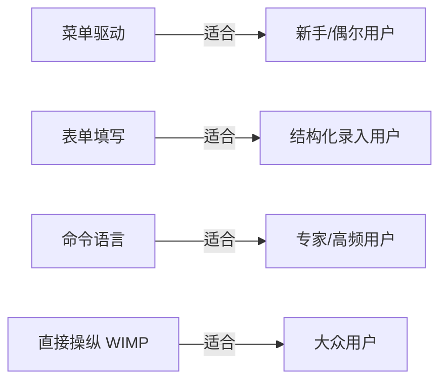

# 习题 - 第8章 界面概要设计

本章习题覆盖 Shneiderman 八条界面设计黄金法则、四种界面类型与选择、交互方式、可用性五要素与界面评估方法。要求在理解原则的基础上辨析界面类型适用场景并选择评估方法。

## 知识点覆盖表

| 知识点 | 题号 |
| --- | --- |
| 人机界面设计五原则 | 1、7、11、16、21 |
| Shneiderman 八条黄金法则 | 2、8、12、17、22、28 |
| 用户类型与概念/实现模型 | 3、9、13、18、23 |
| 四种界面类型与选择 | 4、10、14、19、24、29 |
| 交互方式与界面评估方法 | 5、15、20、25、30 |
| 可用性五要素与综合 | 6、26、27、31、32 |

## 一、单选题（每题 2 分，共 10 题）

**1.** 下列属于人机界面设计五原则的是（  ）。
A. 一致性
B. 高内聚
C. 模块化
D. 数据流驱动

**2.** Shneiderman 八条黄金法则中"允许撤销误操作"对应的是（  ）。
A. 一致性
B. 快捷方式
C. 提供错误处理与撤销
D. 减少短期记忆

**3.** 用户对系统"是什么、如何工作"的心智模型是（  ）。
A. 系统实现模型
B. 用户概念模型
C. 数据模型
D. 控制流模型

**4.** 下列界面类型中，最适合专家与高频任务的是（  ）。
A. 菜单驱动
B. 表单填写
C. 命令语言
D. 直接操纵

**5.** 由少数专家依据可用性启发式规则走查界面的评估方法是（  ）。
A. 用户测试
B. 启发式评估
C. 认知走查
D. 黑盒测试

**6.** 可用性五要素中，"用户能否完成预定任务"指的是（  ）。
A. 效率
B. 有效性
C. 满意度
D. 易学性

**7.** "相似操作用相似界面元素与术语"体现的设计原则是（  ）。
A. 反馈性
B. 一致性
C. 用户控制
D. 容错性

**8.** Shneiderman 法则中"对用户操作即时响应"属于（  ）。
A. 信息反馈
B. 对话框收尾
C. 控制流
D. 一致性

**9.** 设计者/实现者对系统内部结构与运行机制的认识是（  ）。
A. 用户概念模型
B. 系统实现模型
C. 业务模型
D. 数据流模型

**10.** 用窗口、图标、菜单、指针拖拽操作可视化对象的界面类型是（  ）。
A. 菜单驱动
B. 表单填写
C. 命令语言
D. 直接操纵（WIMP）

## 二、多选题（每题 3 分，共 5 题）

**11.** 人机界面设计五原则包括（  ）。
A. 一致性
B. 反馈性
C. 用户控制
D. 减少记忆负担与容错性

**12.** Shneiderman 八条黄金法则包括（  ）。
A. 一致性
B. 快捷方式
C. 信息反馈
D. 减少短期记忆

**13.** 用户类型通常分为（  ）。
A. 新手
B. 熟练用户
C. 专家
D. 系统管理员

**14.** 四种界面类型包括（  ）。
A. 菜单驱动
B. 表单填写
C. 命令语言
D. 直接操纵

**15.** 界面评估的三种主要方法包括（  ）。
A. 启发式评估
B. 用户测试
C. 认知走查
D. 单元测试

## 三、判断题（每题 2 分，共 5 题）

**16.** 一致性要求相似操作用相似界面元素与术语，如所有"删除"都用红色按钮。

**17.** 用户概念模型与系统实现模型的差距越大，界面越难用。

**18.** 命令语言界面学习成本低、不易出错，最适合新手用户。

**19.** 认知走查由评估者按任务步骤模拟用户认知过程，专长于发现学习与探索障碍。

**20.** 可用性的效率指用户完成预定任务的能力（能否完成）。

## 四、简答题（每题 6 分，共 4 题）

**21.** 简述人机界面设计的五项基本原则，并各举一例说明。

**22.** 列举 Shneiderman 八条界面设计黄金法则。

**23.** 对比用户概念模型与系统实现模型，说明二者差距为何是界面设计的关键问题。

**24.** 对比菜单驱动、表单填写、命令语言、直接操纵四种界面类型的特点与适用场景。

## 五、设计题/分析题（每题 8 分，共 4 题）

**25.**（分析题）某银行系统要求客户频繁输入账号、金额，操作频率高且客户多为熟练用户。请从四种界面类型中选择最合适的，并说明理由。

**26.**（分析题）某系统界面要求用户记住大量命令参数才能操作，且无撤销功能、误操作后无法恢复。请指出其违反了 Shneiderman 哪几条法则，并给出改进建议。

**27.**（分析题）某团队拟对新界面做评估，预算有限、希望快速发现广泛问题，且能补充学习探索障碍。请推荐评估方法组合并说明理由。

**28.**（绘图题）请用 Mermaid 绘制四种界面类型与适用用户类型的对应关系图。

## 六、综合题/案例题（每题 10 分，共 2 题）

**29.**（综合题）某"图书馆查询终端"面向大众用户，需求：按书名/作者/ISBN 查询图书，显示馆藏位置与可借状态。请完成：
（1）选择最合适的界面类型并说明理由。
（2）针对该界面列出至少三条 Shneiderman 法则的具体落实。
（3）说明该界面如何体现可用性五要素中的"易学性"与"有效性"。

**30.**（综合题）阅读以下界面设计描述，回答问题：
> 界面 A：所有保存按钮统一为 Ctrl+S，删除前弹窗确认，操作后显示状态提示，长任务可取消。
> 界面 B：不同模块的保存按钮位置与颜色各异，删除直接执行无确认，操作无反馈，长任务不可中断。

（1）分别指出界面 A、B 体现或违反的设计原则。
（2）从可用性五要素角度比较两个界面。
（3）为界面 B 提出改进方案。

## 答案与解析

### 单选题答案

1-10 题答案与解析

**1. 答案：A**
解析：一致性属界面设计五原则；B、C 属模块设计；D 属分析方法。

**2. 答案：C**
解析：撤销属错误处理与撤销法则。

**3. 答案：B**
解析：用户心智模型为用户概念模型。

**4. 答案：C**
解析：命令语言灵活高效适合专家与高频任务。

**5. 答案：B**
解析：专家依据启发式规则走查为启发式评估。

**6. 答案：B**
解析：有效性指能否完成预定任务；效率指完成速度。

**7. 答案：B**
解析：相似操作用相似元素属一致性。

**8. 答案：A**
解析：即时响应属信息反馈。

**9. 答案：B**
解析：实现者对内部的认识为系统实现模型。

**10. 答案：D**
解析：WIMP（窗口/图标/菜单/指针）为直接操纵。

### 多选题答案

11-15 题答案与解析

**11. 答案：ABCD**
解析：五原则为一致性、反馈性、用户控制、减少记忆负担、容错性。

**12. 答案：ABCD**
解析：八条法则含一致性、快捷方式、信息反馈、对话框收尾、错误处理与撤销、控制流、减少短期记忆等。

**13. 答案：ABC**
解析：用户分新手、熟练用户、专家；系统管理员非用户类型分类维度。

**14. 答案：ABCD**
解析：四种界面类型均正确。

**15. 答案：ABC**
解析：三种评估方法；单元测试属软件测试非界面评估。

### 判断题答案

16-20 题答案与解析

**16. 答案：√**
解析：一致性要求相似操作用相似元素。

**17. 答案：√**
解析：差距越大用户越难映射心智模型到操作。

**18. 答案：×**
解析：命令语言学习成本高、易出错，适合专家而非新手。

**19. 答案：√**
解析：认知走查模拟用户认知过程发现学习障碍。

**20. 答案：×**
解析：效率指完成速度；能否完成任务是有效性。

### 简答题答案

21-24 题参考答案

**21.** ①一致性——相似操作用相似元素与术语，如所有删除用红色按钮；②反馈性——对操作即时响应，如点击后显示"处理中"；③用户控制——把控制权交用户，允许中断、撤销、自定义；④减少记忆负担——提供可见选项与提示，如菜单列出可选命令；⑤容错性——对误操作宽容，提供确认、撤销与友好错误信息。

**22.** 八条黄金法则：①一致性；②快捷方式；③信息反馈；④对话框收尾；⑤错误处理与撤销；⑥允许撤销（撤销）；⑦控制流（用户控制）；⑧减少短期记忆。（不同教材表述略有差异，核心为一致性、快捷方式、反馈、错误处理与撤销、减少记忆等。）

**23.** 用户概念模型是用户对系统"是什么、如何工作"的心智模型，源于经验与任务理解；系统实现模型是设计者/实现者对内部结构与机制的认识。差距越大，用户越难把心智模型映射到界面操作，界面越难用。界面设计应构造"表现模型"贴近用户概念模型，隐藏实现细节，缩小认知与机制间鸿沟。

**24.** ①菜单驱动：列出可选项供选择，学习成本低、适合新手与偶尔用户，缺点是选项多时层级深效率低；②表单填写：表格形式录入字段，适合结构化数据录入（登记、申报），缺点是字段多时易疲劳；③命令语言：键入命令与参数，灵活高效、适合专家与高频任务，缺点是学习成本高、易出错；④直接操纵（WIMP）：拖拽可视化对象，直观易学、反馈即时，适合大众用户，缺点是复杂逻辑表达受限。选择依据用户类型、任务频率、错误代价与学习成本。

### 设计题/分析题答案

25-28 题参考答案

**25.** 选择**命令语言**或带快捷键的**表单填写**。理由：操作频率高、用户为熟练用户，对效率要求高；命令语言（或快捷键）灵活高效、适合专家与高频任务，可快速输入账号金额。若考虑准确性可结合表单填写+快捷键，既保证结构化输入又提高效率。不适合菜单驱动（效率低）、直接操纵（输入字段多时繁琐）。

**26.** 违反法则：①要求用户记住大量命令参数——违反"减少短期记忆"法则；②无撤销功能——违反"错误处理与撤销"法则；③误操作无法恢复——违反"错误处理"与"用户控制"；④无反馈——违反"信息反馈"法则。改进：①提供菜单/提示/默认值减少记忆负担；②增加撤销功能；③删除等危险操作前确认；④操作后给予状态反馈。

**27.** 推荐组合：**启发式评估 + 认知走查**。理由：预算有限、希望快速发现广泛问题——启发式评估由少数专家依据启发式规则走查，成本低、发现面广；需补充学习探索障碍——认知走查按任务步骤模拟用户认知过程，专长于发现学习与探索障碍。两者组合可在低成本下兼顾广度与认知盲点。如有余力可对关键任务再做小规模用户测试验证。

**28.** 界面类型与用户类型对应图：

### 综合题答案

29-30 题参考答案

**29.**
（1）选择**直接操纵（WIMP）**或**菜单驱动+表单填写**组合。理由：面向大众用户，直接操纵直观易学、反馈即时（点击图书图标查看状态），菜单+表单便于按书名/作者/ISBN 输入查询条件。
（2）Shneiderman 法则落实：①一致性——所有查询入口布局与按钮位置统一；②信息反馈——查询后即时显示馆藏位置与可借状态；③错误处理与撤销——输入无效 ISBN 时友好提示并允许重新输入；④减少短期记忆——提供查询历史与可见选项。
（3）易学性：大众用户无需培训即可上手（直接操纵直观）；有效性：用户能完成查询图书位置与状态的任务（任务完成率高）。

**30.**
（1）界面 A 体现：一致性（Ctrl+S 统一）、错误处理与撤销（删除前确认）、信息反馈（状态提示）、用户控制（长任务可取消）。界面 B 违反：一致性（保存按钮位置颜色不一）、错误处理（删除无确认）、信息反馈（无反馈）、用户控制（长任务不可中断）。
（2）A 在效率、有效性、满意度、易学性、容错性均优于 B；B 因无反馈与无确认易误操作，容错性差、满意度低、效率低。
（3）改进 B：①统一保存按钮位置颜色与快捷键；②删除前弹窗确认并支持撤销；③操作后显示状态提示；④长任务提供取消按钮；⑤遵循一致性、反馈、容错原则。

## 考点统计表

| 题型 | 题数 | 分值 | 覆盖知识点 |
| --- | --- | --- | --- |
| 单选题 | 10 | 20 | 五原则、Shneiderman 法则、概念/实现模型、界面类型、评估方法、可用性要素 |
| 多选题 | 5 | 15 | 五原则、八条法则、用户类型、界面类型、评估方法 |
| 判断题 | 5 | 10 | 一致性、模型差距、命令语言适用、认知走查、效率有效性 |
| 简答题 | 4 | 24 | 五原则、八条法则、概念/实现模型、四种界面类型 |
| 设计题/分析题 | 4 | 32 | 界面类型选择、法则违反改进、评估方法组合、类型对应图 |
| 综合题/案例题 | 2 | 20 | 图书查询终端界面设计、两界面对比改进 |
| 合计 | 30 | 121 | 第8章全部核心知识点 |

## 关联

- 上一级：[[MOC - 结构化软件设计]]
- 本章知识点：[[8.1 人机界面设计原则与模型]]、[[8.2 界面类型与交互方式]]、[[8.3 界面设计评估与可用性]]
- 上一章习题：[[习题-第7章-数据概要设计]]
- 下一章习题：[[习题-第9章-详细设计工具]]
