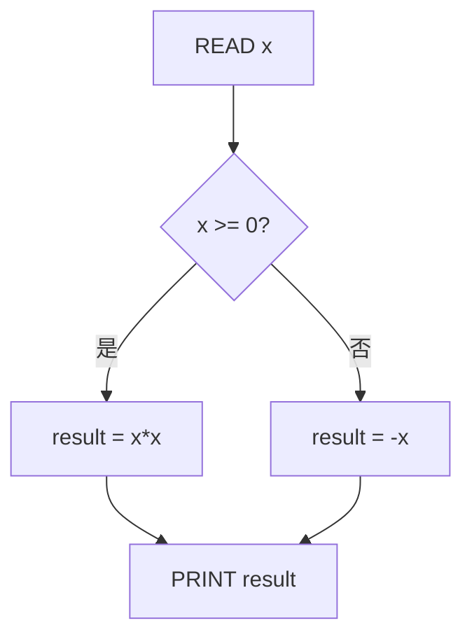
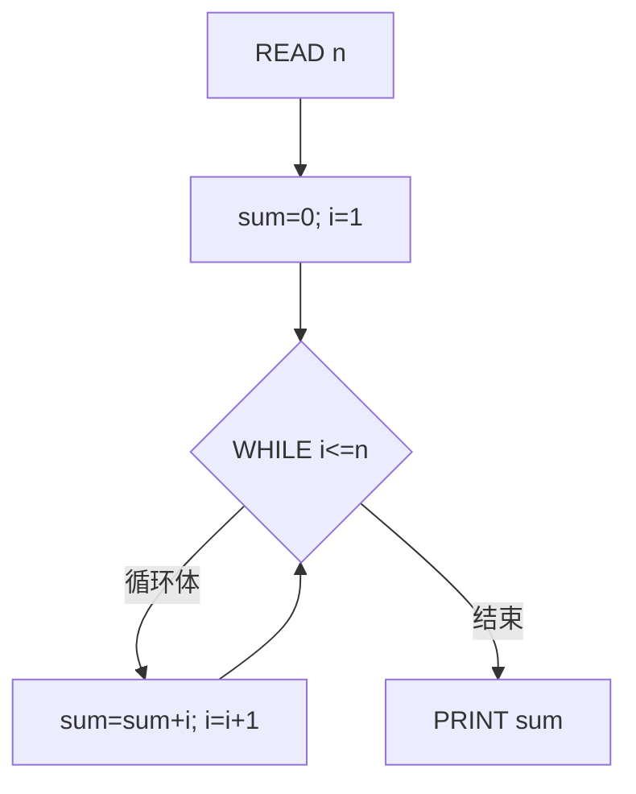
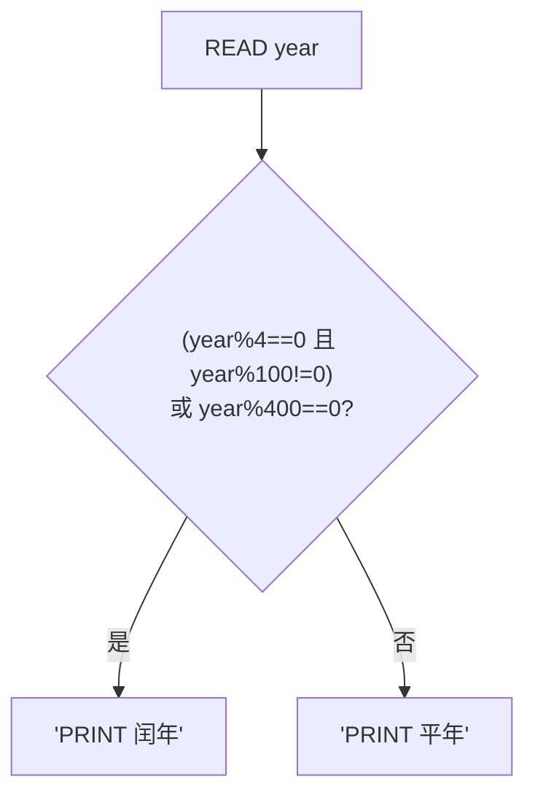
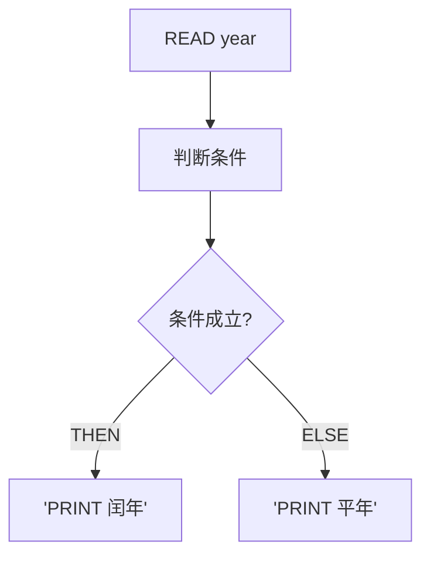

# 习题 - 第9章 详细设计工具

本章习题覆盖程序流程图符号、N-S 图基本结构、PAD 图树形表示、PDL 伪代码语法、判定表与判定树。设计题要求用 N-S 图和 PAD 图（Mermaid 近似表示）表达给定算法，并完成判定表的化简。

## 知识点覆盖表

| 知识点 | 题号 |
| --- | --- |
| 程序流程图符号与基本控制结构 | 1、7、11、16、21 |
| N-S 图特点与基本结构 | 2、8、12、17、22、26 |
| PAD 图树形结构与 PDL 语法 | 3、9、13、18、23、27 |
| 流程图与 N-S 图对比 | 4、10、14、19、24 |
| 判定表组成与化简 | 5、15、20、25、28 |
| 判定树与综合应用 | 6、29、30、31、32 |

## 一、单选题（每题 2 分，共 10 题）

**1.** 程序流程图中，表示开始/结束的符号是（  ）。
A. 矩形
B. 菱形
C. 椭圆（起止框）
D. 平行四边形

**2.** N-S 图（盒图）的特点是（  ）。
A. 有流程线
B. 无流程线、嵌套盒表示控制结构、强制结构化
C. 用树形展开
D. 用伪代码表示

**3.** PAD 图（问题分析图）的结构特点是（  ）。
A. 流程线连接
B. 树形结构，顺序纵向、选择/循环横向分支
C. 表格形式
D. 环形

**4.** 下列关于程序流程图与 N-S 图的对比，正确的是（  ）。
A. 流程图强制结构化，N-S 图不强制
B. 流程图灵活但易滥用 goto，N-S 图强制结构化但复杂逻辑绘制繁琐
C. 二者完全相同
D. N-S 图有流程线

**5.** 判定表的四个组成部分是（  ）。
A. 条件桩、条件项、动作桩、动作项
B. 输入、处理、输出、存储
C. 模块、调用、数据、控制
D. 实体、属性、联系、键

**6.** 下列适合用判定树而非判定表表达的场景是（  ）。
A. 条件多且组合复杂
B. 条件有层次顺序、需直观展示判断流程
C. 大量数据查询
D. 模块结构设计

**7.** 程序流程图中，表示条件判断的符号是（  ）。
A. 椭圆
B. 矩形
C. 菱形（判断框）
D. 平行四边形

**8.** 三种基本控制结构是（  ）。
A. 顺序、选择、循环
B. 顺序、分支、跳转
C. 输入、处理、输出
D. 顺序、调用、返回

**9.** PDL 中 `WHILE 条件 DO 动作 ENDDO` 对应 PAD 图的（  ）。
A. 顺序框
B. 选择框
C. 循环框
D. 判断框

**10.** 结构化设计限制 goto 是因为（  ）。
A. goto 提高效率
B. goto 滥用产生面条代码，难以阅读维护
C. goto 是非法的
D. goto 必须使用

## 二、多选题（每题 3 分，共 5 题）

**11.** 程序流程图的基本符号包括（  ）。
A. 起止框（椭圆）
B. 处理框（矩形）
C. 判断框（菱形）
D. 输入输出框（平行四边形）

**12.** N-S 图能表达的基本控制结构包括（  ）。
A. 顺序
B. 选择（IF-THEN-ELSE）
C. 循环（WHILE/UNTIL）
D. 随意跳转（goto）

**13.** PDL 常用的语法结构包括（  ）。
A. IF-THEN-ELSE
B. WHILE-DO
C. REPEAT-UNTIL
D. CASE

**14.** 关于程序流程图与 N-S 图，下列说法正确的有（  ）。
A. 流程图有流程线
B. N-S 图无流程线
C. N-S 图强制结构化
D. 流程图易滥用 goto

**15.** 判定表分为（  ）。
A. 有限条目判定表（条件项取真/假）
B. 扩展条目判定表（条件项可取多值）
C. 顺序判定表
D. 循环判定表

## 三、判断题（每题 2 分，共 5 题）

**16.** 程序流程图的基本符号包括起止框、处理框、判断框、输入输出框和流程线。

**17.** N-S 图通过去除流程线从机制上保证结构化，无法表达随意跳转。

**18.** PAD 图的顺序结构纵向展开，选择/循环结构横向分支，最左纵向主干为程序主线。

**19.** 判定表中两列条件项仅某一条件取值不同而动作完全相同时，可将该条件视为无关（用"—"表示）合并为一列。

**20.** PDL 与 PAD 图不可相互转换，二者无对应关系。

## 四、简答题（每题 6 分，共 4 题）

**21.** 简述程序流程图的基本符号与三种基本控制结构，并说明结构化设计为何限制 goto。

**22.** 对比程序流程图与 N-S 图的特点。

**23.** 说明 PAD 图的树形结构特点，并写出对应 IF-THEN-ELSE 与 WHILE 循环的 PDL 伪代码。

**24.** 什么是判定表？说明其四个组成部分，并简述判定表化简的方法。

## 五、设计题/分析题（每题 8 分，共 4 题）

**25.**（设计题）给定算法：输入一个数 `x`，若 `x≥0` 则输出 `x` 的平方，否则输出 `x` 的绝对值。请用 PDL 伪代码表示，并用 Mermaid 近似绘制 N-S 盒图结构（用嵌套矩形表示选择）。

**26.**（设计题）给定算法：输入 `n`，求 1 到 n 的累加和 `sum`（用 WHILE 循环）。请用 PDL 表示，并用 Mermaid 近似绘制 PAD 树形结构（横向分支表示循环）。

**27.**（设计题）给定判定表（部分），条件 `C1`、`C2`，动作 `A1`、`A2`，规则如下：规则1（C1=Y, C2=Y）→A1；规则2（C1=Y, C2=N）→A1；规则3（C1=N, C2=Y）→A2；规则4（C1=N, C2=N）→A2。请化简该判定表（合并无关条件列）。

**28.**（设计题）给定算法：根据学生 `score`：`score≥90` 输出"优"；`80≤score<90` 输出"良"；`60≤score<80` 输出"及格"；`score<60` 输出"不及格"。请用 PDL 的 CASE 结构表示。

## 六、综合题/案例题（每题 10 分，共 2 题）

**29.**（综合题）"判断闰年"算法：能被 4 整除但不能被 100 整除，或能被 400 整除的年份是闰年。请完成：
（1）用 PDL 伪代码写出算法。
（2）用 Mermaid 近似绘制 N-S 图结构。
（3）用 Mermaid 近似绘制 PAD 树形结构。

**30.**（综合题）某"运费计算"判定逻辑：重量 `w`、距离 `d`。
- 若 `w<10` 且 `d<100`：运费=10
- 若 `w<10` 且 `d≥100`：运费=15
- 若 `w≥10` 且 `d<100`：运费=20
- 若 `w≥10` 且 `d≥100`：运费=25
请完成：
（1）画出判定表（条件桩、条件项、动作桩、动作项）。
（2）判断是否能化简（说明理由）。
（3）用 PDL 的 IF-THEN-ELSE 结构表示该逻辑。

## 答案与解析

### 单选题答案

<details>
<summary>1-10 题答案与解析</summary>

**1. 答案：C**
解析：起止框为椭圆。

**2. 答案：B**
解析：N-S 图无流程线、嵌套盒、强制结构化。

**3. 答案：B**
解析：PAD 图树形结构，顺序纵向、选择/循环横向。

**4. 答案：B**
解析：流程图灵活易滥用 goto，N-S 图强制结构化但绘制繁琐。

**5. 答案：A**
解析：判定表四部分为条件桩、条件项、动作桩、动作项。

**6. 答案：B**
解析：判定树适合条件有层次顺序、需直观展示判断流程。

**7. 答案：C**
解析：判断框为菱形。

**8. 答案：A**
解析：三种基本结构为顺序、选择、循环。

**9. 答案：C**
解析：WHILE-DO 对应 PAD 循环框。

**10. 答案：B**
解析：goto 滥用产生面条代码难以维护。
</details>

### 多选题答案

<details>
<summary>11-15 题答案与解析</summary>

**11. 答案：ABCD**
解析：四种符号均正确。

**12. 答案：ABC**
解析：N-S 图表达顺序、选择、循环；不能表达 goto（强制结构化）。

**13. 答案：ABCD**
解析：四种 PDL 结构均正确。

**14. 答案：ABCD**
解析：四项对比均正确。

**15. 答案：AB**
解析：判定表分有限条目与扩展条目两类。
</details>

### 判断题答案

<details>
<summary>16-20 题答案与解析</summary>

**16. 答案：√**
解析：基本符号描述正确。

**17. 答案：√**
解析：N-S 图无流程线保证结构化。

**18. 答案：√**
解析：PAD 顺序纵向、选择循环横向，主干为程序主线。

**19. 答案：√**
解析：动作相同时可合并无关条件列。

**20. 答案：×**
解析：PAD 与 PDL 一一对应可相互转换。
</details>

### 简答题答案

<details>
<summary>21-24 题参考答案</summary>

**21.** 基本符号：起止框（椭圆）、处理框（矩形）、判断框（菱形）、输入输出框（平行四边形）、流程线（箭头）。三种基本控制结构：顺序、选择（IF-THEN-ELSE）、循环（WHILE/UNTIL）。限制 goto 因 goto 滥用产生面条代码、控制流随意跳转、难以阅读维护；限制后只用三种基本结构组合，保证单入口单出口、层次清晰。

**22.** 程序流程图用流程线连接各框，灵活直观能表达任意控制流，但流程线随意、易滥用 goto、可读性差。N-S 图用嵌套盒表达控制结构，无流程线、强制结构化、层次清晰、易于由图直接编码；缺点是复杂逻辑绘制繁琐、修改不便。N-S 图通过去除流程线从机制上保证结构化，更适合详细设计。

**23.** PAD 图以树形结构表达程序逻辑：顺序结构纵向展开（自上而下）、选择与循环结构横向分支（条件在上、动作在下或右侧），最左纵向主干为程序主线，符合结构化与逐步求精。PDL：IF-THEN-ELSE 写为 `IF 条件 THEN 动作1 ELSE 动作2 ENDIF`；WHILE 循环写为 `WHILE 条件 DO 动作 ENDDO`。PAD 选择分支对应 IF-THEN-ELSE，循环框对应 WHILE-DO，可相互转换。

**24.** 判定表是用表格表达多条件组合与对应动作的工具。四部分：①条件桩——列出所有条件；②条件项——每列给出各条件取值；③动作桩——列出所有可能动作；④动作项——每列标记该条件组合下应执行的动作。化简方法：若两列条件项仅某一条件取值不同（一真一假）而动作完全相同，将该条件视为"无关"（用"—"表示）合并为一列，表示该条件不影响动作，从而减少规则数。
</details>

### 设计题/分析题答案

<details>
<summary>25-28 题参考答案</summary>

**25.** PDL：
```text
READ x
IF x >= 0 THEN
    result = x * x
ELSE
    result = -x
ENDIF
PRINT result
```
N-S 盒图（Mermaid 近似，用嵌套子图表示选择盒）：



**26.** PDL：
```text
READ n
sum = 0
i = 1
WHILE i <= n DO
    sum = sum + i
    i = i + 1
ENDDO
PRINT sum
```
PAD 树形结构（Mermaid 近似，循环框用横向分支表示）：



**27.** 化简：规则1与规则2动作均为 A1，仅 C2 不同（Y/N），故 C2 为无关条件，合并为一列（C1=Y, C2=—→A1）；规则3与规则4动作均为 A2，仅 C2 不同，合并（C1=N, C2=—→A2）。化简后：

| 条件 | 规则1 | 规则2 |
| --- | --- | --- |
| C1 | Y | N |
| C2 | — | — |
| A1 | √ |  |
| A2 |  | √ |

**28.** PDL（CASE 结构）：
```text
READ score
CASE OF score
    score >= 90: PRINT "优"
    score >= 80 AND score < 90: PRINT "良"
    score >= 60 AND score < 80: PRINT "及格"
    score < 60: PRINT "不及格"
ENDCASE
```
</details>

### 综合题答案

<details>
<summary>29-30 题参考答案</summary>

**29.**
（1）PDL：
```text
READ year
IF (year MOD 4 == 0 AND year MOD 100 != 0) OR (year MOD 400 == 0) THEN
    PRINT "闰年"
ELSE
    PRINT "平年"
ENDIF
```
（2）N-S 图（Mermaid 近似）：



（3）PAD 树形结构（Mermaid 近似）：



**30.**
（1）判定表：

| 条件 | 规则1 | 规则2 | 规则3 | 规则4 |
| --- | --- | --- | --- | --- |
| w<10 | Y | Y | N | N |
| d<100 | Y | N | Y | N |
| 运费=10 | √ |  |  |  |
| 运费=15 |  | √ |  |  |
| 运费=20 |  |  | √ |  |
| 运费=25 |  |  |  | √ |

（2）不能化简。四条规则两两动作各不相同（10/15/20/25），没有动作相同的列可合并，每个条件都影响结果，无无关条件。
（3）PDL：
```text
IF w < 10 THEN
    IF d < 100 THEN
        运费 = 10
    ELSE
        运费 = 15
    ENDIF
ELSE
    IF d < 100 THEN
        运费 = 20
    ELSE
        运费 = 25
    ENDIF
ENDIF
```
</details>

## 考点统计表

| 题型 | 题数 | 分值 | 覆盖知识点 |
| --- | --- | --- | --- |
| 单选题 | 10 | 20 | 流程图符号、N-S 特点、PAD 结构、对比、判定表组成、判定树、判断框、控制结构、PDL 对应、goto |
| 多选题 | 5 | 15 | 流程图符号、N-S 结构、PDL 语法、流程图对比、判定表分类 |
| 判断题 | 5 | 10 | 流程图符号、N-S 结构化、PAD 结构、判定表化简、PAD-PDL 转换 |
| 简答题 | 4 | 24 | 流程图符号与 goto、流程图与 N-S 对比、PAD 与 PDL、判定表 |
| 设计题/分析题 | 4 | 32 | PDL+N-S、PDL+PAD、判定表化简、CASE 结构 |
| 综合题/案例题 | 2 | 20 | 闰年算法三种工具、运费判定表与 PDL |
| 合计 | 30 | 121 | 第9章全部核心知识点 |

## 关联

- 上一级：[[MOC - 结构化软件设计]]
- 本章知识点：[[9.1 程序流程图与N-S图]]、[[9.2 PAD图与伪代码（PDL）]]、[[9.3 判定表与判定树]]
- 上一章习题：[[习题-第8章-界面概要设计]]
- 下一章习题：[[习题-第10章-结构化设计综合案例]]
