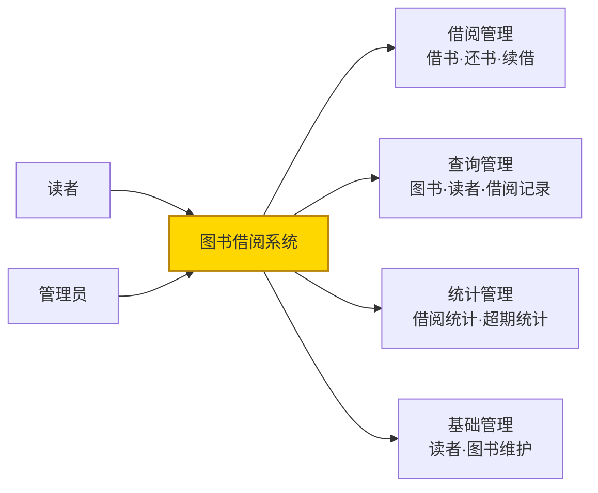
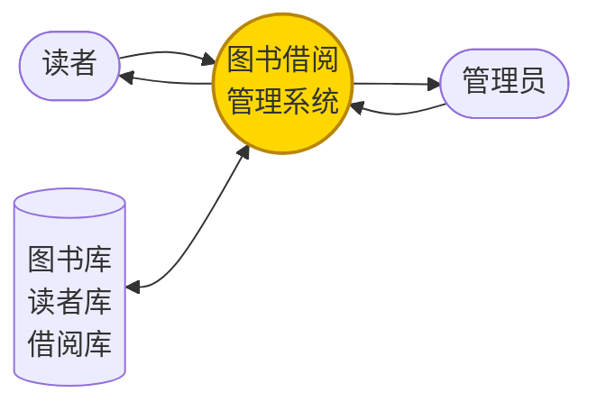
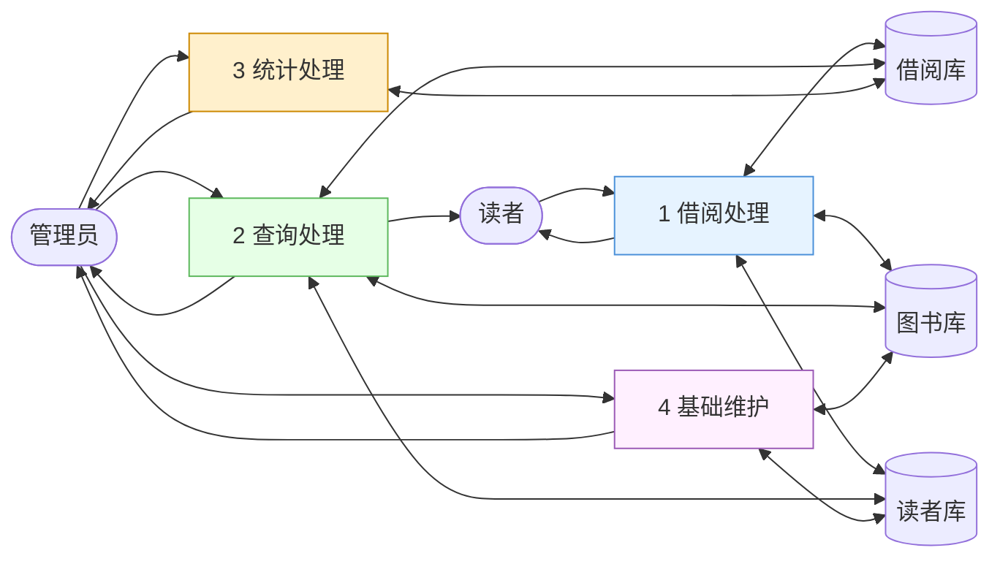
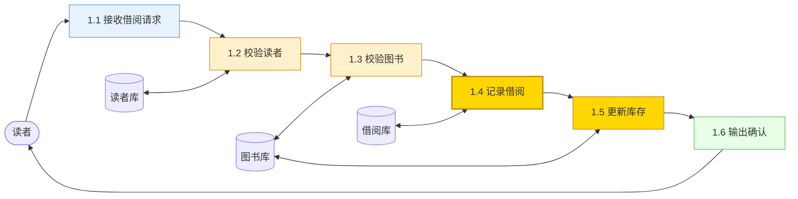
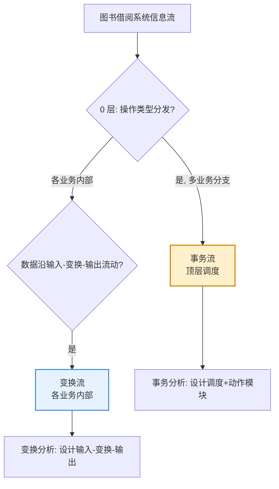
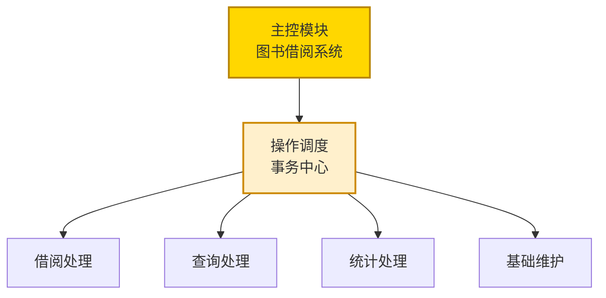
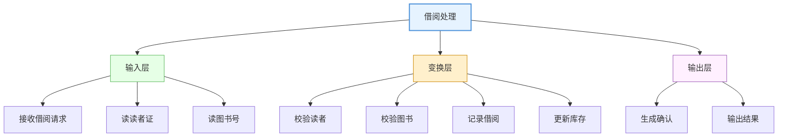
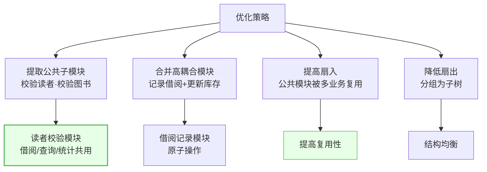
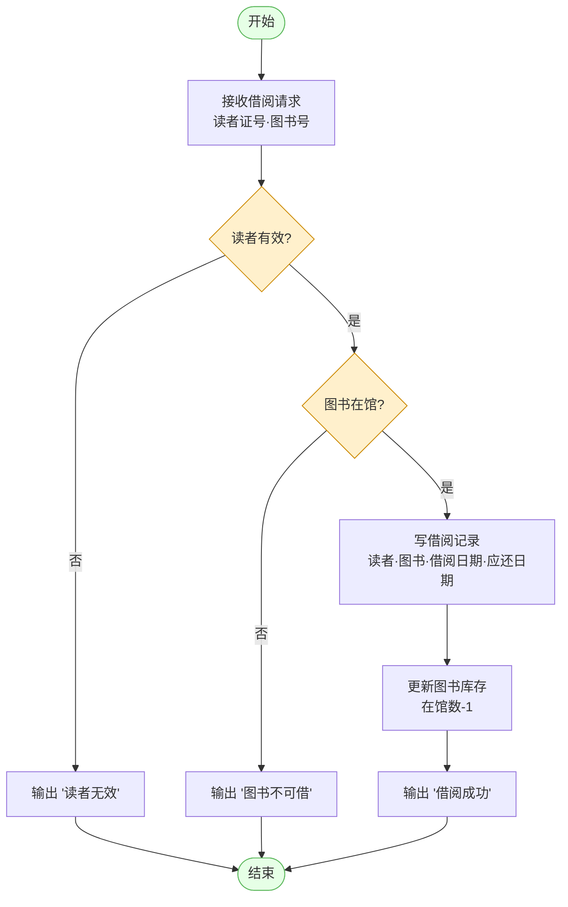
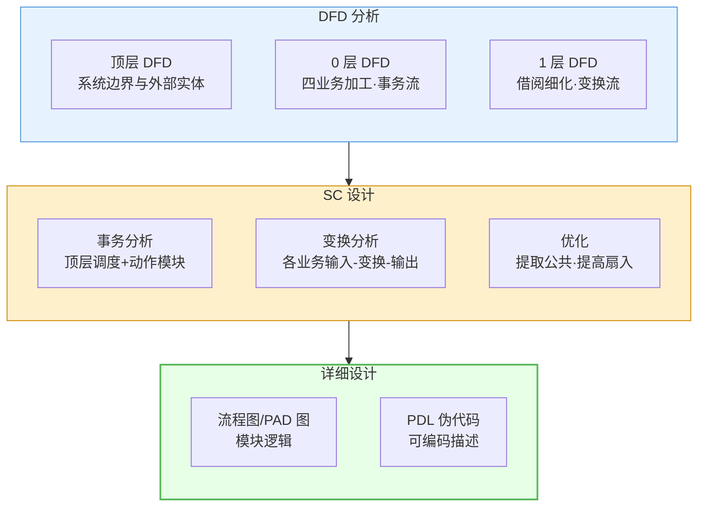

# 10.1 综合案例：图书借阅管理系统设计

本案例整合 [[MOC - 第3章|DFD 映射]]、[[MOC - 第4章|变换流]]、[[MOC - 第5章|事务流]]、[[MOC - 第6章|结构优化]]与 [[MOC - 第9章|详细设计]]，完整演练从需求到 DFD、SC、PDL 的全过程。图书借阅系统同时包含事务流（多业务调度）与变换流（各业务内部数据处理），是变换分析与事务分析组合的典型示例。

## 系统需求概述

> [!definition] 系统需求
> 图书借阅管理系统为图书馆提供图书借阅、归还、查询与统计功能。主要用户为读者与图书管理员，需管理读者信息、图书信息与借阅记录。



| 功能模块 | 主要功能 | 数据操作 |
| --- | --- | --- |
| 借阅管理 | 借书、还书、续借 | 读读者/图书、写借阅记录、更新库存 |
| 查询管理 | 图书查询、读者查询、借阅记录查询 | 读多表 |
| 统计管理 | 借阅统计、超期统计 | 读借阅记录、聚合计算 |
| 基础管理 | 读者维护、图书维护 | 读写读者/图书信息 |

## DFD 分析

### 顶层 DFD



> [!note] 顶层 DFD
> 顶层 DFD 把系统视为一个加工，标识外部实体（读者、管理员）与数据存储（图书库、读者库、借阅库），描述系统边界与外部交互。

### 0 层 DFD



> [!note] 0 层 DFD
> 0 层 DFD 把系统分解为四个主加工：借阅处理、查询处理、统计处理、基础维护，分别对应四类业务。这一层呈典型**事务流**特征——系统根据用户操作类型分发到不同业务处理。

### 1 层 DFD（借阅处理细化）



> [!note] 1 层 DFD
> 借阅处理细化为六个子加工：接收请求→校验读者→校验图书→记录借阅→更新库存→输出确认。数据沿"输入→变换→输出"流动，呈典型**变换流**特征——1.1 为输入路径、1.2-1.5 为变换中心、1.6 为输出路径。

## 识别信息流类型



| 层次 | 信息流类型 | 依据 |
| --- | --- | --- |
| 0 层（系统主调度） | 事务流 | 根据操作类型分发到借阅/查询/统计/维护 |
| 1 层（各业务内部） | 变换流 | 数据沿输入→变换→输出流动 |

> [!tip] 组合流的识别要点
> 系统顶层是事务流（事务中心=操作调度），各事务分支内部是变换流。这是常见组合模式：**事务分析设计顶层调度，变换分析设计各分支内部结构**。

## SC 结构图设计

### 事务分析（顶层）



### 变换分析（借阅处理内部）



> [!note] 变换分析步骤
> ①确定输入边界（接收请求、读读者证、读图书号为输入路径）；②确定输出边界（生成确认、输出结果为输出路径）；③中间为变换中心（校验读者、校验图书、记录借阅、更新库存）；④映射为输入层-变换层-输出层三层模块结构。

## 模块优化



| 优化项 | 问题 | 改进 |
| --- | --- | --- |
| 公共子模块 | 校验读者/图书在多业务重复 | 提取为独立模块，提高扇入复用 |
| 高内聚 | 记录借阅与更新库存强相关 | 评估合并或保持原子，确保功能内聚 |
| 扇出 | 顶层调度 4 分支合理 | 各分支内部再分组均衡 |
| 数据耦合 | 模块间传数据不传控制标志 | 消除控制耦合 |

> [!example] 优化示例
> "读者校验"被借阅处理、查询处理、统计处理三个业务调用，提取为公共子模块后扇入为 3，避免三处重复实现，符合 [[6.1 模块分解与合并原则|高扇入复用]]原则。

## 详细设计：核心模块 PDL

以"借阅处理"核心模块为例：



> [!example] 借阅处理 PDL
> ```pdl
> PROCEDURE borrow_process(reader_id, book_id)
>     // 输入层
>     reader = get_reader(reader_id)
>     book = get_book(book_id)
>
>     // 变换层：校验
>     IF reader IS NULL OR reader.status != '正常' THEN
>         OUTPUT '读者无效'
>         RETURN
>     ENDIF
>     IF book IS NULL OR book.in_stock <= 0 THEN
>         OUTPUT '图书不可借'
>         RETURN
>     ENDIF
>
>     // 变换层：记录与更新
>     due_date = today + MAX_BORROW_DAYS
>     CALL insert_borrow_record(reader_id, book_id, today, due_date)
>     CALL update_book_stock(book_id, in_stock - 1)
>
>     // 输出层
>     OUTPUT '借阅成功, 应还日期: ' + due_date
> END
> ```

## 完整 DFD→SC→PDL 图集



## 小结

图书借阅管理系统设计完整演练了结构化设计全流程：需求分析明确借阅/查询/统计/维护四类业务；DFD 分层从顶层（系统边界）到 0 层（四业务加工，呈事务流）再到 1 层（借阅细化，呈变换流）；信息流识别发现顶层事务流与各业务内部变换流的组合；SC 设计用事务分析设计顶层调度与动作模块、用变换分析设计各业务输入-变换-输出三层；优化提取公共子模块（读者校验、图书校验）提高扇入复用；详细设计用流程图与 PDL 描述核心模块算法。该案例体现了变换分析与事务分析组合的设计方法。

## 关联

- 上一级：[[MOC - 第10章]]
- 下一节：[[10.2 综合案例：学生成绩管理系统设计]]
- 关联概念：[[3.1 DFD到SC的映射原理]]、[[4.2 变换流映射步骤与SC生成]]、[[5.2 事务流映射步骤与SC生成]]、[[6.1 模块分解与合并原则]]、[[9.2 PAD图与伪代码（PDL）]]
