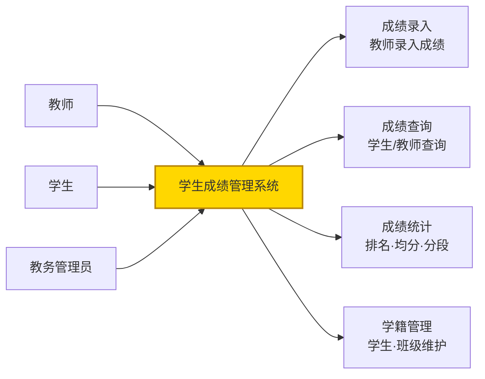
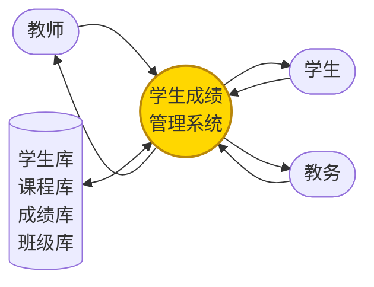
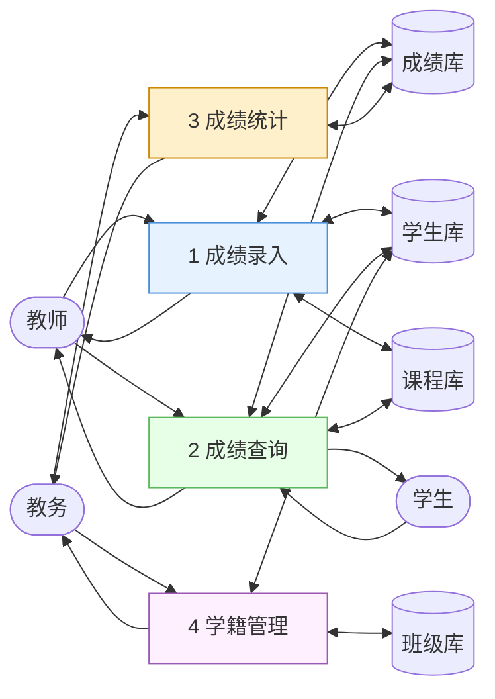
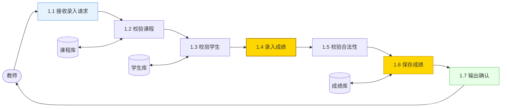
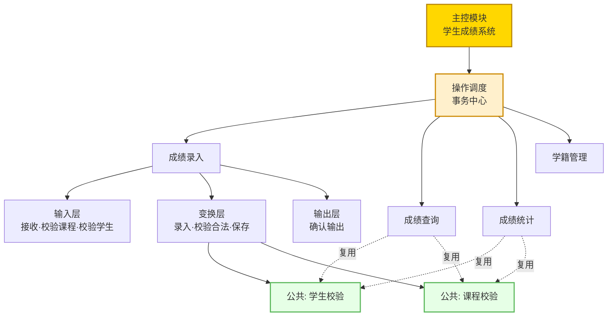
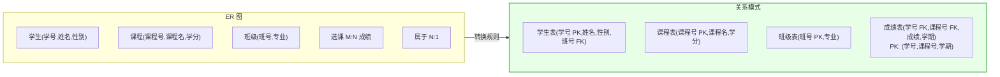
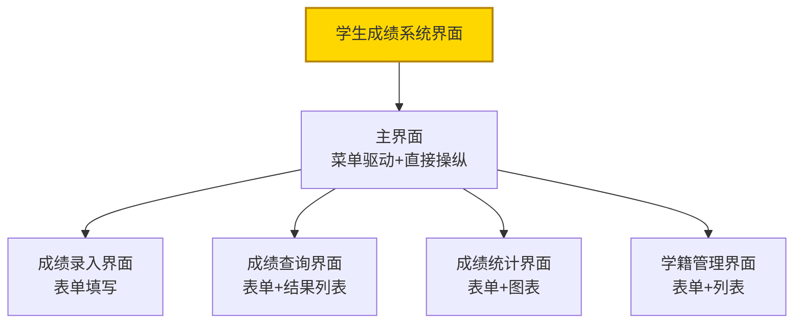
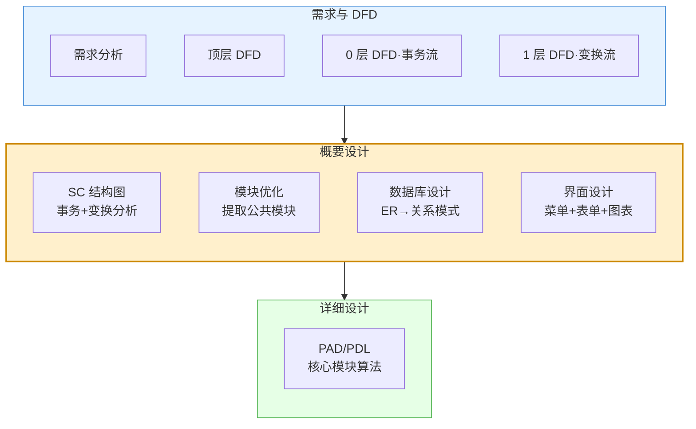

# 10.2 综合案例：学生成绩管理系统设计

本案例在 [[10.1 综合案例：图书借阅管理系统设计|图书借阅案例]]基础上，进一步整合 [[MOC - 第7章|数据设计]]与 [[MOC - 第8章|界面设计]]，演练从需求到 DFD、SC、数据库设计、界面设计的完整流程。学生成绩管理系统涵盖成绩录入、查询、统计与学籍管理，需完成 ER 图转关系模式与界面概要设计。

## 系统需求概述

> [!definition] 系统需求
> 学生成绩管理系统为学校提供成绩录入、成绩查询、成绩统计与学籍管理功能。主要用户为教师、学生与教务管理员，需管理学生、课程、成绩与班级信息。



| 功能模块 | 主要功能 | 主要用户 |
| --- | --- | --- |
| 成绩录入 | 录入/修改成绩、批量导入 | 教师 |
| 成绩查询 | 按学生/课程/学期查询 | 学生、教师 |
| 成绩统计 | 排名、均分、分数段统计 | 教师、教务 |
| 学籍管理 | 学生、班级信息维护 | 教务管理员 |

## DFD 分析

### 顶层 DFD



### 0 层 DFD



> [!note] 0 层信息流
> 0 层呈事务流特征——系统根据用户角色与操作类型分发到成绩录入/查询/统计/学籍管理四类业务。

### 1 层 DFD（成绩录入细化）



> [!note] 1 层信息流
> 成绩录入呈变换流——1.1-1.3 为输入路径（接收请求、校验课程与学生），1.4-1.6 为变换中心（录入、校验合法性、保存），1.7 为输出路径。

## SC 结构图设计



> [!tip] 公共模块复用
> "学生校验"与"课程校验"被录入、查询、统计三个业务复用，提取为公共模块提高扇入，符合 [[6.1 模块分解与合并原则|高扇入复用]]原则。

## 数据库概要设计：ER 图→关系模式

### ER 图

```mermaid
flowchart LR
    STU["学生<br/>(学号,姓名,性别)"] </--|"属于 N:1"| CLS["班级<br/>(班号,专业)"]
    STU --/"选课 M:N<br/>(成绩)"/< CRS["课程<br/>(课程号,课程名,学分)"]

    style STU fill:#e6f3ff,stroke:#4a90d9
    style CRS fill:#e6ffe6,stroke:#5cb85c
    style CLS fill:#fff0cc,stroke:#cc8800
```

| ER 元素 | 属性 |
| --- | --- |
| 学生实体 | 学号、姓名、性别 |
| 课程实体 | 课程号、课程名、学分 |
| 班级实体 | 班号、专业 |
| 选课联系（M:N） | 成绩 |
| 属于联系（N:1） | 学生属于班级 |

### 转换为关系模式



| 转换 | 规则 | 结果 |
| --- | --- | --- |
| 学生实体 | 实体→表，标识符→主键 | 学生表(学号 PK, 姓名, 性别, 班号 FK) |
| 课程实体 | 实体→表 | 课程表(课程号 PK, 课程名, 学分) |
| 班级实体 | 实体→表 | 班级表(班号 PK, 专业) |
| 属于 N:1 | "1"端主键→"N"端外键 | 学生表加班号外键 |
| 选课 M:N | 关联表，主键为两端组合 | 成绩表(学号 FK, 课程号 FK, 成绩, 学期) |

> [!example] 规范化检查
> - 学生表：学号→姓名、性别、班号，无部分依赖与传递依赖，满足 3NF；
> - 成绩表：(学号,课程号,学期)→成绩，成绩完全依赖复合主键，满足 2NF；无非主属性传递依赖，满足 3NF；
> - 课程表、班级表均满足 3NF。

## 界面概要设计



| 界面 | 类型 | 交互方式 | 设计要点 |
| --- | --- | --- | --- |
| 主界面 | 菜单驱动 + 直接操纵 | 菜单选择 | 顶部菜单栏+左侧导航+主工作区 |
| 成绩录入 | 表单填写 | 表单填写 | 选课程、选学生、填成绩、批量录入 |
| 成绩查询 | 表单 + 列表 | 表单填写 + 菜单选择 | 按学生/课程/学期条件查询 |
| 成绩统计 | 表单 + 图表 | 表单填写 | 排名表、均分、分数段直方图 |
| 学籍管理 | 表单 + 列表 | 表单填写 | 学生/班级增删改查 |

> [!note] 界面设计依据
> 界面类型选择依据 [[8.2 界面类型与交互方式|用户类型与任务]]：教师录入成绩为高频结构化操作用表单填写；学生查询为偶尔使用用菜单驱动；统计结果用图表直观呈现。遵循 [[8.1 人机界面设计原则与模型|一致性、反馈性、容错性]]原则。

## 完整设计图集



## 小结

学生成绩管理系统设计整合了 DFD 分析、SC 设计、数据库概要设计与界面设计：需求分析明确成绩录入/查询/统计/学籍管理四类业务；DFD 分层呈事务流（0 层调度）与变换流（各业务内部）组合；SC 设计用事务分析设计顶层调度、变换分析设计各业务三层结构，提取学生校验与课程校验为公共模块提高复用；数据库设计将 ER 图转换为关系模式（学生表、课程表、班级表、成绩表），并验证满足 3NF；界面设计按用户类型选择菜单驱动、表单填写与图表呈现。该案例体现了结构化设计在数据、模块、界面多维度上的综合应用。

## 关联

- 上一级：[[MOC - 第10章]]
- 上一节：[[10.1 综合案例：图书借阅管理系统设计]]
- 下一节：[[10.3 设计评审与课程设计总结]]
- 关联概念：[[3.1 DFD到SC的映射原理]]、[[7.2 数据库概要设计]]（ER 转关系模式）、[[8.2 界面类型与交互方式]]（界面类型选择）
