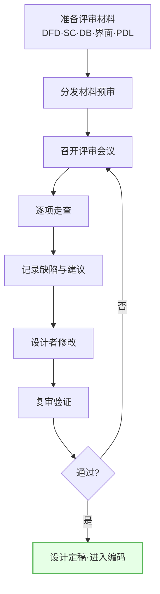
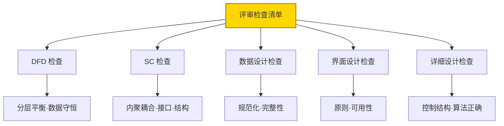
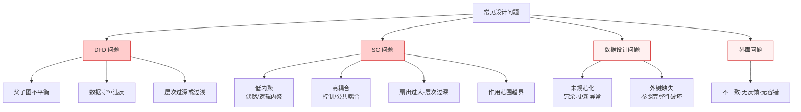
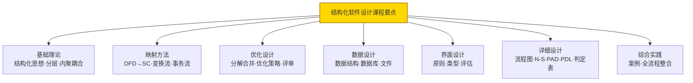
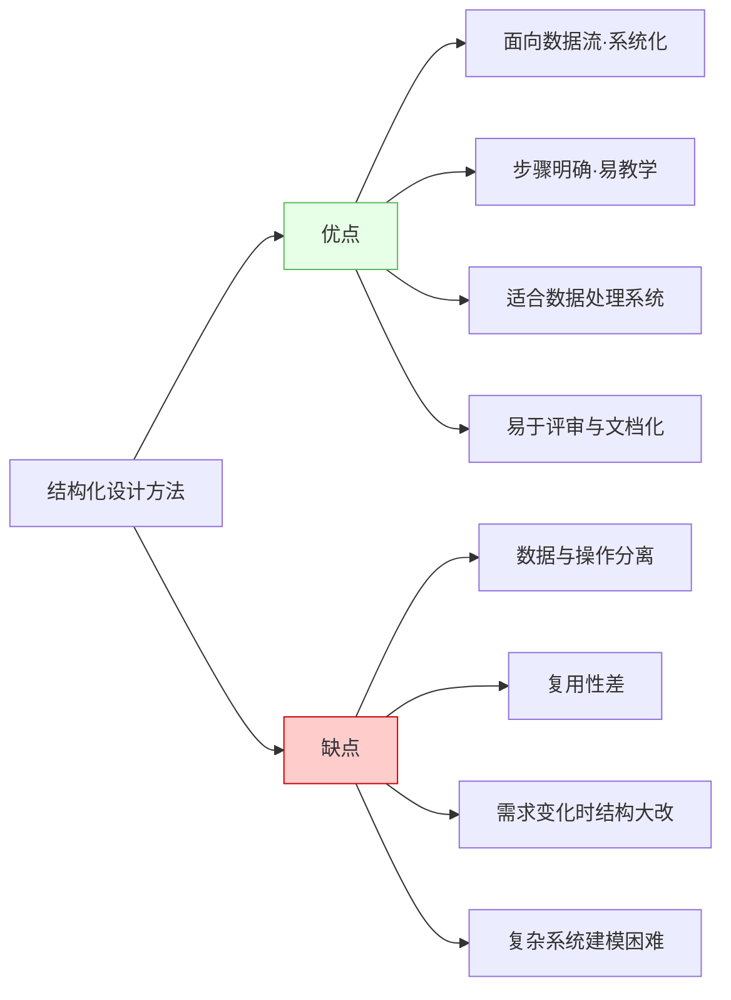
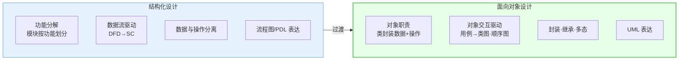
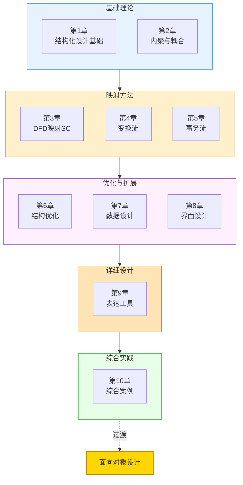

# 10.3 设计评审与课程设计总结

在完成 [[10.1 综合案例：图书借阅管理系统设计|图书借阅]]与 [[10.2 综合案例：学生成绩管理系统设计|学生成绩]]两个综合案例后，需通过设计评审验证质量，并总结课程设计要点。本节阐述设计评审流程与检查清单、常见设计问题、结构化设计方法优缺点，以及向面向对象设计的过渡，是课程的总收尾。

## 设计评审流程与检查清单

> [!definition] 设计评审
> 设计评审是由设计人员、评审人员对软件设计成果进行结构化审查的活动，目的是在设计阶段尽早发现缺陷、验证设计满足需求、评估设计质量。综合案例的评审覆盖 DFD、SC、数据设计、界面设计与详细设计全部产出。

### 评审检查清单

| 检查维度 | 检查项 | 标准 |
| --- | --- | --- |
| DFD | 父子图平衡、数据守恒、层次合理 | 子图输入输出=父图对应加工 |
| SC | 内聚（功能内聚为主）、耦合（数据耦合为主）、扇出（≤7）、作用范围≤控制范围 | 高内聚低耦合 |
| 接口 | 参数数量（≤5）、参数类型（数据为主）、无冗余 | 接口简洁 |
| 数据设计 | 规范化（≥3NF）、主键外键完整、参照完整性 | 无更新异常 |
| 界面设计 | 一致性、反馈性、容错性、可用性 | 满足设计原则 |
| 详细设计 | 三种基本结构、单入口单出口、算法正确 | 结构化 |

## 常见设计问题汇总

| 问题类别 | 典型问题 | 改进方法 |
| --- | --- | --- |
| DFD | 父子图数据流不平衡 | 调整子图使输入输出与父图一致 |
| DFD | 数据守恒违反（加工用到未输入数据） | 补充输入数据流或修正加工 |
| SC | 偶然/逻辑内聚 | 按功能拆分为功能内聚模块 |
| SC | 控制/公共耦合 | 消除控制标志、封装公共数据 |
| SC | 扇出过大、层次过深 | 分组为子树、合并透传模块 |
| SC | 作用范围越界 | 上移判定或调整模块位置 |
| 数据 | 未规范化、冗余 | 分解关系模式提升范式 |
| 数据 | 外键缺失 | 补充外键保证参照完整性 |
| 界面 | 不一致、无反馈、无容错 | 统一规范、加反馈与确认 |

> [!example] 问题改进
> 某成绩系统 SC 中"成绩处理"模块同时负责录入、查询、统计（逻辑内聚），且传递"操作类型"标志给下层（控制耦合）。改进：拆分为"成绩录入""成绩查询""成绩统计"三个功能内聚模块，操作类型判定移入调度模块内部，消除控制标志传递，降为数据耦合。

## 课程设计要点回顾

| 阶段 | 核心要点 | 关键产出 |
| --- | --- | --- |
| 基础理论 | 结构化思想、概要/详细分层、高内聚低耦合 | 设计准则 |
| 映射方法 | DFD→SC、变换分析、事务分析、分层平衡 | 初始 SC |
| 优化设计 | 模块分解合并、优化策略、设计评审 | 优化 SC |
| 数据设计 | 数据结构选择、ER 转关系模式、规范化 | 数据库模式 |
| 界面设计 | 设计原则、界面类型、可用性评估 | 界面设计文档 |
| 详细设计 | 流程图、N-S 图、PAD 图、PDL、判定表 | 模块算法描述 |
| 综合实践 | 案例：图书借阅、学生成绩 | 完整设计文档 |

## 结构化设计方法优缺点

| 维度 | 优点 | 缺点 |
| --- | --- | --- |
| 方法论 | 面向数据流、步骤明确、系统化 | 对数据与操作分离，封装性差 |
| 适用性 | 适合数据处理系统（管理信息系统） | 复杂交互系统建模困难 |
| 复用性 | 模块可复用 | 模块按功能划分，跨系统复用性差 |
| 可维护性 | 结构清晰易评审 | 需求变化时模块结构需大改 |
| 教学性 | 易于教学与文档化 | 与现代 OO 方法有差距 |

## 向面向对象设计的过渡

> [!definition] 向 OO 过渡
> 面向对象（Object-Oriented, OO）设计以对象封装数据与操作，通过继承与多态提高复用与扩展性。结构化设计向 OO 过渡的核心是从"功能分解"转向"对象职责"，从"数据流驱动"转向"对象交互驱动"。

| 对比维度 | 结构化设计 | 面向对象设计 |
| --- | --- | --- |
| 核心思想 | 功能分解、面向数据流 | 对象封装、面向职责 |
| 建模单位 | 模块（功能） | 类/对象（数据+操作） |
| 数据与操作 | 分离（数据作参数传递） | 封装（数据与操作绑定于对象） |
| 复用机制 | 模块复用（扇入） | 继承、多态、组合 |
| 驱动方式 | 数据流（DFD→SC） | 对象交互（用例→类图/顺序图） |
| 表达工具 | 流程图、N-S、PAD、PDL | UML（类图、顺序图、状态图） |
| 需求变化 | 模块结构需大改 | 变化局限在对象内部 |
| 适用场景 | 数据处理系统 | 复杂交互系统、大型系统 |

> [!tip] 过渡的关键转变
> 从结构化到面向对象的过渡需实现四个转变：①从"功能"到"对象职责"——把功能映射到对象的职责而非独立模块；②从"数据流"到"对象交互"——用对象间的消息传递替代数据流；③从"分离"到"封装"——把数据与操作绑定到对象；④从"结构图"到"UML"——用类图、顺序图替代 SC 与流程图。

## 课程知识体系总图

## 小结

设计评审通过结构化走查在编码前验证 DFD、SC、数据设计、界面设计与详细设计的质量，检查清单覆盖 DFD 平衡、SC 内聚耦合、接口、结构、数据规范化、界面原则、详细控制结构。常见问题包括 DFD 不平衡、低内聚高耦合、扇出过大、未规范化、界面不一致等，均有对应改进方法。结构化设计方法优点是面向数据流、系统化、适合数据处理系统；缺点是数据与操作分离、复用性差、复杂系统建模困难。向面向对象过渡需从功能分解转向对象职责、从数据流转向对象交互、从分离转向封装、从结构图转向 UML，是应对复杂系统与现代软件工程的主流方向。

## 关联

- 上一级：[[MOC - 第10章]]
- 上一节：[[10.2 综合案例：学生成绩管理系统设计]]
- 关联概念：[[6.3 设计评审与质量度量]]（评审方法基础）、[[1.1 结构化开发思想、SA与SD衔接关系]]（结构化思想总结）、[[MOC - 结构化软件设计]]（课程总览）
