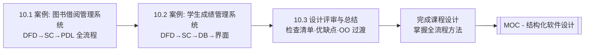

# MOC - 第10章 结构化设计综合案例

> [!info] 本章定位
> 第10章是结构化软件设计课程的综合实践环节，整合 [[MOC - 第3章|DFD 映射]]、[[MOC - 第4章|变换流]]、[[MOC - 第5章|事务流]]、[[MOC - 第6章|结构优化]]、[[MOC - 第7章|数据设计]]、[[MOC - 第8章|界面设计]]与 [[MOC - 第9章|详细设计工具]]的全部知识。本章通过两个完整案例（图书借阅管理系统、学生成绩管理系统）演练从需求到 DFD、SC、详细设计的全过程，并总结设计评审、课程设计要点与向面向对象方法的过渡，是课程的总收尾。

## 学习路线图

## 知识点导航

| 节 | 主题 | 核心要点 | 入口 |
| --- | --- | --- | --- |
| 10.1 | 综合案例：图书借阅管理系统设计 | 需求→DFD 分层→变换+事务流识别→SC 设计→优化→PDL | [[10.1 综合案例：图书借阅管理系统设计]] |
| 10.2 | 综合案例：学生成绩管理系统设计 | 需求→DFD→SC→ER 图转关系模式→界面设计 | [[10.2 综合案例：学生成绩管理系统设计]] |
| 10.3 | 设计评审与课程设计总结 | 评审检查清单、常见问题、方法优缺点、向 OO 过渡 | [[10.3 设计评审与课程设计总结]] |

## 核心考点

> [!warning] 重点掌握
> 1. 综合案例的完整流程：需求分析 → 顶层 DFD → 0 层 DFD → 1 层 DFD → 识别信息流类型 → SC 设计 → 优化 → 详细设计。
> 2. 变换流与事务流的组合识别：一个系统中常同时存在变换流（主数据处理路径）与事务流（多业务分支调度）。
> 3. 变换分析与事务分析组合的 SC 设计：顶层用事务分析调度多业务、各业务内部用变换分析映射输入-变换-输出。
> 4. 图书借阅系统的 DFD 分层与 SC 设计要点（借阅/归还/查询为事务分支，每分支内部为变换流）。
> 5. 学生成绩系统的 DFD 分层、SC 设计、ER 图转关系模式、界面设计整合。
> 6. 设计评审检查清单：内聚耦合、接口、结构、数据流平衡、需求覆盖度。
> 7. 结构化设计方法的优缺点：优点是面向数据流、系统化、适合数据处理系统；缺点是对数据与操作分离、复用性差、复杂系统建模困难。
> 8. 向面向对象方法的过渡：从功能分解到对象职责，从数据流到对象交互。

## 自测题

> [!question] 题1
> 简述图书借阅管理系统中变换流与事务流的组合识别与 SC 设计思路。
> > [!check]- 参考答案
> > 图书借阅系统整体呈事务流特征：系统主调度接收用户操作（借阅/归还/查询/统计），根据操作类型分发到对应业务处理模块，这是典型的事务流——事务中心为"操作调度"，动作模块为各业务处理。而在每个业务分支内部（如借阅处理），数据沿"输入读者证→校验→记录借阅→更新库存→输出确认"流动，呈变换流特征——输入边界为读入读者证与图书号、变换中心为校验与记录、输出边界为确认信息。SC 设计：顶层用事务分析设计调度模块与各业务动作模块；每个业务动作模块内部用变换分析设计输入-变换-输出三层；最后按 [[6.1 模块分解与合并原则|优化原则]]合并高耦合、提取公共子模块（如"读者校验"被多业务复用，提高扇入）。

> [!question] 题2
> 学生成绩管理系统设计中，如何完成 ER 图到关系模式的转换？举例说明。
> > [!check]- 参考答案
> > 学生成绩系统 ER 图含学生实体（学号、姓名、班级）、课程实体（课程号、课程名、学分）、班级实体（班号、专业）、选课联系（M:N，含成绩）。转换规则：①实体转表——学生→学生表(学号 PK, 姓名, 班号 FK)，课程→课程表(课程号 PK, 课程名, 学分)，班级→班级表(班号 PK, 专业)；②1:N 联系——班级(1)与学生(N)的隶属关系，将班号作为学生表外键；③M:N 联系——选课转关联表选课表(学号 FK, 课程号 FK, 成绩)，主键为(学号, 课程号)。转换后按规范化检查：学生表已 3NF（学号→姓名、学号→班号，无传递依赖），选课表 3NF（成绩完全依赖(学号,课程号)）。

> [!question] 题3
> 列举设计评审检查清单的主要检查维度与典型缺陷。
> > [!check]- 参考答案
> > 设计评审检查清单主要四维度：①**内聚耦合**——各模块是否高内聚（避免偶然/逻辑内聚）、模块间是否低耦合（避免内容/控制/公共耦合，以数据耦合为主）；②**接口**——参数数量≤5、以数据为主无控制标志、与 DFD 数据流一致、无冗余参数；③**结构**——扇出顶层≤7、层次不宜过深、底层充分利用扇入、作用范围≤控制范围；④**数据与需求**——数据流父子图平衡、数据字典完备、需求覆盖度完整。典型缺陷：模块存在控制耦合（传操作类型标志）、顶层扇出过大（>7）、作用范围越界（判定影响非下属模块）、接口参数过多（>5）、低内聚（一个模块混做多事）。

> [!question] 题4
> 对比结构化设计方法与面向对象方法的优缺点，说明为何要向面向对象过渡。
> > [!check]- 参考答案
> > **结构化设计**优点：面向数据流、方法系统化步骤明确、适合数据处理系统、易于评审与文档化；缺点：数据与操作分离（数据作为参数在模块间传递，封装性差）、复用性差（模块按功能划分难以跨系统复用）、需求变化时模块结构需大改、复杂系统建模困难。**面向对象方法**以对象封装数据与操作、通过继承与多态提高复用、需求变化局限在对象内部、更贴合现实世界模型。向面向对象过渡是因为结构化方法在数据封装、复用性与复杂系统建模上的固有局限，面向对象通过对象职责与交互更好地应对变化与复杂性，是大型软件系统设计的主流方法。

## 章节导航

- 上一级：[[MOC - 结构化软件设计]]
- 上一章：[[MOC - 第9章]]（详细设计表达工具）
- 关联：[[MOC - 第3章]]（DFD 映射是案例核心）、[[MOC - 第4章]]（变换流）、[[MOC - 第5章]]（事务流）、[[MOC - 第6章]]（结构优化）、[[MOC - 第7章]]（数据设计）、[[MOC - 第8章]]（界面设计）、[[MOC - 第9章]]（详细设计工具）
