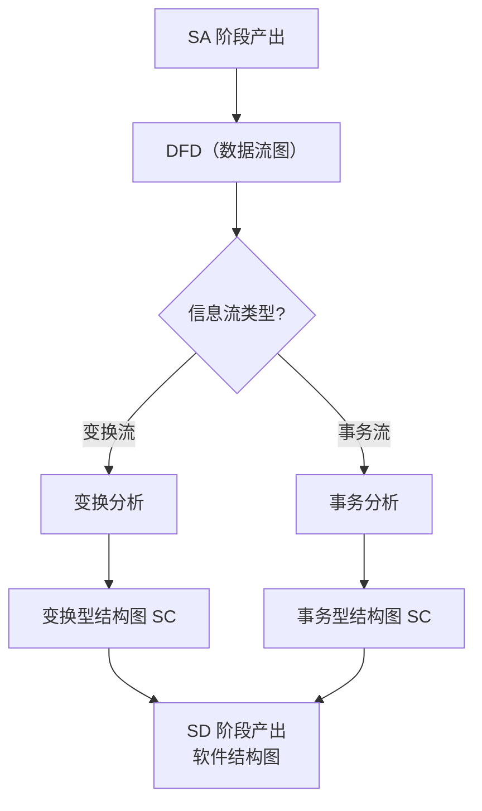

# 1.1 结构化开发思想、SA与SD衔接关系

结构化方法贯穿软件开发的“分析—设计”两阶段。本节阐明结构化开发思想的三个核心要点，结构化分析（SA）的产出，结构化设计（SD）的输入，以及 SA 到 SD 的衔接机制——DFD 如何映射为软件结构图（SC）。理解这一衔接是掌握后续 [[3.1 DFD到SC的映射原理|DFD→SC 映射方法]]的前提。

## 结构化开发思想

> [!definition] 结构化开发思想
> 结构化开发思想是一套面向数据流、自顶向下的系统化开发方法，核心要点为：**自顶向下（Top-Down）、逐步求精（Stepwise Refinement）、模块化（Modularity）**。

| 要点 | 含义 | 作用 |
| --- | --- | --- |
| 自顶向下 | 从最顶层的问题/系统出发，逐层分解为子问题/子系统 | 保证全局视角，避免过早陷入细节 |
| 逐步求精 | 把抽象的上一层描述逐步细化为具体的、可实现的下层描述 | 使复杂问题可控、可验证 |
| 模块化 | 把系统分解为若干相对独立、可分别编写测试的模块 | 降低复杂度，支持分工与复用 |

> [!note] 三者的关系
> 逐步求精是“方法”，模块化是“结果”。逐步求精的每一层细化自然产生模块层次——每求精一层即得到一组下层模块；模块化又为逐步求精提供了可管理的分解边界。自顶向下则规定了分解的方向：先整体后局部。

## SA（结构化分析）的产出

> [!definition] 结构化分析
> 结构化分析（Structured Analysis, SA）是需求分析阶段的方法，以数据流为核心刻画系统“做什么”，主要产出为数据流图、数据字典与加工说明。

| 产出 | 内容 | 作用 |
| --- | --- | --- |
| 数据流图（DFD） | 描述数据在系统中的流动、加工与存储 | 直观表达系统的功能与数据流向，是 SD 的直接输入 |
| 数据字典（DD） | 定义 DFD 中所有数据流、数据项、数据存储、加工的精确含义 | 消除歧义，为设计与实现提供精确数据定义 |
| 加工说明（Process Specification） | 描述 DFD 中每个底层加工的变换逻辑（结构化语言、判定表、判定树） | 说明“加工做什么”，衔接分析与详细设计 |

> [!tip] DFD 的层次
> DFD 通常分层绘制：顶层数据流图（Context Diagram，展示系统与外部实体交互）→ 0 层图 → 1 层图……逐层细化。分层 DFD 是 [[3.3 DFD分层映射与平衡检验|分层映射]]的基础。

## SD（结构化设计）的输入

> [!definition] 结构化设计
> 结构化设计（Structured Design, SD）是设计阶段的方法，以 SA 得到的 DFD 为基础，将其映射为程序的模块结构图（SC），核心任务是确定系统由哪些模块组成、模块间如何调用与传递数据。

SD 的输入即 SA 的分析模型：

> [!warning] SD 不重新分析需求
> SD 以 SA 的分析模型为输入，不重新进行需求获取与分析，而是把需求模型（逻辑模型）转化为设计模型（物理结构）。DFD 描述的“做什么”被映射为 SC 描述的“怎么做”的模块结构。

## SA 到 SD 的衔接：DFD → SC

SA 与 SD 的衔接核心是 **DFD 到结构图（SC）的映射**：

> [!note] 衔接说明
> DFD 中的数据流分为两类：**变换流**（输入→加工中心→输出的线性流水线）与**事务流**（事务中心根据类型分派到多条动作路径）。SD 根据信息流类型选择映射方法——变换流用变换分析映射为变换型 SC，事务流用事务分析映射为事务型 SC。具体的识别与映射方法见 [[3.2 变换流识别与事务流识别|3.2 节]] 与 [[3.1 DFD到SC的映射原理|3.1 节]]。

### SA 与 SD 的关系总览

| 维度 | SA（结构化分析） | SD（结构化设计） |
| --- | --- | --- |
| 阶段 | 需求分析 | 软件设计（概要设计） |
| 核心问题 | 系统“做什么” | 系统“怎么做”（模块结构） |
| 主要工具 | DFD、数据字典、加工说明 | 结构图（SC） |
| 模型性质 | 逻辑模型 | 物理结构模型 |
| 衔接桥梁 | DFD → | SC |

## 小结

结构化开发思想以自顶向下、逐步求精、模块化为核心，贯穿分析与设计两阶段。SA 产出 DFD、数据字典与加工说明，刻画系统“做什么”；SD 以 DFD 为输入，通过变换分析或事务分析将其映射为结构图(SC)，刻画系统“怎么做”的模块结构。DFD 是连接 SA 与 SD 的桥梁——SD 不重新分析需求，而是把需求模型转化为设计模型。

## 关联

- 上一级：[[MOC - 第1章]]
- 下一节：[[1.2 软件设计分层：概要设计与详细设计]]
- 关联概念：[[3.1 DFD到SC的映射原理]]（DFD→SC 映射的具体方法）、[[4.1 数据流图（DFD）与数据字典]]（DFD 是 SA 的核心产出，亦见软件工程课程）
