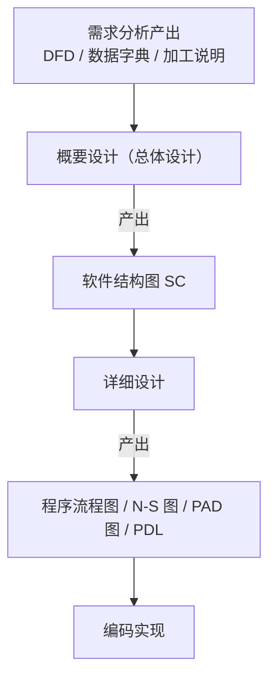
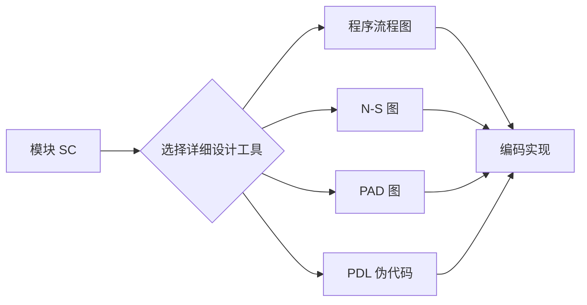

# 1.2 软件设计分层：概要设计与详细设计

软件设计分为概要设计与详细设计两个层次。本节阐明两层设计的任务边界与产出物：概要设计将系统划分为模块并产出软件结构图（SC），详细设计为每个模块设计算法与数据结构并产出程序流程图、N-S 图、PAD 图、PDL。理解这一分层是定位 [[3.1 DFD到SC的映射原理|DFD→SC 映射]]（属概要设计）与详细设计工具（第6章）的前提。

## 设计分层的总体框架

> [!note] 分层逻辑
> 概要设计先解决“系统由哪些模块组成、模块间如何组织”，得到模块层次结构；详细设计再解决“每个模块内部如何工作”，得到模块的算法与数据结构。先结构后细节，符合自顶向下的设计思想（见 [[1.1 结构化开发思想、SA与SD衔接关系|1.1 节]]）。

## 概要设计（总体设计）

> [!definition] 概要设计
> 概要设计（Preliminary Design，又称总体设计）是将系统划分为模块、确定模块间调用关系与接口的设计活动，产出软件结构图（SC）。

### 概要设计的任务

- 将系统按功能划分为若干模块，形成模块层次结构；
- 确定每个模块的功能边界与接口（调用关系、传递的数据与控制信息）；
- 评价模块结构的质量（[[MOC - 第2章|内聚与耦合]]），必要时优化。

### 概要设计的产出：软件结构图（SC）

| 元素 | 图形符号 | 含义 |
| --- | --- | --- |
| 模块 | 矩形 | 程序的可命名单元 |
| 调用 | 箭头（调用者→被调用者） | 模块间的调用关系 |
| 数据 | 带空心圆的箭头 | 模块间传递的数据信息 |
| 控制 | 带实心圆的箭头 | 模块间传递的控制信息（标志、状态） |

> [!warning] 数据与控制的区分
> “数据”用空心圆箭头表示，是被处理的对象（如订单、查询结果）；“控制”用实心圆箭头表示，是影响另一模块执行逻辑的信号（如“结束标志”“错误码”）。传递控制信息意味着存在控制依赖（控制耦合），应尽量减少，详见 [[2.2 耦合类型详解（强到弱）|2.2 节控制耦合]]。

SC 由 DFD 映射而来，映射方法是 [[3.1 DFD到SC的映射原理|第3章]]的核心内容。

## 详细设计

> [!definition] 详细设计
> 详细设计（Detailed Design）是为概要设计得到的每个模块设计具体算法与数据结构的设计活动，产出可供编码直接参照的过程描述。

### 详细设计的任务

- 为每个模块设计算法逻辑（控制流程）；
- 确定模块内部使用的数据结构；
- 描述输入、处理、输出与边界条件，使设计可被编码直接实现。

### 详细设计的产出工具

| 工具 | 形式 | 特点 |
| --- | --- | --- |
| 程序流程图（Flowchart） | 图形（框+流程线） | 直观表达控制流程，但流程线易导致结构混乱 |
| N-S 图（盒图） | 图形（嵌套矩形） | 强制结构化，无流程线，不易画出非结构化逻辑 |
| PAD 图（问题分析图） | 图形（树形展开） | 支持自顶向下逐步求精，结构清晰，易转代码 |
| PDL（伪代码） | 文本 | 语言无关的算法描述，接近自然语言与代码，易维护 |

> [!tip] 工具选用
> 程序流程图直观但易滥用 goto；N-S 图强制结构化但绘制不便；PAD 图兼顾结构化与可读性，推荐用于复杂算法；PDL 适合文本设计与版本管理。详细工具对比将在第6章展开。

## 概要设计与详细设计的对比

| 维度 | 概要设计 | 详细设计 |
| --- | --- | --- |
| 关注层次 | 系统的模块结构 | 模块内部的算法 |
| 核心问题 | 模块划分与组织 | 每个模块如何工作 |
| 主要产出 | 软件结构图 SC | 程序流程图/N-S 图/PAD 图/PDL |
| 依据 | DFD（SA 产出） | 概要设计的 SC 与加工说明 |
| 后继活动 | 详细设计 | 编码实现 |

## 小结

软件设计分为概要与详细两层。概要设计将系统划分为模块、确定模块间关系，产出软件结构图(SC)；详细设计为每个模块设计算法与数据结构，产出程序流程图、N-S 图、PAD 图或 PDL。SC 的四种元素为模块（矩形）、调用（箭头）、数据（空心圆箭头）、控制（实心圆箭头）。两层设计遵循先结构后细节的自顶向下思想，DFD→SC 的映射属于概要设计阶段的核心活动。

## 关联

- 上一级：[[MOC - 第1章]]
- 上一节：[[1.1 结构化开发思想、SA与SD衔接关系]]
- 下一节：[[1.3 设计目标、高内聚低耦合核心准则]]
- 关联概念：[[3.1 DFD到SC的映射原理]]（SC 由 DFD 映射而来）、[[7.1 详细设计工具与方法]]（软件工程课程中的详细设计工具）
