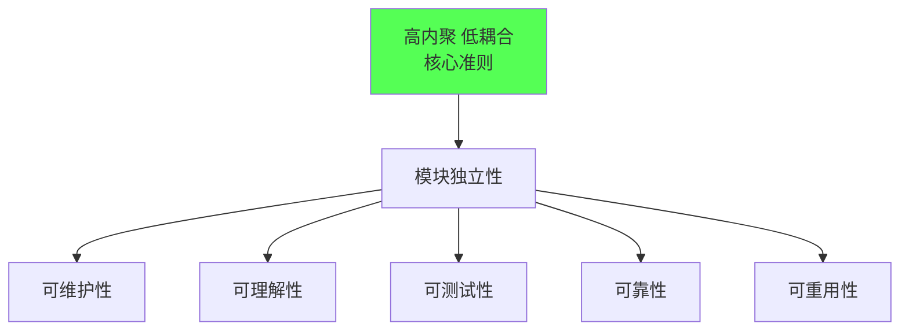
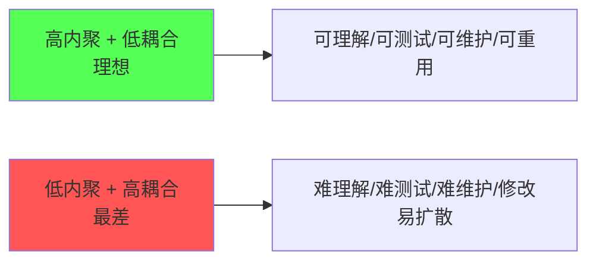
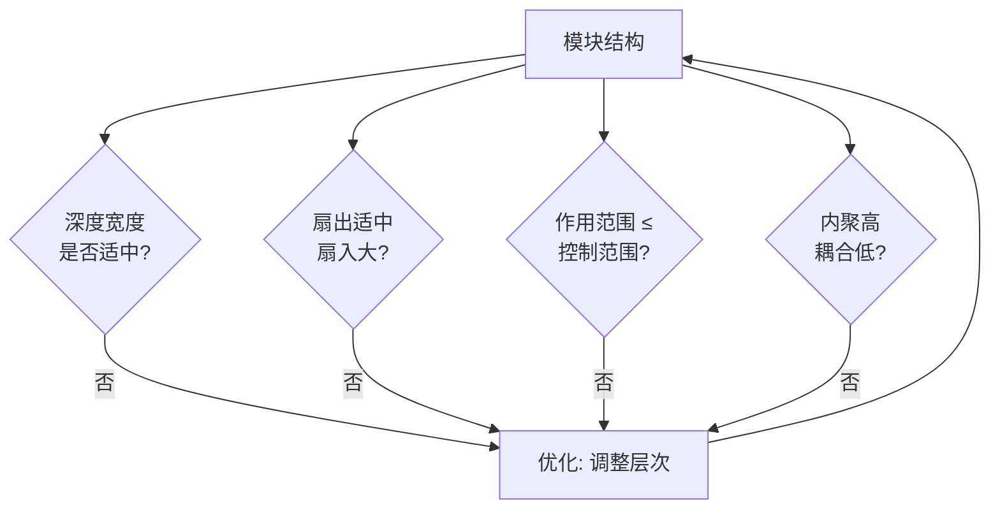

# 1.3 设计目标、高内聚低耦合核心准则

软件设计的最终目标是产出高质量、可长期维护的系统。本节阐明软件设计的五大目标，引入模块独立性概念及其度量维度（内聚与耦合），确立“高内聚低耦合”这一结构化设计的核心准则，并给出模块划分的具体原则。这些准则是 [[MOC - 第2章|第2章内聚耦合判定]]与 [[MOC - 第7章|第7章结构优化]]的判据基础。

## 软件设计目标

> [!definition] 软件设计目标
> 软件设计旨在使系统具备可维护性、可理解性、可测试性、可靠性与可重用性等质量属性。

| 目标 | 含义 | 设计支撑 |
| --- | --- | --- |
| 可维护性 | 修改、扩展系统时影响范围小、成本低 | 模块独立、低耦合 |
| 可理解性 | 系统结构与模块逻辑易于读懂 | 高内聚、功能单一、命名清晰 |
| 可测试性 | 模块可被独立测试、易构造测试用例 | 接口简单、内聚高 |
| 可靠性 | 系统在规定条件下正确履行功能 | 模块边界清晰、错误局部化 |
| 可重用性 | 模块可在不同系统中复用 | 功能单一、与外部耦合低 |

> [!note] 目标的内在一致性
> 五大目标并非彼此独立：高内聚低耦合同时支撑可维护性、可理解性、可测试性与可重用性。设计目标的根本保障是模块独立性，因此“高内聚低耦合”成为结构化设计的核心准则。

## 模块独立性

> [!definition] 模块独立性
> 模块独立性（Module Independence）指每个模块完成一个相对独立的功能，且与其他模块的接口简单、依赖最少。它由内聚与耦合两个维度共同度量。

- **内聚（Cohesion）**：模块内部各成分之间的关联程度，**越高越好**。
- **耦合（Coupling）**：模块之间的依赖程度，**越低越好**。

内聚与耦合的详细分类见 [[2.1 内聚类型详解（弱到强）|2.1 节]]与 [[2.2 耦合类型详解（强到弱）|2.2 节]]。

## 高内聚低耦合核心准则

> [!warning] 设计核心准则
> 结构化设计的核心原则是**高内聚、低耦合**：模块内部应高度内聚（尽量达到功能内聚），模块之间应低度耦合（尽量采用数据耦合）。高内聚保证模块功能单一、易理解、易复用；低耦合保证模块间依赖少，修改一个模块不易波及其他模块。

### 内聚与耦合的关系

内聚与耦合通常是相关的：高内聚的模块往往自然形成低耦合——功能单一的模块不需要过多外部交互。但二者并非完全等价，一个高内聚模块仍可能因接口设计不当而产生较强耦合。

> [!example] 直观类比
> 高内聚低耦合如同一个高效团队：每个成员专精一项职责（高内聚），成员间通过简洁的接口协作而非互相干涉（低耦合）。反之，低内聚高耦合如同职责混乱、彼此牵扯的团队，任何变动都引发连锁反应。

## 模块划分原则

在 [[3.1 DFD到SC的映射原理|DFD→SC 映射]]得到初始结构后，需依据以下原则评估与优化模块划分：

| 原则 | 含义 | 说明 |
| --- | --- | --- |
| 功能单一 | 每个模块完成一个明确功能 | 追求功能内聚，避免一个模块承担多职责 |
| 接口简单 | 模块间只传递必要数据 | 减少参数数量，避免传递整个数据结构（标记耦合） |
| 深度宽度适中 | 结构图的层次与每层模块数适中 | 层次过深增加调用开销，每层模块过多降低清晰度 |
| 扇出适中 | 一个模块直接调用的下层模块数适中 | 扇出过大说明模块职责过重，通常控制在 7 以内 |
| 扇入大 | 一个模块被多个上层模块调用 | 扇入大意味着复用性好，应鼓励 |
| 作用范围在控制范围内 | 判定所在模块应能控制其判定影响的模块 | 避免控制信息长距离传递（详见第7章启发式规则） |

> [!tip] 划分原则的权衡
> 模块并非越小越好——模块过多会增加接口复杂度与调用开销。合理的模块规模需在内聚、耦合与结构形态之间权衡：先保证高内聚低耦合，再调整深度、宽度、扇入扇出。这些启发式规则将在第7章系统讨论。

## 小结

软件设计目标是可维护性、可理解性、可测试性、可靠性与可重用性，其根本保障是模块独立性。模块独立性由内聚（越高越好）与耦合（越低越好）度量，“高内聚低耦合”是结构化设计的核心准则。模块划分应遵循功能单一、接口简单、深度宽度适中、扇出适中扇入大、作用范围在控制范围内等原则，并在 DFD→SC 映射的初始结构上持续优化。

## 关联

- 上一级：[[MOC - 第1章]]
- 上一节：[[1.2 软件设计分层：概要设计与详细设计]]
- 关联概念：[[2.1 内聚类型详解（弱到强）]]、[[2.2 耦合类型详解（强到弱）]]（内聚耦合的具体分类）、[[7.1 详细设计工具与方法]]（软件工程课程中的设计原则对照）
