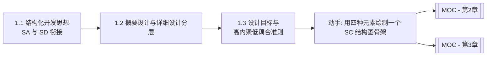

# MOC - 第1章 结构化设计基础理论

> [!info] 本章定位
> 第1章是结构化软件设计课程的总入门，回答“结构化设计是什么、它从哪里来、要到哪里去”。本章阐明结构化开发思想（自顶向下、逐步求精、模块化）与 SA-SD 的衔接关系，区分概要设计与详细设计的分层产出，确立软件设计目标与高内聚低耦合核心准则。后续各章的方法（[[MOC - 第3章|DFD→SC 映射]]、[[MOC - 第2章|内聚耦合判定]]）都建立在本章的概念框架之上。

## 学习路线图

## 知识点导航

| 节 | 主题 | 核心要点 | 入口 |
| --- | --- | --- | --- |
| 1.1 | 结构化开发思想、SA 与 SD 衔接关系 | 自顶向下/逐步求精/模块化；SA 产出 DFD/DD/加工说明；SD 以 DFD 为输入导出 SC | [[1.1 结构化开发思想、SA与SD衔接关系]] |
| 1.2 | 软件设计分层：概要与详细 | 概要设计产出 SC；详细设计产出流程图/N-S 图/PAD 图/PDL | [[1.2 软件设计分层：概要设计与详细设计]] |
| 1.3 | 设计目标、高内聚低耦合准则 | 可维护/可理解/可测试/可靠性/可重用；模块独立性与模块划分原则 | [[1.3 设计目标、高内聚低耦合核心准则]] |

## 核心考点

> [!warning] 重点掌握
> 1. 结构化开发思想的三个要点：自顶向下、逐步求精、模块化。
> 2. SA 与 SD 的衔接：SA 产出 DFD/数据字典/加工说明，SD 以 DFD 为输入导出结构图(SC)，DFD 是连接分析与设计的桥梁。
> 3. 概要设计与详细设计的区分：概要设计划分模块、产出 SC；详细设计为每个模块设计算法与数据结构，产出程序流程图、N-S 图、PAD 图、PDL。
> 4. 软件设计目标：可维护性、可理解性、可测试性、可靠性、可重用性。
> 5. 模块独立性概念及其两个度量维度（内聚、耦合）；高内聚低耦合是设计的核心准则。
> 6. 模块划分原则：功能单一、接口简单、深度与宽度适中、扇出适中扇入大。

## 自测题

> [!question] 题1
> 简述结构化开发思想的三个核心要点，并说明“逐步求精”与“模块化”的关系。
> > [!check]- 参考答案
> > 三个核心要点：①自顶向下——从最顶层的问题出发，逐层分解为子问题；②逐步求精——把抽象的上一层描述逐步细化为具体的、可实现的下层描述；③模块化——把系统分解为若干相对独立的模块分别实现。逐步求精是方法，模块化是结果：逐步求精的过程自然产生模块层次，每求精一层即得到一组下层模块；模块化则为逐步求精提供了可管理的分解边界。

> [!question] 题2
> SA 与 SD 如何衔接？为什么说 DFD 是连接分析与设计的桥梁？
> > [!check]- 参考答案
> > SA（结构化分析）产出 DFD、数据字典与加工说明，刻画系统“做什么”；SD（结构化设计）以 SA 的分析模型（主要是 DFD）为输入，导出结构图(SC)，刻画系统“怎么做”的模块结构。DFD 描述了系统的数据流向与加工，是 SD 映射为模块结构的直接依据——变换流映射为变换型结构图，事务流映射为事务型结构图。SD 不重新分析需求，而是把需求模型转化为设计模型，因此 DFD 是连接分析与设计的桥梁。

> [!question] 题3
> 概要设计与详细设计的任务和产出有何不同？
> > [!check]- 参考答案
> > 概要设计（总体设计）的任务是将系统划分为模块、确定模块间的调用关系与接口，产出软件结构图(SC)，关注系统的模块层次结构。详细设计的任务是为每个模块设计具体的算法与数据结构，产出程序流程图、N-S 图、PAD 图或 PDL 伪代码，关注模块内部的实现逻辑。概要设计解决“系统由哪些模块组成、如何组织”，详细设计解决“每个模块内部如何工作”。

> [!question] 题4
> 为什么“高内聚低耦合”是结构化设计的核心准则？模块划分应遵循哪些原则？
> > [!check]- 参考答案
> > 高内聚保证模块功能单一、内部各成分紧密关联，使模块易于理解、测试与复用；低耦合保证模块间依赖少，修改一个模块不易波及其他模块，提升可维护性。二者共同实现模块独立性，是可维护、可理解、可测试、可重用等设计目标的根本保障。模块划分原则：①功能单一——每个模块完成一个明确功能；②接口简单——模块间只传递必要数据；③深度与宽度适中——层次不宜过深、每层模块数不宜过多；④扇出适中、扇入大——上层模块直接调用的下层模块数适中，下层模块被多处复用（扇入大）有利于复用。

## 章节导航

- 上一级：[[MOC - 结构化软件设计]]
- 下一章：[[MOC - 第2章]]
- 关联：[[MOC - 第3章]]（DFD→SC 映射是 SA-SD 衔接的具体落地）
