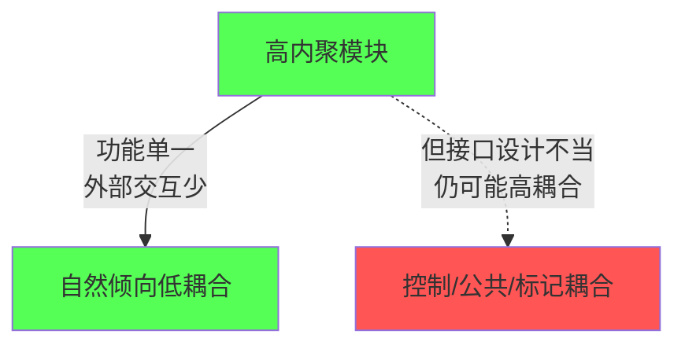
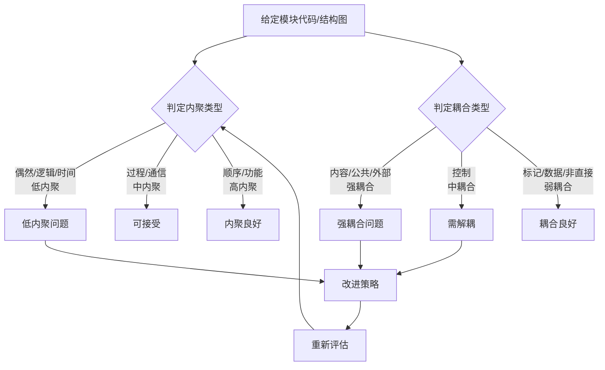
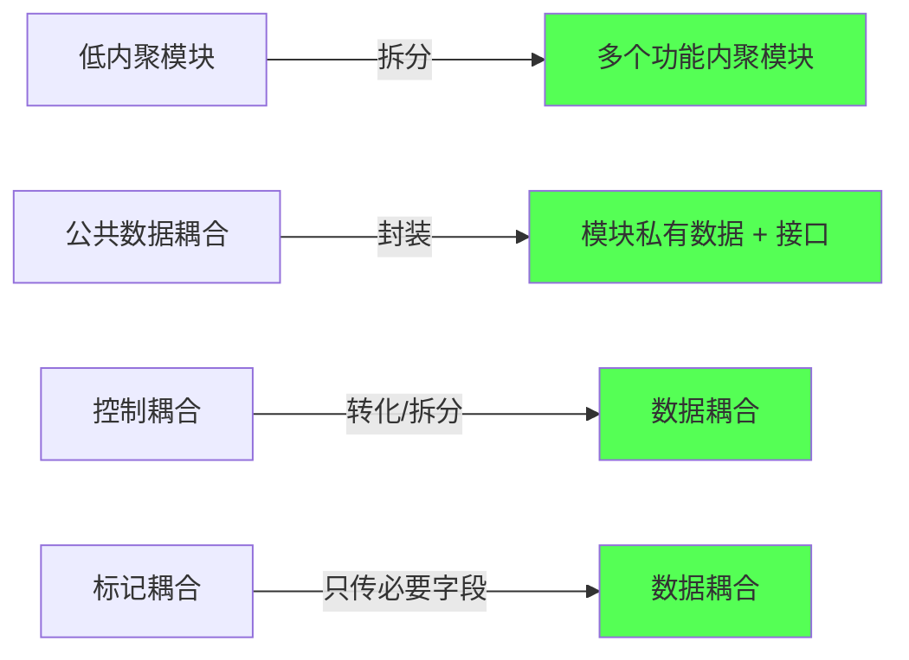

# 2.3 内聚耦合综合判定与设计实践

内聚与耦合是模块独立性的两个度量维度，二者通常相关但非完全等价。本节综合 [[2.1 内聚类型详解（弱到强）|内聚]]与 [[2.2 耦合类型详解（强到弱）|耦合]]的判定方法，阐明二者关系，给出模块质量评估流程、常见设计问题识别与解耦改进策略，并通过综合案例演练判定与改进的全过程。这是 [[MOC - 第7章|第7章结构优化]]的方法基础。

## 内聚与耦合的关系

> [!note] 内聚与耦合的关系
> 内聚与耦合通常相关：**高内聚的模块往往自然形成低耦合**——功能单一的模块不需要过多外部交互。但二者并非完全等价：一个高内聚模块仍可能因接口设计不当（如传递控制标志、共享全局数据）而产生较强耦合。



| 组合 | 模块质量 | 设计评价 |
| --- | --- | --- |
| 高内聚 + 低耦合 | 理想 | 可理解、可测试、可维护、可复用 |
| 高内聚 + 高耦合 | 较差 | 功能单一但接口复杂，需解耦 |
| 低内聚 + 低耦合 | 一般 | 独立但功能混乱，需拆分 |
| 低内聚 + 高耦合 | 最差 | 难理解、难测试、难维护，必须重构 |

## 模块质量评估流程



> [!tip] 评估要点
> 评估模块质量时，内聚与耦合需**同时**考察：先判定内聚（模块内部成分关系），再判定耦合（模块间依赖），最后综合给出质量评价与改进方向。不能只看一个维度。

## 常见设计问题识别

### 低内聚模块的识别信号

| 信号 | 对应内聚类型 |
| --- | --- |
| 模块无法用一句话描述功能 | 偶然内聚 |
| 模块名含“与”“和”“等”泛化词 | 偶然/逻辑内聚 |
| 模块内有根据标志选择的多分支 | 逻辑内聚 |
| 模块名为 `init`/`setup`/`cleanup` 且成分无依赖 | 时间内聚 |
| 模块成分按固定顺序但无数据流动 | 过程内聚 |

### 高耦合模块的识别信号

| 信号 | 对应耦合类型 |
| --- | --- |
| 直接读写另一模块的内部变量 | 内容耦合 |
| 多模块读写同一全局变量 | 公共耦合 |
| 多模块依赖同一文件/协议格式 | 外部耦合 |
| 模块间传递标志/开关控制分支 | 控制耦合 |
| 传递整个对象但接收方只用部分字段 | 标记耦合 |

## 解耦与改进策略

| 问题 | 改进策略 | 转化结果 |
| --- | --- | --- |
| 偶然内聚 | 按功能拆分为多个功能内聚模块 | 偶然→功能内聚 |
| 逻辑内聚 | 拆分为多个功能内聚模块，消除标志参数 | 逻辑→功能内聚 |
| 时间内聚 | 拆分子模块，由顶层协调调用 | 时间→功能内聚 |
| 内容耦合 | 用访问控制封装内部数据，通过接口访问 | 内容→数据耦合 |
| 公共耦合 | 把全局数据封装为模块私有，提供接口 | 公共→数据耦合 |
| 控制耦合 | 拆分被控模块为多个功能模块，或转标志为数据 | 控制→数据耦合 |
| 标记耦合 | 只传递接收方实际需要的字段值 | 标记→数据耦合 |



> [!warning] 改进的边界
> 解耦与改进应保证不破坏功能正确性。某些场景下（如初始化模块的时间内聚、底层硬件访问的外部耦合）完全消除耦合代价过高，需在质量与成本间权衡，至少应避免最差的内容耦合与公共耦合。

## 综合判定练习案例

### 案例：订单处理模块

```python
# 待评估的模块
g_db = None  # 全局数据库连接

def process_order(order, action):
    global g_db
    if action == "save":
        if g_db is None:
            g_db = open_connection()
        g_db.execute("INSERT ...", order.id, order.name, order.score)
    elif action == "query":
        if g_db is None:
            g_db = open_connection()
        return g_db.query("SELECT ...", order.id)
    elif action == "validate":
        return order.score > 0 and len(order.name) > 0
```

**评估过程：**

1. **内聚判定**：模块根据 `action` 标志选择“保存/查询/校验”三种不同功能 → **逻辑内聚**（低内聚）。
2. **耦合判定**：
   - 使用全局变量 `g_db` 且多分支共享 → **公共耦合**；
   - `order` 对象整体传入，但“保存”用到 `id/name/score`、“查询”只用到 `id`、“校验”用到 `score/name` → **标记耦合**；
   - `action` 标志控制分支 → **控制耦合**。

**改进方案：**

```python
# 改进后：拆分为功能内聚模块 + 封装数据库访问
class OrderDB:
    def __init__(self):
        self._conn = None  # 私有数据，封装公共耦合
    def _ensure_conn(self):
        if self._conn is None:
            self._conn = open_connection()
    def save(self, order_id, order_name, order_score):  # 只传必要字段
        self._ensure_conn()
        self._conn.execute("INSERT ...", order_id, order_name, order_score)
    def query(self, order_id):  # 只传必要字段
        self._ensure_conn()
        return self._conn.query("SELECT ...", order_id)

def validate_order(score, name):  # 独立的功能内聚模块
    return score > 0 and len(name) > 0
```

**改进后评估：**

- 内聚：`save`/`query`/`validate_order` 各完成单一功能 → **功能内聚**；
- 耦合：数据库连接封装为 `OrderDB` 私有数据（消除公共耦合）；仅传递必要字段值（标记耦合→数据耦合）；消除 `action` 控制标志（控制耦合→数据耦合）。


## 小结

内聚与耦合通常相关但非完全等价，需同时考察。模块质量评估流程：先判定内聚类型，再判定耦合类型，综合给出评价与改进方向。常见设计问题可通过信号识别：标志分支对应逻辑内聚，全局变量对应公共耦合，传递整个对象只用部分对应标记耦合。解耦改进策略：低内聚拆分为功能内聚模块，公共数据封装为模块私有，控制标志转化为数据参数或拆分模块，标记耦合改为只传必要字段。改进应保证功能正确，并在质量与成本间权衡。

## 关联

- 上一级：[[MOC - 第2章]]
- 上一节：[[2.2 耦合类型详解（强到弱）]]
- 关联概念：[[1.3 设计目标、高内聚低耦合核心准则]]（改进的目标准则）、[[MOC - 第7章]]（结构优化运用本章判定与改进策略）、[[MOC - 第9章]]（综合案例将运用本章方法）
