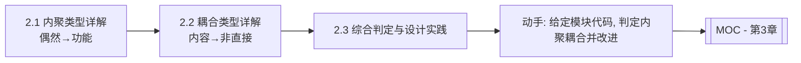

# MOC - 第2章 内聚与耦合

> [!info] 本章定位
> 第2章承接 [[1.3 设计目标、高内聚低耦合核心准则|1.3 节]]的模块独立性概念，系统展开内聚与耦合的七种类型及其判定方法。内聚衡量模块内部各成分的关联程度（由弱到强七种），耦合衡量模块间的依赖程度（由强到弱七种），二者共同决定模块质量。本章是评估与改进模块结构的判据基础，为 [[MOC - 第3章|第3章 DFD→SC 映射]]后结构的优化提供标准。

## 学习路线图

## 知识点导航

| 节 | 主题 | 核心要点 | 入口 |
| --- | --- | --- | --- |
| 2.1 | 内聚类型详解（弱到强） | 偶然/逻辑/时间/过程/通信/顺序/功能七种内聚及示例 | [[2.1 内聚类型详解（弱到强）]] |
| 2.2 | 耦合类型详解（强到弱） | 内容/公共/外部/控制/标记/数据/非直接七种耦合及示例 | [[2.2 耦合类型详解（强到弱）]] |
| 2.3 | 内聚耦合综合判定与设计实践 | 内聚与耦合关系、模块质量评估、解耦与改进策略、综合案例 | [[2.3 内聚耦合综合判定与设计实践]] |

## 核心考点

> [!warning] 重点掌握
> 1. 内聚七类型（由弱到强）：偶然、逻辑、时间、过程、通信、顺序、功能；功能内聚最优。
> 2. 耦合七类型（由强到弱）：内容、公共、外部、控制、标记、数据、非直接；数据耦合最常见且可接受。
> 3. 每种内聚/耦合的含义判定与典型示例。
> 4. 高内聚通常意味着低耦合，但二者非完全等价。
> 5. 常见解耦策略：拆分低内聚模块、封装公共数据、控制标志转数据参数、只传必要数据。
> 6. 能对给定模块代码/结构图判定内聚耦合类型并给出改进方案。

## 自测题

> [!question] 题1
> 列出内聚的七种类型（由弱到强），并为每种举一个简短示例。
> > [!check]- 参考答案
> > ①偶然内聚——模块内各成分无关联，如把几段无关的工具函数随意放入一个 `utils` 模块；②逻辑内聚——完成逻辑相似功能由参数选择，如 `printReport(type)` 根据类型打印不同报表；③时间内聚——同一时间段执行，如 `init()` 同时打开文件、初始化变量、加载配置；④过程内聚——按预定顺序执行，如按业务流程顺序执行的步骤；⑤通信内聚——操作同一数据集，如对同一缓冲区读、写、清空；⑥顺序内聚——前一成分输出为后一成分输入，如读数据→处理数据→写数据；⑦功能内聚——所有成分共同完成单一功能，如 `sin(x)` 计算模块。

> [!question] 题2
> 列出耦合的七种类型（由强到弱），并说明为何内容耦合最差、数据耦合最可接受。
> > [!check]- 参考答案
> > ①内容耦合——直接访问另一模块内部数据/代码；②公共耦合——共享全局数据；③外部耦合——通过外部公共数据环境连接；④控制耦合——传递控制信号；⑤标记耦合——传递数据结构；⑥数据耦合——仅传递数据参数；⑦非直接耦合——无直接关系。内容耦合最差，因为一个模块直接侵入另一模块内部，任何内部改动都会直接影响对方，模块完全丧失独立性。数据耦合最可接受，因为模块间仅通过明确的参数传递必要数据，接口清晰、依赖最小，是正常的模块协作方式。

> [!question] 题3
> 一个模块 `process(type, data)` 根据 `type` 选择执行“计算”“排序”或“过滤”，这属于哪种内聚？如何改进？
> > [!check]- 参考答案
> > 属于逻辑内聚——模块完成逻辑上相关的多种功能，由传入的 `type` 标志选择执行分支。改进方法是拆分为三个功能内聚模块：`calculate(data)`、`sort(data)`、`filter(data)`，分别完成单一功能；调用方根据需要直接调用对应模块，消除标志参数。这样每个模块功能单一、可独立测试与复用。

> [!question] 题4
> 模块 A 调用模块 B 时传入一个完整的 `Student` 记录，但 B 只用到其中的 `score` 字段。这属于哪种耦合？如何改进？
> > [!check]- 参考答案
> > 属于标记耦合——模块间传递数据结构的引用，但接收方只用其中部分字段。改进方法是只传递 B 实际需要的数据：将调用改为 `B(student.score)`，仅传入 `score` 值（数据耦合）。这样 B 不依赖 `Student` 的整体结构，`Student` 字段变化不会波及 B。

## 章节导航

- 上一级：[[MOC - 结构化软件设计]]
- 上一章：[[MOC - 第1章]]
- 下一章：[[MOC - 第3章]]
- 关联：[[MOC - 第7章]]（结构优化运用本章判定准则）
