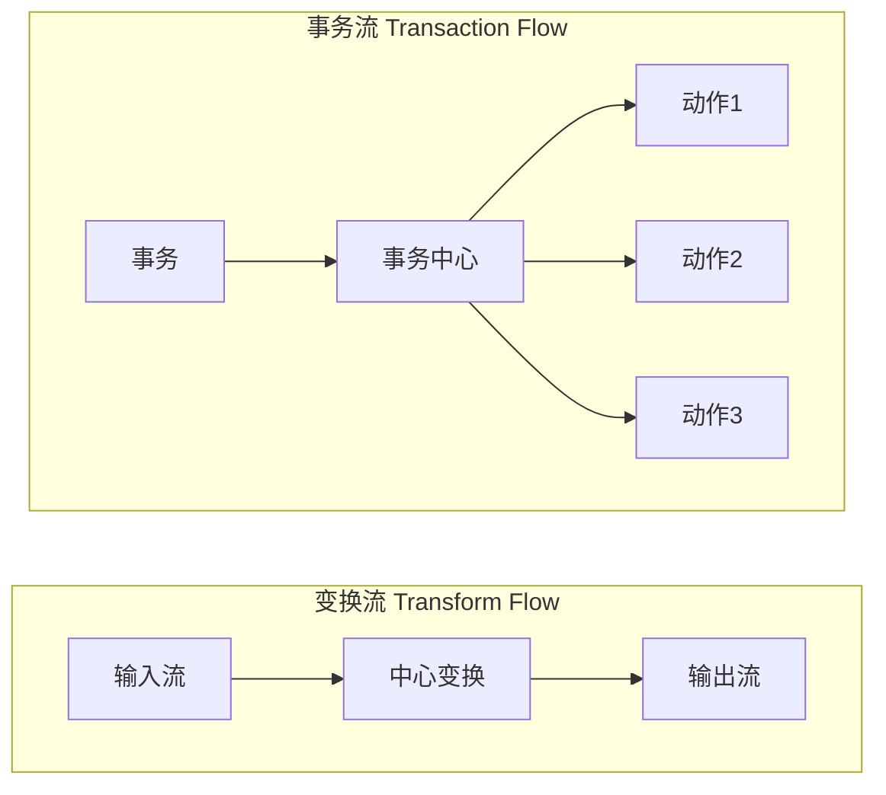
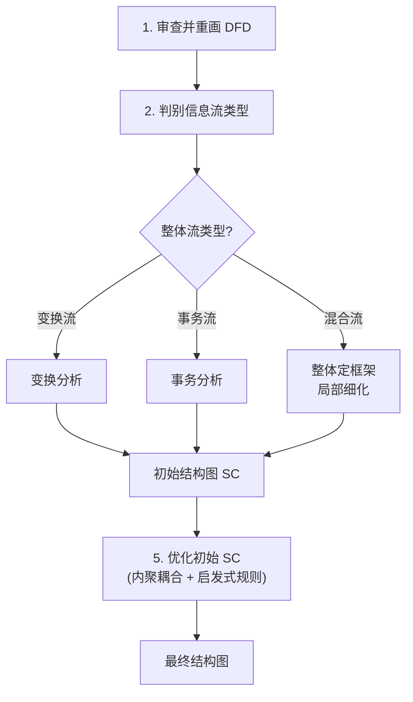
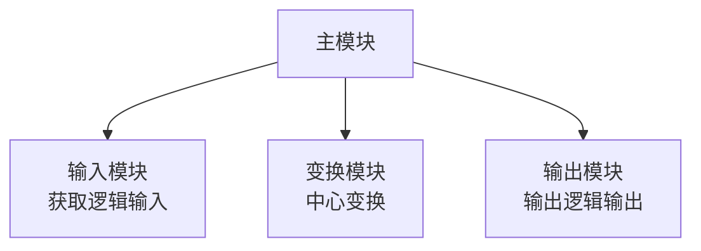
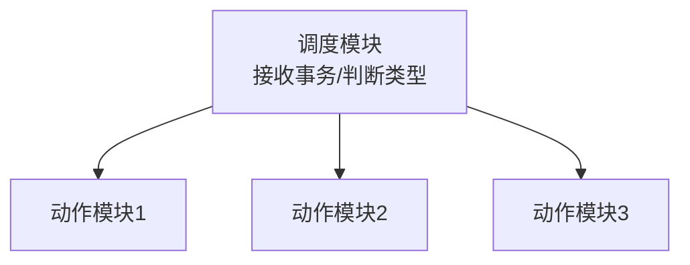

# 3.1 DFD到SC的映射原理

DFD 到 SC 的映射是结构化设计的核心活动，回答“如何把分析阶段的数据流图转化为程序的模块结构”。本节阐明映射的核心思想、DFD 信息流的两种类型（变换流与事务流）、映射的总体步骤，并概述变换分析与事务分析两种映射方法。具体的流类型识别见 [[3.2 变换流识别与事务流识别|3.2 节]]，分层映射见 [[3.3 DFD分层映射与平衡检验|3.3 节]]。

## 映射的核心思想

> [!definition] DFD→SC 映射
> DFD→SC 映射是结构化设计中将数据流图转化为软件结构图的方法：以 DFD 为输入，按信息流的类型选择对应的映射策略，把 DFD 中的加工转化为模块，把数据流转化为模块间的调用与数据传递，导出初始软件结构图(SC)。

> [!note] 映射是起点而非终点
> 从 DFD 机械映射得到的只是**初始**结构图，通常需要依据 [[2.3 内聚耦合综合判定与设计实践|内聚耦合准则]]与启发式规则优化（模块合并/拆分、扇入扇出调整等）。映射提供骨架，优化决定质量，详见 [[MOC - 第7章|第7章]]。

## DFD 信息流的两种类型

DFD 中的数据流按形态分为两类，对应两种映射方法：

| 信息流类型 | 特征 | 映射方法 | 结构图形态 |
| --- | --- | --- | --- |
| 变换流（Transform Flow） | 输入→加工中心→输出的线性流水线 | 变换分析 | 三叉树（输入-变换-输出） |
| 事务流（Transaction Flow） | 事务中心→多条动作路径的分派结构 | 事务分析 | 扇形（调度-多动作） |

> [!note] 两种流的判别
> 若数据流呈“输入→处理→输出”的线性流水线，且存在明显的中心变换，则为变换流；若存在一个加工根据输入类型将数据分派到多个不同处理路径，则该加工为事务中心，对应事务流。一个系统的 DFD 可能同时包含两种流，需对不同部分分别采用相应方法（见 [[3.2 变换流识别与事务流识别|3.2 节混合型 DFD]]）。

## 映射的总体步骤

> [!note] 五步映射法
> ①**审查并重画 DFD**——确保 DFD 完整、正确，数据流与加工清晰；②**判别信息流类型**——区分变换流、事务流或混合流；③**选择映射方法**——变换流用变换分析，事务流用事务分析，混合流整体定框架局部细化；④**导出初始 SC**——按映射方法得到初始模块层次结构；⑤**优化初始 SC**——依据高内聚低耦合与启发式规则优化模块结构。

## 变换分析概述

> [!definition] 变换分析
> 变换分析（Transform Analysis）是把变换型 DFD 映射为变换型结构图的方法。变换流分为传入路径（物理输入→逻辑输入）、中心变换（逻辑输入→逻辑输出）、传出路径（逻辑输出→物理输出）三段，映射得到“输入模块—变换模块—输出模块”的三叉树形结构图。

变换分析的核心是**确定逻辑输入与逻辑输出的边界**，从而划分出中心变换。具体步骤与变换中心识别见 [[3.2 变换流识别与事务流识别|3.2 节]]，深入设计方法见 [[MOC - 第4章|第4章]]。

## 事务分析概述

> [!definition] 事务分析
> 事务分析（Transaction Analysis）是把事务型 DFD 映射为事务型结构图的方法。事务流有一个事务中心，它接收事务并根据类型调度到对应的动作模块，映射得到“调度模块—多个并列动作模块”的扇形结构图。

事务分析的核心是**识别事务中心与事务类型**。具体步骤与事务中心识别见 [[3.2 变换流识别与事务流识别|3.2 节]]，深入设计方法见 [[MOC - 第5章|第5章]]。

## 变换型与事务型的比较

| 比较维度 | 变换型 | 事务型 |
| --- | --- | --- |
| 数据流特征 | 输入→处理→输出的线性流水线 | 一进多出的分派结构 |
| 核心加工 | 中心变换 | 事务中心 |
| 映射方法 | 变换分析 | 事务分析 |
| 结构图形态 | 三叉树（输入-变换-输出分支） | 扇形（调度-多动作） |
| 设计重点 | 划分逻辑输入/输出边界 | 识别事务类型与调度 |
| 典型系统 | 数据处理系统（统计、转换） | 交互系统、菜单系统、命令处理 |

## 小结

DFD→SC 映射是结构化设计的核心活动，以 DFD 为输入，按信息流类型选择映射方法导出初始结构图。DFD 信息流分为变换流（输入→加工中心→输出）与事务流（事务中心→多条动作路径），分别用变换分析与事务分析映射为三叉树形与扇形结构图。映射的总体步骤为：审查重画 DFD → 判别信息流类型 → 选择映射方法 → 导出初始 SC → 优化。映射得到的是初始结构，需依据内聚耦合准则与启发式规则进一步优化。

## 关联

- 上一级：[[MOC - 第3章]]
- 下一节：[[3.2 变换流识别与事务流识别]]
- 关联概念：[[1.1 结构化开发思想、SA与SD衔接关系]]（DFD 是 SA 的产出，映射是 SD 的核心）、[[2.3 内聚耦合综合判定与设计实践]]（初始 SC 优化的依据）、[[5.3 变换分析与事务分析]]（软件工程课程中的映射方法对照）
