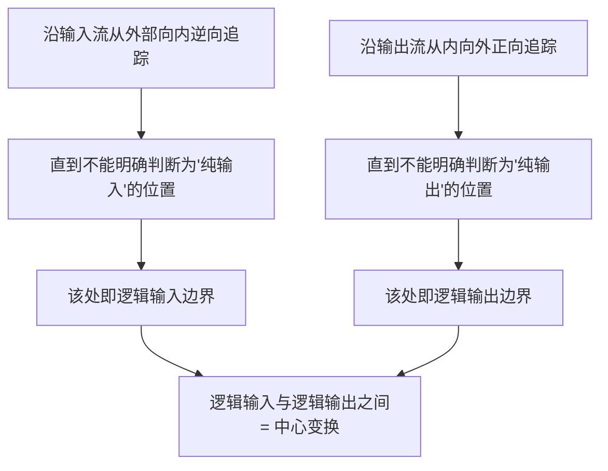
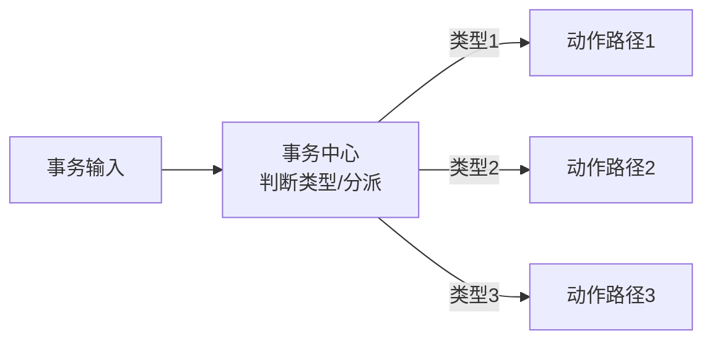
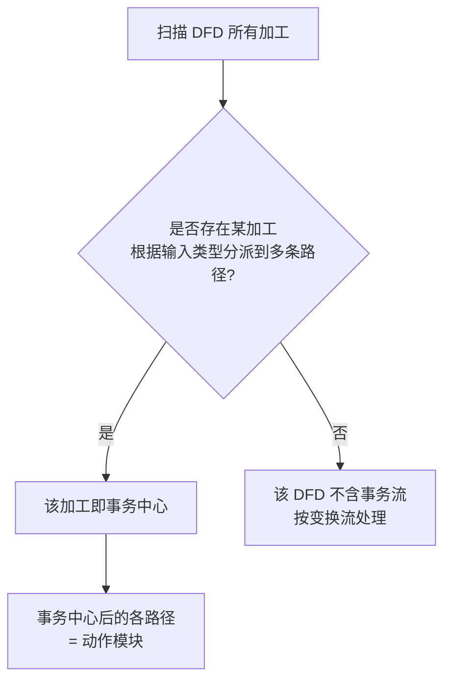
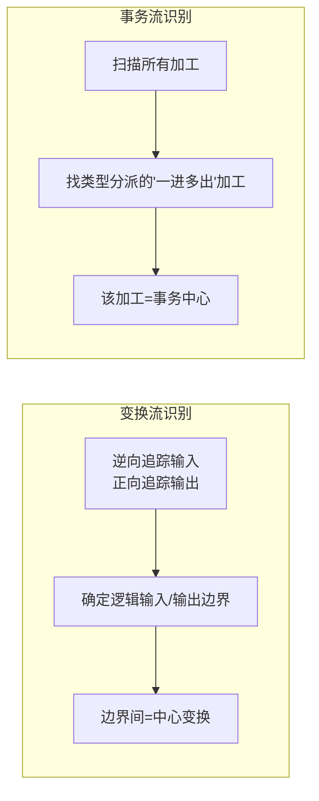
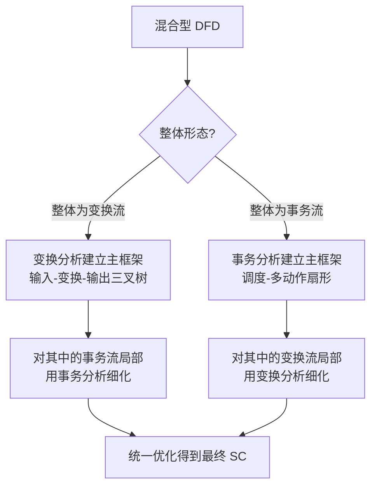

# 3.2 变换流识别与事务流识别

DFD→SC 映射的第一步是判别信息流类型，这决定后续采用 [[3.1 DFD到SC的映射原理|变换分析还是事务分析]]。本节详细阐述变换流与事务流的特征、变换中心与事务中心的识别方法，以及同时包含两种流的混合型 DFD 的处理策略。准确识别流的类型是映射正确性的前提。

## 变换流特征

> [!definition] 变换流
> 变换流（Transform Flow）是数据沿输入路径进入系统，经中心变换处理后沿输出路径输出的线性流水线形态的数据流，分为传入路径、中心变换、传出路径三段。

| 段 | 边界 | 作用 |
| --- | --- | --- |
| 传入路径 | 物理输入 → 逻辑输入 | 接收、校验、格式化外部输入，转化为系统内部数据 |
| 中心变换 | 逻辑输入 → 逻辑输出 | 完成核心的数据变换处理 |
| 传出路径 | 逻辑输出 → 物理输出 | 把处理结果格式化、输出到外部 |

> [!note] 变换流的典型场景
> 变换流常见于数据处理系统：如统计系统（输入原始数据→统计计算→输出报表）、转换系统（输入一种格式→格式转换→输出另一种格式）、计算系统（输入参数→计算→输出结果）。

## 变换中心（加工中心）的识别方法

变换中心的识别是变换分析的关键，核心是确定逻辑输入与逻辑输出的边界：

> [!tip] 识别技巧
> “纯输入”指那些仅做数据接收、校验、格式转换而未做实质业务处理的加工；“纯输出”指那些仅做结果格式化、输出的加工。当追踪到加工开始执行实质业务变换时，即到达逻辑输入边界；当追踪到加工不再做实质变换而仅做输出准备时，即到达逻辑输出边界。两边界之间的加工集合即中心变换。

> [!example] 识别示例
> 某成绩统计系统 DFD：`输入原始成绩 → 校验成绩 → 汇总统计 → 排序 → 格式化报表 → 输出报表`。
> - 逆向追踪输入：`输入原始成绩`、`校验成绩` 属纯输入 → 逻辑输入边界在 `汇总统计` 前；
> - 正向追踪输出：`格式化报表`、`输出报表` 属纯输出 → 逻辑输出边界在 `排序` 后；
> - 中心变换 = `汇总统计` + `排序`。

## 事务流特征

> [!definition] 事务流
> 事务流（Transaction Flow）是一个事务进入系统后，由事务中心根据事务类型分派到多条不同处理路径的“一进多出”扇形数据流。

> [!note] 事务流的典型场景
> 事务流常见于交互系统、菜单系统、命令处理系统：如菜单系统（选择菜单项→分派到对应功能）、命令处理（输入命令→分派到对应处理器）、交易系统（输入交易类型→分派到存款/取款/查询等处理）。

## 事务中心的识别方法

事务中心的识别比变换中心直接——寻找那个根据输入类型分派数据流的加工：

> [!tip] 事务中心的判定信号
> 事务中心通常表现为：一个加工接收一个输入数据流，然后产生多个输出数据流，且选择哪条输出由输入数据的“类型”字段决定。它的特征是“一进多出 + 类型分派”，与变换流的“线性流水线”形态明显不同。

> [!example] 识别示例
> 某 ATM 系统 DFD：`输入交易请求 → 交易调度 → [存款/取款/查询/转账]`。
> - `交易调度` 接收一个请求，根据 `交易类型` 分派到四条路径 → `交易调度` 是事务中心；
> - 动作路径 = `存款`、`取款`、`查询`、`转账`。

## 变换流与事务流对比

| 比较维度 | 变换流 | 事务流 |
| --- | --- | --- |
| 数据流形态 | 线性流水线（一进一出） | 一进多出（扇形分派） |
| 核心加工 | 中心变换 | 事务中心 |
| 识别方法 | 确定逻辑输入/输出边界 | 找类型分派的加工 |
| 映射方法 | 变换分析 | 事务分析 |
| 结构图形态 | 三叉树 | 扇形 |
| 典型系统 | 数据处理、统计、转换 | 菜单、命令、交互调度 |

## 混合型 DFD

> [!warning] 混合型 DFD
> 实际系统的 DFD 往往**同时包含变换流与事务流**。设计时应先识别整体形态，再对不同部分分别采用相应方法，遵循“整体定框架、局部定细节”原则。

> [!example] 混合型示例
> 某订单处理系统 DFD：`输入订单 → 订单调度 → [新增订单/修改订单/删除订单]`，其中 `新增订单` 路径内部为 `校验 → 计算金额 → 保存 → 输出确认` 的线性流水线。
> - 整体形态：`订单调度` 根据操作类型分派 → 整体为事务流，用事务分析建立主框架（调度-多动作扇形）；
> - 局部细化：`新增订单` 动作内部为变换流，用变换分析细化（输入-变换-输出三叉树）。

## 小结

变换流呈“输入→加工中心→输出”线性流水线，识别方法是沿输入逆向追踪确定逻辑输入边界、沿输出正向追踪确定逻辑输出边界，两边界间即中心变换。事务流呈“事务中心→多条动作路径”扇形分派，识别方法是寻找根据输入类型分派的“一进多出”加工即事务中心。实际 DFD 常为混合型，遵循“整体定框架、局部定细节”原则——整体为变换流则用变换分析建框架、局部事务流用事务分析细化，反之亦然，最后统一优化。

## 关联

- 上一级：[[MOC - 第3章]]
- 上一节：[[3.1 DFD到SC的映射原理]]
- 下一节：[[3.3 DFD分层映射与平衡检验]]
- 关联概念：[[MOC - 第4章]]（变换分析的深入设计）、[[MOC - 第5章]]（事务分析的深入设计）、[[5.3 变换分析与事务分析]]（软件工程课程中的对照）
