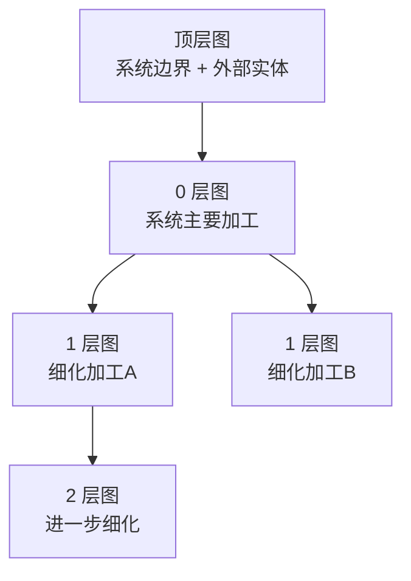
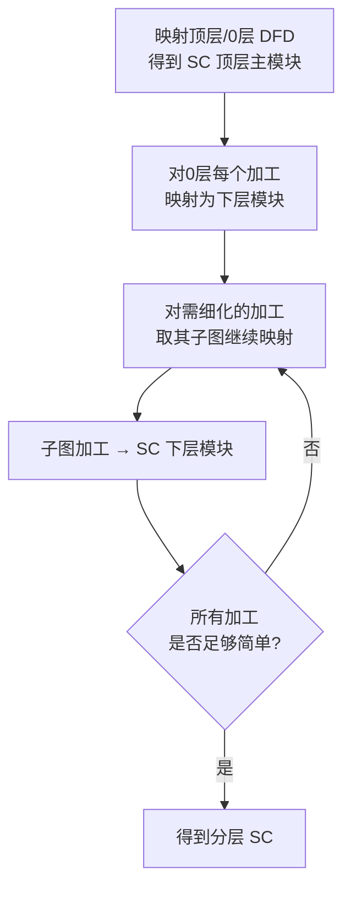
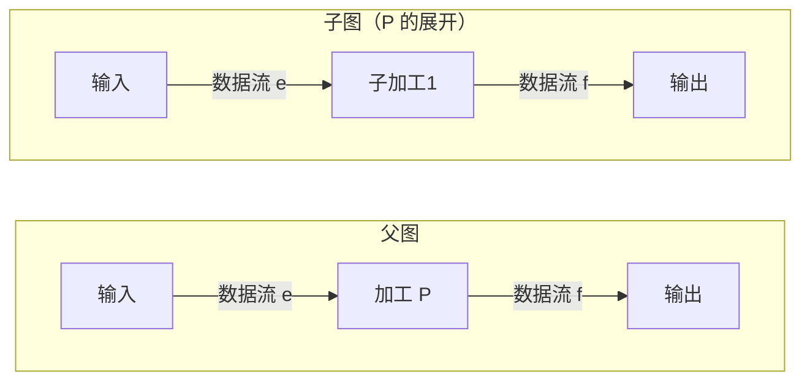
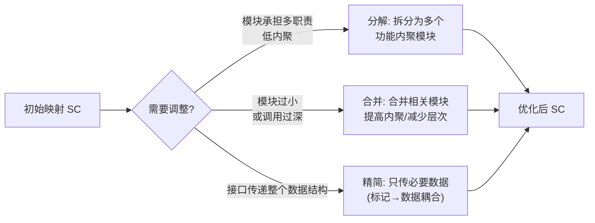
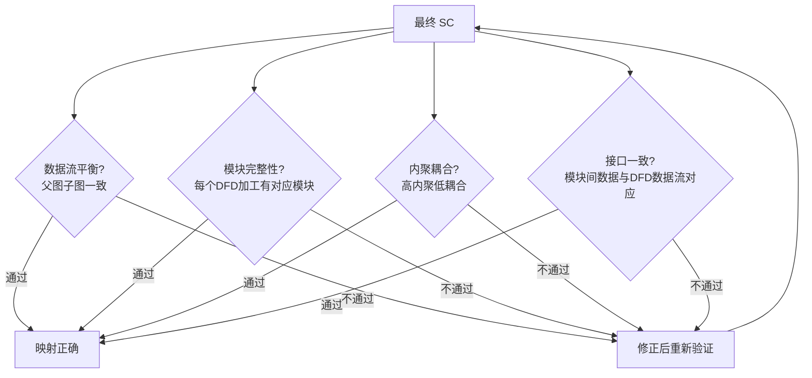

# 3.3 DFD分层映射与平衡检验

实际系统的 DFD 通常分层绘制（顶层→0 层→1 层……），映射到 SC 也需逐层进行。本节阐明分层 DFD 的逐层映射方法、父图与子图的平衡检验、映射过程中的模块分解与合并，以及映射结果的验证方法。分层映射与平衡检验是保证 [[3.1 DFD到SC的映射原理|DFD→SC 映射]]正确性与可追溯性的关键。

## 分层 DFD 回顾

> [!definition] 分层 DFD
> 分层 DFD 是把一个复杂系统的数据流图自顶向下逐层细化的一组图：顶层图（Context Diagram）展示系统与外部实体的边界，0 层图展开顶层系统的主要加工，1 层图再展开 0 层中某个加工，依此类推。

> [!note] 分层的意义
> 分层 DFD 符合 [[1.1 结构化开发思想、SA与SD衔接关系|自顶向下、逐步求精]]思想：每层只关注某一层抽象，避免一张图过于复杂。分层也为 SC 的逐层映射提供了自然对应——DFD 的加工层次映射为 SC 的模块层次。

## 逐层映射方法

分层 DFD 的映射遵循“由顶向下、逐层展开”的原则，把 DFD 的加工层次映射为 SC 的模块层次：

> [!note] 映射的层次对应
> DFD 的加工层次与 SC 的模块层次大致对应：顶层 DFD 的系统对应 SC 的主模块；0 层 DFD 的加工对应主模块直接调用的下层模块；1 层 DFD（某加工的展开）对应下层模块的再下层模块。每一层的映射仍按 [[3.1 DFD到SC的映射原理|信息流类型]]选择变换分析或事务分析。

> [!tip] 何时停止细化
> 当一个加工已足够简单（功能单一、可用一个模块直接实现），无需再展开子图时，映射停止。这与 [[1.1 结构化开发思想、SA与SD衔接关系|逐步求精]]的终止条件一致——细化到模块可独立实现为止。

## 父图与子图的平衡检验

> [!definition] 父图子图平衡
> 父图子图平衡指：子图（某加工的展开图）的输入/输出数据流必须与父图中对应加工的输入/输出数据流在数量、名称、方向上一致，即数据流一致性。

> [!warning] 平衡的必要性
> 平衡检验保证分层 DFD 在逐层细化中没有丢失或增加数据流——子图如实实现了父图加工的职责。若不平衡，说明细化存在错误（如某数据流未被任何子加工处理、或子图引入了父图未定义的数据流），将导致映射得到的 SC 结构错误。平衡是 DFD 正确性与映射可靠性的前提。

### 平衡的判定规则

| 检查项 | 平衡要求 | 不平衡示例 |
| --- | --- | --- |
| 输入数据流 | 子图输入 = 父图加工输入（数量/名称/方向） | 父图有 2 个输入，子图只处理 1 个 |
| 输出数据流 | 子图输出 = 父图加工输出（数量/名称/方向） | 子图多出一个父图未定义的输出 |
| 数据流名称 | 名称一致（允许等价别名但需在数据字典说明） | 父图 `订单`，子图 `请求`，未说明等价 |
| 数据流方向 | 方向一致（输入/输出方向） | 父图入流，子图误为出流 |

> [!note] 允许的等价情况
> 若父图一条数据流在子图中被分解为多条数据流（或反之），但总和一致且在数据字典中可说明等价，仍视为平衡。例如父图 `学生数据` 在子图展开为 `学号`+`姓名`+`成绩`，只要数据字典定义了 `学生数据 = 学号 + 姓名 + 成绩`，即平衡。

## 映射过程中的模块分解与合并

从 DFD 映射得到的初始 SC 往往需要调整，主要操作为分解与合并：

| 操作 | 触发条件 | 目标 |
| --- | --- | --- |
| 分解 | 模块承担多种职责（低内聚） | 拆为多个功能内聚模块 |
| 合并 | 模块过小、调用过深、或高度相关 | 提高内聚、减少层次与调用开销 |
| 精简接口 | 传递整个数据结构但只用部分 | 转标记耦合为数据耦合 |
| 调整扇出 | 一个模块扇出过大 | 拆分或增加中间层 |

> [!tip] 分解与合并的依据
> 分解与合并应以 [[2.1 内聚类型详解（弱到强）|内聚]]与 [[2.2 耦合类型详解（强到弱）|耦合]]准则为依据：分解的目的是提升内聚，合并的目的是减少不必要的耦合与调用开销。详细的启发式规则（扇入扇出、作用范围与控制范围）见 [[MOC - 第7章|第7章]]。

## 映射结果的验证方法

得到最终 SC 后，需从以下方面验证映射的正确性：

| 验证项 | 验证内容 |
| --- | --- |
| 数据流平衡 | 各层 DFD 父图子图数据流一致 |
| 模块完整性 | DFD 中每个加工都有对应模块，无遗漏 |
| 内聚耦合 | 各模块达到高内聚（顺序/功能）、低耦合（数据/非直接） |
| 接口一致 | SC 中模块间传递的数据与 DFD 数据流对应 |
| 可追溯性 | 每个模块可追溯到 DFD 加工与需求 |

## 小结

分层 DFD 的映射遵循由顶向下、逐层展开的原则，DFD 加工层次对应 SC 模块层次，每层按信息流类型选择变换分析或事务分析。父图子图平衡要求子图输入/输出数据流与父图对应加工一致，是 DFD 正确性与映射可靠性的前提。映射得到的初始 SC 需通过分解（提升内聚）、合并（减少耦合与调用）、精简接口（转标记为数据耦合）等操作优化。最终通过数据流平衡、模块完整性、内聚耦合、接口一致与可追溯性五方面验证映射正确性。

## 关联

- 上一级：[[MOC - 第3章]]
- 上一节：[[3.2 变换流识别与事务流识别]]
- 关联概念：[[1.1 结构化开发思想、SA与SD衔接关系]]（分层映射符合自顶向下逐步求精）、[[2.3 内聚耦合综合判定与设计实践]]（模块分解合并的依据）、[[MOC - 第7章]]（结构优化的启发式规则）、[[4.1 数据流图（DFD）与数据字典]]（分层 DFD 与平衡的来源）
