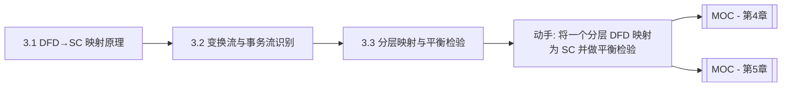

# MOC - 第3章 数据流图映射软件结构图

> [!info] 本章定位
> 第3章是结构化设计的方法学核心，解决“如何把 [[1.1 结构化开发思想、SA与SD衔接关系|SA 阶段]]得到的 DFD 系统地映射为软件结构图（SC）”。本章阐明 DFD→SC 的映射总原理，区分变换流与事务流两种信息流类型及其识别方法，并介绍分层 DFD 的逐层映射与父图子图平衡检验。映射得到的初始结构图随后需依据 [[MOC - 第2章|第2章内聚耦合准则]]与 [[MOC - 第7章|第7章启发式规则]]优化。

## 学习路线图

## 知识点导航

| 节 | 主题 | 核心要点 | 入口 |
| --- | --- | --- | --- |
| 3.1 | DFD 到 SC 的映射原理 | 映射核心思想、信息流类型、映射步骤概述 | [[3.1 DFD到SC的映射原理]] |
| 3.2 | 变换流识别与事务流识别 | 变换中心/事务中心识别、混合型 DFD 处理 | [[3.2 变换流识别与事务流识别]] |
| 3.3 | DFD 分层映射与平衡检验 | 逐层映射、父图子图平衡、模块分解合并与验证 | [[3.3 DFD分层映射与平衡检验]] |

## 核心考点

> [!warning] 重点掌握
> 1. DFD→SC 映射的核心思想：以 DFD 为输入，按信息流类型选择映射方法，导出初始 SC。
> 2. 两种信息流类型：变换流（输入→加工中心→输出）、事务流（事务中心→多条动作路径）。
> 3. 变换中心与事务中心的识别方法。
> 4. 映射的总体步骤：重画/审查 DFD → 判别信息流类型 → 分别用变换分析/事务分析 → 得到初始 SC → 优化。
> 5. 分层 DFD 的逐层映射，父图与子图的平衡（数据流一致性）。
> 6. 混合型 DFD 的处理：整体定框架，局部细化。

## 自测题

> [!question] 题1
> 简述 DFD 到 SC 映射的核心思想与总体步骤。
> > [!check]- 参考答案
> > 核心思想：SD 以 DFD 为输入，按 DFD 中信息流的类型选择对应的映射方法，将数据流加工转化为模块层次，导出初始软件结构图(SC)。总体步骤：①审查并重画 DFD，确保完整正确；②判别 DFD 的信息流类型（变换流或事务流）；③对变换流用变换分析、对事务流用事务分析，分别映射为对应结构图；④得到初始 SC；⑤依据高内聚低耦合准则与启发式规则优化初始 SC。映射是起点而非终点，工程师的优化判断不可省略。

> [!question] 题2
> 如何识别变换流与事务流？分别说明变换中心与事务中心的判定方法。
> > [!check]- 参考答案
> > 变换流特征：数据沿输入路径进入系统，经中心变换后沿输出路径输出，呈“输入→处理→输出”线性流水线。变换中心（加工中心）的识别：沿输入流从外部向内逆向追踪，直到不能明确判断为“纯输入”的位置为逻辑输入边界；沿输出流从内向外正向追踪，直到不能明确判断为“纯输出”的位置为逻辑输出边界；逻辑输入与逻辑输出之间即变换中心。事务流特征：一个事务进入后由某加工根据类型分派到多条处理路径，呈“一进多出”扇形。事务中心的识别：找到那个根据输入数据类型将数据流分派到多个不同路径的加工，即为事务中心。

> [!question] 题3
> 什么是分层 DFD 的父图子图平衡？为什么必须进行平衡检验？
> > [!check]- 参考答案
> > 父图子图平衡指：子图的输入/输出数据流必须与父图中对应加工的输入/输出数据流在数量、名称、方向上一致（数据流一致性）。平衡检验是必要的，因为它保证分层 DFD 在逐层细化过程中没有丢失或增加数据流——即子图如实实现了父图加工的职责。若不平衡，说明细化过程中存在遗漏或错误（如某数据流未被任何子加工处理、或子图引入了父图未定义的数据流），将导致映射得到的 SC 结构错误。平衡是 DFD 正确性与映射可靠性的前提。

> [!question] 题4
> 一个系统的 DFD 既包含变换流又包含事务流，应如何映射？
> > [!check]- 参考答案
> > 对混合型 DFD，应先识别整体形态：若整体为变换流，则用变换分析建立主框架（输入-变换-输出三叉树），对其中的事务流局部用事务分析细化（将该局部加工映射为调度+动作模块）；若整体为事务流，则用事务分析建立主框架（调度-多动作扇形），对其中的变换流局部用变换分析细化（将某动作模块内部展开为输入-变换-输出）。原则是“整体定框架、局部定细节”，对不同部分分别采用对应的映射方法，最后统一优化初始 SC。

## 章节导航

- 上一级：[[MOC - 结构化软件设计]]
- 上一章：[[MOC - 第2章]]
- 下一章：[[MOC - 第4章]]（变换分析设计方法的深入）
- 关联：[[MOC - 第1章]]（SA-SD 衔接是映射的起点）
