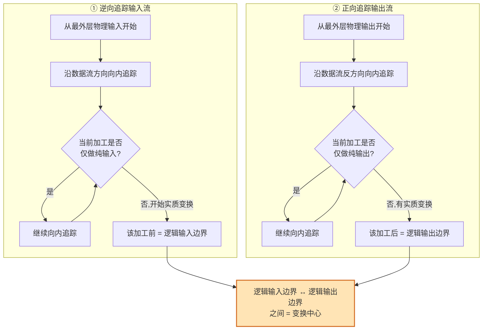

# 4.1 变换流识别与变换中心确定

变换流是结构化设计中最常见的信息流形态。准确识别变换流并确定其变换中心边界，是运用 [[4.2 变换流映射步骤与SC生成|变换分析四步法]]生成软件结构图的前提。本节在 [[3.2 变换流识别与事务流识别|3.2 节识别基础]]上深入讲解变换流的三段划分、变换中心的双向追踪确定方法，以及输入流路径与输出流路径的界定。

## 变换流的定义

> [!definition] 变换流
> 变换流（Transform Flow）是数据沿输入路径进入系统，经中心变换处理后沿输出路径流出的线性流水线数据流。它由三段组成：传入路径、中心变换、传出路径，呈"输入流→变换中心→输出流"的线性结构。

变换流的三段划分如下表：

| 段 | 起点 → 终点 | 职责 | 加工特征 |
| --- | --- | --- | --- |
| 传入路径 | 物理输入 → 逻辑输入 | 接收、校验、格式化外部输入，转为内部数据 | 纯输入：不改变业务语义 |
| 中心变换 | 逻辑输入 → 逻辑输出 | 完成核心数据变换与业务计算 | 实质业务处理 |
| 传出路径 | 逻辑输出 → 物理输出 | 结果格式化、组织并输出到外部 | 纯输出：不改变业务语义 |

> [!note] 变换流的典型场景
> 变换流常见于数据处理类系统：统计系统（输入原始数据→汇总计算→输出报表）、格式转换系统（输入一种格式→转换→输出另一种格式）、计算系统（输入参数→计算→输出结果）、报表生成系统（输入业务数据→汇总→生成报表）。

## 变换中心的识别方法

变换中心（又称加工中心）的识别是变换分析的关键环节，其核心是确定**逻辑输入边界**与**逻辑输出边界**。两边界之间的加工集合即变换中心。识别采用双向追踪法：

> [!tip] "纯输入"与"纯输出"的判定
> - **纯输入加工**：仅做数据接收、编辑、校验、格式转换等准备性工作，不改变数据的业务语义。如"读取记录""校验格式""编辑输入"。
> - **纯输出加工**：仅做结果格式化、组织、显示等输出准备，不改变数据业务语义。如"格式化报表""显示结果""打印输出"。
> - 当追踪到加工开始执行**实质业务变换**（如计算、汇总、转换、排序业务数据）时，即到达逻辑输入边界；当加工不再做实质变换而仅做输出准备时，即到达逻辑输出边界。

> [!example] 识别示例：成绩统计系统
> 某 DFD 加工链：`输入原始成绩 → 校验成绩 → 汇总统计 → 排序 → 格式化报表 → 输出报表`
> - **逆向追踪输入**：`输入原始成绩`、`校验成绩` 属纯输入 → 逻辑输入边界在 `汇总统计` 之前；
> - **正向追踪输出**：`格式化报表`、`输出报表` 属纯输出 → 逻辑输出边界在 `排序` 之后；
> - **变换中心** = `汇总统计` + `排序`（两边界之间的加工集合）。

## 输入流路径

> [!definition] 输入流路径
> 输入流路径（传入路径）是从外部实体到变换中心的逻辑输入边界之间的数据流路径，包含所有纯输入加工及其数据流。

输入流路径的界定要点：

1. **起点**：外部实体（如用户、文件、设备）提供的物理输入。
2. **终点**：逻辑输入边界——即进入变换中心前的数据流。
3. **路径上的加工**：均为纯输入加工，负责接收、校验、编辑、格式转换。
4. **数据流向**：由外向内，逐步将外部格式转化为系统内部标准数据。

> [!note] 输入流路径可能为空
> 当外部实体的数据直接进入变换中心（无需校验、格式转换）时，输入流路径为空，此时物理输入即逻辑输入。这种情况较少见，多数系统至少包含校验环节。

## 输出流路径

> [!definition] 输出流路径
> 输出流路径（传出路径）是从变换中心的逻辑输出边界到外部实体之间的数据流路径，包含所有纯输出加工及其数据流。

输出流路径的界定要点：

1. **起点**：逻辑输出边界——即变换中心产出的逻辑输出数据流。
2. **终点**：外部实体接收的物理输出。
3. **路径上的加工**：均为纯输出加工，负责格式化、组织、输出。
4. **数据流向**：由内向外，将内部处理结果转化为外部可接收的格式。

## 变换流识别完整示意图

将三段整合，得到变换流识别的完整示意：

> [!warning] 边界判定的常见误区
> 1. **将校验误判为变换**：数据校验（如格式检查、范围检查）属纯输入，不改变业务语义，不应划入变换中心。
> 2. **将排序误判为纯输出**：排序改变数据的业务排列，属实质变换，应划入变换中心而非传出路径。
> 3. **边界划得过宽或过窄**：过宽会把纯输入/输出纳入变换中心导致模块职责混乱；过窄会遗漏核心变换。判定标准是"是否改变业务语义"。

## 与事务流的区别

变换流与 [[5.1 事务流识别与事务中心确定|事务流]]在形态上有本质区别，识别时需对照判断：

| 比较维度 | 变换流 | 事务流 |
| --- | --- | --- |
| 数据流形态 | 线性流水线（一进一出） | 一进多出（扇形分派） |
| 核心加工 | 中心变换（实质业务处理） | 事务中心（类型分派） |
| 边界确定 | 双向追踪法 | 寻找分派加工 |
| 结构图形态 | 三叉树 | 扇形 |
| 典型系统 | 数据处理、统计、转换 | 菜单、命令、交易调度 |

## 小结

变换流呈"输入流→变换中心→输出流"的线性流水线，分为传入路径、中心变换、传出路径三段。变换中心的识别采用双向追踪法：沿输入流从外部向内逆向追踪，直到加工开始执行实质业务变换处即逻辑输入边界；沿输出流从内向外正向追踪，直到加工不再做实质变换处即逻辑输出边界；两边界间的加工集合即变换中心。输入流路径是外部实体到逻辑输入边界的纯输入加工链，输出流路径是逻辑输出边界到外部实体的纯输出加工链。准确划定边界是后续 [[4.2 变换流映射步骤与SC生成|变换分析映射]]正确性的基础。

## 关联

- 上一级：[[MOC - 第4章]]
- 下一节：[[4.2 变换流映射步骤与SC生成]]
- 关联概念：[[3.2 变换流识别与事务流识别]]（变换流识别基础）、[[3.1 DFD到SC的映射原理]]（映射总原理）、[[5.1 事务流识别与事务中心确定]]（事务流对照）
