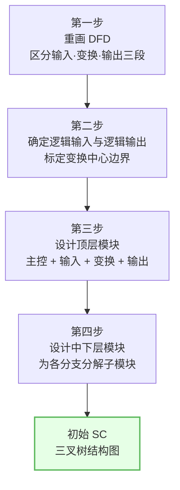
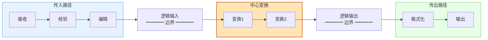
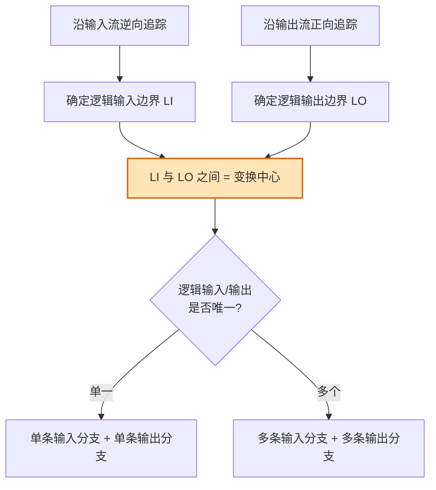
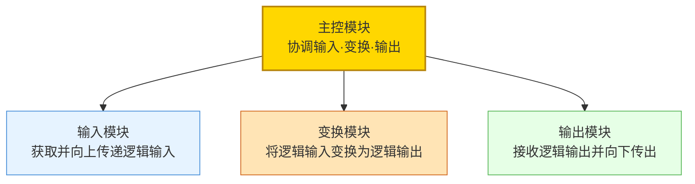
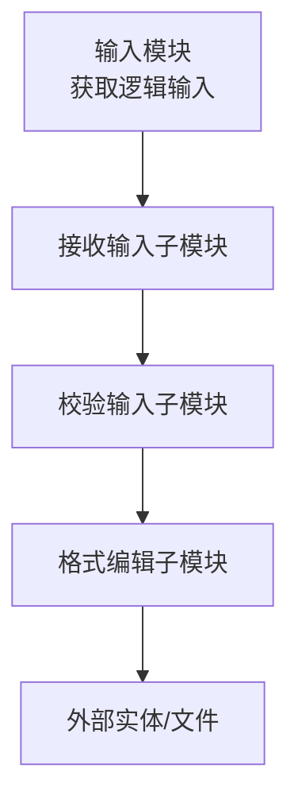
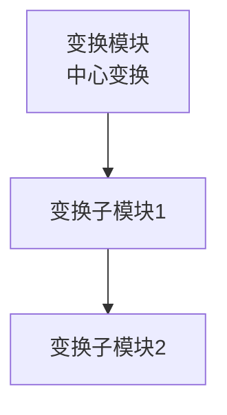
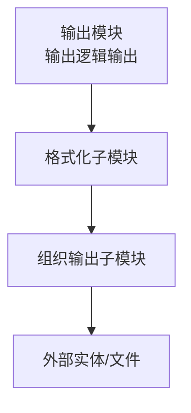
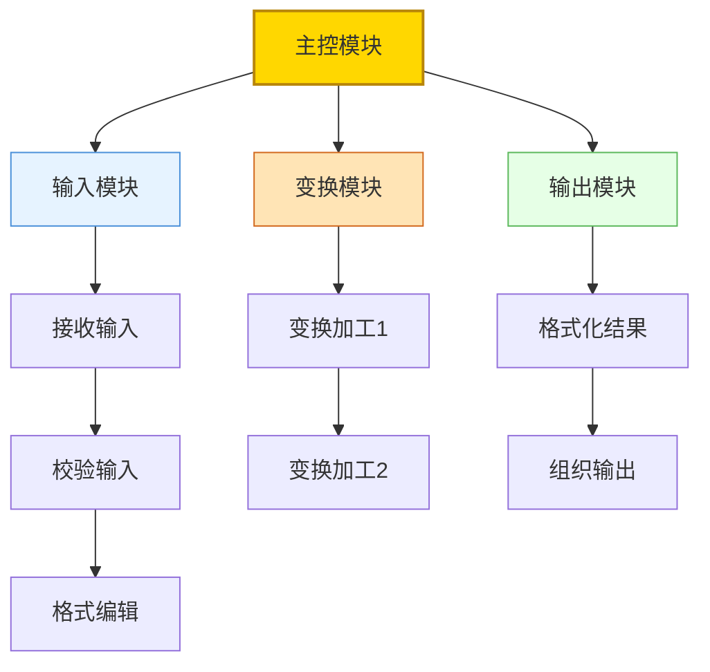
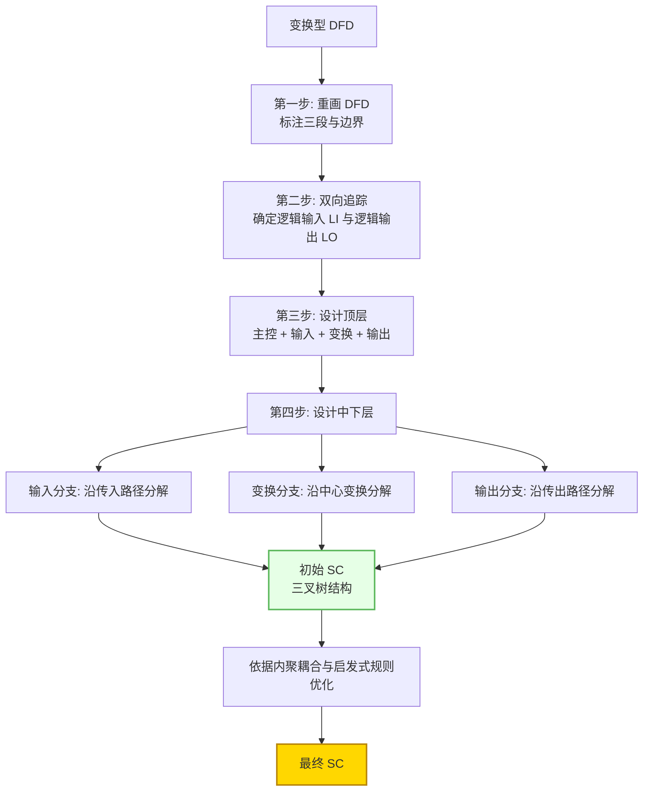

# 4.2 变换流映射步骤与SC生成

在 [[4.1 变换流识别与变换中心确定|确定变换中心边界]]后，需将变换型 DFD 系统地映射为软件结构图（SC）。本节阐述变换分析四步法——从重画 DFD、确定边界，到设计顶层与中下层模块，最终导出三叉树形初始 SC。这是变换流设计的核心操作流程，所得初始 SC 需再经 [[MOC - 第6章|优化原则]]改进。

## 变换分析四步法概述

> [!definition] 变换分析
> 变换分析（Transform Analysis）是把变换型 DFD 映射为变换型软件结构图的方法。它通过四步操作，将 DFD 中的传入路径、中心变换、传出路径分别映射为 SC 的输入模块、变换模块、输出模块，形成以主控模块为根的三叉树层次结构。

## 第一步：重画 DFD

重画 DFD 的目的是在原图上清晰区分三段，为映射做准备：

1. **审查 DFD**：确认数据流完整、加工清晰、无遗漏。
2. **标注三段**：在 DFD 上用不同标记区分传入路径、中心变换、传出路径。
3. **标定边界**：明确标出逻辑输入边界与逻辑输出边界。

> [!tip] 重画要点
> 重画时保留原 DFD 的加工与数据流，仅增加边界标注与分段着色，不改变 DFD 本身的语义。这一步看似简单，但能显著降低后续映射出错概率。

## 第二步：确定逻辑输入与逻辑输出

运用 [[4.1 变换流识别与变换中心确定|双向追踪法]]标定变换中心边界：

- **逻辑输入**：传入路径终点、中心变换起点的数据流。一个 DFD 可能有多个逻辑输入。
- **逻辑输出**：中心变换终点、传出路径起点的数据流。一个 DFD 可能有多个逻辑输出。
- **变换中心**：逻辑输入与逻辑输出之间的所有加工。

> [!note] 多个逻辑输入/输出的处理
> 当变换中心有多个逻辑输入（如需合并两类数据才能变换）或多个逻辑输出（如同一变换产生多种结果）时，顶层仍是一个主控模块，但其下输入分支、输出分支可对应多个逻辑输入/输出，分别设计相应模块。

## 第三步：设计顶层模块

顶层模块是 SC 的根，体现变换流的整体结构。顶层包含一个主控模块与三个直接下属模块：

| 顶层模块 | 职责 | 对应 DFD 部分 |
| --- | --- | --- |
| 主控模块 | 协调三分支，控制整体流程 | 整个变换流 |
| 输入模块 | 获取逻辑输入并传递给主控 | 传入路径 |
| 变换模块 | 将逻辑输入变换为逻辑输出 | 中心变换 |
| 输出模块 | 接收逻辑输出并输出到外部 | 传出路径 |

> [!note] 模块间数据传递
> 输入模块将逻辑输入传给主控，主控传给变换模块，变换模块产出逻辑输出回传主控，主控传给输出模块。主控模块充当数据中转与流程协调枢纽。

## 第四步：设计中下层模块

为顶层三分支分别分解子模块，形成层次结构：

### 输入分支的分解

沿传入路径的加工链，为每个纯输入加工设计一个输入子模块，自顶向下逐层分解：

### 变换分支的分解

沿中心变换的加工链，为每个变换加工设计一个变换子模块：

### 输出分支的分解

沿传出路径的加工链，为每个纯输出加工设计一个输出子模块：

## 完整 SC 结构图生成

将三分支合并，得到变换型 SC 的三叉树完整结构：

> [!definition] 三叉树结构
> 变换型 SC 的特征形态：主控模块为根，其下分为输入、变换、输出三个分支，每个分支按 DFD 加工链逐层分解，整体呈一棵"一根三叉"的树形结构，称为三叉树。

## 变换流映射完整步骤图

将四步法与 SC 生成整合为完整流程：

> [!warning] 初始 SC 需优化
> 四步法得到的是**初始** SC，是 DFD 的机械映射。它可能存在模块过大、接口参数过多、扇出过大、内聚偏低等问题。必须依据 [[6.1 模块分解与合并原则|模块分解原则]]与 [[6.2 结构图优化策略|优化策略]]改进后才可用于工程实践。优化不是可选步骤，而是设计闭环的必要环节。

## 小结

变换分析四步法将变换型 DFD 系统映射为三叉树形 SC：①重画 DFD 标注三段与边界；②用双向追踪法确定逻辑输入与逻辑输出，标定变换中心；③设计顶层模块——主控模块下分输入、变换、输出三类模块；④为三分支分别沿各自加工链分解中下层子模块，形成层次结构。所得初始 SC 呈"一主控、三分支、逐层细化"的三叉树形态，需再经内聚耦合与启发式规则优化。

## 关联

- 上一级：[[MOC - 第4章]]
- 上一节：[[4.1 变换流识别与变换中心确定]]
- 下一节：[[4.3 变换流设计案例与实践]]
- 关联概念：[[3.1 DFD到SC的映射原理]]（映射总原理）、[[6.1 模块分解与合并原则]]（初始 SC 优化）、[[5.2 事务流映射步骤与SC生成]]（事务分析对照）
