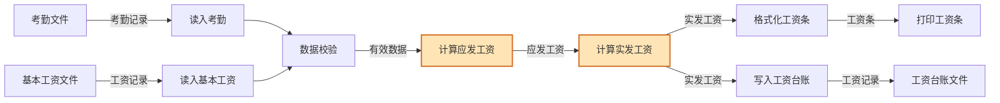
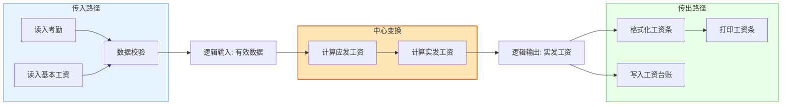
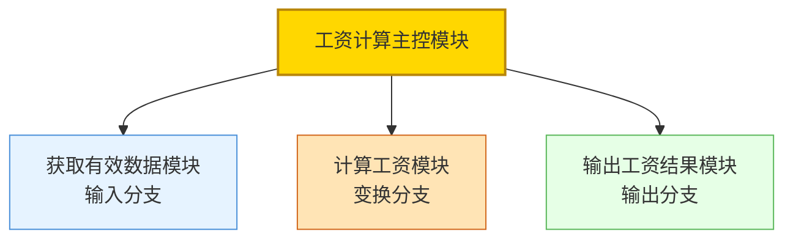
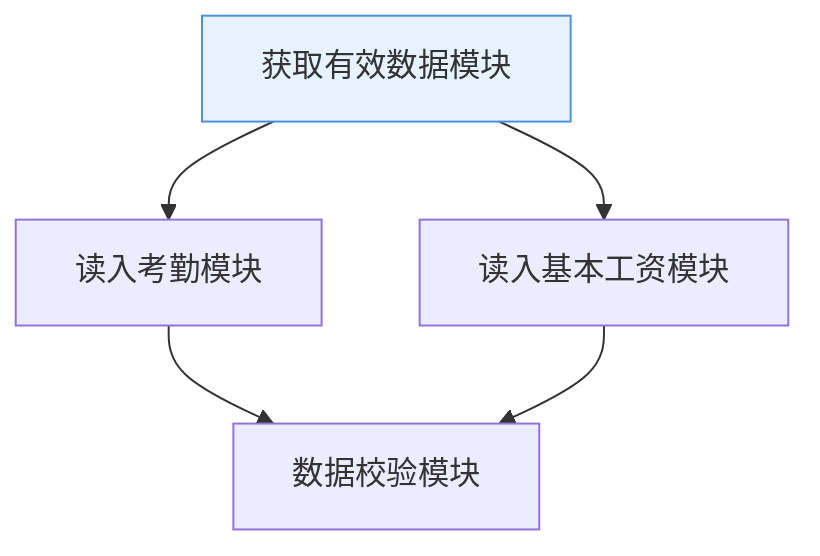
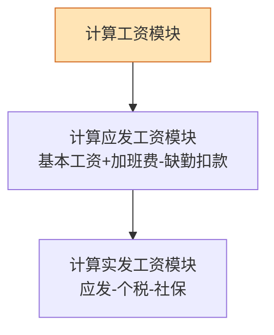
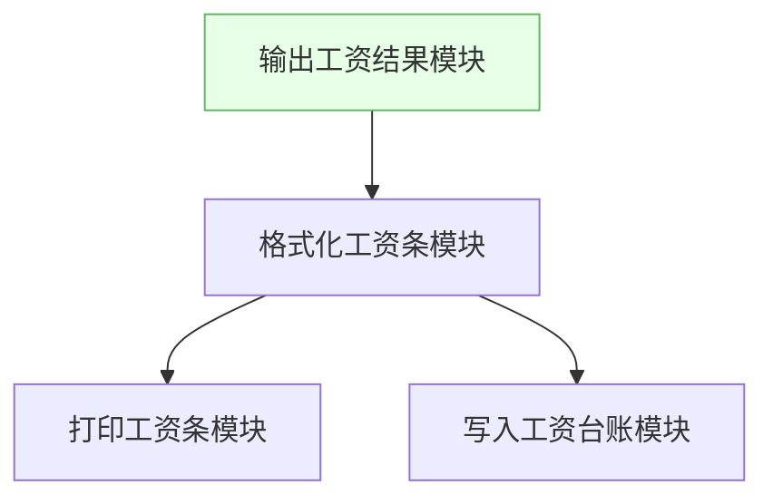
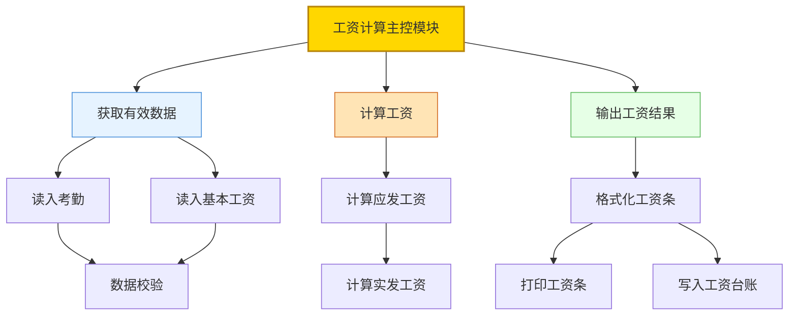
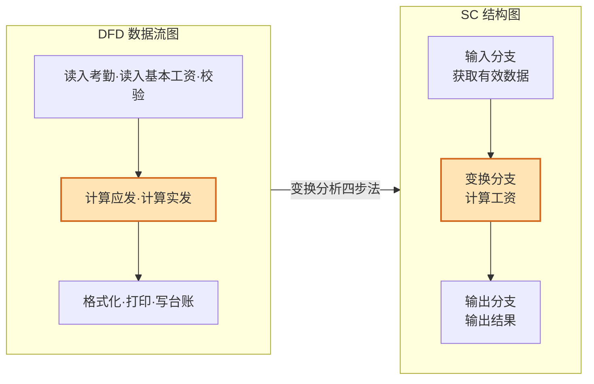

# 4.3 变换流设计案例与实践

本节通过工资计算系统的完整案例，演练从 DFD 分析到 SC 生成的变换流设计全流程。案例覆盖 [[4.1 变换流识别与变换中心确定|变换流识别]]、[[4.2 变换流映射步骤与SC生成|四步法映射]]、模块分解与设计验证，是对本章前两节知识的综合应用。

## 案例背景

> [!example] 工资计算系统
> 某企业工资计算系统：从考勤文件和基本工资文件读入员工数据，校验数据合法性，计算应发工资（基本工资+加班费-缺勤扣款），计算实发工资（应发工资-个人所得税-社保），格式化工资条并打印输出，同时写入工资台账。

该系统的数据流呈典型变换流形态：输入员工与考勤数据 → 中心变换（计算工资）→ 输出工资条与台账。

## 第一步：DFD 分析与三段识别

### 系统 DFD

### 三段识别

运用 [[4.1 变换流识别与变换中心确定|双向追踪法]]识别变换流三段：

| 段 | 加工 | 判定依据 |
| --- | --- | --- |
| 传入路径 | 读入考勤、读入基本工资、数据校验 | 纯输入：仅做数据接收与校验 |
| 中心变换 | 计算应发工资、计算实发工资 | 实质业务变换：核心工资计算 |
| 传出路径 | 格式化工资条、打印工资条、写入工资台账 | 纯输出：格式化与输出 |

> [!note] 边界判定说明
> - 逆向追踪：`读入考勤`、`读入基本工资`、`数据校验` 均为纯输入加工 → 逻辑输入边界在 `计算应发工资` 前，逻辑输入 = "有效数据"。
> - 正向追踪：`格式化工资条`、`打印工资条`、`写入工资台账` 均为纯输出加工 → 逻辑输出边界在 `计算实发工资` 后，逻辑输出 = "实发工资"。
> - 变换中心 = `计算应发工资` + `计算实发工资`。

## 第二步：确定逻辑输入与逻辑输出

- **逻辑输入**：`有效数据`（经校验后的考勤与基本工资数据）。
- **逻辑输出**：`实发工资`（含应发、扣款、实发的完整计算结果）。
- **变换中心**：`计算应发工资` → `计算实发工资`。

## 第三步：设计顶层模块

顶层建立主控模块，下分输入、变换、输出三个分支：

## 第四步：设计中下层模块

### 输入分支分解

沿传入路径分解：

### 变换分支分解

沿中心变换加工链分解：

### 输出分支分解

沿传出路径分解，注意有两条输出路径（打印与写台账）：

## 完整 SC 结构图

将三分支合并，得到工资计算系统的初始 SC：

## 模块分解说明

| 模块 | 类型 | 职责 | 内聚类型 |
| --- | --- | --- | --- |
| 工资计算主控 | 主控 | 协调输入、变换、输出 | 功能内聚 |
| 获取有效数据 | 输入 | 读入并校验数据 | 顺序内聚 |
| 读入考勤/读入基本工资 | 输入子模块 | 读取原始数据 | 功能内聚 |
| 数据校验 | 输入子模块 | 校验数据合法性 | 功能内聚 |
| 计算工资 | 变换 | 完成工资计算 | 功能内聚 |
| 计算应发工资 | 变换子模块 | 计算应发部分 | 功能内聚 |
| 计算实发工资 | 变换子模块 | 计算实发部分 | 功能内聚 |
| 输出工资结果 | 输出 | 输出工资结果 | 顺序内聚 |
| 格式化工资条 | 输出子模块 | 格式化结果 | 功能内聚 |
| 打印工资条 | 输出子模块 | 打印输出 | 功能内聚 |
| 写入工资台账 | 输出子模块 | 持久化存储 | 功能内聚 |

## DFD→SC 完整转换图集

## 设计验证

> [!check] 验证检查清单
> 1. **三段对应**：DFD 传入路径→输入分支、中心变换→变换分支、传出路径→输出分支，映射完整无遗漏。✓
> 2. **边界正确**：逻辑输入为"有效数据"、逻辑输出为"实发工资"，变换中心为两个计算加工。✓
> 3. **模块独立性**：各模块功能单一，内聚度高；模块间通过数据参数传递，耦合度低。✓
> 4. **数据流平衡**：SC 中模块间的数据传递与 DFD 数据流一致，无丢失或新增。✓
> 5. **父图子图平衡**：若 DFD 分层，子图数据流与父图对应加工一致。✓

> [!warning] 待优化项
> - `数据校验` 模块同时被 `读入考勤` 和 `读入基本工资` 调用，扇入为 2，复用性好，但需检查接口参数是否过多。
> - `计算实发工资` 模块涉及个税与社保计算，若规则复杂可进一步分解为 `计算个税` 与 `计算社保` 子模块。
> - 这些优化属 [[MOC - 第6章|第6章]]范畴，本案例聚焦映射本身。

## 小结

工资计算系统案例完整演练了变换流设计：从 DFD 分析识别三段（读入校验为传入路径、两个计算加工为中心变换、格式化与输出为传出路径），到用四步法生成三叉树 SC（主控下分输入、变换、输出三分支，各分支按加工链分解），再到模块分解与设计验证。案例表明变换分析能将线性流水线 DFD 系统地映射为层次清晰的模块结构，所得初始 SC 经验证后可进入优化阶段。

## 关联

- 上一级：[[MOC - 第4章]]
- 上一节：[[4.2 变换流映射步骤与SC生成]]
- 关联概念：[[4.1 变换流识别与变换中心确定]]（识别方法）、[[6.1 模块分解与合并原则]]（后续优化）、[[5.3 事务流设计案例与实践]]（事务流案例对照）、[[3.3 DFD分层映射与平衡检验]]（分层与平衡）
