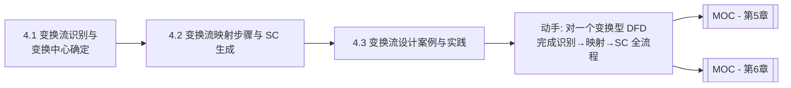

# MOC - 第4章 变换流设计方法

> [!info] 本章定位
> 第4章深入展开结构化设计中最常用的映射方法——变换分析。它在 [[3.1 DFD到SC的映射原理|第3章映射原理]]与 [[3.2 变换流识别与事务流识别|变换流识别]]的基础上，系统讲解如何把变换型 DFD 完整地转化为软件结构图（SC）：先精确定位变换中心边界（逻辑输入与逻辑输出），再用变换分析四步法导出三叉树形初始 SC，最后通过工资计算系统案例完成 DFD→SC 的全流程演练。本章得到的初始 SC 随后需依据 [[MOC - 第6章|第6章优化原则]]进一步优化。

## 学习路线图

## 知识点导航

| 节 | 主题 | 核心要点 | 入口 |
| --- | --- | --- | --- |
| 4.1 | 变换流识别与变换中心确定 | 变换流三段划分、逻辑输入/输出边界追踪、输入流与输出流路径 | [[4.1 变换流识别与变换中心确定]] |
| 4.2 | 变换流映射步骤与 SC 生成 | 变换分析四步法、顶层与中下层模块设计、三叉树 SC 生成 | [[4.2 变换流映射步骤与SC生成]] |
| 4.3 | 变换流设计案例与实践 | 工资计算系统 DFD 分析、SC 生成、模块分解与设计验证 | [[4.3 变换流设计案例与实践]] |

## 核心考点

> [!warning] 重点掌握
> 1. 变换流的三段结构：传入路径（物理输入→逻辑输入）、中心变换（逻辑输入→逻辑输出）、传出路径（逻辑输出→物理输出）。
> 2. 变换中心的识别方法：沿输入流从外部向内逆向追踪确定逻辑输入边界；沿输出流从内向外正向追踪确定逻辑输出边界；两边界间即中心变换。
> 3. 变换分析四步法：①重画 DFD 区分三段；②确定逻辑输入/输出边界；③设计顶层模块（主控+输入+变换+输出）；④设计中下层模块。
> 4. 变换型 SC 的三叉树形态：主控模块下分输入、变换、输出三个分支。
> 5. 能对具体变换型 DFD 完成从识别到生成 SC 的完整设计。
> 6. 变换流与 [[MOC - 第5章|事务流]]的区别及混合型 DFD 中变换流局部的处理。

## 自测题

> [!question] 题1
> 简述变换流的三段结构，并说明逻辑输入与物理输入的区别。
> > [!check]- 参考答案
> > 变换流分为传入路径、中心变换、传出路径三段。传入路径从物理输入到逻辑输入，负责接收、校验、格式化外部输入，将其转化为系统内部可用数据；中心变换从逻辑输入到逻辑输出，完成核心业务变换；传出路径从逻辑输出到物理输出，负责结果格式化与输出。物理输入是外部实体直接提供的数据（如键盘录入、文件读入），仍带有外部格式；逻辑输入是经过传入路径处理后、进入中心变换前已转化为系统内部标准形式的数据。区分二者是确定变换中心边界的关键。

> [!question] 题2
> 如何确定变换中心的边界？请描述具体追踪方法。
> > [!check]- 参考答案
> > 变换中心边界的确定采用双向追踪法：①从最外层物理输入开始，沿数据流方向向内追踪，逐个判断加工是否仅做"纯输入"（接收、校验、格式转换），直到遇到执行实质业务变换的加工，该加工前的数据流即逻辑输入边界；②从最外层物理输出开始，沿数据流反方向向内追踪，逐个判断加工是否仅做"纯输出"（格式化、输出），直到遇到执行实质变换的加工，该加工后的数据流即逻辑输出边界。逻辑输入边界与逻辑输出边界之间的加工集合即变换中心。两边界不重合时中心变换可能包含多个加工。

> [!question] 题3
> 详述变换分析四步法，并说明顶层模块包含哪几类。
> > [!check]- 参考答案
> > 变换分析四步法：①**重画 DFD**——在原图上区分传入路径、中心变换、传出路径三段，确保边界清晰；②**确定逻辑输入与逻辑输出**——用双向追踪法标定变换中心边界；③**设计顶层模块**——建立主控模块，其下分三类：输入模块（获取并向上传递逻辑输入）、变换模块（完成中心变换）、输出模块（接收逻辑输出并向下传出）；④**设计中下层模块**——为输入模块分解获取与校验子模块，为变换模块分解各变换子加工，为输出模块分解格式化与输出子模块，形成三叉树层次结构。顶层四类模块：主控模块、输入模块、变换模块、输出模块。

> [!question] 题4
> 变换型 SC 为什么呈三叉树形态？得到的初始 SC 是否可直接使用？
> > [!check]- 参考答案
> > 三叉树形态源于变换流的三段结构：主控模块对应整个变换流，其下三个分支分别对应传入路径、中心变换、传出路径，每个分支再按 DFD 中加工层次逐层分解，形成"一主控、三分支、逐层细化"的树形结构，因主控下恰好分三叉故称三叉树。得到的初始 SC 不能直接作为最终设计——它是 DFD 的机械映射，可能存在模块过大、接口参数过多、扇出过大、低内聚或高耦合等问题，必须依据 [[MOC - 第6章|高内聚低耦合准则与启发式规则]]进行优化（合并/拆分、扇入扇出调整、接口简化等）后才可用于工程。

## 章节导航

- 上一级：[[MOC - 结构化软件设计]]
- 上一章：[[MOC - 第3章]]（DFD→SC 映射总原理与流类型识别）
- 下一章：[[MOC - 第5章]]（事务流设计方法）
- 关联：[[MOC - 第6章]]（初始 SC 的优化原则）、[[3.2 变换流识别与事务流识别]]（变换流识别基础）
